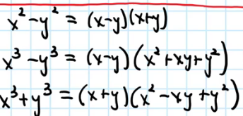
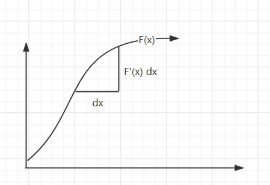
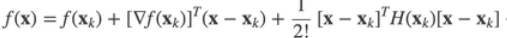

# 1. 微积分

## 1. 代数基础

***基本初等函数有哪些?***

```
>> 幂函数 x^a (多项式本质为幂函数的线性组合)
>> 指数函数 a^x
>> 对数函数 log
>> 三角函数 sin cos tan cot(=1/tan) sec(=1/cos) csc(=1/sin)
>> 反三角函数 arcsin(定义域-pi/2 ~ +pi/2) arccos(定义域0 ~ pi) arctan(定义域-pi/2 ~ +pi/2)
```

***常用于提取公因式的等式有哪些?***

1. 平方差公式
2. 立方差公式
3. 立方和公式



***如何推导三角函数的倍角公式?***

```
>> 倍角公式由和角公式推导出来
>> 和角公式可以通过几何证明
```

## 2. 极限

***如何求解复杂的极限表达式?***

```
>> 对于0/0或无穷/无穷或无穷-无穷类型, 提取并消去分子和分母中相同公因式

>> 夹逼定理: 如果f(x) <= g(x) <= h(x) 且 f和h的极限都为C, 那么g的极限也为C

>> 泰勒展开为多项式

>> 洛必达法则
```

***用通俗的话讲一下极限的epsilon-delta定义?***

```
a点周围总能找到一个区间(这个区间不包含a), 使得区间内所有自变量x的函数值f(x)都和常量C相差一个很小的值(epsilon)
```

## 3. 连续

***函数在一个点连续的定义是什么?***

如果一个函数在点a连续, 那么

$$
\lim_{x\to a} f(x) = f(a)
$$

***第一类间断点和第二类间断点的区别?***

```
第一类又称可取间断点, 可以通过重新定义该点函数值使得函数称为连续函数, 第二类则无法这样做
```

***讲一下介值定理(intermediate value theorm)?***

```
函数在连续区间[a, b]上, 对于f(a)和f(b)之间的任何一个值都可以取到
```

***什么是三大中值定理?***

```
>> 三大中值定理分别为: Roll/Lagrange/Cauchy中值定理, 罗尔中值定理是拉格朗日中值定理的特例

>> Lagrange中值定理: 对于光滑函数的一个区间, 区间内一定有一点的变化率等于这个区间从头到尾的总体变化率

>> Cauchy中值定理: 对于二维平面中一段光滑的曲线, 曲线上总有一点的切线方向和曲线从头到尾的向量方向相同 
```

## 4. 导数

***极限和导数的关系(导数是怎么定义的)?***

```
导数 = 切线的斜率 = 割线斜率的极限 = dy/dx
```

***基本初等函数的求导公式?***

所有求导公式都可以通过导数的极限表达式或求导法则推导出来, 分别是:

$$
\begin{align}
x^a  \to^{求导} a.x^{a-1}\\
a^x \to^{求导} \ln a.a^x\\
\log_ax \to^{求导} \frac{1}{\ln a.x}\\
\sin x \to^{求导} \cos x\\
\cos x \to^{求导} -\sin x\\
\tan x \to^{求导} \sec^2 x\\
\arcsin x \to^{求导} \frac{1}{\sqrt{1-x^2}}\\
\arccos x \to^{求导} \frac{-1}{\sqrt{1-x^2}}\\
\arctan x \to^{求导} \frac{1}{1+x^2}\\
\end{align}
$$

***哪些公式/法则经常用于求导数?***

$$
\begin{align}
乘法法则: f(x)g(x)  \to^{求导} fg^{'} + f^{'}g\\
除法法则: \frac{f(x)}{g(x)} \to^{求导} \frac{1}{g^2}.(gf^{'} - fg^{'})\\
反函数法则: f^{-1}(x) \to^{求导} \frac{1}{f^{'}(y)}\\
链式法则: f(g(x)) \to^{求导} \frac{df}{dg}. \frac{dg}{dx}
\end{align}
$$

***自然数e是怎么来的?***

$$
在计算f(x) = a^x的通用导数公式时, 出现了\lim_{k \to 0} (k+1)^{\frac{1}{k}}这个极限表达式, \\人为把这个表达式的结果定义为e
$$

***连续函数的导数=0时一定为极值点吗?***

```
不一定, 极值点处导数为0或者导数不存在
```

## 5. 微分

***什么是无穷小?***

无穷小是值相对的, **如果两个量都很小时,** **无穷小的那一个量更加微不足道**

$$
如果\lim_{y \to 0} \frac{O(y)}{y} = 0, 那么O(y)是y的无穷小
$$

***如何理解微分dy?***

$$
dy  = \Delta y + O(\Delta y) = y的变化值的主要/线性部分
$$


## 6. 积分

***如何理解N-L公式?***

$$
\int_a^b F'(x)dx = \sum F'(x)dx = y轴变化值的和 = F(x)|_a^b
$$



***常用的积分技巧有哪些?***

```
>> 换微分法
```

## 多元函数的微积分

***导数&偏导&方向导数&梯度分别的含义是什么?***

```
>> 导数是指y随x的变化率

>> 偏导是z在x切面或y切面上的导数

>> 方向导数是任意一个垂直切面上z的导数

>> 梯度是与最大方向导数的方向同方向的一个向量, 单位向量与梯度的内积 === 方向导数
```

$$
\begin{align*}
方向导数的计算公式:\\
f^{'}_{\vec{e}}(x, y) 
&= \lim_{\sqrt{\Delta x^2 + \Delta y^2}\to 0} \frac{f(x+\Delta x, y+\Delta y) - f(x, y)}{\sqrt{\Delta x^2 + \Delta y^2}}\\
&= ......\\
&= \frac{\delta z}{\delta x} \cos{\theta} + \frac{\delta z}{\delta y} \sin{\theta} \qquad (\theta为\vec{e}与x轴的夹角)\\
&= (\frac{\delta z}{\delta x}, \frac{\delta z}{\delta y})^T \cdot(\cos{\theta}, \sin{\theta})\\
&= <梯度\nabla z(x, y). 方向单位向量\vec{e}>
\end{align*}
$$

$$
这里的\nabla是一个记号(又称算子), 用于方便地表示(\frac{\partial}{\partial x},\frac{\partial}{\partial y})
$$

***多元函数(矩阵表示)的方向导数求导公式?***


## 向量场

***什么是向量场?***

$$
向量场\vec{X}是值域为向量的函数\\
向量场可以看作标量函数组成的向量, 例如:(f_1, f_2)
$$

***什么是向量场的散度(divergence)和旋度?***

散度

$$
向量场\vec{X}的散度
div(\vec{X}) 
\\ = \nabla . \vec{X} 
\\= (\frac{\partial{}}{\partial{x}}, \frac{\partial}{\partial{y}}) . (f_1, f_2) 
\\ = \frac{\partial{f_1}}{\partial{x}} + \frac{\partial{f_2}}{\partial{y}}
$$

> 散度衡量了向量场某一个点周围的向量向外扩散的程度/向内收缩的程度

旋度

$$
向量场\vec{X}的旋度
curl(\vec{X}) 
\\= \nabla \times \vec{X}
\\= (\frac{\partial{}}{\partial{x}}, \frac{\partial}{\partial{y}}) \times (f_1, f_2)
$$

> 旋度衡量了向量场中一个点周围的向量的旋转程度和旋转轴的方向

***什么是拉普拉斯算子?***

$$
拉普拉斯算子\Delta f \\=多元函数f在某一点的领域的函数平均值和这一点的函数值的差
\\= \nabla^2 f = (\frac{\partial}{\partial x^2} + \frac{\partial}{\partial y^2}).f
$$

# 2. 级数

***傅里叶变换的思想?***

***泰勒展开式的核心思想?***

```
泰勒展开式目的是为了使用一个多项式函数去尽可能地逼近任意一个无限可导的函数

核心思想: 如果两个函数在一个点的函数值且任意阶导数相同, 那么这两个函数在这个点的领域直观上就是相同的
```

***单元函数的泰勒展开式和多元函数的区别是什么?***

```
>> 自变量x => 向量X

>> f的导数 => f的梯度 (2阶梯度对应2阶Hessian矩阵)

>> 乘积 => 内积
```


