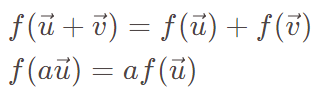
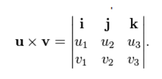

# 1. 向量

## 1. 范数和内积

***向量的范数(norm)和内积(inner production)有什么实际意义?***

```
>> 向量的范数表示向量的长短

>> 向量的内积表示两个向量的对齐程度
```

***欧几里得空间(Euclidean Space)中向量的L2范数和内积如何计算?***

$$
内积 = <\vec{u}, \vec{v}> = u_1v_1 + u_2v_2 + u_3v_3 = |\vec{U}|.|\vec{V}|.cos(\theta)
$$

$$
L2范数 = |\vec{u}|_{L2} = \sqrt{<\vec{u}, \vec{u}>} = \sqrt{u_1^2 + u_2^2 + u_3^2}
$$

***函数和向量有什么关系?** *

```
>> 一个函数可以看作是一个无穷维度的向量(函数的定义域必须为[0,1])
```

$$
函数||f||的范数 = \sqrt{\int f^2 dx}
$$

$$
函数f和函数g的内积<<f, g>> = \int (f.g)  dx\\
$$

## 2. 线性映射

***线性变换的代数含义?***



***线性映射(linear map)和仿射(affine map)的区别?***

```
仿射变换本质上是先对进行线性变换, 再进行平移
```

***讲一下Schmidt正交化算法?***

```
>> 算法目的: 将一个非正交基向量集合转为正交单位基向量集合

>> 算法思想: 递归算法, 一个向量A减去A在当前正交集合的每个向量方向上的投影分量后, 再单位化, 最后加入正交集合

>> 为什么要正交化和单位化?: 任意一个向量 === 该向量在各个正交基向量上的投影分量之和
```

## 3. 叉积

***叉积在三维空间中的含义?***

```
两个向量的叉积: 
* 方向 = 垂直于这两个向量组成的平面, 遵循右手法则

* 长度 = 两个向量围成的四边形的面积
```

***如何快速记忆一个三维向量的叉积公式?***

```
使用行列式可以快速记忆叉积计算公式
```



***叉积在二维空间中的含义?***

```
>> 二维向量的叉积是一个标量, 大小为两个向量围成图形的面积

>> (x1, y1) × (x2, y2) = x1y2 - y1x2
```

***如何求两个向量的夹角?***

$$
\mathbf{u}\cdot(\mathbf{v}\times\mathbf{u})=\det(\mathbf{u},\mathbf{v},\mathbf{u})=0
$$

```
>> 夹角 =  arccos (两个向量的内积 / 两个向量的范数乘积)

>> 夹角 = arcsin (两个向量的叉积的范数 / 两个向量的范数乘积)
```

# 2. 矩阵

## 1. 矩阵和向量

***矩阵有什么用?***

```
>> 一个矩阵可以表示一个向量线性变换
例如: Ax表示向量x的线性变换

>> 一个矩阵可以表示一个线性方程组
例如: Ax = b 

>> 一个方阵对应一个n次齐次方程
例如: transpose(w)Bw
```

***逆矩阵的几何含义是什么, 如何求逆矩阵?***

```
>> 几何含义: 原矩阵对应的线性变换的逆变换

>> 对增广矩阵进行初等行变换可以求逆矩阵: (A, E) => (E, A^(-1))
```

## 2. 行列式

***矩阵的行列式的几何含义是什么?***

```
>> 行列式 === 矩阵列向量围成的面积/体积

>> 所以有公式: 行列式|a, b, c| = (a×b).c
```
