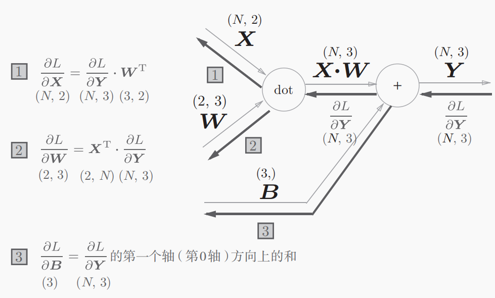
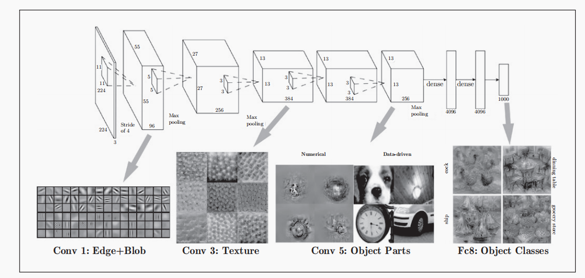
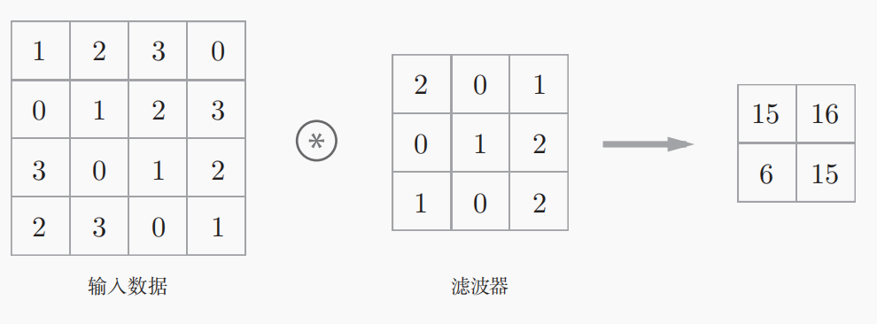

# 1. 深度学习基础

## 1. 神经网络简介

_常见的激活函数有哪些?_

```
* sigmoid函数
y(x) = 1/1+e^(-x)

* reLU函数
y(x) = max(0, x)
```

_输出层的激活函数有哪些?_

```
* 恒等函数(回归问题)
h(x) = x

* softmax函数(分类问题)
```

_为什么激活函数不能使用线性函数?_

```
当激活函数为线性函数时, 多层神经网络一定可以使用单层神经网络表示, 多层神经网络没有意义
```

_神经网络前向传播的过程?_

```
1. 将输入信号X正则化为0~1之间的值

2. 重复计算A = f(W.X + B)

3. 重复计算输出层Y = f(A)
```

## 2. SGD 算法

_常见的损失函数有哪些?_

```
* 均方误差(回归问题)

* 交叉熵函数(聚类问题, 和softmax函数一起使用时可以简化BP计算)
```

_讲一下 SGD(随机梯度下降法)步骤?_

```
1. 将训练集随机分为多个互斥的mini-batch

2. 遍历mini-batch, 在每个mini-batch上计算Loss函数的梯度并进行梯度下降

3. 重复1 2

tip: 进行一次1 2步骤称为一个epoch
```

## 3. BP 算法

_有哪些方式可以计算 Loss 函数的梯度?_

```
* 微分法: 梯度 = [Loss(W + h) - Loss(W-h)] / 2h, h=1e-4

* BP算法

tip: 微分法速度很慢, 因为即使最简单的神经网络中参数也有百万个, 每次计算一次梯度要进行百万次矩阵运算
```

_反向传播算法计算偏导的原理是什么?_

```
链式法则

>>> 神经网络本质上是多个函数的符合, 反向传播相当于对函数Loss(Y(h(X)))从外到内依次求导, 并将导数从后往前传播
```

_一个神经网络分为哪些层?画出 Affine 层的计算图?_

```
* Affine层

* sigmoid层/reLU层

* softmax-with-loss层/mean-square-with-loss层
```



## 4. 神经网络优化技巧

_学习率过大和过小会造成什么结果? 学习率如何设定?_

```
* 过大: Loss函数值在最小值附近震荡, 始终不能收敛到最小值

* 过小: 收敛需要的迭代次数增多, 并且更容易收敛到局部最小值

tip1: Adam算法中学习率会动态衰减
tip2: Adam算法还模拟了梯度下降时的物理惯性(momentum)
```

_初始权重参数如何设置?_

```
* Xavier初始化, 随机正态分布数~N(0, sqrt(1/in)), 适合sigmoid函数

* He初始化, 随机正态分布数~N(0, sqrt(2/in)), 适合reLU函数
```

_什么是梯度消失和梯度爆炸?_

```
* 梯度消失: 激活函数为S型曲线时, 连续多个神经网络层梯度接近0, 相乘导致梯度无穷小

* 梯度爆炸: 激活函数为S型曲线时, 连续多个神经网络层梯度很大, 相乘导致梯度溢出
```

_Batch Normalization 层做了什么?_

```
计算输入信号的均值和方差, 然后将其转换为N(0, 1)分布的信号, 最后进行仿射变换
```

_有哪些方式可以防止神经网络过拟合?_

```
* 权值衰减
>>> 方法: 损失函数添加权重的L2范数
>>> 原理: 一般认为权重过大会导致过拟合

* Dropout方法
>>> 添加DropOut Layer随机删除神经网络中的神经元
```

_讲一下 Data Augmentation 是如何提高神经网络精确度的?_

```
通过对训练集的样本图像进行平移, 旋转等技巧变换出新的训练集, 从而增大训练集大小
```

_什么是迁移学习技术?_

```
在一个大的数据集上训练好网络, 然后讲训练好的参数作为相同结构网络的输出参数, 然后在新的小训练集上训练
```

# 2. 特殊网络

## 1.CNN

_CNN 相较于传统全连接神经网络的优点?_

```
CNN网络的前几层使用了Convolution Layer, Conv Layer可以提取二维图形中的局部特征(边缘, 形状, 纹理, 物体)

tip: Conv Layer相较于Affine Layer的优点是将输入的图像当作二维而不是一维, 二维图像进行卷积运算可以提取局部特征
```



_CNN 中有哪些独特的 Layer?_

```
* Convolution Layer

* Max Pooling Layer
```

_什么是卷积运算?_

```
通过一个称为"卷积核"或"滤波器"的小矩阵与一个更大的矩阵进行元素对元素的加权求和，来提取或增强某些特征
```



## 2. RNN

## 3. ResNet

## 4. GAN

## 5. LSTM

## 6. U-Net

## 7. 深度学习网络

_为什么更深层的网络学习效果往往更好?_

```
直观上讲, 深层网络每一层可以单独学习一方面的特征, 而浅层网络需要一次性识别多方面的特征
```

_为什么过度加深层会很多情况下学习将不能顺利进行?_

```
随着网络深度的增加, 参数增多，损失函数的曲面可能变得更加复杂，存在更多的局部最小值、鞍点或平坦区域
```
