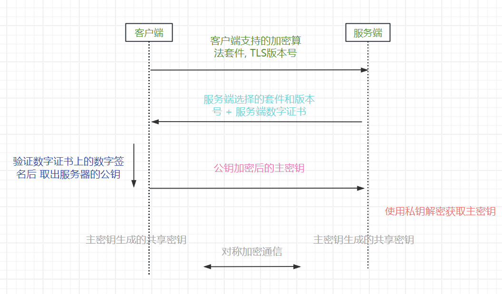
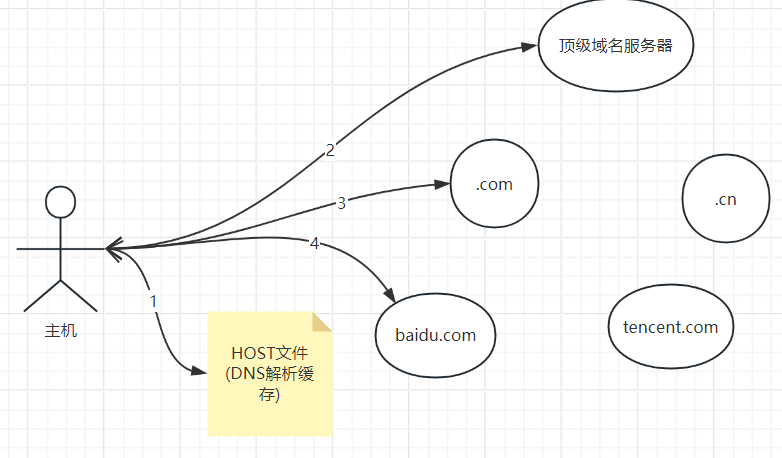

# 1. 计算机网络理论

## 1.1 网络模型

_**讲一下网络的 OSI 七层模型和 TCP/IP 五层模型?**_

```
🌟 应用层(Application Layer): 应用到应用
* (表现层)
* (会话层)
🌟 传输层(Transport Layer): 进程到进程
🌟 网络层(Network Layer): 终端到终端
🌟 链路层(Link Layer): 网络节点到网络节点
🌟 物理层: 物理信号到Bit
```

_**每一层常见的协议有哪些?**_

```
应用层: HTTP FTP DNS SSH(安全Shell协议) SMTP(简单邮件传输协议)
传输层: TCP UDP
网络层: IP ICMP(网络探测协议)
链路层: ARP(地址解析协议)
```

## 1.2 术语

_**为什么有 MAC 地址还要有 IP 地址, 可以只用 MAC 地址/IP 地址吗?**_

```
* IP地址分为网络号和主机号, 适合路由, 但不适应设备地理迁移(路由表更新慢)

* MAC地址是UUID, 不适合用于路由(路由表过大), 但适应设备地理迁移
```

_**带宽(bandwidth)、吞吐量(throughput)、网速(speed)、延迟(latency)的区别?**_

```
如果把网络信道比作水管, 那么:
* 吞吐量是每秒通过水管的水的质量

* 带宽是吞吐量的理论最大值

* 网速分为实时网速和最大网速, 最大网速等价于带宽, 实时网速等价于吞吐量, 其中实时网速又细分为实时上传网速+实时下载网速

* 延迟是水从水管一端到另一端所需的时间
```

_**为什么 ISP 宣称的 200Mbps 宽带实际网速才 3MiB/s?**_

```
Mbps的M全称为Mega, 遵循10进制, MiB/s中的M全称为Mebi, 遵循2进制

所以, 200Mbps = 25MBps = 2.98MiB/s
```

_**网卡和中继器的作用?**_

-   网卡: 负责链路层的数据发送和接收, **每个网卡有唯一的 MAC 地址**
-   中继器/集线器: 负责放大物理信号

_**什么是 VALN(虚拟局域网)?**_

```
VLAN: 交换机通过端口的VID从逻辑上划分了广播域, 从而使得一个VID下的设备逻辑上在同一个局域网中
```

_**交换机和路由器是如何实现转发数据包的?**_

```
* 交换机通过ARP广播报文学习端口<=>MAC地址的映射表

* 路由器通过路由协议(如RIP报文)学习IP地址<=>路由端口的路由表
```

_**什么是 CDN 加速?**_

```
CDN全称Content Delivery Networks, 在网络边缘搭建CDN服务器同步源站的静态资源, 客户端直接访问CDN服务器

🌙 客户端访问不存在的资源时CDN服务器会主动从源站拉取数据, 源站也能主动Push资源到CDN服务器
🌙 CDN依赖DNS系统, 当访问同一个源站域名时, 依赖DNS解析成不同的CDN服务器ip
```

# 2. 应用层协议

## 2.1 HTTP/1.1

_**`URL`和 `URI`的区别?**_

```
URL特指网络上资源的标识符, URI是URL的超集
```

_**讲一下 http 请求报文和响应报文的格式?**_

请求报文

```
GET /index.html?a=1&b=2 HTTP/1.1         ---请求行 = 请求方法 + 请求路径 + 协议版本号
HOST: www.example.com                    ---请求头
User-Agent: Mozilla/5.0

{age: 18, name: 'jerry'}                 ---请求体
```

响应报文

```
HTTP/1.1 200 OK                ---响应行 = 响应码 + 响应描述 + 协议版本号
Content-Type: text/html        ---响应头
Content-Length: 3373

{msg: 'success'}               ---响应体
```

_**讲一下常见的请求方法和响应码?**_

请求方法

```
GET: 获取服务器资源
POST: 新增服务器资源
PUT: 更新服务器资源
DELETE: 删除服务器资源
OPTIONS: 询问Web服务器的配置

tip: GET方法请求中只允许使用query参数
```

响应码

```
200: OK
301:永久重定向 302:临时重定向
400:请求报文格式错误 401:未认证 403:无权限 404:资源不存在 405:请求方法不允许
500:服务器内部错误
```

_**什么是幂等性, 哪些方法需要遵循幂等性?**_

```
幂等性: 指多次重复请求不会对服务器产生副作用

tip: HTTP协议规定GET PUT DELETE方法需要遵循幂等性
```

_**什么是 `HTTP`长连接?**_

```
Htpp/1.1 请求头中可以使用"keep-alive", 多个http请求使用一个TCP连接(以管道的方式复用TCP连接)
```

_**Cookie 主要的组成部分有哪些？如何通过 Cookie 实现会话管理?**_

```
Cookie的组成部分包括:
* key
* value
* domain & path
* expire

前端在发送请求时请求头中会携带key="JSESSIONID"的Cookie, 后端通过JSESSIONID从数据库中获取Session对象
```

_**Jwt 的由哪三部分组成?**_

```
* header: 包含加密算法等元信息
* payload
* signature: 数字签名
```

## 2.3 HTTP 2/3

**_Http/2.0 相较于 Http/1.1 有哪些改进?_**

-   使用**多路复用**解决 Http 长连接中的队头阻塞问题
-   `HPACK`算法对请求头进行压缩
-   服务器主动推送资源

```
* 多路复用指在TCP通道中, 服务器可以并发发送两个请求的Http响应帧, 不用等前一个http响应完再响应下一个

* HPACK算法使用数字编码常见的请求头键值对组合
```

**_Http3.0 特点?_**

```
* HTTP3.0传输层使用QUIC协议(QUIC协议集TCP TLS UDP协议优点于一身)
```

## 2.4 HTTPS

_**常见的加密算法有哪些?**_

```
* Hash算法: MD5 SHA

* 对称加密算法: AES

* 非对称加密算法: RSA
```

**_可以通过明文-密文对破解出 AES 的密钥吗?_**

```
很难, AES加密算法可以抵御明文攻击(KPA)
```

_**什么是加盐加密?**_

```
存储密码时, 生成随机字符串作为salt, 将密码和salt拼接后再hash, DB中保存salt和hash值
```

_**数字证书和数字签名的区别?**_

```
* 数字签名: 指对文档的hash值使用私钥加密得到的密文, 使用公钥可以还原密文进行验证

* 数字证书: CA机构颁发的带数字签名的证书, 包含服务器TLS握手需要的公钥
```

_**讲一下 `SSL/TLS`协议握手过程?**_



## 2.5 WebSocket

**_什么是 WebSocket 协议?_**

```
基于TCP的全双工应用层协议
```

**_WebSocket 协议握手过程?_**

```
1. 客户端发送HTTP报文, 请求头中包含Upgrade: WebSocket

2. 服务端返回HTTP报文, 响应码为101, 握手完成
```

# 3. 传输层协议

## 3.1 TCP/UDP

**_为什么 TCP 使用四元组而 UDP 使用二元组?_**

```
* TCP面向连接, 所以使用<源IP, 源端口, 目标IP, 目标端口>标识一个TCP连接

* UDP只需要确认接收方 使用<目标IP, 目标端口>二元组
```

**_说一下常见的端口号对应的哪些应用?_**

```
20/21: FTP
53: DNS
80: HTTP
443: HTTPS
3306: MYSQL
```

**_可以在一个端口上同时进行 TCP 通信和 UDP 通信吗?_**

```
可以, 操作系统会将TCP报文和UDP报文交给不同的模块处理
```

## 3.2 可靠通信服务

**_TCP 依靠什么提供可靠通信服务?_**

```
* 超时重传和重排序
* 滑动窗口和流量控制
* 拥塞控制算法
```

**_什么是快重传算法?_**

```
发送方发送窗口中的报文会并行发送和确认接收成功

如果发送方如果重复3次收到一个ACK, 会立刻重传该SEQ的报文(认为报文已经丢失)
```

**_讲一下 TCP 的拥塞控制算法?_**

```
发送方的发送窗口的大小 = min(接收方设定的cwnd, 拥塞窗口)

拥塞窗口在没有拥塞时指数级增长(快启动), 达到阈值后线性增长, 出现拥塞时更新阈值并重新开始快启动
```

**_什么是 nagle 算法?_**

```
内核在发送TCP报文时, 如果单个报文过小, 会先放入缓冲区, 合并为大报文再发送

nagle算法默认关闭
```

**_什么是 TCP 粘包和拆包问题?_**

```
如果TCP报文过长(>MMU)/过短, 内核会拆分报文/使用nagle算法合并报文, 从而导致接收方在接收到报文后需要对应用层数据进行粘包和拆包(使用不同消息间使用分隔符)
```

## 3.3 TCP 连接

**_TCP 连接建立和释放过程?_**

三次握手

```
1. 客户端 => SYN
2. SYN + ACK <= 服务端
3. 客户端 => ACK
```

四次挥手

```
1. 客户端 => FIN
2. ACK <= 服务器(CLOSE_WAIT)
3. FIN <= 服务器
4. 客户端(TIME_WAIT) => ACK
```

**_为什么需要三次握手而不是两次?_**

```
如果客户端没有收到服务器发送的SYN报文会导致:

1. 客户端不知道服务器可连接, 不会发送消息
2. 服务器浪费资源去维持不会有消息到来的TCP连接
```

**_为什么 TIME_WAIT 需要等待 2MSL(最大报文生存时间)后才正式关闭连接?_**

```
防止发送的ACK报文丢失, 如果服务器重新发送FIN报文, 间隔时间最多为2MSL
```

## 3.5 QUIC

**_为什么 QUIC 协议基于 UDP 还能实现可靠传输?_**

```
QUIC在用户空间(应用层)重新实现了TCP的重排序&重传&拥塞控制, 所以是可靠的
```

**_QUIC 协议的特点和优点?_**

```
* 支持网络迁移, 连接不丢失(使用Connection ID替代四元组)

* 无队头阻塞问题(基于UDP)

* 内置TLS1.3协议, 安全

* 支持自定义拥塞控制算法(用户空间实现, 不用升级内核)
```

# 4. 网络层协议

## 4.1 IP 协议

**_IP 地址是如何分类的?_**

```
* A类: 0.X.X.X ~ 127.X.X.X

* B类: 128.0.X.X ~ 191.255.X.X

* C类: 192.0.0.X ~ 223.255.225.X

* D类为多播地址, E类未使用
```

**_一个 IP 地址由哪些方式有哪些方式确定网络号?_**

```
* 子网掩码
* CIDR
```

**_1 个 A 类地址最多有多少个主机地址?_**

```
2^24 - 2(网络号和广播号)
```

**_私有网络 IP 地址的 IP 地址范围是多少?_**

```
A类私有地址 10.X.X.X
B类私有地址 172.16.X.X ~ 172.31.X.X
C类私有地址 192.168.X.X
```

**_什么是 NAT 技术?_**

```
* 私有网络中的主机使用私有IP地址, 私网中的主机复用一组公网IP地址

* NAT路由器完成私有IP到公有IP的映射
```

## 4.2 DNS

**_域名解析过程?_**

```
1. 先查询本地DNS缓存

2. 从顶级域名服务器开始, 依次获取下级DNS服务器IP, 最底层DNS服务器返回解析到的IP
```



**_域名记录的类型常见的有哪些?_**

```
* A记录: 域名 <=> 主机IP
* CNAME记录: 域名别名 <=> 域名本名
* 邮件域名 <=> 邮件服务器IP
```

## 4.3 ARP

**_ARP 协议是什么?_**

```
ARP协议通过广播报文 解析IP地址为MAC地址

1. 广播ARP请求报文(包含发送方MAC地址和请求的IP地址)

2. 对应IP地址的主机接受到报文后向请求方发送自己的IP地址和MAC地址
```

## 4.4 ICMP

**_常见的 ICMP 报文类型有哪些?_**

```
ICMP协议用于网络诊断和监测, 报文类型分为:

* 超时报文(trace route原理): 收到TTL=0的报文后响应超时报文

* 不可达报文

* 回送请求报文和回送应答报文(ping原理)
```

## 4.5 DHCP

**_DHCP 协议是什么?_**

```
DHCP协议用于: 主机连接到局域网后局域网内的路由器自动给主机进行网络配置
```

**_使用 DHCP 协议自动配置的过程?_**

```
1. 客户端广播DHCP发现报文

2. DHCP服务端返回可用配置集合

3. 客户端发送被选择的配置

4. 客户端定期续约
```

## 4.6 路由协议

**_有常见的内部路由协议?_**

```
* RIP: 路由表中保存 (IP <=> 距离)表, 距离=16认为不可达, 只适用于小型局域网

* OSPF: 直接保存网络拓扑图, 使用单源最短路径算法路由
```

# 6. 链路层介绍

## 6.1 以太网

**_什么是以太网?_**

```
物理实现一般为电缆/光纤, 链路层使用以太网协议的网络称为以太网
```

**_CSMA/CD 和 CSMA/CA 协议的区别?_**

```
* CSMA/CD: 发送消息时检测到信道有噪音(判断出有其他设备开始发送消息)则延迟随机发送(允许碰撞)

* CSMA/CA: 发送消息前需要告知信道上所有设备"信道已被占用", 避免碰撞

CSMA/CA适合无线网络等自然噪音较大的网络
```

## 6.3 VPN

**_什么是虚拟私有网络 VPN?_**

```
主机和私有网络上的边界路由器建立加密通道, 边界路由器解密后转发报文到私有网络
```

# 7. 网络安全

_**什么是 XSS 注入和 SQL 注入?**_

```
XSS注入: 用户输入的内容被解析为了DOM元素

SQL注入: 用户输入的查询条件破坏了原本的SQL语法结构
```

_**什么是 CROS 标准?**_

```
CROS标准: 使用XHR对象发起跨域请求时, 浏览器会先向服务器发送OPTIONS请求询问服务器的跨域策略, 如果服务器允许跨域才发送真正的请求

tip1: 跨域请求指在a.com网页中向b.com发送请求
tip2: 使用<a>等标签可以绕过同源策略
tip3: 使用nginx等代理服务器也可以绕过同源策略
```

_**什么是 CSRF 攻击?**_

```
CSRF攻击: 用户点击进入了危险网站后, 危险网站发送跨域请求, 由于跨域请求会携带对应网站的Session Cookie, 用户的身份会被盗用

CSRF攻击的防范方法:
* 将后端接口配置为不允许跨域
* 不使用Cookie进行会话管理
```

_**常见的 DDOS 攻击有哪些?, 怎么防范?**_

```
常见的DDOS攻击有:
>> SYN泛洪(TCP半连接)
>> ICMP泛洪(ping)
>> 网络泛洪

防范方式有: 负载均衡, CDN加速, IP黑名单
```
