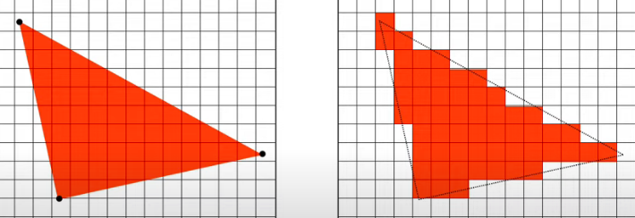

# 1. 术语和概念

**_为什么二维的显示器上可以呈现三维的效果?_**

```
* 使用眼球成像原理, 物体上的所有点通过中心对称点(瞳孔)投影到视网膜平面

* 通过相似三角形计算投影后的二维坐标
```

**_GPU 基元有哪些?_**

```
* 点P(x, y, z)

* 三角形(P1, P2, P3)
```

**_什么是 GPU Pipeline 和 Shader?_**

```
* GPU Pipeline : GPU基元 到 渲染二维图像之间的一系列规范步骤

* Shader: GPU渲染管道的中的程序, 用于给几何体顶点和片元渲染
```

**_为什么 GPU 更适合 AI 中的计算?_**

```
* GPU的核心数众多但每个核心只支持简单的运算

* 每个核心与神经网络中的神经元正好对应, 并行运算效率更高
```

# 2. GPU PipeLine

## 1. 光栅化

**_什么是像素(pixel), 光栅(Raster)和光栅化(Rasterization)?_**

```
* 光栅指: 像素点组成的二维平面

* 光栅化指: 将 三角形 和 光栅上离散的像素点 映射
```



**_常用的光栅化算法是什么?_**

```
  采样法: 一个像素点内使用均匀分布的采样点, 像素点的颜色为大多数采样点所在三角形的颜色
```

## 2. 线性变换

**_如何求出线性变换对应的变换矩阵?_**

$$
假设x,y,z方向上的单位向量分别为\vec{e_x}, \vec{e_y}, \vec{e_z}, 经过线性变换后为\vec{e_x}', \vec{e_y}', \vec{e_z}'\\
则该线性变换对应的矩阵为[\vec{e_x}', \vec{e_y}', \vec{e_z}']
$$
