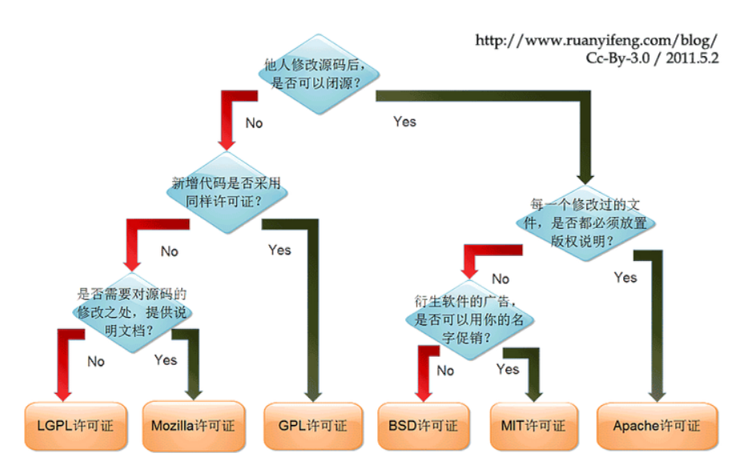

# 1. 开源

## 1. 开源软件协议

[https://www.ruanyifeng.com/blog/2017/10/open-source-license-tutorial.html](https://www.ruanyifeng.com/blog/2017/10/open-source-license-tutorial.html)

[https://blog.csdn.net/testcs_dn/article/details/38496107](https://blog.csdn.net/testcs_dn/article/details/38496107)

***大多数开源协议都有哪些使用要求和权利?***

```
权利:
* 可以商用和再开发

使用要求:
* 分发时需要保留Licence并附上Notice
```

***MIT & Apache2 & GPL协议中哪个更宽松?***

```
协议宽松程度: MIT > Apache2 > GPL 

GPL: 必须开源并且使用GPL协议
Apache2: 允许闭源
MIT:  允许闭源
```



# 2. 自然科学

## 1. 时间

***时间戳和本地时间的区别是什么?***

```
* 全球任何地方任何一刻, 时间戳的值都相等(1970年1月1日的时间戳为0)

* 同一个时间戳, 不同时区的本地时间字符串表示不同(如上海8:00AM, 纽约8:00PM)
```

***UTC GMT CST时间的区别是什么?***

```
* GMT基于天文现象, UTC基于原子钟
* 同一个时间戳时,  UTC的本地时间字符串会和GMT的本地时间字符串有一定误差

CST等价于UTC+8
```
