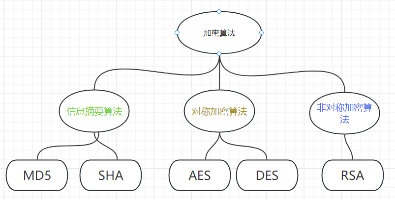
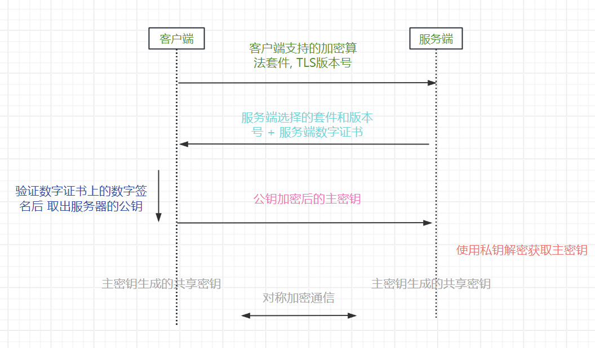
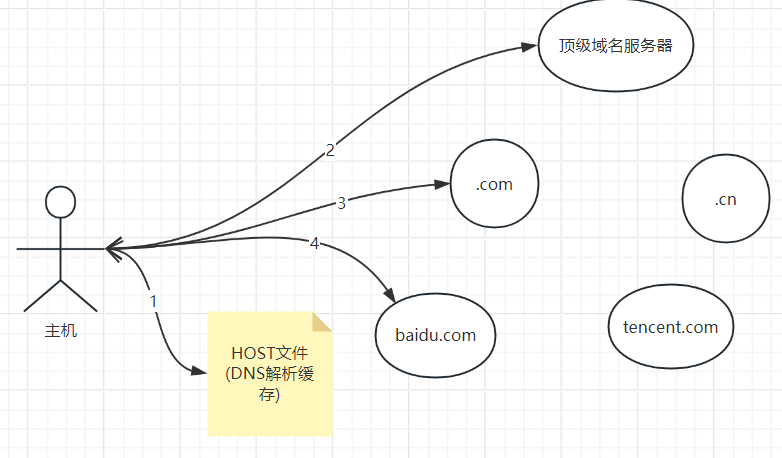

# 1. The Internt

## 1.1 OSI七层和TCP/IP五层

***讲一下网络的OSI七层模型和TCP/IP五层模型?***

```
* 应用层
* (表现层)
* (会话层)
* 传输层
* 网络层
* 链路层
* 物理层
```

***每一层常见的协议有哪些?***

```
应用层: HTTP FTP DNS SSH(安全Shell协议) SMTP(简单邮件传输协议)
传输层: TCP UDP
网络层: IP ICMP(网络探测协议)
链路层: ARP(地址解析协议)
```

## 1.2 网络术语

***为什么有MAC地址还要有IP地址, 可以只是用MAC地址/IP地址吗?***

```
* IP地址分为网络号和主机号, 适合路由, 但不适应设备地理迁移(路由表更新慢)

* MAC地址是UUID, 不适合用于路由(路由表过大), 但适应设备地理迁移
```

***带宽和吞吐量的区别?***

```
带宽: 网线的传输数据速度

吞吐量: 设备往网络中读写数据的熟读

两者单位都是bps, 带宽单位换算中 1Mbps = 10^6 bit/s ~= 0.12 MB/s
```

***网卡和中继器的作用?***

* 网卡: 负责链路层的数据发送和接收, **每个网卡有唯一的MAC地址**
* 中继器/集线器: 负责放大物理信号

***什么是VALN(虚拟局域网)?***

```
VLAN: 交换机通过端口的VID从逻辑上划分了广播域, 从而使得一个VID下的设备逻辑上在同一个局域网中
```

***交换机和路由器是如何实现转发数据包的?***

```
* 交换机通过ARP广播报文学习端口<=>MAC地址的映射表

* 路由器通过路由协议(如RIP报文)学习IP地址<=>路由端口的路由表
```

***什么是CDN加速?***

```
全称Content Delivery Networks, CDN服务提供商搭建网络边缘节点并同步加速站点的静态资源, 客户端直接访问网络边缘节点, 避免单点故障和高延迟
```

# 2. 应用层协议

## 2.1 HTTP/1.1

***`URL`和 `URI`的区别?***

```
URL特指网络上资源的标识符, URI是URL的超集
```

***讲一下http请求报文和响应报文的格式?***

请求报文

```
GET /index.html?a=1&b=2 HTTP/1.1         ---请求行
HOST: www.example.com                    ---请求头
User-Agent: Mozilla/5.0
...

{age: 18, name: 'jerry'}                 ---请求体
```

响应报文

```
HTTP/1.1 200 OK                ---响应行
Content-Type: text/html        ---响应头
Content-Length: 3373
....

{msg: 'success'}               ---响应体
```

***什么是请求的幂等性?***

```
请求幂等性: 指多次重复请求不会对服务器产生副作用
```

***讲一下常见的请求方法和响应码?***

请求方法

```
GET: 获取服务器资源, 接口需要实现幂等性, 只允许使用query传参
POST: 新增服务器资源
PUT: 更新服务器资源
DELETE: 删除服务器资源
OPTIONS: 询问Web服务器的配置
```

响应码

```
200: OK
301:永久重定向 302:临时重定向
400:请求报文格式错误 401:未认证 403:无权限 404:资源不存在 405:请求方法不允许
500:服务器内部错误
```

***什么是 `HTTP`长连接?***

```
* Http/1.0 时每次http请求重新建立一次tcp连接

* Htpp/1.1 中可以使用"keep-alive"请求头, 多个http请求使用一个TCP连接(以管道的方式复用TCP连接)
```

***Cookie和Session的区别?***

```
* Cookie: 浏览器提供的技术, 保存http请求头中"set-cookie"字段设置的键值对和键值对的元信息, 发送http请求时会带上cookie

* Session: 服务端使用Session结构体保存用户信息, 通过key = "session_id"的cookie确认请求用户对应的Session
```

***Jwt是什么?***

```
Jwt全称Json Web Token, 带数字签名的身份令牌, 一般存储在浏览器的localStorage中, 请求时请求头中带上用于身份验证

Jwt具体结构为Header.Payload.Signature, Header中保存元信息
```

***什么是Cros跨域问题, 如何解决?***

```
* 浏览器安全策略只允许使用向同域名下发送ajax请求

* 服务器可以配置允许跨域, 跨域请求前, 浏览器会先发送OPTIONS请求判断服务器是否允许跨域
```

## 2.3 HTTP 2/3

***Http/2.0相较于Http/1.1有哪些改进?***

* 使用**多路复用**解决Http长连接中的队头阻塞问题
* `HPACK`算法对请求头进行压缩
* 服务器主动推送资源

```
* 多路复用指在TCP通道中, 服务器可以并发发送两个请求的Http响应帧, 不用等前一个http响应完再响应下一个

* HPACK算法使用数字编码常见的请求头键值对组合
```

***Http3.0特点?***

```
* HTTP3.0传输层使用QUIC协议(QUIC协议集TCP TLS UDP协议优点于一身)
```

## 2.4 HTTPS

***https协议和http协议的区别?***

```
https协议会在TCP连接建立后进行TLS握手, 再进行加密的http通信
```

***对称加密算法和非对称加密算法的区别?***

```
* 对称加密算法用于加密和解密的密钥相同(称为共享密钥)

* 非对称加密算法用于加密的密钥和解密的密钥不同, 用于加密的密钥不公开(分别称为私钥和公钥)
```

***常见的各种类型的加密算法有哪些?***



***RSA算法一定安全吗?***

```
不一定, 可以使用shor算法根据RSA公钥计算RSA私钥

>>> shor算法本质上是大数的质因数分解(如果算力足够强大, 可以短时间破解)
```

***什么是加盐加密?***

```
加盐加密: 使用信息摘要算法进行加密时, 给明文添加一段随机数据, 再生成信息摘要
```

***数字证书和数字签名的区别?***

```
* 数字签名: 指使用私钥生成的信息摘要, 可以使用公钥验证信息摘要的正确性

* 数字证书: CA机构颁发的证书, 包含服务器注册信息, 使用CA机构公布的公钥可以验证证书上的数字签名
```

***讲一下 `SSL/TLS`协议握手过程?***



## 2.5 WebSocket

***什么是WebSocket协议?***

```
基于TCP的全双工应用层协议
```

***WebSocket协议握手过程?***

```
1. 客户端发送HTTP报文, 请求头中包含Upgrade: WebSocket

2. 服务端返回HTTP报文, 响应码为101, 握手完成
```

# 3. 传输层协议

## 3.1 TCP/UDP

***为什么TCP使用四元组而UDP使用二元组?***

```
* TCP面向连接, 所以使用<源IP, 源端口, 目标IP, 目标端口>标识一个TCP连接

* UDP只需要确认接收方 使用<目标IP, 目标端口>二元组
```

***说一下常见的端口号对应的哪些应用?***

```
20/21: FTP
53: DNS
80: HTTP
443: HTTPS
3306: MYSQL
```

***可以在一个端口上同时进行TCP通信和UDP通信吗?***

```
可以, 操作系统会将TCP报文和UDP报文交给不同的模块处理
```

## 3.2 可靠通信服务

***TCP依靠什么提供可靠通信服务?***

```
* 超时重传和重排序
* 滑动窗口和流量控制
* 拥塞控制算法
```

***什么是快重传算法?***

```
发送方发送窗口中的报文会并行发送和确认接收成功

如果发送方如果重复3次收到一个ACK, 会立刻重传该SEQ的报文(认为报文已经丢失)
```

***讲一下TCP的拥塞控制算法?***

```
发送方的发送窗口的大小 = min(接收方设定的cwnd, 拥塞窗口)

拥塞窗口在没有拥塞时指数级增长(快启动), 达到阈值后线性增长, 出现拥塞时更新阈值并重新开始快启动
```

***什么是nagle算法?***

```
内核在发送TCP报文时, 如果单个报文过小, 会先放入缓冲区, 合并为大报文再发送

nagle算法默认关闭
```

***什么是TCP粘包和拆包问题?***

```
如果TCP报文过长(>MMU)/过短, 内核会拆分报文/使用nagle算法合并报文, 从而导致接收方在接收到报文后需要对应用层数据进行粘包和拆包(使用不同消息间使用分隔符)
```

## 3.3 TCP连接

***TCP连接建立和释放过程?***

三次握手

```
1. 客户端 => SYN
2. SYN + ACK <= 服务端
3. 客户端 => ACK
```

四次挥手

```
1. 客户端 => FIN
2. ACK <= 服务器(CLOSE_WAIT)
3. FIN <= 服务器
4. 客户端(TIME_WAIT) => ACK
```

***为什么需要三次握手而不是两次?***

```
如果客户端没有收到服务器发送的SYN报文会导致:

1. 客户端不知道服务器可连接, 不会发送消息
2. 服务器浪费资源去维持不会有消息到来的TCP连接
```

***为什么TIME_WAIT需要等待2MSL(最大报文生存时间)后才正式关闭连接?***

```
防止发送的ACK报文丢失, 如果服务器重新发送FIN报文, 间隔时间最多为2MSL
```

## 3.5 QUIC

***为什么QUIC协议基于UDP还能实现可靠传输?***

```
QUIC在用户空间(应用层)重新实现了TCP的重排序&重传&拥塞控制, 所以是可靠的
```

***QUIC协议的特点和优点?***

```
* 支持网络迁移, 连接不丢失(使用Connection ID替代四元组)

* 无队头阻塞问题(基于UDP)

* 内置TLS1.3协议, 安全

* 支持自定义拥塞控制算法(用户空间实现, 不用升级内核)
```

# 4. 网络层协议

## 4.1 IP协议

***IP地址是如何分类的?***

```
* A类: 0.X.X.X ~ 127.X.X.X

* B类: 128.0.X.X ~ 191.255.X.X

* C类: 192.0.0.X ~ 223.255.225.X

* D类为多播地址, E类未使用
```

***一个IP地址由哪些方式有哪些方式确定网络号?***

```
* 子网掩码
* CIDR
```

***1个A类地址最多有多少个主机地址?***

```
2^24 - 2(网络号和广播号)
```

***私有网络IP地址的IP地址范围是多少?***

```
A类私有地址 10.X.X.X
B类私有地址 172.16.X.X ~ 172.31.X.X
C类私有地址 192.168.X.X
```

***什么是NAT技术?***

```
* 私有网络中的主机使用私有IP地址, 私网中的主机复用一组公网IP地址

* NAT路由器完成私有IP到公有IP的映射
```

## 4.2 DNS

***域名解析过程?***

```
1. 先查询本地DNS缓存

2. 从顶级域名服务器开始, 依次获取下级DNS服务器IP, 最底层DNS服务器返回解析到的IP
```



***域名记录的类型常见的有哪些?***

```
域名 <=> 主机IP
域名别名 <=> 域名本名
邮件域名 <=> 邮件服务器IP
```

## 4.3 ARP

***ARP协议是什么?***

```
ARP协议通过广播报文 解析IP地址为MAC地址

1. 广播ARP请求报文(包含发送方MAC地址和请求的IP地址)

2. 对应IP地址的主机接受到报文后向请求方发送自己的IP地址和MAC地址
```

## 4.4 ICMP

***常见的ICMP报文类型有哪些?***

```
ICMP协议用于网络诊断和监测, 报文类型分为:

* 超时报文(trace route原理): 收到TTL=0的报文后响应超时报文

* 不可达报文

* 回送请求报文和回送应答报文(ping原理)
```

## 4.5 DHCP

***DHCP协议是什么?***

```
DHCP协议用于: 主机连接到局域网后局域网内的路由器自动给主机进行网络配置
```

***使用DHCP协议自动配置的过程?***

```
1. 客户端广播DHCP发现报文

2. DHCP服务端返回可用配置集合

3. 客户端发送被选择的配置

4. 客户端定期续约
```

## 4.6 路由协议

***有常见的内部路由协议?***

```
* RIP: 路由表中保存 (IP <=> 距离)表, 距离=16认为不可达, 只适用于小型局域网

* OSPF: 直接保存网络拓扑图, 使用单源最短路径算法路由
```

# 6. 链路层介绍

## 6.1 以太网

***什么是以太网?***

```
物理实现一般为电缆/光纤, 链路层使用以太网协议的网络称为以太网
```

***CSMA/CD和CSMA/CA协议的区别?***

```
* CSMA/CD: 发送消息时检测到信道有噪音(判断出有其他设备开始发送消息)则延迟随机发送(允许碰撞)

* CSMA/CA: 发送消息前需要告知信道上所有设备"信道已被占用", 避免碰撞

CSMA/CA适合无线网络等自然噪音较大的网络
```

## 6.3 VPN

***什么是虚拟私有网络VPN?***

```
主机和私有网络上的边界路由器建立加密通道, 边界路由器解密后转发报文到私有网络
```

# 7. 网络安全

***什么是注入攻击, 如何防范?***

```
* 常见的注入攻击有XSS注入(构造DOM元素)和SQL注入(构造特殊的查询条件)

* 解决注入攻击方法为: 对用户的输入内容进行检查和处理
```

***什么是CSRF攻击, 如何防范?***

```
CSRF攻击指: 
同一个浏览器下点击危险三方网站的按钮后发送form请求到被攻击服务器
此时作为身份凭证的Cookie会被携带且允许跨域(form的方式可以绕过同源策略 & 同浏览器下Cookie共享)


防范方法:
* 可以通过检查请求头中的Reference和Origin
* 使用保存在localStorage中的token作为身份凭证
```

***什么是DDOS攻击, 怎么防范?***

```
* DDOS攻击指: 采用分布式的方法占用服务器资源使得服务器不能响应正常请求

* 常见的DDOS攻击有:  SYN泛洪(TCP半连接), ICMP泛洪(ping), 网络泛洪

* 防范方式有: 负载均衡, CDN加速, IP黑名单
```
