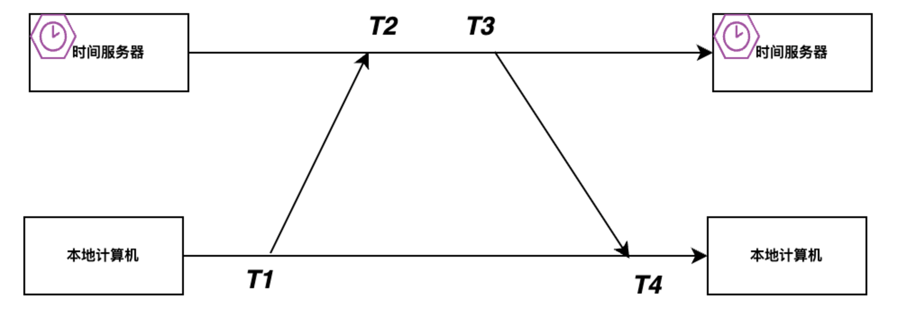

# 1. 研发通识

## 1. 项目管理

_如何项目统一代码风格?_

```
使用.editorconfig文件/.prettierrc文件配置代码风格, 该文件可以被多数IDE识别并生效(可能需要额外插件)
```

_常用的配置文件的格式有哪些?_

```
🌟xml文件
🌟properties文件
🌟yml文件

🌙Java中可以直接使用java.util.Property解析properties文件
🌙可以导入xsd文件规定xml文件的结构/默认值/约束值
🌙配置文件中的${Xxx}等占位符需要应用自定义解析和替换， 配置文件解析的三方库一般不支持
```

_项目中常见的文件含义?_
```
🌟README.md: 项目简介
🌟licsence: 开源协议

🌙.md文件后缀代表markdown文件, 一种和tex类似的文件但更适合记笔记
```

## 2. 平台兼容

_LF和CRLF的区别是什么?_

```
🌟 unix系统使用LF换行 LF=\n
🌟 windows系统使用CLRF换行 CLRF=\r\n
```

_环境变量是什么?_

```
环境变量是由操作系统维护的变量, 进程(如jvm, shell)可以读写环境变量

🌙常用的环境变量PATH为可执行文件搜索路径
🌙win的CMD中使用%变量名%表示环境变量, linux的shell中使用$变量名表示环境变量
🌙linux中可以通过修改/etc/profile文件定义全局环境变量
```

_win和unix系统如何管理软件的安装和卸载?_

```
🌟 unix: 使用包管理器(如apt yum, 包管理器在安装时可)
🌟 win: 使用installer程序(基于.NET平台, 安装的同时可修改注册表)

🌙安装便携式应用可以直接解压程序文件到文件系统中
```

_win和unix的文件路径区别?_
```
🌟 win: 盘符:\path\fileName
🌟 unix: /path/filename

🌙盘符从C开始
🌙早期盘符物理隔离存储设备(光盘/磁盘), 现在盘符作用为逻辑隔离(不同盘符可以使用不同的文件系统)
```

_win和unix系统是怎么暴露系统级API的?_
```
🌟 windows: 提供dll动态链接库文件
🌟 unix: 提供so共享库文件

🌙系统级API底层都是调用系统调用和内核交互
🌙所有应用程序功能的实现(计算/读写)都是基于系统级API
🌙不同系统的API定义可能不一样， 所以应用程序有win/mac/linux等版本（基于Java的跨平台应用程序除外）
🌙dll文件和so文件本质上是编译好的二进制指令集合，可以被用作CPP/Rust等程序的动态链接
```

_windows的注册表的作用是什么?_
```
注册表相当于一个层级数据库, 存储系统关键配置, 包括:
🌟开机自动启动项 & 服务
🌟防火墙配置 & 网络代理配置
🌟已安装的应用信息(安装位置&卸载程序)
🌟"文件后缀-默认启动程序命令"
🌟硬件的驱动程序位置
🌟桌面背景图片 & 应用图标 & 字体 & 鼠标样式和速度
```


## 3. 开源协议

_什么是开源协议?_

```
使用开源代码时需要遵循的法律条款
```

_常见开源协议的特点?_

```
🌟 MIT: 保留源代码中的版权声明和License文件, 不能因为代码问题起诉作者
🌟 Apache: 在MIT的基础上如果对代码修改了需要添加修改说明
🌟 GPL: 必须以GPL协议开源自己的源码
```

## 4. 云架构
*PaaS和IaaS的区别?*
```
🌟 IaaS(Infrastructure as a Service): 硬件资源相关服务, 如网络防火墙服务, 虚拟机服务
🌟 PaaS（Platform as a Service）: 基础软件相关服务, 如消息队列,关系型数据库,对象存储,图像识别
```

*什么是SLA?*
```
SLA = Service Level Agreement = 服务等级协议, 用于服务提供方声明服务质量(TP999, 可用性百分比, QPS, 数据延迟)和免责声明
```

# 2. 代码常识

## 1. RegExp

_正则表达式如何匹配特殊字符?_

```
🌟 开始和结束: ^这是一段文本$
🌟 单词边界: \b
🌟 除换行外的任意字符: .
🌟 范围: a-z
🌟 通过转义符匹配保留字符: \.
```

_正则表达式如何按数量/集合匹配?_

```
🌟 按次数匹配: ? + {n} {n, m}
🌟 按集合匹配: [a-z] [^A-Z]
```

## 2. Cron 表达式

_Cron 表达式是什么?_

```
一个Cron表达式定义了一个定时任务的执行时机
```

## 3. URI

_linux 中怎么表示上级目录和当前目录以及用户目录和根目录?_

```
🌟当前工作目录(working directory) = .
🌟工作目录的上级目录 = ..
🌟用户目录(home directory) = ~
🌟根目录 = /
```

_Apache Ant 风格的路径匹配规则是怎样的?_

```
🌟使用*匹配不含路径分隔符"/"的字符串, 如/sys/disk/*
🌟使用**匹配包含路径分隔符"/"的字符串, 如/sys/**/config.yml
```

## 4. MIME

_MIME 文件类型由哪三部分组成?_

```
由"主类型+子类型+参数列表"组成, 例如:
type/subtype; param1=value1; param2=value2
```

_HTTP提交表单时如果表单中包含文件那么Content-Type是什么?_
```
Content-Type: multipart/form-data; boundary=参数分隔符

🌙文件被二进制编码后作为表单的一个参数
🌙HTTP中使用MIME表示内容的类型
```

_如何设置 Http 响应头让浏览器将响应体下载为附件?_

```
Content-Disposition: attachment; filename="demo.pdf"
```

## 5. 序列化
*常见的序列化协议有哪些?*
```
🌟 JSON
🌟 Thrift
🌟 Protobuf

🌙 JSON可读性最高, 但数据压缩度不高且性能差, 所以大型企业为了节省流量加快响应速度可能选用其他协议
```
*Gson/FastJson/Jackson的区别是什么?*
```
🌟 Gson: Google开源, 入口类Gson
🌟 FastJson: Alibaba开源, 入口类Json
🌟 Jackson: Spring序列化库, 入口类ObjectMapper

🌙 Gson依赖反射实现, FastJson和Jackson依赖于getter/setter方法
🌙 Gson没有解决循环依赖问题, 循环依赖会StackOverflow
🌙 FastJson由于autoType机制导致漏洞多, 推荐FastJson2
```

# 3. 生活常识

## 1. 时间

*时间戳和本地时间的区别是什么?*
```
🌟 全球任何地方任何一刻, 时间戳的值都相等(GMT时间1970年1月1日00:00.000对应的时间戳为0)

🌟 同一个时间戳, 不同时区的本地时间字符串表示不同(如上海8:00AM, 纽约8:00PM)
```

*UTC GMT CST 时间的区别是什么?*
```
🌟 GMT(Greenwich Mean Time)基于天文现象
🌟 UTC(Coordinated Universal Time)基于原子钟, 同一时刻两者时间戳相差900左右
🌟 CST(China Standard Time)等价于UTC+8
```

*计算机时间戳同步协议NTP是如何消除网络传输的延迟的?*
```
利用本地时间戳diff和时间服务器上的时间戳diff估计网络耗时
```

# 4. 计算机系统常识

## 1. 硬件

_存储单位从小到大有哪些?_

```
8 bit (b)
= 1 byte (B)
= 2^-10 Kibibyte (KiB)
= 2^-20 Mebibyte (MiB)
= 2^-30 Gibibyte (GiB)
= 2^-40 Tebibyte (TiB)
= 2^-50 Pebibyte (PiB)

🌙ISP(电信服务提供商)经常将十进制单位和二进制单位混淆用来营销网速, 十进制的单位有:
Kilobyte (KB)
Megabyte (MB)
Gigabyte (GB)
Terabyte (TB)
Petabyte (PB)
```

_计算机中各种基本操作的时间大概为多少?_

| 操作                  | 时间                      |
| --------------------- | ------------------------- |
| 执行一个指令          | 1 ns                      |
| L1-L3 cache 访问     | L1 < 1 ns<br />L3 = 50 ns |
| Memory 访问           | 100 ns                    |
| SSD 随机访问/顺序访问 | 0.1 ms                    |
| HDD 顺序访问          | 2ms                       |
| HDD 随机访问          | > 10ms                    |
| 北京到上海网络延迟    | 30ms                      |

## 2. 网络
_系统代理和应用程序代理的区别?_
```
🌟系统代理: 操作系统级别的网络代理配置, 在使用操作系统提供的特殊网络API时(如WinINet)会自动走系统代理
🌟应用程序代理: 指应用程序自定义的网络代理, 应用程序调用操作系统通用网络API(如Java中的Socket)可绕过系统代理直连, 可以把目标地址配置为自定义的代理服务器

🌙VPN的原理就是修改系统代理为VPN应用绑定的端口, 如localhost:7890, 并转发网络包
🌙浏览器默认支持系统代理, 其他应用程序不一定支持系统代理, 但可以从环境变量获取系统代理配置
```

_什么是防火墙?_
```
防火墙是按照一定规则(ip/端口/协议/进程等)拦截网络流量的软件, 分为:
🌟硬件级防火墙: 如路由器防火墙设置
🌟操作系统级防火墙: 如Windows Defender防火墙
🌟应用程序防火墙: 如火绒/360防火墙, 基于操作系统提供的NetFilter功能实现
```

_GFW是什么?_
```
GFW = Great Firewall, 中国国家防火墙(网信办控制), 在网络的国际-国内网关路由器上进行流量拦截/域名污染

🌙因为GFW,国内无法访问绝大多数国外网站, 如youtube.com(github.com没有被拦截, 访问慢或访问失败是因为CDN域名被污染了)
🌙可以通过物理专线/VPN的方式绕过GFW, VPN可通过境外服务器搭建(境外云服务商的IP一般不会被拦截)
```

_镜像网站的原理是什么?_
```
镜像服务器主动爬取源站数据, 存储到镜像服务器中
```

_168骨干网和CN2的区别?_
```
两者均由中国电信提供
🌟168骨干网访问境外网络时经常卡顿丢包, 路由节点为202.97开头
🌟CN2价格更贵但访问境外时网络更好, 路由节点为59.43开头

🌙 如果国外服务器需要在国内访问, 推荐买CN2的服务器
```

_延迟/带宽/吞吐量的区别?_
```
将网络比作一个水管, 传输的数据比作水, 那么:
🌟 延迟=水从一端到另一端间隔时间
🌟 带宽=水管宽度
🌟 吞吐量=每秒流过的水

```
