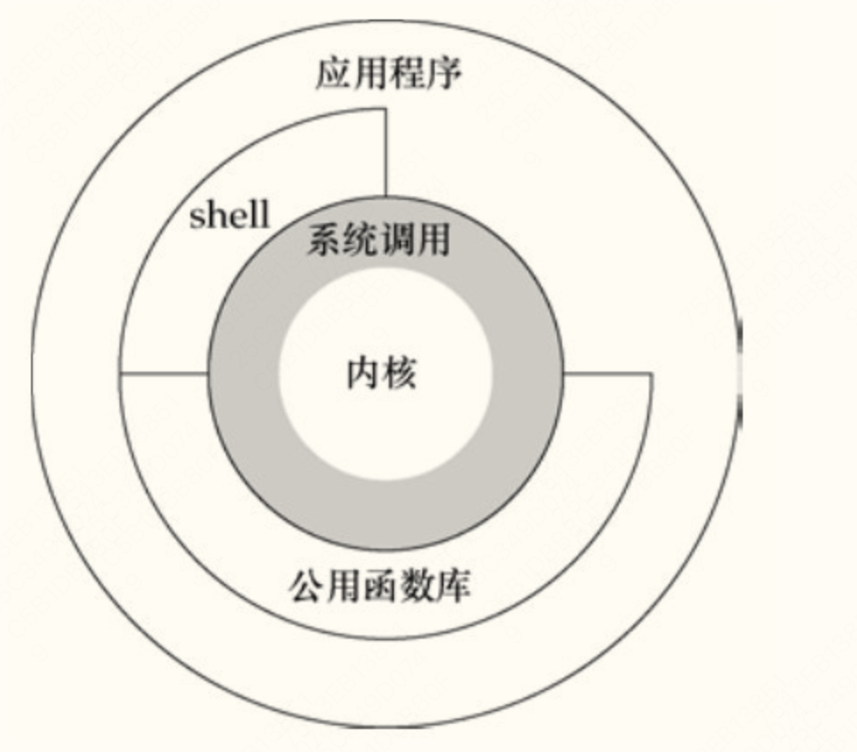
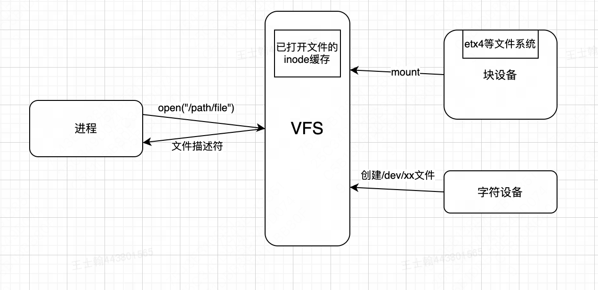

# unix系统简介
## 1. unix常识
*如何和系统内核交互?*
```
使用系统调用(system call)
```

*shell:应用程序:公共函数库:内核:系统调用之间的关系?*


*文件描述符可以表示什么?*
```
🌟 一个进程已打开的文件(映射为VFS中的inode)
🌟 一个socket

🌙 使用shell创建子进程时, 会创建三个文件描述符(标准输入/输出/错误流, 默认指向键盘文件/终端文件)
```

*VFS的作用?*
```
在操作系统内核和外部IO设备之间添加了一个抽象层
```


*POSIX标准定义了Unix系统的哪些内容?*
```
🌟系统调用
🌟shell工具及其相关实用程序(ls/mv/grep)
🌟文件系统
🌟进程/线程模型
🌟...
```

## 2. 硬件常识
_x86 和 arm 架构的区别?_
```
🌟x86 CPU: 使用复杂指令集
🌟arm CPU: 使用精简指令集

🌙 CPU架构架构不同, 同一个指令(如加法)对应的二进制机器码指令也不同
```

_什么是 BIOS 和 CMOS?_
```
BIOS: 主板上的BIOS(Basic Input/Output System)相当于一个程序在主板启动时运行, 作用是
```

_常用的接口标准有哪些?_


