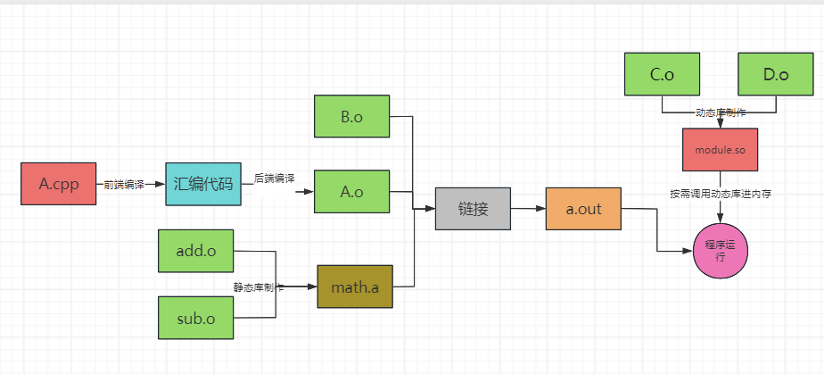

# 1. 基础知识

## 1. CPP 构建工具链
_Cpp 的常见编译器有哪些?_
```
🌟GNU开源计划中的gcc/g++(unix平台)
🌟MSVC(windows平台)

🌙gcc为c语言编译器, g++为cpp语言编译器
```

_GNU 计划是什么?_

```
一个开源软件计划(集合), GNU计划的开源软件需要遵循GPL开源协议

🌙Linux gcc都是GNU计划的软件
```

_make 和 cmake 的区别?_

```
🌟make是GNU计划下cpp构建工具, 使用Makefile来配置
🌟cmake是跨平台的cpp构建工具, 使用CMakeLists.txt来配置

🌙make只能用于unix系统的构建
🌙如果不使用构建工具, 需要把所有源文件one by one手动编译, 并手动链接
```

## 2. CPP 的编译

_讲一下 cpp 源码到可执行程序的过程?_


```
🌟编译后的.o文件本质上是一堆和机器相关(CPU架构不同时指令不同)的二进制指令
🌟cpp代码中通过头文件使用静态库和动态库, 链接过程需要依赖.lib文件
```

_静态库和动态库的区别?_

```
🌟使用静态库时, 在编辑阶段就会复制一份代码到编译产物中
🌟使用动态库时, 运行时才重定向函数到共享库

🌙静态库执行更快, 动态库更灵活
🌙编译和链接后的程序中有一个导入表,通过导入表实现动态链接的重定向
```

_什么是预编译指令?_

```
源码中以#开头的编译指令, 用于对源码进行预处理和编译器配置, 常见的预编译指令有:
🌟#include: 文本复制
🌟#define: 定义标识符的替换字符
🌟#if #else #endif:  条件编译
🌟#pragma: 设置编译器参数
```

_.h文件/.cpp文件/.lib文件的区别?_

```
🌟h文件中仅声明标识符(变量/函数/结构), 用于被其他文件#include
🌟cpp文件中写标识符的具体实现, 不直接被#include
🌟lib文件中定义了标识符和链接文件(dll/so)的对应关系

🌙编译器只编译cpp文件从而间接包含h文件中的标识符定义, 同时编译阶段不需要知道标识符具体实现
🌙编译时, 需要指定h文件/lib文件的搜索目录
```

_如何避免头文件循环include导致的重复声明标识符问题?_

```
在头文件开头加上 #ifndef X_H #def X_H, 结尾加上 #endif
```

## 3. CPP 的执行

_cpp程序的进程占用的内存的功能分区是怎样的?_

```
🌟代码区: 存放指令
🌟常量区: 存储const变量/字面值常量
🌟全局静态区: 存储全局变量/类的static变量
🌟堆: 存储new/malloc创建的对象
🌟栈: 存储函数的局部变量和返回地址
```

_struct结构体的变量在内存中是如何对齐的?_

```
🌟一个成员变量的起始地址必须是变量类型的整数倍 (int的起始地址必须是4n)
🌟struct总大小必须是最大成员变量的整数倍
🌟struct的最小大小=1byte

🌙 之所以按上面的方式存储, 是为了方便寻址(单次读取变量时只进行一次性寻址)
```

_指针类型在 32/64 位 CPU 中的大小分别是多少?_

# 2. 语言特性

# 3. STL
