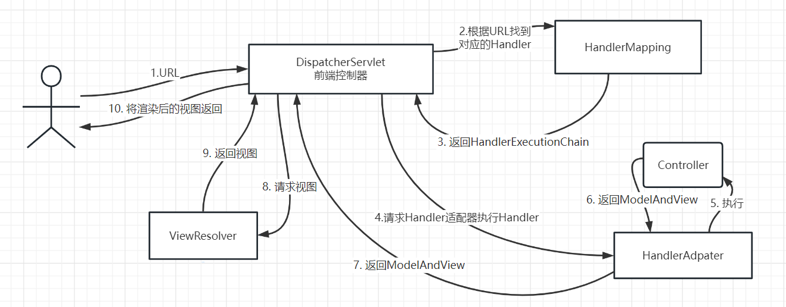

# ?1. IOC

## 1. IOC

_使用 IOC 的好处?_

```
使用IOC容器管理对象之间的依赖关系, 解耦业务对象
```

_IOC 容器注入依赖对象的方式有哪些?_

```
* 构造器注入
* setter方法注入
* 反射注入
```

_BeanFactory 和 FactoryBean 的关系?_

```
没有关系, BeanFactory是IOC容器的顶级接口, FactoryBean是注册Bean的一种方式
```

## 2. Bean

_Spring 有哪些方式可以获取 Bean 的注册信息?_

```
1. 读取配置文件

2. 扫描特定包下的所有类, 通过反射读取注册信息

tip: 使用@ComponentScan注解或在配置文件中添加<<context:component-scan>开启包扫描
```

_Bean 的 常用 Scope 有哪些?_

```
>> singleton(默认scope): 每次从容器中获取的bean是同一个对象

>> prototype: 每次从容器中获取的bean是新的对象
```

_讲一下 bean 的生命周期?_

```
1. 实例化(调用constructor方法)

2. 依赖注入

3. 初始化, 使用, 销毁
```

_懒加载和预加载 Bean 的区别?_

```
Bean为懒加载时, 会在getBean()时才会开始生命周期, 预加载Bean则会在容器启动时就开始

tip: 默认为预加载, 使用@Lazy注解指定Bean懒加载
```

_如何标注 Bean 的 init/destory 钩子方法?_

```
使用@PostConstruct 和 @PreDestory标注
```

_如何在容器启动后, 实例化阶段, 依赖注入阶段前后对 Bean 进行再加工?_

```
往容器中注册下面的Bean:
* BeanFactoryPostProcessor
* InstantionAwareBeanPostProcessor
* BeanPostProcessor

tip: @Value中的通配符实现原理为在BeanFactoryPostProcessor修改Bean注册信息
```

_如何将 IOC 容器对象注入为依赖?_

```
注入特殊的依赖可以让Bean实现XxxAware接口, 通过方法注入

例如: BeanNameAware, ApplicationContextAware
```

## 3. 基于注解的开发

_如何开启 Spring 的注解开发?_

```
在 spring 配置文件中加入<context:component-scan>

tip: springboot默认开启包扫描, 不用额外配置
```

_@Autowired 和 @Resource 的区别?_

```
* @Autowired 优先使用ByType的方式注入

* @Resource("beanID") 优先使用byID的方式注入

tip1: 可以使用@Qualifier指明beanId
tip2: 当需要注入的类型为 Collection 时, 会将容器内所有符合要求的类型都注入到容器中
```

_哪些 Spring 注解的作用是注册 Bean?_

```
* 类注解: @Component @Service @Controller @Mapper @Configuration

* 方法注解: @Bean
```

_如何将配置文件中的配置注入为依赖?_

```
* @Value + 通配符

* 使用@ConfigurationProperties
```

_Spring 中@Import 注解的作用?_

```
Bean类如果被@Import标注, 会额外注册指定的类为Bean, 即使不在包扫描范围内

tip: @Import常见的应用为@EnableXxx注解
```

# 2. AOP

## 1. AOP 理论

**_AOP 中的各种概念的含义?_**

```
joinpoint: 可以切入的点
pointcut: 对一类可以切入的点的描述
advice: 需要切入的逻辑
aspect: 对pointcut和advice的模块化封装
wave: 切入的过程
waver: 执行切入过程的角色
target: 被切入的对象
```


**_Advice 有哪些类型?_**

```
Before Advice: 方法执行前的通知
After Returning Advice
After Throwing Advice
After Advice: 方法执行后的通知, 不论方法是否抛异常还是执行成功返回值
Around Advice
```

**_Java 中实现 AOP 常见的方法?_**

```
使用JDK动态代理
使用CGLIB等动态字节码增强库实现动态代理
```

**_Aop 具体应用场景有哪些?_**

```
* 日志/系统监控: 将方法的调用情况记录下来
* 缓存
* 事务管理
* 访问控制: 如果没有权限则拒绝访问
* 异常处理: 当发生uncheckedException时通知管理员
```

## 2. SpringAop 原理

SpringAop 采用动态代理的方式在代理对象中织入切面, 如果被代理对象实现类接口采用 JDK 动态代理, 否则采用 CGLIB 库实现动态代理

具体代理代码如下


**_JDK 动态代理如何实现?_**

```
关键方法Proxy.newProxyInstance(), 关键类InvocationHandler
!!!JDK通过动态代理生成的代理对象和被代理对象必须实现同样的接口
```

```java
public static void main(String[] args) {
    Subject subject = new Subject();
// JDK生成的代理对象会赋值给接口
ISubject iSubject = (ISubject) Proxy.newProxyInstance(ClassLoader.getSystemClassLoader(),
Subject.class.getInterfaces(), new MyInvocationHandler(subject));
iSubject.hello();
}
static class MyInvocationHandler implements InvocationHandler {
    private Object target;
    public MyInvocationHandler(Object target) {
        this.target = target;
}
    @Override
public Object invoke(Object proxy, Method method, Object[] args) throws Throwable {
        System.out.println("前置通知");
Object ret = method.invoke(target, args);
System.out.println("后置通知");
        return ret;
}
}
```

**_CGLIB 动态代理如何实现?_**

```
通过Enhancer生成一个类的子类对象(代理对象), 重写了非final方法用来织入切面
```


## 3. SpringAOP 使用

1. 将一个 POJO 声明一个为一个 Aspect
2. 开启 `@EnableAspectJAutoProxy`

```java
@Component
@Aspect
public class MyAspect {
    @Pointcut("execution(void spider.myspr.aop.Test.hello())")
    public void onMethodExecution() {}

    @Before("onMethodExecution()")
    public void beforeAdvice() {
        System.out.println("i will say hello");
    }

    @After("onMethodExecution()")
    public void afterAdvice() {
        System.out.println("i have said hello");
    }
}
```

**_@EnableAspectJAutoProxy 的作用?_**

```
开启自动代理, 会往容器中注册一个AnnotationAwareAspectJAutoProxyCreator(是一个BeanPostProcessor)用于自动识别带@Aspect的bean并为Aspect类中描述的需要代理的对象生成代理对象, 也可以注册XxxAdvisor, 根据XxxAdvisor中描述的对象生成代理对象
```

**_Aop 失效的场景?_**

```
* target对象中需要代理的方法是final方法, 会导致代理对象无法重写该方法, aop失效
* target对象中需要代理的方法A的方法体中调用了target对象中另一个需要代理的方法B, 在代理对象中调用A()会使得B()的通知失效
```

## 4. 三级缓存机制

**_什么是三级缓存?_**

```
singletonObjects: 缓存初始化完成后的bean对象
earlySingletonObjects: 缓存提前进行AOP织入后的代理对象
singletonFactories: 缓存bean的ObjectFactory对象
```

**_为什么是三级而不是二级缓存?_**

如果只有循环依赖问题理论只需要二级缓存就可以解决, 引入 `earlySingtonObjects`的作用是缓存早期代理对象


# 3. 事务管理

## 1. Spring 事务基本盖帘

**_事务的 ACID 特性指什么?_**

```
* 原子性: 如果事务执行失败则回滚
* 一致性: 事务前后数据库的完整性没有被破坏
* 隔离性: 事务并发执行时可以保证不同执行顺序不影响最终的数据(通过事务的隔离级别实现)
* 持久性: 事务对数据库的修改是永久的
```

**_事务的隔离级别有哪些?_**

```
Isolation.READ_UNCOMMITTED : 事务期间其他事务写入的未提交的数据也有效-脏读问题

Isolation.READ_COMMITTED :  事务期间其他事务写入的提交后的数据有效-不可重复读问题

Isolation.REPEATABLE_READ: 事务期间不允许其他事务对同一个数据进行修改提交(增删可以提交)-幻读问题

Isolation.SERIALIZABLE : 事务期间不允许其他事务对同一个数据进行增删改提交-性能问题
```

**_事务的传播行为指什么? 有哪些传播行为?_**

在一个@Transactional 方法 A 内部调用了另一个@Transactional 方法 B 时, B 方法的行为为传播行为

```
Propagation.REQUIRED: 当前没有事务新建事务, 当前有事务则加入
Propagation.SUPPORTS: 不新建事务, 当前有事务则加入

Propagation.REQUIRES_NEW: 新建一个事务, 如果之前有事务则挂起
Propagation.NESTED: 新建一个嵌套事务(嵌套事务失败时, 外层事务也失败)
Propagation.NOT_SUPPORTED: 不新建事务, 如果之前有事务则挂起


Propagation.MANDATORY: 方法执行前必须有一个事务, 否则抛异常
Propagation.NEVER: 方法执行前必须没有一个事务, 否则抛异常
```

## 2. Spring 事务管理架构

**_spring 事务管理中重要的类以及类的作用?_**

```
TransactionDefinition: 包含事务的隔离级别, 传播行为, 超时时间等事务定义信息
TransactionStatus: 事务状态
PlatformTransactionManager: 负责管理与线程绑定的连接上下文(jdbc中是Connection对象), 隔离了不同连接技术事务管理api的差异从而提供了统一的接口(不同的数据库连接技术对应不同的实现类, 如JDBC对应DataSourceTransactionManager)
```


## 3. 声明式事务

**_声明式事务管理实现原理?_**

```
包含被@Transactional标注的方法的对象, 会通过aop在方法执行前使用PlatformTransactionManager获取与当前线程绑定的数据库连接上下文(在jdbc中是Connection)并开启事务, 在方法内部所有dao与数据库连接都使用同一个连接上下文, 当方法结束时, PlatformTransactionManager根据是否抛出特定异常决定是否回滚事务, 最后关闭连接上下文并与当前线程解绑
```

**_声明式事务什么情况下会失效?_**

```
* 事务方法为final方法(aop失效)
* 事务方法被同一个对象里的其他方法调用时(aop失效)
* 事务方法为private方法时(spring规定的)
```

**_编程式事务如何使用?适用情况?_**

编程式事务适合多线程情况下

```java
PlatformTransactionManager transactionManager = ...;  // 根据具体数据库技术获取相应的txmanager
DefaultTransactionDefinition txDef = new DefaultTransactionDefinition();
txDef.setPropagationBehavior(TransactionDefinition.PROPAGATION_REQUIRED);
// 获取事务状态
TransactionStatus txStatus = transactionManager.getTransaction(txDef);
        try {
            // 在此执行涉及数据库或其他资源的操作

            // 操作成功完成后，提交事务
            transactionManager.commit(txStatus);
        } catch (Exception ex) {
            // 发生异常时，回滚事务
            transactionManager.rollback(txStatus);
            throw ex;
        }
```

# 4. SpringMVC

## 1. 框架原理

_Springmvc 中的组件有哪些?_



```
tip: springmvc基于tomcat, 所以Dispatcherservlet需要映射所有请求路径
```

_SpringMvc 中拦截器(HandlerInterceptor)可以在哪些时机拦截请求?_

```
1.HandlerAdptor处理前
2.HandlerAdptor处理后
3.ViewResolver处理后
```

_SpringMvc 中如何统一处理 Controller 方法中抛出的异常?_

```
使用异常解析器(HandlerExceptionResolver)可以捕获异常并返回ModelAndView
```


## 2. 注解开发

### 4.2.1 Controller

_Handler 方法的返回类型是什么?_

```
ModelAndView
```

_怎样让 Handler 方法的返回对象直接序列化到 http 响应体中?_

```
1. 使用@RestController
2. 添加@ResponseBody
```

_RestController 默认使用哪个库进行序列化?_

```
默认使用JackSon进行序列化

tip1: Jackson序列化时需要getter方法
tip2: 通过WebMvcConfigurer添加HttpMessageConverter可以扩展序列化器
```

_如何将 Handler 方法和特定路径的请求绑定?_

```
使用@RequestMapping及子注解标记
```

### 4.2.2 传递参数和依赖

_Handler 方法的哪些参数类型会被自动注入?_

```
* HttpServletRequest/HttpServletResponse/InputStream/OutputStream: Servlet相关类

* ModelAndView: 要返回的ModelView对象

* BindingResult: 注入和验证参数的结果
```

_讲一下 Handler 方法的参数解析相关注解?_

```
* @RequestParam: query参数, form参数,  multipart参数

* @PathVariable: path参数

* RequestBody: 请求体反序列化参数
```

_如何自定义 Handler 方法的参数解析?_

```
通过通过WebMvcConfigurer配置HandlerMethodArgumentResolver
```

## 3. MVC 配置

_SpringMvc 的配置类需要实现什么接口?_

```
WebMvcConfigurer

tip: WebMvcConfigurer可以配置拦截器, 异常解析器, 参数解析器, 跨域规则
```

_前端为 SPA 应用时, SpringMvc 如何配置 ResourceHandler?_

```
将大部分路径(/**)都映射到index.html, 如果有js或css需要单独配置
```

# 5. SpringBoot

## 1. 介绍

_为什么要使用 Springboot?_

```
使用第三方库的xxx-starter.jar包时可以自动注册bean, 无需手动注册

tip: springmvc的starter中使用内嵌web容器, 默认依赖库为spring-boot-starter-tomcat
```

## 2. 实现原理

_springboot 自动配置原理?_

```
使用了类似于Java SPI的机制:
读取三方jar包中的spring.facotries文件, 加载中文件列出的配置类并注册到容器, 配置类被ConditionOnXxx注解, 只有在符合条件时才被注册
```

## 3. 配置文件

_SpringBoot 如何导入额外的 yml 配置文件?_

```
在Bean上标注@PropertySource("db.yml")
```

_多环境配置文件如何设置?_

```
application.yml中设置spring.profiles.active: Xxx `启用从配置文件`application-Xxx.yml`
```
