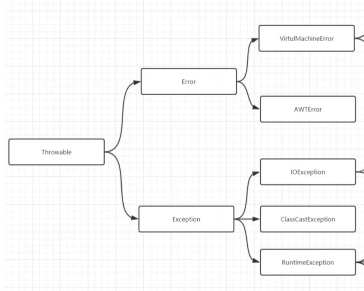
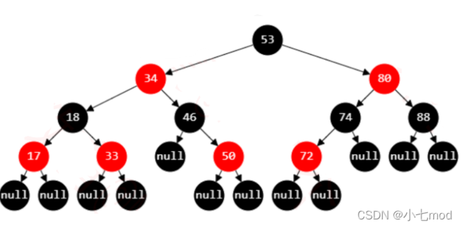
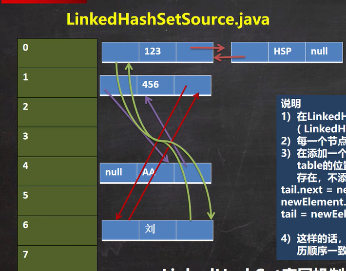

# 1. Java基础

## 1.1 方法

方法重载: 多个同名方法共存

```java
    //方法名相同, 参数列表不同, 返回值可以不同, 修饰符可以不同
    public int getSum(int a, int b){
        return a+b;
    }
    public double getSum(double a){
        return a+1.3;
    }
```

方法重写(override): 覆盖父类的方法

```java
        Runnable runnable = new Runnable() {
            @Override
            public void run() {
                System.out.println("hello, Override!");
            }
        };
```

方法的参数传递

* 基本数据类型传递值, 引用类型传递引用(可以理解为单层指针)
* 参数不能使用默认值, 默认值通过重载方法实现
* 可以使用不定项参数

```java
    public void printParameterLength(int... args){
        System.out.println(args.length);//args是数组
    }
```

常用方法

```java
        System.out.println("hello,world!");
        /**
         * == 判断引用的是否是同一个对象
         * 一般重写equals方法比较对象逻辑上是否相同
         */
        this.equals(null);
        /**
         * clone可以进行对象的浅复制
         * native方法比new一个对象再复制快得多
         */
        Object obj = this.clone();
         /**
         * 对象被当作垃圾要回收前时调用的一个函数, 小心使用, 防止对象复活
         */
        this.finalize();
	//instanceof 判断对象是否属于某个类/子类
        new String() instanceof Object
```

## 1.2 数组

```java
//******************************************初始化
//创建大小为10的数组(所有元素默认值为int的默认值0)
int[] arr = new int[10];
//创建指向空的数组
int[] arr = null;
//列表初始化
int[] arr = {1, 1, 2};

//******************************************遍历
//利用下标和循环遍历数组
for(int i = 0; i < arr.length; i++){
    System.out.println(arr[i]);
}
//foreach循环遍历数组
for (int num : arr) {
    System.out.println(num);
}

//******************************************操作
//java.util.Arrays类提供static方法对数组操作
//初始化(全部初始化为1)
Arrays.fill(arr, 1);
//打印数组的所有元素的值
System.out.println(Arrays.toString(arr)); 
//升序排序(数组的元素要实现Comparable接口)
Arrays.sort(arr);
//复制数组
int[] newArr = null;
Arrays.copyOf(newArr, arr.length);
//比较两个数组的所有元素是否相等
Arrays.equals(arr, newArr);
//二分查找
Arrays.binarySearch(arr, 2);//返回元素值为2的索引

//二维数组
//2x3的数组声明
int[][] gird = new int[2][3];
//初始化
int[][] gird = {{3, 4}, {1, 2}};
```

## 1.3 枚举类Enum

所有枚举类是java.lang.Enum的子类

声明一个枚举类

```java
public enum Color{
	//与普通类声明不同的一点: 首先给出所有枚举常量
	BLUE("蓝色"),
	GREEN("绿色");
	//和普通类一样有方法, 属性, 构造器
	private String des;
	public Color(String des){
		this.des = des;
	}
	public void say(){
		System.out.println(des);
	}
}
```

如果有需要查看所有枚举常量可以使用从Enum类中继承过来的方法:

`Color[] allColors = Color.values();`

## 1.4 注解

Java中的注解分为7个元注解(Java语言自带的注解)和程序员自定义的注解.

* 元注解

元注解各自的作用如下

| 注解名               | 作用                                                                                                         |
| -------------------- | ------------------------------------------------------------------------------------------------------------ |
| @Override            | 告诉编译器这个方法是重写的                                                                                   |
| @Deprecated          | 告诉编译器这个内容是过时的                                                                                   |
| @SuppressWarnings    | 告诉编译器忽略Warning                                                                                        |
| **@Retention** | 声明自定义注解的有效范围<br />RetentionPolicy.SOURCE<br />RetentionPolicy.CLASS<br />RetentionPolicy.RUNTIME |
| @Documented          | 声明自定义注解是否加入文档                                                                                   |
| **@Target**    | 声明自定义注解的使用范围<br />ElementType.FIELD<br />ElementType.METHOD<br />ElementType.TYPE                |
| **@Inherited** | 声明自定义注解的是否有继承性                                                                                 |


* 自定义的注解

自定义的注解通常是利用反射机制来搭框架,

声明语法为

```java
@Documented//要用元注解声明自定义注解的属性
@Target({ElementType.METHOD, ElementType.FIELD})
@Retention(RetentionPolicy.RUNTIME)
public @interface MyAnotation{//与声明接口相同, 只是关键字interface前加了@
	String[] value() default "unknown";
}
```

* 反射与运行期生效注解

假设通过反射获得了某个Method对象, 他是被MyAnnotation注解过的.

那么有以下与注解有关的操作, 可以让我们获得注解标注的内容并进行相应操作

```java
method.isAnnotationPresent(MyAnnotation.class)//看Method是否有特定注解
MyAnnotation myAnnotation = method.getAnnotation(MyAnnotation.class);
//获取方法的注解
String[] values = myAnnotation.value();//获取注解的属性值
```

* APT与编译期生效注解

Annotation Processing Tool，简称APT，是Java提供给开发者的用于在编译期对注解进行处理的一系列API，这类API的使用被广泛的用于各种框架，如lombok. **APT可以在编译期间处理语法树**

> 通过继承AbstractProcessor实现自定义编译期生效注释处理器

## 1. 4 Switch

基本类型(**除long double float外**)和String, Enum都可以用在switch语句上

```java
        String s = "123";
        switch (s) {
            case "":
                System.out.println(1);
                break;
            case "123":
                System.out.println(2);
        }
```

## 1.5 异常处理

* java异常接口为Throwable, 实现类为**Error(程序无法处理的异常)和Exception(程序可以处理的异常)**

  
* 异常处理代码

```java
try {
    逻辑程序块
} catch(ExceptionType1 e) {
    处理代码块1
} catch (ExceptionType2 e) {
    处理代码块2
    throw(e);    // 再抛出这个"异常"
} finally {
    释放资源代码块
}
```

* 异常抛出

```java
    public void test() throws Exception {//方法内部不处理异常时, 向上抛出异常
        throw(new Exception("错误信息"));//抛出异常
    }
```

* 打印异常栈

```java
new Exception().printStackTrace();
```

* CheckedException和UncheckedException

```
CheckedException: 不捕获就不能通过编译的异常(ClassNotFindException, IOException)
UncheckedException: 不捕获也可以通过编译的异常(RuntimeException)
```

* try-with-resource

```java
        try(Scanner scanner = new Scanner(System.in)) {
            int i = scanner.nextInt();
        } catch (Exception e) {
            e.printStackTrace();
        }
```

## 1. 6 Math&String

String

```
//格式化字符串
String.format("dp[%d][%d] = %d", j, K, minMaxPart)
//string byte[]互相转化
byte[] b = "hello, world!".getBytes();
System.out.println(new String(b));
//String重写了equals(), 可以比较两个字符串逻辑是否相等
"??".equals("??");

//字符串编码转换
String s = "你好";
String ss = new String(s.getBytes("gbk"), "utf8")

```

String对象为甚么不可变?

```
String类没有提供像StringBuilder中的replace, append的修改api, 而且value属性是private的

当String相加时, 实质上是新建了一个StringBuilder对象进行append, 最终返回一个新的String对象

要想可变, 使用反射修改value
```

Math

```java

       	//1. 常量
        //自然对数e
        double e = Math.E;
        //圆周率pi
        double pi = Math.PI;

        //2. 各种数学函数
        Math.min(1, 2);
        Math.max(3, 4);
        Math.abs(-1);
        Math.ceil(2.3);//向上取整
        Math.floor(2.3);//向下取整
        //支持三角函数sin, cos, tan, 以及对应的反三角函数
        Math.sin(Math.PI);//弧度制
        Math.acos(1);//值域[0, pi]
        //弧度和角度相互转换
        System.out.println( Math.toDegrees(Math.PI));
        System.out.println(Math.toRadians(180)); 
```

## 1.7 Lambda函数

Java中Lambda函数是依附于函数式接口(只有一个抽象方法的接口叫做函数式接口)存在的,  进一步来说**Lambda函数是用来给(函数式)接口实例化的.**

```java
        Runnable r = () -> {System.out.println("你好");};
        //上面的式子右边是一个Lambda函数
        //这个式子的含义是将r中run()方法实现为右边的Lambda方法
        //Lambda方法只能实现只有一个函数没实现的接口
  
        //Lambda函数的语法:
        //1. ->的左边是参数, ->的右边是函数体
        //2. 参数不用指明类型
        //3. 函数体可以是一个{}括起来的代码块, 也可以是一句代码, 可以有返回值.

        (a, b) -> {return a+b;}//合法的Lambda函数
	a -> a+1 //只有一个参数可以简写, 返回值为a+1
```

java自带了一些常用函数式接口如下

```java
       Consumer c = new Consumer<T>() {
            @Override
            public void accept(T t) {
                // TODO Auto-generated method stub
  
            }
        };
        Supplier s = new Supplier<T>() {
            @Override
            public T get() {
                // TODO Auto-generated method stub
                return null;
            }
        };
        Function f = new Function<T,R>() {
            @Override
            public R apply(T t) {
                // TODO Auto-generated method stub
                return null;
            }
        };
        Predicate p = new Predicate<T>() {
            @Override
            public boolean test(T t) {
                // TODO Auto-generated method stub
                return false;
            }
        };
```

## 1.8 Stream API

使用Stream API分为获取stream, 操作stream, 收集stream

获取stream

```java
        //1. Collection及其子类使用.stream()获取
        List<Integer> list = new ArrayList<Integer>();
        list.stream();

        //2. 数组使用Arrays.stream()获取
        int[] arr = {1, 5, 10};
        Arrays.stream(arr);

        //3. java.util.stream.Stream中的of()方法可以产生一个stream
        Stream<Integer> s = Stream.of(1, 2, 3);
```

操作stream

```java
        String[] arr = {"hello", "world", "hi", "interesting"};
        //###Stream的中间操作###

        //##过滤
        //1 .filter()的参数是一个Predicate, 返回值为false的元素会被去除掉
        Arrays.stream(arr).filter(a -> a%2 != 0);//去除掉偶数
        //2. skip(i)去除掉流的前i个元素
        Arrays.stream(arr).skip(1);
        //3. limit(n)流的最大长度为n, 多余n的元素被去除掉
        Arrays.stream(arr).limit(2);
        //4. 通过hash值去除重复元素
        Arrays.stream(arr).distinct();

        //##映射
        Arrays.stream(arr).map(a -> a.length()); //map()的参数是一个Function

        //##排序
        //sorted()不加参数是自然排序
        Arrays.stream(arr).sorted();
        //添加Comparator可以使用Comparator的compare方法进行比较
        //Comparator也是一个函数式接口
        Arrays.stream(arr).sorted((a, b) -> a.length() - b.length()).forEach(System.out::println);
```

stream的收集操作

```java
        //1. forEach迭代
        Arrays.stream(arr).forEach(System.out::println);
        //2. 收集到一个容器
        Stream<String> stream = Stream.of("aaa", "bbb", "ccc", "bbb");
        List<String> list = stream.collect(Collectors.toList());
```

**stream没有调用终止操作时中间操作也不会执行!**

## 1.9 SPI

SPI(Service Provider Interface), 是Java提供的一种服务发现机制, 可以通过接口查找相关实现类并动态加载实现类达到解耦+框架组件替换, 例如JDBC中的java.sql.Driver接口不同厂商会有不同实现

如何实现服务发现机制?

```
jar包下的META-INF/services/中有配置文件, 配置文件中包含要实现的接口和实现类之间的映射关系

通过ServiceLoader发现并加载接口的实现类
```

ServiceLoader的代码

```java
        // 加载实现了JDBC Driver接口的类
        ServiceLoader<Driver> serviceLoader = ServiceLoader.load(Driver.class);
        serviceLoader.forEach((impl) -> {
            System.out.println(impl.jdbcCompliant());
        });
```

## 1.10 基本类型

常用基本类型

```
byte char(注意JAVA中char类型为2字节, 使用unicode编码, char不存在自动类型提升) short int long float double
```

类型等级与**自动类型提升**

```
byte -> short -> int -> long -> float -> double
```

**低等级可以赋值给高等级(高等级不可以赋值给低等级)**

```java
        int i = 'a';
        short s = 'a';
        float f = 123L;
        int j = 12d;//编译报错
```

**低等级和高等级运算结果为高等级(+=, -=运算符会强制转型)**

```java
        short s1 = 1;
        s1 += 1;
        short s2 = s1 + 1;//编译报错
```

**java编译器会根据类型和字面值的取值确定字面值的类型**

```
byte b = 12; //正确
byte b = 1234; // 错误
float f = 12.3; // 错误
```

强制转型(向下转型)

```java
int i = (int) 123.3d;
```

自动装箱为包装类

```java
        Integer i = 128, j = 127, k = 128, m = 127;
        System.out.println(i == k);//false
        System.out.println(j == k);//true, Integer.IntegerCache
```

## 1.11 序列化

什么是序列化和反序列化?

```
序列化是指将Java对象变成字节流用于传输, 反序列化相反
```

JavaJDK的序列化方式

```
实现Serializable接口的类可以进行序列化, 序列化的对象的引用属性必须也能序列化

通过ObjectInputStream/OutputStream可以实现序列化对象为io流
```

transient

```
transient属性不会被序列化, 密码等属性要使用transient
```

serialVersionUID

```
private static final long serialVersionUID = 1L;
如果对象的序列化版本号和类的序列化版本号对不上会导致反序列化失败
所以需要显示指明序列化版本号避免hash函数生成
```

## 1.12 接口和抽象类

两者区别

```
1. 接口和抽象类不能实例化
2. 接口所有方法都为抽象的public方法, 不能有成员属性, 可以有static属性
3. 抽象类方法的修饰符没有限制, 但可以包含抽象方法
```

## 1.13 泛型和泛型擦除

## 1.14 包装类

自动装箱和自动拆箱

```
int i = new Integer(1) // 实际上是将new Integer(1).value赋值给i
Integer j = 1; // 右边实际上是调用了Integer.valueOf(1)方法, 会使用IntegerCache
```

Integer中有一个静态内部类IntegerCache, 在类初始化时会将值为[-128, 127]的Integer对象放到缓存数组中, 调用Integer.valueOf()方法如果值在这个范围内会直接返回缓存中的Integer对象

```java
    public static Integer valueOf(int i) {
        if (i >= IntegerCache.low && i <= IntegerCache.high)
            return IntegerCache.cache[i + (-IntegerCache.low)];
        return new Integer(i);
    }
```

## 1.15 反射

获取反射对象的方式

```
Class.forName()
类名.class
对象.getClass()
```

## 1.16 IO

Java中的IO流分为InputStream OutputStream Reader Writer

## 1.17 内部类

内部类分为静态内部类, 成员内部类, 局部内部类

```
静态内部类不依赖外部类而存在, 使用Outter.Inner表示静态内部类的类型, 可以访问外部类所有static属性和方法

成员内部类依赖于外部类的对象存在, 可以访问外部类对象的所有属性和方法
```

## 1.18 常用设计模式

单例模式

```
JDK中的Runtime, 单例模式适合用在在大对象/占用资源多的对象
```

建造者模式

```
JDK中的StringBuilder, 建造者模式适合用在对象有复杂的建造过程的情况
```

工厂模式

```
JDK包装类的valueOf方法, 工厂模式主要作用是将对象创建过程解耦出来
```

观察者模式

```
Java中的Swing GUI,  当被观察者的状态发生改变时自动通知观察者做出响应
```

代理模式

```
Spring中的AOP, 代理对象对被代理对象做了功能上的增强
```

装饰者模式

```
Java中的IO流, BufferedReader和Reader
```

.

# 2. Java容器

Java集合的体系


## 2.1 Collection

迭代器遍历

```java
        Collection<String> collection = new ArrayList<String>(){{add("jack"); add("jerry");}};
        // Collection的迭代器遍历
        Iterator iterator = collection.iterator();
        while (iterator.hasNext()){
            System.out.println(iterator.next());
        }
        //增强for遍历Collection本质是使用迭代器
        for (String s: collection){
            System.out.println(s);
        }
```

## 2.2 List

### 2.2.1 ArrayList

* **ArrayList底层使用Object数组**
  ```java
  transient Object[] elementData; // non-private to simplify nested class access
  ```
* ArrayLsit线程不安全, Vector线程安全

默认数组长度为0,  第一次add()后初始长度为10

```java
        if (elementData == DEFAULTCAPACITY_EMPTY_ELEMENTDATA) {
            return Math.max(DEFAULT_CAPACITY, minCapacity);
        }
```

**数组空间不足时扩容到1.5倍**, copy原数据到新数组中

```java
int newCapacity = oldCapacity + (oldCapacity >> 1);
```

### 2.2.2 Vector

Vector和ArrayList很相似, 底层也是使用Object数组, 默认大小==10, **容量不足时扩容默认扩容两倍(可以设置具体扩容多少)**

```java
        int newCapacity = oldCapacity + ((capacityIncrement > 0) ?
                                         capacityIncrement : oldCapacity);
```

方法基本为同步方法, 线程安全

```java
    public synchronized void addElement(E obj) {
        modCount++;
        ensureCapacityHelper(elementCount + 1);
        elementData[elementCount++] = obj;
    }
```

### 2.2.3 LinkedList

*底层是一个双端链表(维护头节点和尾节点)*

移除列表中的节点时, 需要将pre, item, next指针置空防止内存泄漏

原因: 节点虽然从LinkedList中删除, 但是如果可以通过其他方式可达该节点, 那么这个节点的next, item, pre也可达, 可能导致gc不能识别出垃圾

```java
        f.item = null;
        f.next = null; // help GC
```

## 2.3 Set&Map

### 2.3.1 HashSet

HashSet底层使用HashMap, HashMap中的所有键值对***value是同一个占位Object***

```java
//HashSet的add()
public boolean add(E e) {
    return map.put(e, PRESENT)==null; //private static final Object PRESENT = new Object();
}
```

### 2.3.2 HashMap

HashMap底层是**散列表+红黑树**, 默认capacity是16

HashMap的长度为2^n的目的是便于求模(length-1再&hash)

```java
        if ((p = tab[i = (n - 1) & hash]) == null)
            tab[i] = newNode(hash, key, value, null);
```

当存在链表时, 顺着链表查找, **根据==和equals()比较逻辑是否相等**, 相等返回该值

```java
            if (p.hash == hash &&
                ((k = p.key) == key || (key != null && key.equals(k))))
                e = p;
```

到链表末尾时, 插入节点并检查查找长度是否超过树化阈值, 超过则将链表转为红黑树

```java
                    if ((e = p.next) == null) {
                        p.next = newNode(hash, key, value, null);
                        if (binCount >= TREEIFY_THRESHOLD - 1) // -1 for 1st
                            treeifyBin(tab, hash);
                        break;
                    }
```

如果总节点数超过阈值(capacity * load factor), 扩容

```java
        if (++size > threshold)
            resize();
```

扩容逻辑: capacity *= 2

```java
newCap = oldCap << 1
```

**HashMap1.7->1.8改进**

```
* 使用尾插法而不是头插法
* 链表过长时会转化成红黑树
```

### 2.3.3 红黑树

红黑树的定义

* 根节点黑色
* **红色节点子节点必须是黑色**
* **根节点到所有null节点路径上的黑色节点数相同**
* 所有null节点都是黑色

> 上面的定义保证了最长路径 <= 最短路径*2, 类平衡二叉树, 时间复杂度logN
>
> 红黑树适合插入和删除比较频繁的, AVL适合查询比较频繁的, 总体性能红黑树>AVL

一颗红黑树示例



**一颗红黑树与一颗4阶B树是等价的**


**插入元素时插入的节点默认为红节点**, 如果插入的位置父节点也是红节点, 需要旋转并染色, 否则直接插入

删除节点时, 红节点直接删除, 黑色节点情况复杂, 需要染色和旋转

### 2.3.4 LinkedHashMap

底层是散列表+双向链表



### 2.3.5 HashTable

是线程安全的HashMap, 使用的同步方法

```java
public synchronized V put(K key, V value)
```

HashTable的key, value不能为null(**需要作为****synchornized的锁**)

```java
        Hashtable<String ,Integer> table = new Hashtable<>();
        table.put(null, null);//NullPointerException
        table.put("spider", null);//NullPointerException
        table.put(null, 123);//NullPointerException
```

### 2.3.6 TreeSet&TreeMap

TreeSet底层使用TreeMap, 可以实现排序, 排序使用Comparator, 如果两个值相等会认为是同一个元素

**TreeMap底层使用红黑树,** 比较大小可以使用comparator/自然排序, 复杂度logN

### 2.3.7 Hash冲突解决方法

```
1. 在hash冲突的位置往周围探测, 找到一个空闲的桶放置
2. 发生hash冲突时, 通过另一个hash函数映射到其他桶
3. 冲突的位置使用链表
4. 将冲突的元素放到公共的溢出表
```

## 2.5 ConcurrentHashMap

ConcurrentHashMap 底层结构和HashMap相同

使用了 `CAS` + `Synchronized` 来保证线程安全, **桶空时使用CAS, hash冲突时还是会synchronized**加锁

```java
         // 如果桶的位置没有元素, 使用Unsafe中CAS方法放入一个元素
         else if ((f = tabAt(tab, i = (n - 1) & hash)) == null) {
             if (casTabAt(tab, i, null,
                          new Node<K,V>(hash, key, value, null)))
                 break;                   // 如果成功退出循环, 否则自旋
         }
         // 如果发现当前节点的哈希值是 MOVED，则说明正处于扩容状态中，当前线程帮助扩容
         else if ((fh = f.hash) == MOVED)
             tab = helpTransfer(tab, f);
         else {
             V oldVal = null;
             // 锁住头节点节点
             synchronized (f) {
		//遍历链表/红黑树插入节点
	     }
```

## 2.6 Pair

## 2.7 PriorityQueue
