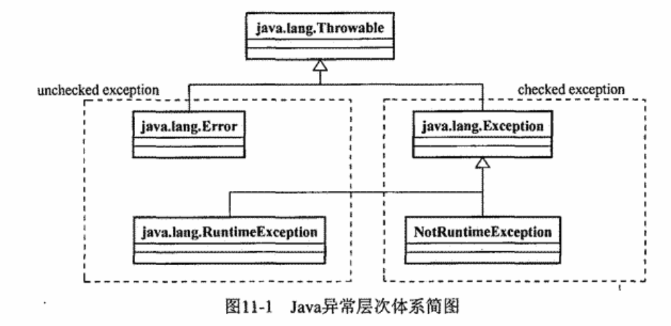

# 1. Java语言特性

## 0. Java语言概述

***Java和CPP的区别?***

| Java         | cpp                          |
| ------------ | ---------------------------- |
| 纯面向对象   | 可以面向对象, 也可以面向过程 |
| 自动垃圾回收 | 使用delete手动回收垃圾       |
| 单继承+接口  | 多继承                       |
| 跨平台       | 不跨平台                     |

## 1. 方法

***重写的方法权限修饰符和抛出的异常有什么要求?***

```
子类重写父类的方法需要满足要求:
* 子类方法比父类方法更容易访问
* 子类方法抛出的异常是父类抛出异常的子类
```

***方法中不定参数如何使用?***

```java
    void hello(String ...argus){
        System.out.println(argus[0]);
    }
```

***Java中方法参数传递是值传递还是引用传递?***

```
使用值传递
* 基本类型拷贝一份变量
* 引用类型拷贝地址
```

## 2. 常用类型

***如何改变String的编码?***

先将String转为byte数组, 再将byte数组构造为String

```java
new String("test".getBytes(StandardCharsets.UTF_8), Charset.forName("gbk"));
```

***Math.round(-3.5)结果是什么?***

```
正数: 四舍五入 Math.round(3.5) == 4
负数: 五舍六入 Math.round(-3.5) == -3;  Math.round(3.51) == -4
```

***什么是自动装箱/自动拆箱?***

```
基本类型有对象的封装类, 两种类型的变量之间可以相互赋值, 赋值时会在底层调用valueOf方法和xxxValue方法
```

***为什么new Integer(11) == new Integer(11)?***

```
Integer中有一个内部类IntegerCache, 当调用valueOf方法时如果值<=127会直接返回Cache里的对象 
```

***为什么重写equals()需要重写hashcode()?***

```
* 根据hash函数的定义, 如果两个对象相等, 那么两个对象的hash值必须相等
* hashcode()默认实现不能满足这个要求
```

`new String("1" + "2" + new String(""))` ***共创建了几个对象?***

```
字符串常量池中两个对象: "12", ""
堆区三个对象: 值为"12"的String, 值为""的String, StringBuilder
```

***StringBuilder, StringBuffer, String的区别?***

```
* String是final类, 由于没有提供更改私有成员value的方法, 所以不可变
* StringBuilder是String的建造者
* StringBuffer是线程安全的StringBuilder
```

`String#intern()`方法的作用?

```
将String对象放入字符串常量池, 并返回常量池中的引用
>>> 如果常量池中已有相等的对象, 直接该对象的引用
```

***如何实现深拷贝?***

```
* 重写copy方法
* 先序列化, 再反序列化
```

## 3. 注解与反射

***Java中的元注解有哪些, 注解保留策略有哪些?***

重要的元注解如下:

| 注解名               | 作用                                                                                                                                                               |
| -------------------- | ------------------------------------------------------------------------------------------------------------------------------------------------------------------ |
| @Override            | 标记重写方法                                                                                                                                                       |
| @Deprecated          | 标记过时方法                                                                                                                                                       |
| @SuppressWarnings    | 忽略编译器警告                                                                                                                                                     |
| **@Retention** | **注解的保留策略**<br />**RetentionPolicy.SOURCE(只在源码中保留)<br />RetentionPolicy.CLASS(保留到编译期)<br />RetentionPolicy.RUNTIME(保留到运行时)** |
|                      |                                                                                                                                                                    |
| **@Target**    | **注解用在什么地方**<br />ElementType.FIELD<br />ElementType.METHOD<br />ElementType.TYPE                                                                    |
| **@Inherited** | **注解是否会由父类传递给子类**                                                                                                                               |

***编译期注解和运行期注解分别是如何生效的?***

* 编译期注解通过编译期处理器 `AbstractProcessor`生效(如lombok)
* 运行期注解通过反射API `clazz.getAnnotations()` 生效

***Java中反射是什么, 反射为什么慢?***

```
反射: Java程序通过反射在运行时动态地获取对象的类信息, 对类的成员进行操作

反射速度慢的原因:
* JIT无法对反射进行优化
* 反射调用方法的过程中涉及一系列额外的操作, 比如参数的封装/校验
```

***有哪些方式能获取Class对象?***

```
* Class.forName()
* object.getClass()
* Object.class
```

***Class.forName()和classLoder.loadClass()的区别?***

```
Class.forName(): 加载类, 默认会到类初始化(cinit调用)完成
classLoder.loadClass(): 只会加载类到元空间, 不会进行验证解析等后续步骤
```

## 4. 异常处理

***讲一下Java异常处理类体系结构?***



***Exception和Error的区别是什么, 常见的Exception和Error有哪些?***

```
区别: Exception可以被程序处理, Error不能被程序处理

Exception: ArrayIndexOutOfBoundException, ClassNotFoundException, NullPointerException
Error: OutOfMemoryError, StackOverFlowError
```

***Checked Exception 和 unChecked Exception的区别,哪些异常属于UnCheckedException?***

```
Checked Exception: 源代码中必须catch的异常, 如果不捕获不能通过编译

UnChecked Exception: 非必须catch的异常, RuntimeException及其子类都属于这类
```

***什么是try-with-resource?***

```
Java7引入的语法糖, 在try()中声明的AutoCloseable对象会在离开try{}代码块后立刻调用close()方法
```

```java
        try (MyStream myStream = new MyStream(); MyStream myStream2 = new MyStream()) {
            throw new Exception();
        } catch (Exception e) {
            System.exit(1);
        }
```

***finally中的代码块一定会被执行吗?***

```
finally代码块在某些情况下不会被执行:

* catch代码块中使用System.exit()关闭JVM
```

## 5. 序列化

***Java序列化的方式有哪些?***

```
* JDK序列化: 实现Serializable, 使用ObjectOutputStream
* 第三方库序列化: Gson, Jackson
```

***transient关键字的作用?serialVersionUID的作用?***

```
transient修饰的字段不会进行序列化
serialVersionUID: JDK序列化的版本号, 使用JDK序列化时需要指定
```

***序列化协议有哪些?***

```
XML
JSON
Protobuf
```

## 6. 类

***接口和抽象类的区别和相同点有哪些?***

```
两者都不能被实例化

* 接口中所有变量强制为public static final变量, 抽象类中无限制
* 接口中所有方法强制为public abstract方法, 抽象类中方法没有限制, 可以声明abstract方法
* 接口不能声明构造函数, 抽象类可以有构造函数, 但不能调用
```

***什么是泛型擦除?***

```
泛型擦除: 
* 泛型参数不同的同名泛型类,会编一个同一个原始类型(raw_type), 例如ArrayList<A> 和 ArrayList<B> 会被编译为ArrayList<Object>类型, 类型内部所有泛型参数T都会被编译成Object

* 返回泛型类型的对象时会进行强制类型转换
```

***如何查看所有枚举常量?***

```
因为所有的枚举类都继承自Enum, 所以使用Enum的成员方法values()方法获取所有枚举常量
```

## 7. SPI

***什么是SPI?***

```
SPI: 通过ServiceLoader可以加载特定接口的实现类, 从而实现一种自动扩展机制
```

***怎样可以让接口的实现类被SPI加载?***

```
在jar包下/META-INF/services目录下添加接口和接口实现类的映射文件
```

## 8. 新特性

***Java8版本新特性有哪些?***

```
* Lambda表达式
* Stream API
* OPTIONAL
```

***Stream常用的中间操作和终止操作有哪些?***

中间操作有 `filter(), map(), sorted()`

终止操作有 `forEach(), collect()`

***Optional API的作用***

```java
// 避免频繁的判断==NULL

        String s = new Random().nextBoolean() ? null:"函数返回值";
        String ss = Optional.ofNullable(s).orElse("默认值");
        System.out.println(ss);
```

***Java17新特性***

```
* swith + lambda表达式 + yield
* sealed类 + permits
```

## 9. IO

***Java中IO流分为哪几种, 具体有哪些IO流?***

```
IO流分四种: 
 * InputStream OutPutStream
 * Reader Writer

这四种类的常用子类包括:
FileInputStream/FileOutStream/FileReader/FileWriter
BufferedInputStream/BufferedOutStream/BufferedReader/BufferedWriter
```

***什么是NIO, BIO, AIO, IO多路复用?***

```
* BIO: 使用open()系统调用使用阻塞式打开文件, 调用read()/write()时, 线程阻塞直到IO完成
* NIO: 使用open()系统调用使用非阻塞式打开文件, 每次调用read()/write()后, 立刻返回IO是否完成
* IO多路复用: 先使用select()/poll/epoll()监听多个文件描述符, 返回IO就绪的fd, 然后再调用read()/write()对所有就绪的fd进行IO
* AIO: 使用aio_xx()系统调用后, 有操作系统负责io, 当io完成时, 通过调用aio_Xxx()时指明的通知方式通知进程, 一般为信号或函数回调
```

***系统调用select, poll, epoll的区别?***

`select(fd_read_set, fd_write_set, timeout)` & `poll(fd_read_array, fd_write_array, timeout)`

```
* select/poll都会在timeout时间后返回这期间IO就绪的文件描述符(IO就绪指的是内核缓冲区就绪)
* select/poll时间复杂度都为O(N)

* select传入的是一个1024大小的bitmap, 比特位为1表示需要监听, 返回的bitmap为1表示IO就绪
* poll传入的是一个需要监听的fd数组, 返回的数组包含所有IO就绪的fd
```

`epoll_create, epoll_ctl, epoll_wait`

```
epoll_create: 创建一个epoll上下文(一个红黑树和一个监听到的事件链表)
epoll_ctl: 往红黑树中增删要监听的fd和对应的事件结构体
epoll_wait: 会阻塞timeout时间, 返回这期间监听到的事件数组
```

***边缘触发和水平触发的区别?***

```
epoll_wait中, 边缘触发只会有一次event, 水平触发有多次event
```


***什么是零拷贝?***

零拷贝指减少内核缓冲区和用户缓冲区的数据拷贝, 通过系统调用 `mmap / sendfile` 实现

```
mmap: 将进程的用户地址空间映射到内核文件缓冲区
sendfile: 将内核文件缓冲区直接拷贝到另一个内核文件缓冲区, 不需要经过用户缓冲区
```

***什么是Reactor模型?***

```
Reactor线程负责:
* epoll多路复用监听多个fd
* 注册和维护handler信息
* 将io事件分发给对应的handler 
```

## 10. 设计模式

***讲一下I常用的设计模式?***

```
* 单例模式: 保证系统中特殊对象(比如内存占用大的对象)的唯一性
* 观察者模式: 用于响应式编程
* 工厂模式: 将对象构造实例化过程解耦
* 组合模式: 让对象之间保持树形结构, 便于检索
* 策略模式: 多个策略实现类实现了同一个策略接口, 需要执行策略时直接调用接口, 避免if-else带来的开闭原则问题
* 代理模式: 代理类和被代理类实现同一个接口, 代理类对被代理类进行功能增强
* 装饰器模式: 装饰器和被装饰器都实现同一个接口, 调用装饰器的方法可以对原方法进行功能增强
* 职责链模式
```

***单例模式的实现方式有哪些?***

```
* static静态代码块
* 双重锁检验
* 枚举类
```

***代理模式和装饰城模式的区别?***

```
* 代理模式中, 代理对象一般不会被再代理
* 装饰器模式中, 装饰器一般会被作为其他装饰器的被装饰对象
```

***面向对象设计的原则有哪些?***

```
* 开闭原则
* 单一职责原则
* 最小知道原则
* 依赖导致原则
* 里氏替换原则
* 合成复用原则
```

# 2. Java容器

## 1. Collection

***讲一下Java中的集合体系?***

```
* conllection接口的子接口: set list queue
* map不属于collection, 但经常被使用
```


## 2. List

***ArrayList和LinkedList的区别?***

```
* ArrayList内部是一个Object[], LinkedList是一个Object双向链表
* 随机读写时ArrayList复杂度O(1), LinkedList复杂度O(N)
* 插入时ArrayList复杂度O(N), LinkedList复杂度O(1)
```

***ArrayList扩容机制是什么?***

```
newCapacity = oldCapacity + (oldCapacity >> 1)
* 初始大小为0, 第一次直接扩容到10
* 当超过最大大小时, 重新申请1.5倍的内存, 并将原数据拷贝到新内存中
```

***ArrayList线程安全吗, 多线程下修改会出现什么问题, 如何解决?***

```
ArrayList线程不安全, 多线程下修改可能会出现数据不一致问题, 还可能会抛出并发修改异常

使用Vector替代ArrayList, Vector中方法与ArrayList基本相同, 但读写使用同步方法
```

## 3. Map

***TreeMap底层数据结构是什么?***

```
底层使用红黑树

红黑树特点:
* 二叉搜索树
* 根节点和null节点为黑色
* 红色节点的子节点必须时黑色节点
* 每条根叶路径上黑色节点数相同

红黑树保证了左右子树高度差不会太大
```

***HashMap底层数据结构是什么, 扩容机制?***

```
底层数据结构为散列表, 初始化大小为16, 当表的负载因子超过0.75时, 表的大小 *= 2

表的大小为2的整数倍的目的: 方便通过掩码的方式将hash值映射到桶索引
```

***HashMap 从JDK1.7到JDK1.8改进了什么?***

```
JDK8中, 如果一个桶的链表过长时(>=树化阈值8), 会将链表转化为红黑树
当红黑树过小时(<=退化阈值6), 会将红黑树转化为链表

默认退化阈值不为7的原因是: 避免频繁转化退化造成的性能下降
```

***Hash冲突的解决办法有哪些?***

```
* 拉链法: 冲突的元素组成链表 
* 探测法: 当发生冲突时, 在冲突位置向周围按照一定算法(线性探测, 二次探测)进行探测, 找到一个空位置存放, 当删除元素时, 需要对其他发生冲突的元素进行重定位!!!
* 公共溢出区: 将hash冲突的元素放到一个公共的区域, 但在这个公共区域的查找效率低
* rehash到另一个hash表中
```

***什么是一致性hash算法, 用于什么场景?***

一致性hash算法使用场景:

```
在一个分布式系统中, 有很多节点, 如果使用普通的hash算法进行负载均衡, 当节点数发生变化时要进行rehash, 需要进行大规模的数据迁移, 使用一致性hash算法则不会
```

一致性hash算法原理

```
* hash函数的值域是一个环
* 节点映射到环上多个点, 数据通过hash函数映射到环上一个点
* 数据存储到离映射点顺时针最近的节点上
```

***HashTable可以使用null作为键值对吗, HashMap呢?***

```
* HashMap可以使用null作为key/value, 当null为key时, hash值取0
* HashTable不允许使用null做key(null.hashCode()会报NPE), 不允许使用null做value, 为了向下兼容
```

***LinkedHashMap是如何实现有序的?***

```
* LinkedHashMap继承自HashMap, 内部数据结果和put/get过程和HashMap一致
* LinkedHashMap内部的Entry继承自HashMap内部的Entry, 但多了两个指针before/after
* LinkedHashMap内部还维护了双向链表的头尾Entry
```

## 4. ConcurrentHashMap

***为什么要使用ConcurrentHashmap?***

```
* HashMap线程不安全
* HashTable锁的粒度过大, 元素过多时性能差
```

***ConcurrentHashmap原理?***

```
JDK8后, concurrenthashmap的结构与hashmap相同
* get()不加锁, 因为Node[] / node.next/ node.val都使用volatile修饰
* put()时会进行自旋, 如果桶==null, 尝试cas赋值, 如果正在扩容, 会帮助扩容, 如果桶!=null且未扩容则获取链表第一个节点的对象锁再遍历链表
```

## 5. 阻塞队列

***Java中的常用的阻塞队列有哪些?***

```
* ArrayBlockingQueue: 初始化必须指定大小, 底层为数组
* LinkedBlockingQueue: 可以任意大小, 底层为链表, 会有OOM问题
* PriorityBlockingQueue: 按优先级出队列
* DelayQueue: 元素必须实现Delayed接口
```

***阻塞队列队列的接口有哪些?***

```
* 阻塞接口: put() take()
* 抛异常的接口: add() remove()
```

## 6. 其他常用容器

***最大堆和最小堆的区别, PriorityQueue是什么堆?***

```
定义: 最大堆指根节点为最小值的二叉树, 且树的所有子树均为最大堆, 最小堆相反

!!! 所有默认的排序都是从小到大, 所以默认为最小堆
```

***堆排序重要过程?***

```
* update(int idx, int v, boolean skipRoot): 从idx节点开始, 使用v向下更新

* init(): 初始化时从后往前, 更新父节点和子节点使其符合关系

!!! 初始化时如果父节点与子节点交换后, 需要立刻使用update(sonIdx, fatherVal);
```

***Comparator和Comparable的区别?***

```
*  comparator和comparable都是用于比较Object大小的函数式接口
*  Comparator的比较方法参数有两个, Comparable比较方法参数只有一个(用于比较自身和另一个Object的大小)
```
