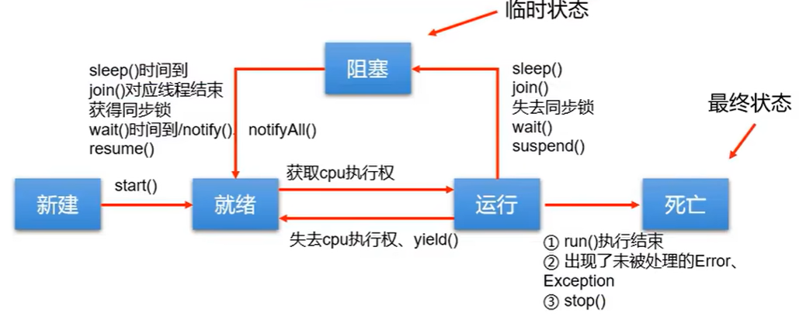
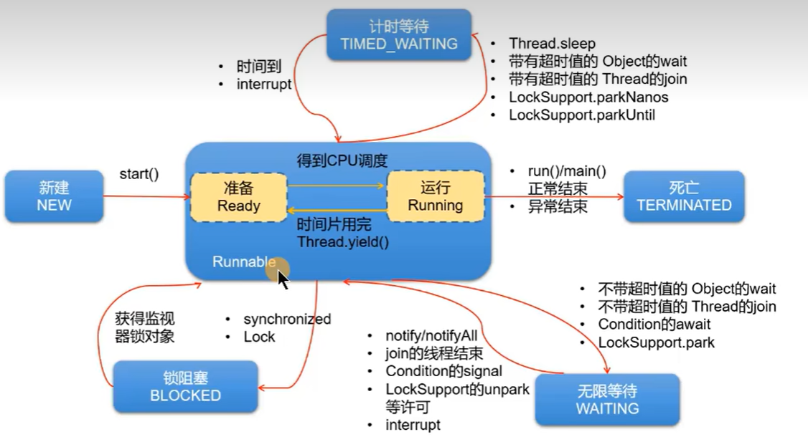

# 1. Java并发基础

## 1.0 并发编程三大问题

原子性

可见性

有序性

## 1.1 程序, 进程, 线程, 并发, 并行

```
程序: 由二进制指令组成的数组, 可以看作一个文件
进程: 程序被操作系统加载到内存中后执行被称作进程, 进程是操作系统资源分配和调度的最小单位
线程: 多个线程共享进程的资源, 多个线程里的指令可以各自被不同的处理器并行执行

并发: 一个时间点只有一个任务执行, 但很快的交替执行不同任务, 看起来一段时间内多个任务都执行了
并行: 任何一个时间点内多个任务同时执行
```

> 多线程/并发的意义: 提高多核CPU利用率 缩短响应时间

## 1.2 线程创建方式

* 直接重写Thread及其子类的run()

  ```java
          Thread thread1 = new Thread() {
              @Override
              public void run() {
                  this.setName("thread1");
                  System.out.println(Thread.currentThread().getName());
              }
          };
          thread1.start();
  //这种方式多线程的共享数据需要设置为这个类的静态变量
  ```
* 使用Runable接口的实现类创建Thread

  ```java
          Runnable runnable = new Runnable() {
              public int a = 1;//多个线程共享的数据
              @Override
              public void run() {
                  System.out.println(Thread.currentThread().getName());
                  System.out.println(a++);
              }
          };
          Thread t1 = new Thread(runnable);
          Thread t2 = new Thread(runnable);
          t1.start();
          t2.start();
  ```
* 使用Callable实现类作为参数的FutureTask对象创建Thread

  ```java
          Callable<String> callable = new Callable<String>() {
              @Override
              public String call() throws Exception {
                  System.out.println("分线程正在计算2*3结果");
                  return "6";
              }
          };
          FutureTask computeTask = new FutureTask(callable);
          Thread t1 = new Thread(computeTask);
          t1.start();
          try {
              System.out.println("主线程正在完成其他任务");
              System.out.println("主线程其他任务完成, 需要计算结果");
              System.out.println(computeTask.get());
          }catch (Exception e){
              e.printStackTrace();
          }
  ```

## 1.3 线程常用方法

```java
        //static
        Thread.sleep(1000);
        Thread.activeCount();
        Thread main = Thread.currentThread();
        //setXxx()
        main.setPriority(Thread.MAX_PRIORITY);
        main.setDaemon(false);
        main.setName("main");
        //isXxx()
        main.isAlive();
        main.isDaemon();
        main.isInterrupted();
```

## 1.4 线程生命周期



JDK6+后对阻塞状态细分为3个状态



## 1.5 同步代码块

**当多个线程对共享数据进行读写时**会出现线程安全问题, 使用**同步代码块可以解决线程安全问题**但会造成并发性能变低

```java
        Runnable runnable = new Runnable() {
            private Integer a = 10;
            @Override
            public void run() {
                synchronized (a){//a作为锁
                    while (a > 0) System.out.println(a--);
                }
            }
        };
        Thread t1 = new Thread(runnable);
        Thread t2 = new Thread(runnable);
        t2.start();
        t1.start();
//一个线程进入同步代码块前会查看对象a的锁标志位是否为false, 为false时进入代码块并把标志位设为true(原子操作)
//离开同步代码块会恢复锁标志位为false
```

> 锁对象常使用Xxx.class

synchronized也可以修饰静态方法, 成员方法

```java
    static synchronized void hello(){
        System.out.println("hello");
    }
//static方法的锁为Xx.class
    synchronized void hello(){
        System.out.println("hello");
    }
//成员方法的锁为this指向的对象
```

## 1.6 死锁问题

多个线程的资源等待链形成一个环时会造成死锁

死锁4个必要条件(面试题)

```
互斥: 同一个资源同一时间不能被多个线程使用
不可剥夺: 已经获得的资源不会被强行剥夺
占用且等待: 线程占有资源并且还在等待资源
循环等待: 资源等待链形成一个环
```

## 1.7 线程通信

当线程之间需要协作完成任务时, 需要线程通信, 如生产者消费者模式中生产者在产品数达到上限时通知消费者消费, 消费者在没有产品时通知生产者生产

```java
        Thread.sleep(1000);//线程阻塞1s, 不释放锁
        t1.join();//阻塞当前线程, 等待t1线程结束
        Thread.yield();//当前线程由运行状态转到等待状态
	t1.interrupt();//将线程的中断标志设置为true, 当中断标志位true线程阻塞后会直接中断并抛出异常

synchronized (MyApplication.class){
    try {
        MyApplication.class.wait();//线程阻塞, 释放锁, 将当前线程加入到该锁的阻塞列表中
        MyApplication.class.notify();//唤醒锁的阻塞列表中的一个线程
        MyApplication.class.notifyAll();//唤醒锁的阻塞列表中的全部线程
    } catch (InterruptedException e) {
        e.printStackTrace();
    }
}
```

## 1.8 虚假唤醒

什么是虚假唤醒?

```
本来没有货物, 多个消费者线程都在wait()，生产者线程生产了一件货物然后notify，
消费者线程A被唤醒消费了货物，这时A线程nofity应该期待唤醒生产者线程(货物数=0), 但由于使用了if而换起了一个消费者线程
```

如何避免虚假唤醒

```
把     if (product < 1) { this.wait() }
换成   while (product < 1) { this.wait() }
```

# 2. JUC基础

## 2.1 Lock

使用Lock的lock()和unlock()可以实现同步代码块相同的功能

```java
ticketLock.lock();
try {
    if (ticketNum > 0){
        System.out.println(Thread.currentThread().getName());
        System.out.println(sb.append("卖出第").append(10-(ticketNum--)).append("张票"));
    }else{
        break;
    }
}finally {
    ticketLock.unlock();
    sb.delete(0, sb.length());
}
//private Lock ticketLock = new ReentrantLock();
```

Lock和同步代码块的差异和比较

```
同步代码块中抛出异常当前线程会自动释放锁
Lock的lock()到unlock()之间的代码发生异常线程不会释放锁
```

## 2.2 Condition

```java
   final Lock lock = new ReentrantLock();
   final Condition notFull  = lock.newCondition(); 
   final Condition notEmpty = lock.newCondition();
   notFull.await();
   notFull.signal();
```

每个Condition会有自己单独的等待队列，调用await方法，会将当前线程放到对应的等待队列中并阻塞。当调用Condition的signalAll/signal方法，则只会唤醒对应的等待队列中的线程。**唤醒的粒度变小了，且更具针对性。**

## 2.3 集合的线程安全问题

### 2.3.1 并发修改异常

### 2.3.2 并发容器

## 2.4 公平锁和非公平锁

公平锁: 会优先分配给线程等待队列的首个线程

非公平锁: 会被(线程等待队列中的线程+正在申请锁但还没入队的线程)自由竞争

> 非公平锁可能会导致线程饿死, 公平锁会消耗额外的时间

```java
boolean isFair = true;
Lock lock = new ReentrantLock(isFair);
//默认为非公平锁
```

## 2.5 可重入锁

可重入锁: 当前线程拥有可重入锁时, 可以再次申请该可重入锁, ReentrantLock & Synchornized都属于可重入锁

```java
    lock.lock();
    lock.lock();
    try {
      // ... method body
    } finally {
      lock.unlock()
      lock.unlock()
    }
//!!!每加锁一次, 就需要解锁一次
```

可重入锁的目的: 避免同步方法的递归导致死锁

## 2.6 JUC辅助类

### 2.6.1 CountDownLatch

### 2.6.2 CyclicBarrier

### 2.6.3 Semaphore

## 2.7 乐观锁和悲观锁

乐观锁和悲观锁

```
悲观锁: 每次线程获得悲观锁之后不允许别的线程获取锁, 适合写线程较多的场景

乐观锁: 线程获得乐观锁后乐观地认为其他线程获得锁后不会进行写操作, 允许其他线程获取锁, 但在写数据前会检查数据是否被其他线程修改, 如果其他线程修改过就放弃修改/重新获取锁修改数据, 适合读线程较多的场景
```

读写锁

```
1. 当线程对数据进行只读时申请读锁, 要写时申请写锁
2. 其他线程持有写锁时, 当前线程申请不了任何锁
3. 其他线程只有读锁时, 当前线程可以申请读锁
4. 当前线程持有写锁时, 可以将写锁降级为读锁
```

读写锁问题和优点

```
可能造成写线程饿死, 但增加了并发性
```

## 2.8 线程池

线程池优点

```
线程池可以避免频繁的创建和销毁线程大量消耗CPU和内存资源
```

创建和使用JUT自带的线程池

```java
        ExecutorService pool = Executors.newCachedThreadPool();
        pool.submit(()->{
            System.out.println("hello");
        });
        pool.shutdown();
```

线程池ThreadPoolExecutor继承图和构造函数


```java
public ThreadPoolExecutor(int corePoolSize,
                          int maximumPoolSize,
                          long keepAliveTime,
TimeUnit unit,
BlockingQueue<Runnable> workQueue,
ThreadFactory threadFactory,
RejectedExecutionHandler handler){

}
```

## 2. 9 异步回调

CompletableFuture


CompletableFuture可以完成异步任务并指定回调

```java
        CompletableFuture<Void> completableFuture = CompletableFuture.runAsync(()->{
            try {
                Thread.sleep(1000);
            } catch (InterruptedException e) {
                e.printStackTrace();
            }
        });
        long start = System.currentTimeMillis();
        completableFuture.whenComplete((result, exception)->{
            long end = System.currentTimeMillis();
            System.out.println(Thread.currentThread().isDaemon());//true
            System.out.println("异步任务完成时间: " + (end- start));//1048
        });
        Thread.sleep(3000);//防止用户线程过早结束
```

CompletableFuture创建时就开始执行, 绑定完成回调时会检查是否完成, 如果完成会立刻执行回调

```java
        CompletableFuture<Void> completableFuture = CompletableFuture.runAsync(()->{
            try {
                Thread.sleep(500);
                System.out.println("异步任务完成");
            } catch (InterruptedException e) {
                e.printStackTrace();
            }
        });
        Thread.sleep(3000);
        completableFuture.whenComplete((r,e)->{
            System.out.println("没有异常");
        });
        Thread.sleep(3000);//防止用户线程过早结束
```

线程逻辑运算

```java
        CompletableFuture<Integer> taskA = CompletableFuture.supplyAsync(()->{
            try {
                Thread.sleep(1000);
            } catch (InterruptedException e) {
                e.printStackTrace();
            }
            return 1;
        });
        CompletableFuture<Integer> taskB = CompletableFuture.supplyAsync(()->{
            try {
                Thread.sleep(2000);
            } catch (InterruptedException e) {
                e.printStackTrace();
            }
            return 2;
        });
        //线程或
        taskA.applyToEither(taskB, res -> res).thenAccept(res->{
            System.out.println("较快的线程的计算结果是"+res);
        });
        //线程并
        taskA.thenCombine(taskB, Integer::sum).thenAccept((res)->{
            System.out.println("两个线程的和是"+ res);
        });
        //allOf, anyOf
        CompletableFuture.allOf(taskA, taskB).thenAccept((res)->{
            System.out.println("所有任务均以完成");}
        );
        CompletableFuture.anyOf(taskA, taskB).thenAccept((res)->{
            System.out.println("有一个任务完成, 结果是" + res);}
        );
        Thread.sleep(3000);
```

# 3.    进阶

## 3.1 管程

## 3.2 协程

## 3.3 守护进程

当用户线程全部结束时, 守护线程会立刻结束

```java
        Thread t1 = new Thread(new Runnable() {
            @Override
            public void run() {
                while (true){
                    try {
                        Thread.sleep(1000);
                        System.out.println("t1---running");
                    } catch (InterruptedException e) {
                        e.printStackTrace();
                    }
                }
            }
        });
        t1.setDaemon(true);
        t1.start();
        Thread.sleep(3000);
        System.out.println("main---end");
```

## 3.4 并发任务Future

Future接口, FutureTask作为实现类, 用作初始化并发任务

```java
        FutureTask<String> task = new FutureTask<String>(() -> {
            int i = 0;
            while (i++ < 3) {
                System.out.println("计算中: "+ i);
                Thread.sleep(1000);
            }
            return "计算结果";
        });
        new Thread(task).start();
        System.out.println(task.get());//get()方法会导致主线程阻塞
```

线程池+FutureTask

```java
        ExecutorService executorService = Executors.newFixedThreadPool(2);
        FutureTask<String> futureTask0 = new FutureTask<>(()->{
            Thread.sleep(300);
            return "ok";
        });
        FutureTask<String> futureTask1 = new FutureTask<>(()->{
            Thread.sleep(400);
            return "ok";
        });
        long begin = System.currentTimeMillis();
        executorService.submit(futureTask0);
        executorService.submit(futureTask1);
        futureTask0.get();
        futureTask1.get();
        long end = System.currentTimeMillis();
        System.out.println("total time: " + (end-begin) + "ms");
        //total time: 406ms
        executorService.shutdown();
```

过时不候

```java
        FutureTask<String> futureTask1 = new FutureTask<>(()->{
            Thread.sleep(4000);
            return "ok";
        });
        new Thread(futureTask1).start();
        futureTask1.get(3, TimeUnit.SECONDS);
//抛出 java.util.concurrent.TimeoutException
```
