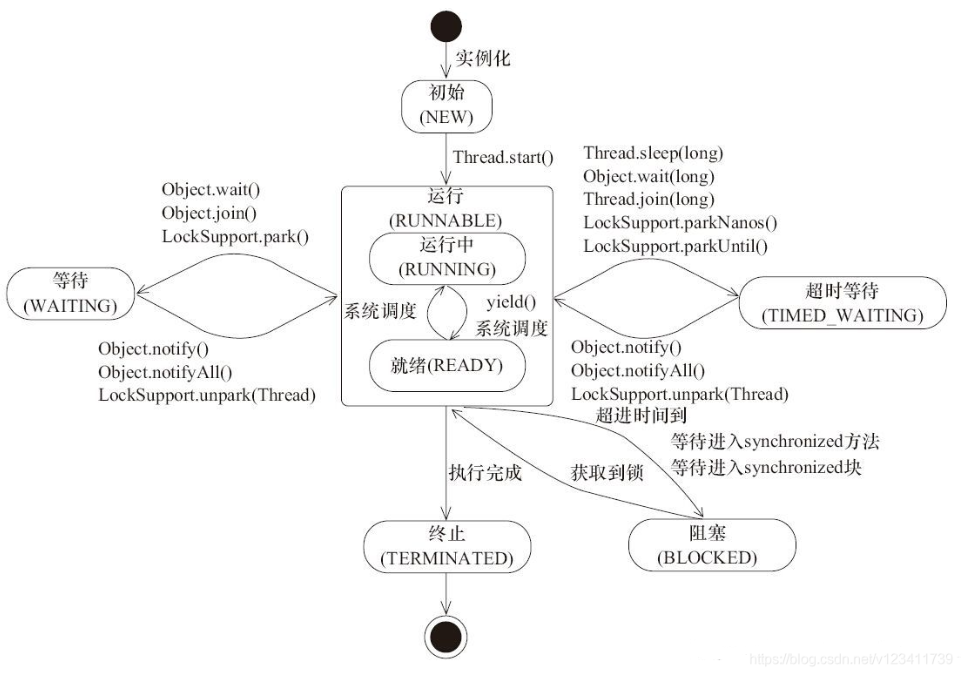
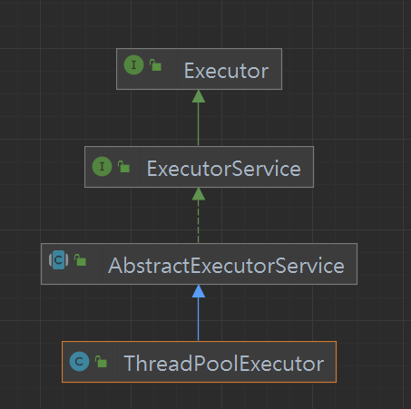
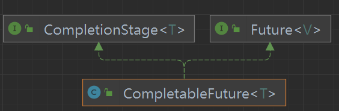
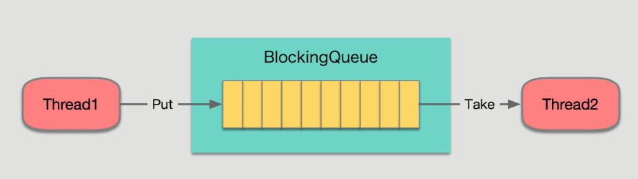
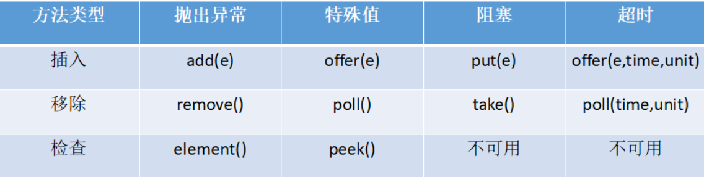
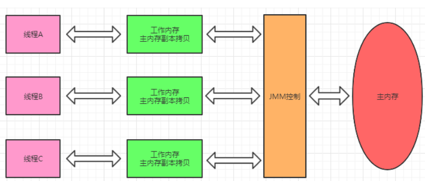
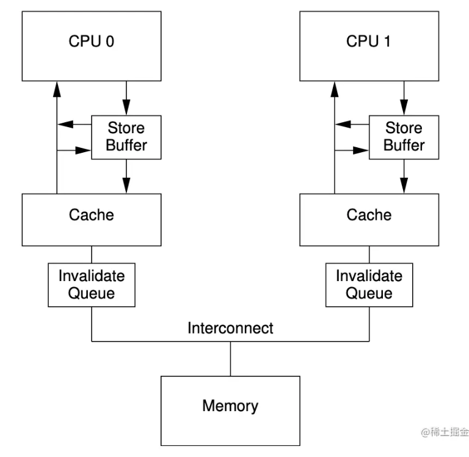
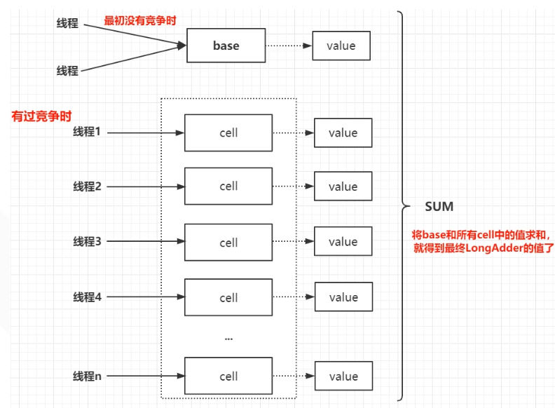
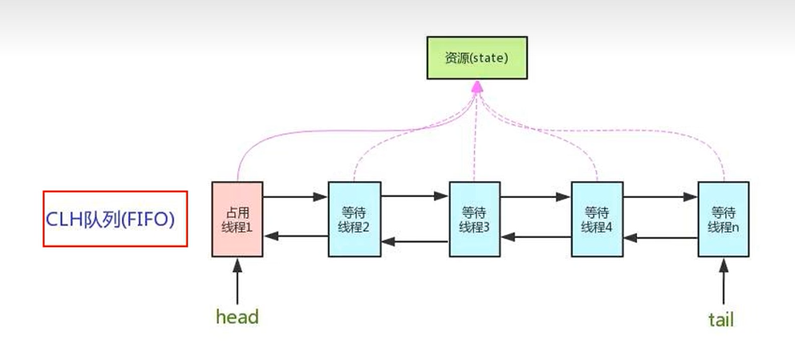

# 1. Java并发基础

## 1.0 并发编程三大问题

原子性 可见性 有序性

Java如何解决这三个问题的?

```
原子性: 
	java中基本运算都是原子的, 自增自减不是, 如果要保障原子性需要加锁/cas锁
可见性:
	java中使用volatile解决
有序性:
	加锁, 线程间通信
```

## 1.1 程序, 进程, 线程, 协程, 并发, 并行

```
程序: 由二进制指令组成的数组, 可以看作一个文件
进程: 程序被操作系统加载到内存中后执行被称作进程, 进程是操作系统资源分配和调度的最小单位, 每个进程单独一个页表, 切换进程需要切换页表, 需要转换用户态和内核态
线程: 多个线程共享进程的资源, 多个线程里的指令可以各自被不同的处理器并行执行, 切换线程需要进行CS(上下文切换)
协程: 一个线程拥有多个虚拟线程(协程), 不同协程切换不需要切换用户态和核心态, 在一个线程里同时只能执行一个协程

并发: 一个时间点只有一个任务执行, 但很快的交替执行不同任务, 看起来一段时间内多个任务都执行了
并行: 任何一个时间点内多个任务同时执行
```

> 多线程/并发的意义: 提高多核CPU利用率 缩短响应时间

进程切换为什么比线程慢?

```
TLB在CPU中只有一个, 切换进程后所有TLB缓存失效, 新的程序访问一个地址会重新从内存中读取页表, 如果不切换进程TLB命中率很高!!!
```

## 1.2 线程创建方式

* 直接重写Thread及其子类的run()

  ```java
          Thread thread1 = new Thread() {
              @Override
              public void run() {
                  this.setName("thread1");
                  System.out.println(Thread.currentThread().getName());
              }
          };
          thread1.start();
  //这种方式多线程的共享数据需要设置为这个类的静态变量
  ```
* 使用Runable接口的实现类创建Thread

  ```java
          Runnable runnable = new Runnable() {
              public int a = 1;//多个线程共享的数据
              @Override
              public void run() {
                  System.out.println(Thread.currentThread().getName());
                  System.out.println(a++);
              }
          };
          Thread t1 = new Thread(runnable);
          Thread t2 = new Thread(runnable);
          t1.start();
          t2.start();
  ```
* 使用Callable实现类作为参数的FutureTask对象创建Thread

  ```java
          Callable<String> callable = new Callable<String>() {
              @Override
              public String call() throws Exception {
                  System.out.println("分线程正在计算2*3结果");
                  return "6";
              }
          };
          FutureTask computeTask = new FutureTask(callable);
          Thread t1 = new Thread(computeTask);
          t1.start();
          try {
              System.out.println("主线程正在完成其他任务");
              System.out.println("主线程其他任务完成, 需要计算结果");
              System.out.println(computeTask.get());
          }catch (Exception e){
              e.printStackTrace();
          }
  ```

## 1.3 线程常用方法

```java
        //static
        Thread.sleep(1000);
        Thread main = Thread.currentThread();
        //setXxx()
        main.setPriority(Thread.MAX_PRIORITY);
        main.setDaemon(false);
        main.setName("main");
```

## 1.4 线程生命周期



## 1.5 同步代码块

**当多个线程对共享数据进行读写时**会出现线程安全问题, 使用**同步代码块可以解决线程安全问题**但会造成并发性能变低

```java
        Runnable runnable = new Runnable() {
            private Integer a = 10;
            @Override
            public void run() {
                synchronized (a){//a作为锁
                    while (a > 0) System.out.println(a--);
                }
            }
        };
        Thread t1 = new Thread(runnable);
        Thread t2 = new Thread(runnable);
        t2.start();
        t1.start();
//一个线程进入同步代码块前会查看对象a的锁标志位是否为false, 为false时进入代码块并把标志位设为true(原子操作)
//离开同步代码块会恢复锁标志位为false
```

> 锁对象常使用Xxx.class

synchronized也可以修饰静态方法, 成员方法

```java
    static synchronized void hello(){
        System.out.println("hello");
    }
//static方法的锁为Xx.class
    synchronized void hello(){
        System.out.println("hello");
    }
//成员方法的锁为this指向的对象
```

## 1.6 死锁问题

多个线程的资源等待链形成一个环时会造成死锁

死锁4个必要条件(面试题)

```
互斥: 同一个资源同一时间不能被多个线程使用
不可剥夺: 已经获得的资源不会被强行剥夺
占用且等待: 线程占有资源并且还在等待资源
循环等待: 资源等待链形成一个环
```

## 1.7 线程通信

当线程之间需要协作完成任务时, 需要线程通信, 如生产者消费者模式中生产者在产品数达到上限时通知消费者消费, 消费者在没有产品时通知生产者生产

```java
        Thread.sleep(1000);//线程阻塞1s, 不释放锁
        t1.join();//阻塞当前线程, 等待t1线程结束
        Thread.yield();//当前线程由运行状态转到等待状态
	t1.interrupt();//将线程的中断标志设置为true, 当中断标志位true线程阻塞后会直接中断并抛出异常

synchronized (MyApplication.class){
    try {
        MyApplication.class.wait();//线程阻塞, 释放锁, 将当前线程加入到该锁的阻塞列表中
        MyApplication.class.notify();//唤醒锁的阻塞列表中的一个线程
        MyApplication.class.notifyAll();//唤醒锁的阻塞列表中的全部线程
    } catch (InterruptedException e) {
        e.printStackTrace();
    }
}
```

## 1.8 虚假唤醒

什么是虚假唤醒?

```
本来没有货物, 多个消费者线程都在wait()，生产者线程生产了一件货物然后notify，
消费者线程A被唤醒消费了货物，这时A线程nofity应该期待唤醒生产者线程(货物数=0), 但由于使用了if而换起了一个消费者线程
```

如何避免虚假唤醒

```
把     if (product < 1) { this.wait() }
换成   while (product < 1) { this.wait() }
```

# 2. JUC基础

## 2.1 Lock

使用Lock的lock()和unlock()可以实现同步代码块相同的功能

```java
ticketLock.lock();
try {
    if (ticketNum > 0){
        System.out.println(Thread.currentThread().getName());
        System.out.println(sb.append("卖出第").append(10-(ticketNum--)).append("张票"));
    }else{
        break;
    }
}finally {
    ticketLock.unlock();
    sb.delete(0, sb.length());
}
//private Lock ticketLock = new ReentrantLock();
```

Lock和同步代码块的差异和比较

```
同步代码块中抛出异常当前线程会自动释放锁
Lock的lock()到unlock()之间的代码发生异常线程不会释放锁
```

## 2.2 Condition

```java
   final Lock lock = new ReentrantLock();
   final Condition notFull  = lock.newCondition(); 
   final Condition notEmpty = lock.newCondition();
   notFull.await();
   notFull.signal();
```

每个Condition会有自己单独的等待队列，调用await方法，会将当前线程放到对应的等待队列中并阻塞。当调用Condition的signalAll/signal方法，则只会唤醒对应的等待队列中的线程。**唤醒的粒度变小了，且更具针对性。**

## 2.4 公平锁和非公平锁

公平锁: 会优先分配给线程等待队列的首个线程

非公平锁: 会被(线程等待队列中的线程+正在申请锁但还没入队的线程)自由竞争

> 非公平锁可能会导致线程饿死, 公平锁会消耗额外的时间

```java
boolean isFair = true;
Lock lock = new ReentrantLock(isFair);
//默认为非公平锁
```

## 2.5 可重入锁

可重入锁: 当前线程拥有可重入锁时, 可以再次申请该可重入锁, ReentrantLock & **Synchornized都属于可重入锁**

```java
    lock.lock();
    lock.lock();
    try {
      // ... method body
    } finally {
      lock.unlock()
      lock.unlock()
    }
//!!!每加锁一次, 就需要解锁一次
```

可重入锁的目的: 避免同步方法的递归导致死锁

## 2.6 JUC辅助类

### 2.6.1 CountDownLatch

一个计数器

```java
        CountDownLatch countDownLatch = new CountDownLatch(10);
        countDownLatch.countDown();//计数器-1
        countDownLatch.await();//当计数器为0时当前线程继续
```

### 2.6.2 CyclicBarrier

```java
        CyclicBarrier cyclicBarrier = new CyclicBarrier(5);
        cyclicBarrier.await(); //当5个线程调用await后所有线程继续
```

### 2.6.3 Semaphore

```java
        Semaphore semaphore = new Semaphore(10);
        semaphore.acquire();//当资源数量>=1时, 线程可以继续, 否则阻塞
        semaphore.release();//资源数量+=1
```

## 2.7 乐观锁和悲观锁

乐观锁和悲观锁

```
悲观锁: 每次线程获得悲观锁之后不允许别的线程获取锁, 适合写线程较多的场景

乐观锁: 线程获得乐观锁后乐观地认为其他线程获得锁后不会进行写操作, 允许其他线程获取锁, 但在写数据前会检查数据是否被其他线程修改, 如果其他线程修改过就放弃修改/重新获取锁修改数据, 适合读线程较多的场景
```

## 2.8 线程池

线程池优点

```
线程池可以避免重复的创建和销毁线程所用的时间, 便于管理线程
```

线程池**ThreadPoolExecutor**继承图和构造函数



如何创建一个线程池?

使用Executors定义好的线程池

```
Executors.newXxx();
```

使用ThreadPoolExecutor构造函数创建

```
    public ThreadPoolExecutor(int corePoolSize, //最小线程个数
                              int maximumPoolSize, //最大线程个数
                              long keepAliveTime, //空闲线程存活时间
                              TimeUnit unit,
                              BlockingQueue<Runnable> workQueue, //存放待完成工作的阻塞队列
                              ThreadFactory threadFactory, //线程工厂
                              RejectedExecutionHandler handler) // 工作阻塞队列满时的拒绝策略
```

线程池使用

```java
        // execute只接收runnable, submit可以接收callable
        threadPool.execute(runnable);
        threadPool.submit(new FutureTask<Integer>(new Callable<Integer>() {
            @Override
            public Integer call() throws Exception {
                return 1;
            }
        }));
```

## 2. 9 异步回调

**CompletableFuture**



CompletableFuture可以完成异步任务并指定回调

```java
        CompletableFuture<Void> completableFuture = CompletableFuture.runAsync(()->{
            try {
                Thread.sleep(1000);
            } catch (InterruptedException e) {
                e.printStackTrace();
            }
        });
        long start = System.currentTimeMillis();
        completableFuture.whenComplete((result, exception)->{
            long end = System.currentTimeMillis();
            System.out.println(Thread.currentThread().isDaemon());//true
            System.out.println("异步任务完成时间: " + (end- start));//1048
        });
        Thread.sleep(3000);//防止用户线程过早结束
```

CompletableFuture创建时就开始执行, 绑定完成回调时会检查是否完成, 如果完成会立刻执行回调

```java
        CompletableFuture<Void> completableFuture = CompletableFuture.runAsync(()->{
            try {
                Thread.sleep(500);
                System.out.println("异步任务完成");
            } catch (InterruptedException e) {
                e.printStackTrace();
            }
        });
        Thread.sleep(3000);
        completableFuture.whenComplete((r,e)->{
            System.out.println("没有异常");
        });
        Thread.sleep(3000);//防止用户线程过早结束
```

线程逻辑运算

```java
        CompletableFuture<Integer> taskA = CompletableFuture.supplyAsync(()->{
            try {
                Thread.sleep(1000);
            } catch (InterruptedException e) {
                e.printStackTrace();
            }
            return 1;
        });
        CompletableFuture<Integer> taskB = CompletableFuture.supplyAsync(()->{
            try {
                Thread.sleep(2000);
            } catch (InterruptedException e) {
                e.printStackTrace();
            }
            return 2;
        });
        //线程或
        taskA.applyToEither(taskB, res -> res).thenAccept(res->{
            System.out.println("较快的线程的计算结果是"+res);
        });
        //线程并
        taskA.thenCombine(taskB, Integer::sum).thenAccept((res)->{
            System.out.println("两个线程的和是"+ res);
        });
        //allOf, anyOf
        CompletableFuture.allOf(taskA, taskB).thenAccept((res)->{
            System.out.println("所有任务均以完成");}
        );
        CompletableFuture.anyOf(taskA, taskB).thenAccept((res)->{
            System.out.println("有一个任务完成, 结果是" + res);}
        );
        Thread.sleep(3000);
```

# 3.    进阶

## 3.2 阻塞队列

* 当阻塞队列是空时，从队列中获取元素的操作将会被阻塞。
* 当阻塞队列是满时，从队列中添加元素的操作将会被阻塞。



使用JUC阻塞队列的目的: 不需要关心什么时候需要阻塞线程，什么时候需要唤醒线程，因为BlockingQueue封装了

BlockingQueue接口方法



JDK中常见的阻塞队列

```
ArrayBlockingQueue
LinkedBlockingQueue
PriorityBlockingQueue
```

## 3.3 守护进程

**当用户线程全部结束时, 守护线程会立刻结束**

```java
        Thread t1 = new Thread(new Runnable() {
            @Override
            public void run() {
                while (true){
                    try {
                        Thread.sleep(1000);
                        System.out.println("t1---running");
                    } catch (InterruptedException e) {
                        e.printStackTrace();
                    }
                }
            }
        });
        t1.setDaemon(true);
        t1.start();
        Thread.sleep(3000);
        System.out.println("main---end");
```

## 3.5 中断线程

t.interrupt(), t.isInterrupted(), 设置中断标志位和获取中断标志位

```java
        Thread anotherThread = new Thread(() -> {
            while (true) {
                try {
                    Thread.sleep(800);
                } catch (InterruptedException e) {
                    System.out.println("线程在sleep时发生了中断");
                    break;
                }
                System.out.println("running...");
                if (Thread.currentThread().isInterrupted()){//当前线程中断标志位的值==true
                    break;
                }
            }
        });
        anotherThread.start();
        Thread.sleep(3000);
        anotherThread.interrupt();//将线程实例的中断标志位设置为true
```

**Thread.interrupted() 返回当前线程的中断标志位并清除中断标志位**

```java
        Thread main = Thread.currentThread();
        main.interrupt();
        if (Thread.interrupted()){
            System.out.println("线程中断标志位==true");
        }
        if (main.isInterrupted()){
            System.out.println("线程中断标志位==true");
        }else{
            System.out.println("Thread.interrupted()清除了中断标志位, 现在中断标志位==false");
        }
```

## 3.6 LockSupport

LockSupport.unpark(t1) 将线程的permit设置为true

LockSupport.park()根据当前permit标志决定线程是否阻塞

```java
        Thread t1 = new Thread(()->{
            try {
                System.out.println("t1 started");
                Thread.sleep(1000);
                LockSupport.park();//如果permit==false阻塞, 直到permit==true
                System.out.println("t1 finished");
            } catch (InterruptedException e) {
                e.printStackTrace();
            }
        });
        t1.start();
        if (new Random().nextBoolean()){
            LockSupport.unpark(t1);
            System.out.println("main 线程将t1.permit设置为true");
        }else{
            System.out.println("线程t1.permit == false, 将一直阻塞");
        }
```

用于notify先于wait导致线程永久阻塞的场景

# 4. JMM

JMM(Java memory model)是对操作系统/硬件内存的抽象, 用于屏蔽具体的硬件细节差异

## 4.1 缓存一致性问题

每个线程使用的处理器中的缓存中的数据副本, **缓存被抽象为工作内存, 内存被抽象为主内存**

由于缓存中存的是副本, 多线程下可能与主存中的数据/其他缓存中的数据会有差异, 导致缓存不一致问题

硬件层面使用MESI等协议保障缓存一致性, JMM从Java层面保障缓存一致性, 避免不同协议之间的差异



## 4.2 Happens-before

**Java编译器/CPU** 会对指令进行重排序以提高执行效率, 但遵守一系列happens-before规则使得重排序后的代码语义上和没有重排序的代码相同,

也就是说, **尽管指令会重排序, 但一些操作一定要发生在另一些特定操作之前**

```java
        int a = 1;//1
        int b = 2;//2
        int c = a + b;//3
//1和2的执行顺序可能交换, 但根据happens-before规则, 1和2一定先于3
```

## 4.3 Volatile

尽管有Happens-before规则, **多线程下还是可能发生语义不同**, 例如线程A写一个数据, 这个数据在线程A的缓存被写入, 但在线程B的缓存中每有变化, 导致线程A明明写入在前, 线程B却对写入不可见

对于volatile变量, 多个线程对volatile变量的写一定happens-before对volatile变量的读

可以这样理解: **对volatile的变量的写直接写到主存中, 读直接从主内存中读**

底层原理: 调用**内存屏障**指令

## 4.4 内存屏障

CPU为了实现缓存一致性, 需要遵守缓存一致性协议, 当使用缓存一致性协议(入MESI协议)之后, CPU对cache的写都会先写入store buffer, 等待其他核心的cache 加入无效队列后并返回ack才正式写入

所以读写操作都会有延迟, 可能导致指令重排序



使用内存屏障指令可以强制限定指令之前的读操作/写操作在什么时候必须完成, 由于不同硬件的内存屏障指令不同, 所以JDK对内存屏障指令做了抽象, 分为4中

```
LoadLoad :  屏障之前的读必须在屏障之后的下一次读之前完成
LoadStore: 屏障之前的读必须在屏障之后的下一次读之前完成
StoreStore
StoreLoad
```


## 4.4 CAS

CAS(Compare and swap)是一种**乐观锁**机制

CAS写入时会比较线程的expect期待值(线程读取时的值)和内存中的值是否相等

1. 如果相同说明没有其他线程写过, 将计算后的值写入
3. 整个CAS比较和写入过程是一个硬件提供的**原子操作**

***JUC中的AtomicXxx类 + AtomicReference `<T>`均使用CAS机制***

## 4.5 CAS的硬件保障

总线方式实现

```
当比较和写入共享变量时, 直接锁定总线, 不让其他线程访问
效率较低
```

MESI缓存一致性协议实现

```
每一个缓存行都会有一个状态标志当前缓存行数据的有效性 M(当前行已修改) E(当前行被这个核心独占) S(其他核心也有当前行) I(当前行数据无效)
```

其他核心中相同缓存行写入时当前核心的缓存行会变成I

## 4.5 Atomic&LongAdder

常用的Atomic类, 对整个值/对象加CAS锁

```java
        //atomic primitive
        AtomicInteger integer = new AtomicInteger(1);
        integer.getAndAdd(1);
        //atomic array
        AtomicIntegerArray atomicIntegerArray = new AtomicIntegerArray(new int[]{1, 2});
        atomicIntegerArray.addAndGet(0, 1);
        //atomic reference
        AtomicReference<Object> reference = new AtomicReference<>(null);
        reference.compareAndSet(null, new Object());
        //StampedReference, 修改一次version+=1
        AtomicStampedReference<Object> reference1 = new AtomicStampedReference<>(null, 0);
        //compareAndSet 通过==比较expect值和内存值
        reference1.compareAndSet(null, null, 0, 1);
        System.out.println(reference1.getStamp());// 1
        //MarkableReference 与StampedReference类似, int类型版本号变成了boolean类型标志
        AtomicMarkableReference<Object> reference2 = new AtomicMarkableReference<>(null, false);

```

LongAdder

```java
        LongAdder longAdder = new LongAdder();// initial value == 0
        longAdder.add(10);
        System.out.println(longAdder.longValue());
```

**LongAdder用于高并发下统计不精确的和**, **自增时发现CAS锁冲突不会进行自旋**, 实现原理的核心思想是空间换时间



当线程发生cas锁竞争时, 将不在进行自旋, 而是将结果写入Cell数组中, 当求和时遍历数组返回和, 由于求和时不锁Cell数组, 所有得到的和不一定是最新值

## 4.6 ThreadLocal

ThreadLocal对象在不同线程get时返回的值不同(每个线程单独一个副本)

```java
    static ThreadLocal<Integer> localInteger = ThreadLocal.withInitial(()->0);
    public static void main(String[] args) {
        for (int i = 0; i < 5; i++){
            new Thread(()->{
                int j = new Random().nextInt(10);
                while(j-- > 0)
                    localInteger.set(localInteger.get()+1);
                System.out.println(Thread.currentThread().getName() + ": " + localInteger.get());
                localInteger.remove(); // 在线程池的情况下必须清除, 避免内存泄漏
            }, "t" + i).start();
        }
    }
//t3: 8
//t0: 9
//t1: 6
//t4: 3
//t2: 9
```

原理: Thread对象维护一个ThreadLocalMap对象, map的key = ThreadLocal的弱引用, value = Thread对象的ThreadLocal值

get()时使用Thread.localThread获取值

ThreadLocalMap的key**使用ThreadLocal弱引用的原因**:

```
当确认不再使用threadLocal时, threadLocal = null
但此时t1.threadLocals(线程的ThreadLocalMap对象)的key如果是强引用会导致内存泄漏
```

## 4.7 Synchornized锁升级

锁的升级过程

```
无锁 -> 偏向锁(避免无竞争时的同步消耗) -> 轻量锁(自旋等待) -> 重量锁(线程阻塞)
```

1. 偏向锁: 当A线程获取锁时, 会记录锁的偏向为A, 当A再次获取锁时, 如果锁偏向是A, 说明期间没有竞争, 就直接执行代码, 如果B线程获取锁时发现锁的偏向是A, 会CAS修改偏向锁偏向, 修改失败则升级轻量级锁
2. 轻量级锁: 线程在等待被占有的锁时, 会先尝试cas自旋, 自旋一定次数后还没有获取锁时才升级为重量级锁
3. 重量级锁:  当线程获取不到锁时操作系统进入内核态将线程阻塞

> !偏向锁在JDK15后被废除

## 4.8 锁粗化&锁消除

锁消除和锁粗化都是JIT优化同步代码块的机制

```java
    static final Object lock = new Object();
    public static void main(String[] args) {
        for (int i = 0; i < 10; i++){
            new Thread(()->{
                Object obj = new Object();
                synchronized (obj){ //锁消除: JIT编译后判断obj为局部变量, 会忽略synchronized
                    int a = 2;
                }
            }).start();
        }
        int a = 0;
        synchronized (lock) {
            a++;
        }
        synchronized (lock) {//锁粗化: 连续获取相同的锁时, JIT会将两个同步代码块合并
            a++;
        }
    }
```

## 4.9 AQS

`AQS(抽象队列同步器)` 是JUC的基石, Lock, Semaphore都是基于AQS的

维护了一个 `volatile int state`变量和一个 `双向队列` , 是JUC的基石框架



**对state的修改使用CAS操作**

```
将AQS作为独占锁时:
线程获取锁时: cas(state, 0, 1) 如果失败则将线程加入队列并阻塞当前线程
```


```
state表示当前上锁的次数, 为0是
```

## 4.10 读写锁和邮戳锁

读写锁

```
1. 当线程对数据进行只读时申请读锁, 要写时申请写锁
2. 写锁和任何锁互斥, 读读相容
3. 锁降级: 线程有写锁时可以申请读锁, 只有读锁时不能申请写锁
```

读写锁问题和优点

```
可能造成写线程饿死, 但增加了并发性
```

ReentrantReadWriteLock代码示例

```java
        ReentrantReadWriteLock rwLock = new ReentrantReadWriteLock();
        for (int i = 0; i < 10; i++) {
            new Thread(() -> {
                rwLock.readLock().lock();
                System.out.println("当前正在读取");
                rwLock.readLock().unlock();
            }).start();
        }
```

StampedLock

```
1. 写写互斥, 读读和读写可以相容
2. 当其他线程有写锁时, 可以乐观读锁, 当乐观锁验证失败时, 可以申请悲观读锁
3. 在读线程>写线程时性能好
```

StampedLock代码示例

```java
        StampedLock stampedLock = new StampedLock();
        Thread writeThread = new Thread(()->{
            long stamp = stampedLock.writeLock();
            System.out.println("正在写入数据");
            stampedLock.unlockWrite(stamp);
        });
        Thread readThread = new Thread(()->{
           long stamp = stampedLock.tryOptimisticRead();
            System.out.println("正在读取");
            if (!stampedLock.validate(stamp)){
                System.out.println("在读期间发生了写, 需要重试");
                long stamp1 = stampedLock.readLock();//
                System.out.println("重试时获取的读锁是悲观锁");
                stampedLock.unlockRead(stamp1);
            }
        });
        writeThread.start();
        //Thread.sleep(1000);
        readThread.start();
```
