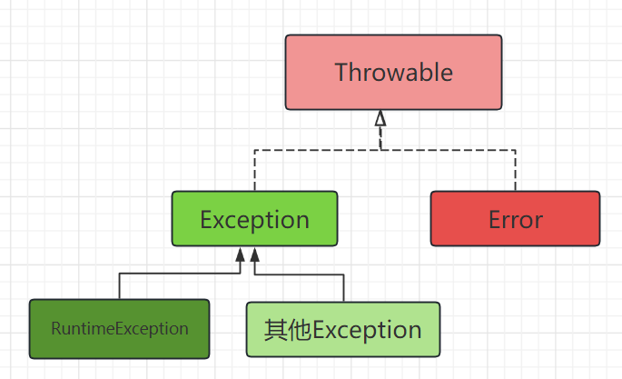
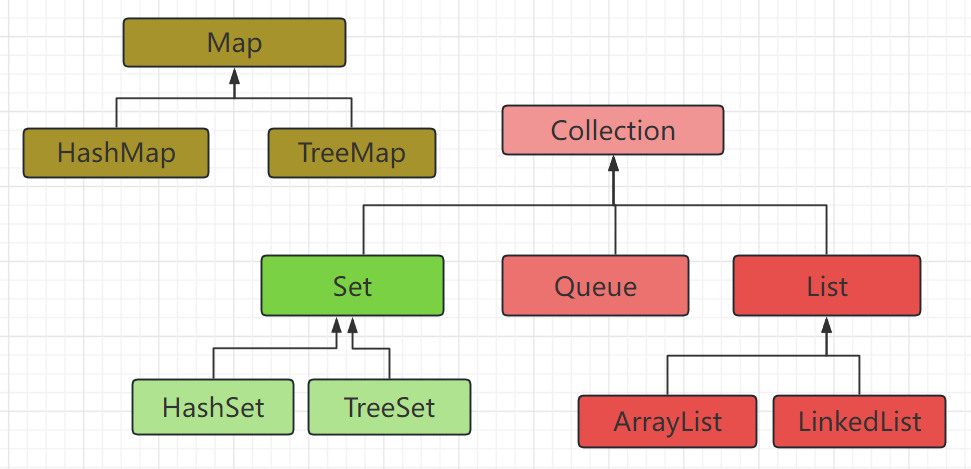

# 1. Java简介

## 1. 术语

***什么是 JDK & JRE ?***

* `JDK(java development kit) 包含 JRE和Java开发工具(javac, javadoc, jar)`
* `JRE(java runtime enviroment) 包含Java程序运行必备的组件( 基于平台的JVM程序以及动态链接文件, 标准库 class/jar文件,  基于平台的 class/jar 文件)`

***什么是OpenJDK?***

```
开源的的JDK, 相较于Oracle JDK而言(商用付费)
```

***什么是 jar & war?***

* `jar(Java Archive) 是Java应用程序的压缩包 (包含class文件, resource文件, META-INF文件下的元信息)`
* `war 是 Java网络应用的压缩包 (额外包含/WEB-INF下的网络应用元信息和网络应用静态资源)`

***什么是classpath?***

```
指ClassLoader加载类/资源的文件系统路径(集合)

Tip1: 通过ClassPath.getClassPath()查看
Tip2: classpath默认包含JAVA_HOME/lib/*.jar和Main.jar
```

## 2. 程序的启动和环境

***讲一下Java源文件到程序运行的过程?***

1. `使用javac编译源文件为class文件`
2. `使用jar打包class+资源文件+Manifest`
3. `使用java -jar Xxx.jar执行`

***`java -jar Main.jar` 和 `java -cp <classpath> xyz.Main.class`的区别?***

```
指定 classpath 的方式不同, jar需要在 Manifest中指定 classpath
```

## 3. JDK

***Java SE && EE && ME的区别?***

```
* SE(standard edition) 提供基础的开发库

* EE(enterprise edition) 是 SE(standard edition) 的超集

* ME(micro edition) 只提供移动端java开发库
```

***JDK LTS 版本有哪些, 各自主要特性是什么?***

| JDK | 主要特性                                 |
| --- | ---------------------------------------- |
| 8   | stream API, lambda表达式, LocalDate API |
| 17  | zgc, seal类, switch+lambda               |
| 21  | 虚拟线程                                 |

## 4. 语言概述

***Java和CPP的区别?***

| Java                   | cpp                          |
| ---------------------- | ---------------------------- |
| **纯面向对象**   | 可以面向对象, 也可以面向过程 |
| **自动垃圾回收** | 使用delete手动回收垃圾       |
| 单继承+接口            | 多继承                       |
| **跨平台**       | 不跨平台                     |

# 2. Java语言特性

## 1. 面向对象

***Java中的权限修饰符权限范围从大到小分别是什么?***

`public` -> `default` -> `protected` -> `private`

***方法重写 `(override)`和方法重载 `(overload)`的区别?***

```
* 重写: 根据 方法调用者的实际类型 从 继承链往上 找到第一个的 同名同参 方法

* 重载: 根据 参数的外观类型 从方法列表中找到 同名 方法中最适合的一个方法
```

***方法的参数个数不确定时, 如果传入参数?***

```java
    void hello(String ...argus){
        System.out.println(argus[0]);
    }
```

***Java方法的参数传递中, 值传递和引用传递的区别?***

```
* 基本类型传递另一份复制的变量

* 引用类型传递 被引用的源对象的地址
```

***如何查看一个枚举类的所有枚举常量?***

因为 `所有的枚举类都继承自Enum`, 所以使用 `Enum.values()`方法获取所有枚举常量

***接口和抽象类的区别和相同点有哪些?***

相同点

* 两者都不能被实例化

不同点

* 变量方面, 接口中所有变量为 `public static final`, 抽象类无限制
* 方法方面, 接口中所有方法为 `public abstract`, 抽象类无限制(可以包含 `abstract ` 方法)
* 构造器方面, 接口不能声明构造函数, **抽象类无限制**

## 2. 注解与反射

***Java中的元注解有哪些, 注解保留策略有哪些?***

重要的元注解如下:

| 注解名               | 作用                                                                                                                                                               |
| -------------------- | ------------------------------------------------------------------------------------------------------------------------------------------------------------------ |
| @Override            | 标记重写方法                                                                                                                                                       |
| @Deprecated          | 标记过时方法                                                                                                                                                       |
| @SuppressWarnings    | 忽略编译器警告                                                                                                                                                     |
| **@Retention** | **注解的保留策略**<br />**RetentionPolicy.SOURCE(只在源码中保留)<br />RetentionPolicy.CLASS(保留到编译期)<br />RetentionPolicy.RUNTIME(保留到运行时)** |
|                      |                                                                                                                                                                    |
| **@Target**    | **注解用在什么地方**<br />ElementType.FIELD<br />ElementType.METHOD<br />ElementType.TYPE                                                                    |
| **@Inherited** | **注解是否会由父类传递给子类**                                                                                                                               |

***编译期注解和运行期注解分别是如何生效的?***

* 编译期注解通过  `AbstractProcessor` 生效, `AbstractProcessor` 中可以修改语法书
* 运行期注解通过反射 `Class#getAnnotations()` 生效

***Java中反射是什么, 反射为什么慢?***

```
反射: 通过Class操作该类的对象

反射速度慢的原因: JIT无法对反射代码进行优化
```

***有哪些方式能获取Class对象?***

```
* Object#getClass()

* Object.class

* Class.forName()

* ClassLoader#loadClass()
```

## 3. 异常处理

***讲一下Java异常处理类体系结构?***



***Exception和Error的区别是什么?***

```
Exception可以被程序捕获并处理, Error不能
```

***什么是Checked Exception?***

```
必须被 try-catch处理的异常才能通过编译的异常, Exception的子类中除了 RuntimeException都属于 Checked Exception
```

***什么是 `try-with-resource` 代码块?***

```
Java7引入的语法糖, 在 try 代码块执行后自动关闭 Closeable接口实现类
```

***finally中的代码块一定会被执行吗?***

```
不一定, 比如:
* catch代码块中使用System.exit()关闭JVM
```

***如何绕过编译器的 `Checked Exception`检查?***

```
* 使用Unsafe#throwException()
* 泛型方法中抛出泛型异常
```

## 5. 序列化

***Java序列化的方式有哪些?***

```
* JDK序列化: 实现Serializable, 使用ObjectOutputStream

* 第三方库序列化: Gson, Jackson
```

***transient关键字的作用? serialVersionUID的作用?***

```
transient修饰的字段不会进行序列化

serialVersionUID: 使用JDK序列化时需要指定
```

***序列化协议有哪些?***

```
* XML
* JSON
* Protobuf
```

## 6. 泛型

***泛型中泛型参数为 `? extends/super Xxx` 表示什么含义?***

```
表明泛型参数必须是Xxx的子类或父类
```

***什么是泛型擦除?***

```
泛型参数在编译后会变成Object, 仅仅在获取泛型对象时添加强制类型转化指令
```

## 7. SPI

***什么是SPI?***

`SPI(Service Provider Interface)` 是Java提供的扩展机制, 可以在运行时加载 `实现了特定接口的第三方服务实现类`

> SPI典型应用: JDBC

***怎样通过SPI加载第三方接口实现类?***

```
1. 在jar包下/META-INF/services目录下添加映射文件

2. 使用ServiceLoader.load()方法
```

## 8. JDK高版本新特性

***Java中的Lambda表达式是什么? (JDK8)***

```
* Lambda表达式是一个语法糖, Lambda表达式可以赋值给函数式接口

* Lambda表达式: (arg0, arg1) -> {statement}
```

***Stream常用的中间操作和终止操作有哪些? (JDK8)***

中间操作有 `filter(), map(), sorted()`

终止操作有 `forEach(), collect()`

## 9. IO和文件

***Java中BIO中IO流分为哪四种?***

```
IO流分四种: 
 * InputStream OutPutStream
 * Reader Writer

这四种IO流的常用子类包括:
FileXxx
BufferedXxx
```

***什么是BIO, NIO, IO多路复用, AIO?***

```
* BIO: 线程阻塞直到操作系统IO完成

* NIO: 线程不阻塞, 立刻返回操作系统当前是否完成IO

* IO多路复用: 基于NIO, 操作系统同时对多个文件描述符进行监听, 线程阻塞一段时间并返回就绪的IO事件

* AIO: 线程不阻塞, IO完成后操作系统调用回调函数 or 发送信号通知进程
```

# 3. Java容器

## 1. Collection

***讲一下Java中的集合体系?***



***List和Set的区别是什么?***

```
List有序, 元素可以重复
Set无序, 元素会去重
```

## 2. List

***ArrayList和LinkedList的区别?***

```
由于:
* ArrayList内部是一个Object[]

* LinkedList是一个Object双向链表

所以两者的随机读写和插入数据的时间复杂度会有区别
```

***ArrayList扩容机制是什么?***

```
默认大小10, 每次扩容扩容到1.5倍空间并复制数据
```

***ArrayList 多线程下修改会出现什么问题?***

```
多线程下可能出现并发修改异常

Tips: 使用Vector代替ArrayList, Vector的方法为同步方法
```

## 3. Map

***TreeMap底层数据结构是什么?***

```
红黑树
```

***讲一下HashMap扩容机制?***

```
* 初始大小为16
* 当表的负载因子超过0.75时, 扩容到两倍

Question: 为什么扩容到两倍?
Answer: hash值通过掩码的方式映射到桶索引
```

***HashMap 从JDK1.7到JDK1.8改进了什么?***

```
JDK8中HashMap哈希冲突过多/过少时(树化阈值8; 退化阈值6), 会在链表和红黑树之间转换
```

***Hash冲突的解决办法有哪些?***

```
* 链表法

* 探测法: 在冲突位置向两侧按照一定算法(线性探测, 二次探测)进行探测, 找到一个空位置放置元素

* 公共溢出区: 将发生冲突的元素放到一个公共的区域(可以是链表, 也可以是另一个hash表(rehash法))

Tips: 探测法中, 当删除元素时, 需要对其他发生冲突的元素进行重定位
```

***什么是一致性hash算法, 优点是什么?***

优点

```
避免了桶的数量发生变化时, 需要进行大量的数据迁移
```

一致性hash算法原理

```
* hash函数的值域必须是一个环

* 桶节点和元素节点分别通过hash函数映射到环上一个点

* 通过映射点在环上最近的相邻映射点, 决定元素放到哪个桶中
```

***HashTable和HashMap的区别?***

```
* HashTable线程安全

* HashTable处于兼容性考虑, 不可以使用null作为键
```

***LinkedHashMap是如何实现有序的?***

```
LinkedHashMap内部的Entry继承自HashMap内部的Entry, 但额外包含前后指针, 通过指针维护链表
```

## 4. ConcurrentHashMap

***ConcurrentHashmap并发性能为什么好?***

```
ConcurrentHashmap的锁粒度小:
* get()不加锁

* put()时, 最多只锁一个桶, 不会锁整个对象
	- 映射的桶为空时, 尝试cas
	- 映射的桶不为空时, 才获取对象锁
```

## 5. 阻塞队列

***Java中的常用的阻塞队列有哪些?***

```
* ArrayBlockingQueue: 底层为数组

* LinkedBlockingQueue: 底层为链表, 可能会有OOM问题

* PriorityBlockingQueue: 按优先级出队列

* DelayQueue: 元素必须实现Delayed接口
```

## 6. 其他

***Comparator和Comparable的区别?***

```
*  Comparator的比较方法的参数有两个

*  Comparable比较方法参数只有一个(用于比较自身和另一个Object的大小)
```

# 4. JDK API

## 1. Object

***`Object#equals() `和 `== `的区别?***

```
equals默认实现为==, ==比较两个Object是否为同一个引用
```

***为什么重写 `equals()`必须要重写 `hashcode()`?***

```
重写hashcode的是为了符合hash函数的定义(相同对象的hash值必须相等)
```

***`Object#copy()`是深拷贝还是浅拷贝?***

```
浅拷贝
```

## 2. String

***如何改变String的编码?***

1. 先调用 `String#getBytes方法`
2. 再调用 `new String(bytes, Charset)`

***`new String("1" + "2" + new String("3"))`*** ***共创建了几个对象?***

```
字符串常量池中两个对象: "12", "3"

堆区三个对象: 值为"123"的String, 值为"3"的String, StringBuilder
```

***StringBuilder, StringBuffer, String的区别?***

```
* String内部是一个char[]

* StringBuilder是String的建造者类

* StringBuffer是线程安全的StringBuilder
```

***`String#intern()`方法的作用?***

```
将String对象放入字符串常量池, 并返回常量池中的引用

>>> 如果常量池中已有相等的对象, 直接该对象的引用
```

## 3. 包装类

***Java中的基本类型有哪些, 对应的包装类是什么, 各种类型的长度是多少?***

| 基本类型 | 包装类  | 基本类型的长度(byte) | 字面值               |
| -------- | ------- | -------------------- | -------------------- |
| boolean  | Boolean | 依赖于JVM实现        |                      |
| byte     | Byte    | 1                    |                      |
| char     | Char    | 2                    |                      |
| short    | Short   | 2                    |                      |
| int      | Integer | 4                    |                      |
| float    | Float   | 4                    | `float f = 12.2F;` |
| double   | Double  | 8                    | `double d = 12.2D` |
| long     | Long    | 8                    | `long l = 12L;`    |

***什么是自动装箱/自动拆箱?***

```
* 自动装箱
	"Integer i = 1"  被编译为 "Integer i = Integer.valueOf(1)"
* 自动拆箱
	"int i = new Integer(1)" 被编译为 "int i = new Integer(1).intValue()"
```

***为什么 `new Integer(11) == new Integer(11)`?***

```
Integer中有一个内部类IntegerCache

当调用valueOf方法时如果-128<=值<=127会直接返回缓存的对象 
```

## 4. 时间

***为什么不推荐使用Date等旧时间API?***

```
旧API设计不合理, 太难用

Tips: 使用LocalDateTime代替Date
```

***`LocalDateTime`和  `ZoneDateTime` 的区别?***

```
ZoneDateTime额外保存时区ZoneId, 同一个时间戳时, 时间字符串会不同
```

## 5. 系统API

***Java程序如何和shell交互(获取环境变量, 启动参数等操作)?***

主要用到 `System`和 `Runtime`两个类

```
环境变量: System.getenv()

启动参数: System.getProperties()

shell实体: System.console()

创建子进程执行命令: Runtime.getRuntime().exec()
```

***`AccessController.doPrivileged()`方法的作用?***

```java
无视JDK中SecurityManager的安全检查, 执行需要特定权限的代码
```

> JDK的安全控制已经在JDK17后移除
