Java实现起来不容易，或者是我们对程序的效率很在意时

# 1. 类加载系统

## 1.1.1 class文件的结构

class文件的结构

```
Magic number (4Byte) + Minor Version (2Byte) + Major Version (2Byte) +
常量池长度 (2Byte) + 常量池 +
access_flags (2Byte) + 
this_class(2Byte) + super class(2Byte) + interface_count(2Byte) + interfaces +
field_count(2Byte) + fields +
method_count(2Byte) + methods +
atrributes_count(2Byte) + atrributes
```

### 1.2 class文件的常量池

常量池是一个列表, 列表每一项可以是不同的类型

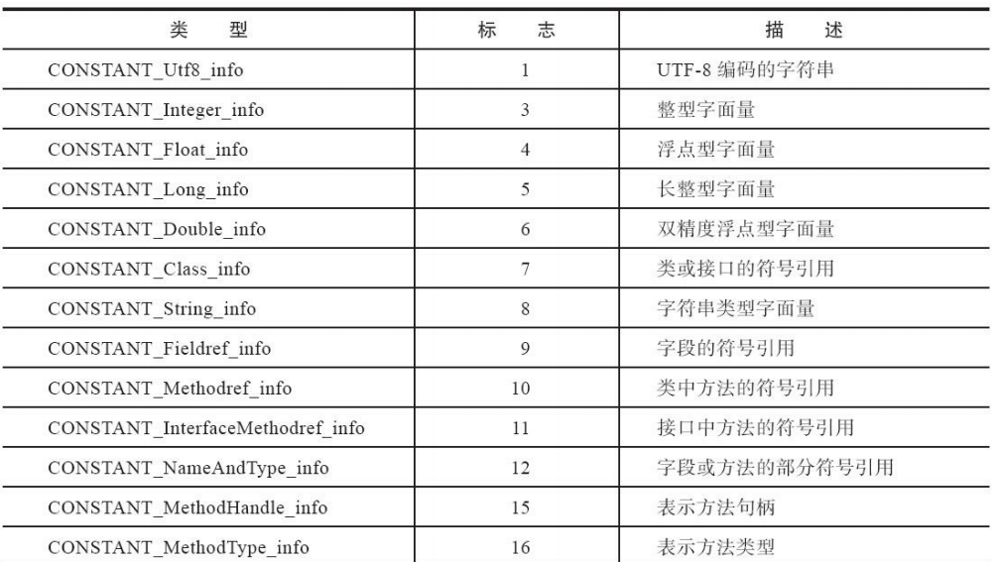

例如UTF8字符串类型的列表项为

```
1Byte类型标志 + 2Byte字符串长度 + Utf8字符串编码
```

类的符号引用的列表项为

```
1Byte类型标志+2Byte指向常量池中类名字符串的指针
```

一段代码的常量池示例

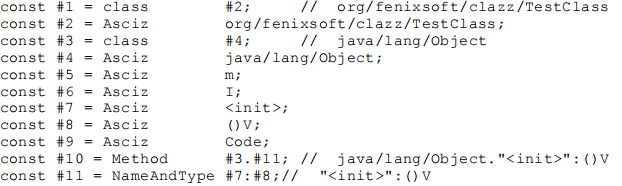

### 1.3 class文件其他部分

Magic number

```
固定值为0xCOFEBABE 标识这是一个class文件
```

Major Version & Minor Version

```
JDK的主版本和小版本, 高版本JVM可以运行低版本的class文件
JDK1对应的主版本号为45, JDK对应的主版本号为46
```

access_flags

```
标识位, 标识是class/interface 是否final 是否abstract 是否是注解 是否是枚举...
```

this_class&super class& interface_count& interfaces

```
用来标识类的继承关系和接口信息
this_class, super class, interface是指向常量池的指针
```

## 1.2 类加载机制

什么是类加载?

```
从Class文件通过类加载器加载到JVM内存中成为一个可以使用的类型
"Class文件"不一定是磁盘上的文件, 可以来自网络/压缩包/数据库/运行时期动态生成, 只要是一串符合规范的二进制流就可以
```

### 1.2.1 类的生命周期

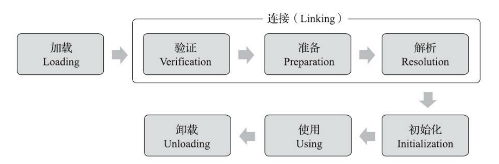

加载

```
通过类的全限定名找到二进制字节流
将类的静态数据结构放到方法区
生成一个Class对象作为访问入口
```

验证 准备 解析

```
验证: 验证字节流文件是否安全/格式是否正确(如数组的越界访问)
准备: 为static变量申请存储空间并设为0
静态解析: 将常量池中的符号引用变为直接引用
```

初始化

```
执行<cinit>方法, 给static变量赋值&执行static代码块
!!! 变量的赋值和static代码块执行的顺序按照源码中的声明顺序
!!! <cinit>函数在多线程下执行会被加锁
```

**初始化的时机为一个类被主动引用,** 主动引用大致分为

```
new对象 读写静态变量 调用静态方法时
反射中使用了该类时
子类将要初始化时
main()方法所在的类在程序启动时
```

### 1.2.2 类加载器的层次和分类

> JVM中判断两个类相同需要类全限定名相同 && 类的加载器对象相同
>
> 所以不同类加载器对象加载的同名类不是一个类, instanceof运算结果为false

分类:

1. bootstrap加载器
2. 继承抽象类ClassLoader并重写loadClass方法的加载器

层次:

```
bootstrap class loader: 负责加载在<JAVA_HOME>\lib或者被-Xbootclasspath参数所指定的路径下的类
Extension Class Loader(继承ClassLoader): 负责加载 <JAVA_HOME>\lib\ext 下的类
Application Class Loader(继承ClassLoader): ClassLoader.getSystemClassLoader()方法的返回值, 加载Classpath下的类
```

### 1.2.3 双亲委派模型

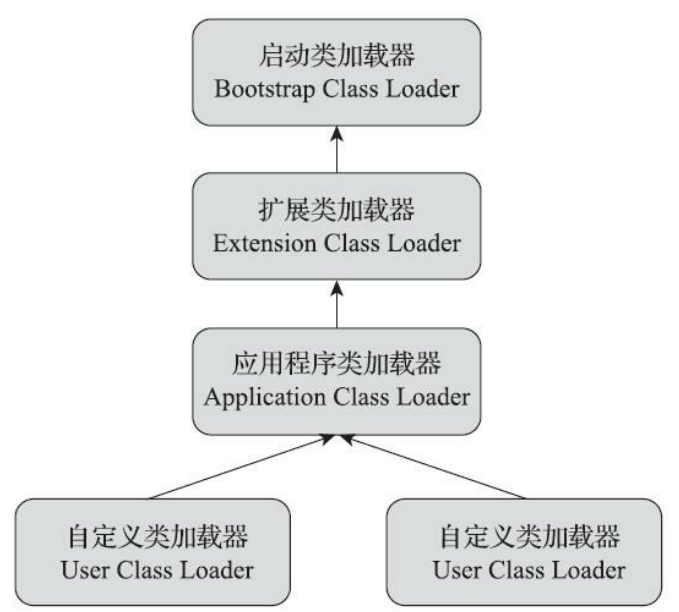

下一级类加载器采用组合的方式包含上一级类加载器, 当下级loadClass()时会委托给上级loadClass(), 上级无法加载时再自己完成findClass(), **双亲委派机制保障了Java 标准库的安全**

破坏双亲委派机制

```
1. 重写loadClass() 而不是 findClass()
2. 使用Thread Context ClassLoader
3. 模块的热部署---OSGI
```

# 2. 内存管理

## 2.1 Runtime Data Area

Jvm把运行时数据区(Runtime data area)分为不同的区域用于不同用途

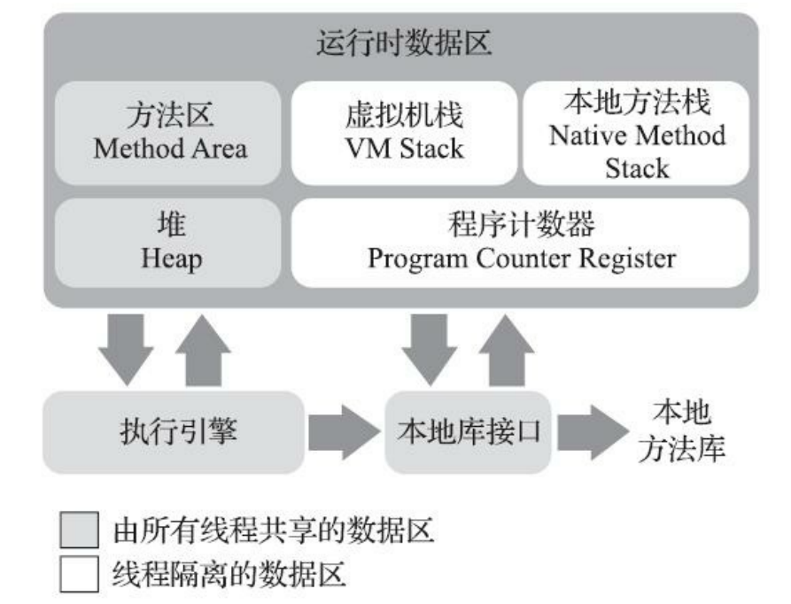

### 2.1.1 程序计数器

每个线程都独有一个程序计数器, 存储将要执行的字节码指令的行数, 执行native方法的代码时值为Undefined.

### 2.1.2 虚拟机栈

每个线程独有一个栈, VM stack的基本单位是栈帧(stack frame), 每个栈帧包含一个方法的

```
1. 方法的局部变量表
2. 方法的返回地址
3. 操作数栈
4. 动态链接
```

栈在以下情况会出现异常

```
1. 如果当线程的栈扩容时没有足够存储空间时, 会报OutOfMemory异常
2. 如果一个线程扩容后的栈大小大于虚拟机所允许的最大值, 会报StackOverflow异常(-Xss设置最大值)
```

### 2.1.3 堆

堆是几乎所有的对象和数组的存储位置, 由磁盘上的地址不连续的存储碎片组成, 是自动垃圾回收的主要区域

*特点:*

1. Heap被所有线程共享, 也可以分配出给线程的私有空间(Thread Local Allocation Buffer，TLAB)以提升对象分配存储空间时的效率.
2. Heap可以动态扩容, 可以通过虚拟机参数 `-Xmx最大内存  -Xms最小内存` 限制Heap容量
   当扩容时超出允许的最大内存会出现OutOfMemory异常

> -XX: +UseTLAB 开启TLAB
>
> 多个线程给对象分配堆空间的默认策略是CAS(失败重试), 高并发下影响性能.
>
> 开启TLAB后每个线程在Java堆中预先分配一小块私有内存, 给对象分配内存的时候，直接在自己这块"私有"内存中分配, 私有内存预先分配还是用CAS，不过这种竞争就小得多。

### 2.1.4 方法区

*存储类的元信息(所以方法区又称Metaspace)和运行时常量池, JIT编译的机器指令*

类的元信息

```
全类名+父类全类名+实现的接口全类名+字段元信息+方法元信息
```

运行时常量池

```
一个class文件的常量池对应一个运行时常量池
类文件中的常量池经过静态解析, 把可以部分符号引用变成直接引用
```

```
JDK8后方法区使用直接内存
-XX:MaxMetaspaceSize设置方法区最大大小(默认值-1)
```

JD8以后方法区变化:

常量池中的字符串放了到堆空间的字符串常量池中, 便于垃圾回收, 静态引用变量指向的对象也放到了heap中

```java
static int i = 1; //the value 1 is stored in the metaspace
static Object o = new SomeObject(); //the reference(pointer/memory address) is stored in the metaspace, the object itself is not.
```

### 2.1.5 常见参数和异常

-Xss

```
虚拟机栈的最大大小, 超过报StackOverFlow异常

如果栈大小没有超过栈的最大大小但没有额外内存分配报OOM
```

-Xmx -Xms

```
-Xmx 堆最大大小
-Xms 堆最小大小
超过堆最大大小时报OOM
```

### 2.1.6 OOM/SOF排查

stackoverflow排查

```
基本上就是死循环 or 无线递归调用 导致的问题
```

outofmemory: heap space

```
使用jvm选项-XX:+HeapDumpOnOutOfMemoryError, 将发生OOM时的内存快照dump下来
使用专门的工具分析是内存不足还是内存泄漏
```


### 2.1.7 直接内存

直接内存是JVM向操作系统申请的内存空间, 读写速度更heap快

**JDK8后方法区和的方法区和NIO direct buffer都使用直接内存**

## 2.2 普通对象的new过程

当遇到 `new 普通Java对象(不含数组和Class)`指令时, 会进行如下步骤

```
1. 去方法区检查是否有类的元信息, 如果没有会先加载类
2. 在heap区为对象划分存储空间
3. 初始化对象存储空间中除对象头的区域为0
4. 调用类的<init>函数
```

## 2.3 普通对象的存储结构

一个OO的存储空间被划分为: Header(markword+classPointer) + Instance Data +Padding

header(8Byte Markword+8Byte ClassPointer)

markword(8Byte)

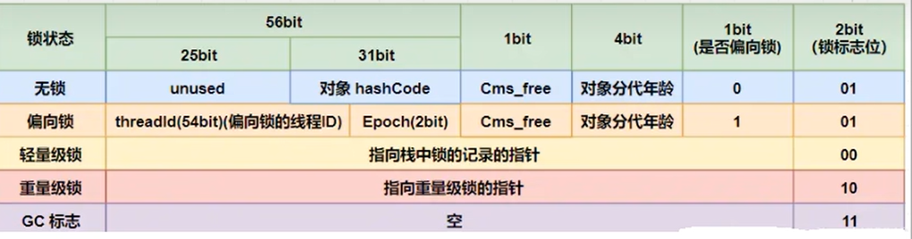

+ classPointer(8Byte)

Instance Data

```
由从父类继承的字段和自己类型的字段组成
```

Padding

```
一个对象大小必须是8Byte的整数倍
```

## 2.4 普通对象的访问方式

栈中存储普通对象的指针, 通过指针访问堆中的对象实例, 具体如何访问有两种方式

1. 指针指向堆中的句柄池中的句柄(节约存储空间)

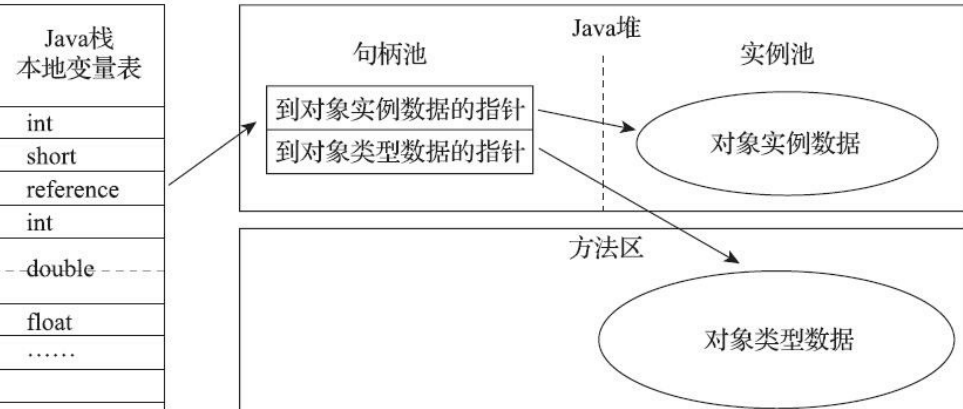

2. 指针直接指向堆中的对象实例(访问速度更快)

## 2.5 栈帧结构

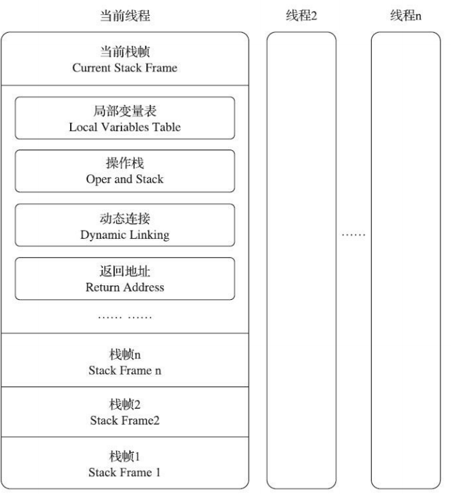

局部变量表

```
1. 局部变量表的大小在方法编译后就已经确定了, 大小不变
2. 以变量槽（Variable Slot）为最小单位, 一个变量槽至少能够存储int、reference或  	  returnAddress类型的数据, double等过长的类型用多个slot存储
3. 非静态方法的局部变量表首位是this
4. 方法内局部变量离开作用域后会重复使用变量槽
```

操作数栈

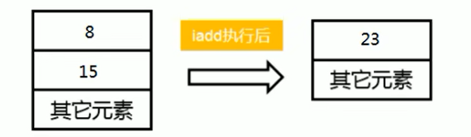

```
操作数栈的最大深度在编译期间就计算出来了
```

动态链接

```
动态链接指向 栈帧对应的运行时常量池中的方法引用
```

# 3. GC

## 3.1 新生代和老年代


```
-XX: NewRation=2 设置老年代/新生代=2/1
-XX: SurvivorRation=8 设置Eden/from/to=8/1/1
-XX:MaxTenuringThreshold=16 设置survivor区年龄阈值
```

YoungGen: 新创建的对象的区域(80%对象朝生夕灭)

OldGen: 存在时间较长的对象的区域

Survivor区: 存放Eden中经过YGC后存活的对象, 对象年龄超过阈值会被放到oldgen

## 3.2 对象的内存分配和垃圾回收

对象分配堆内存的流程图

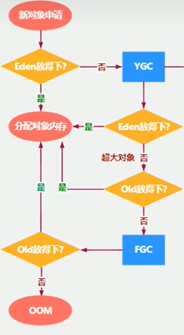

```
YGC(young gc): YoungGen的垃圾回收
FGC(full gc): 整个堆和方法区的垃圾回收
```

YGC时Survivor区的处理

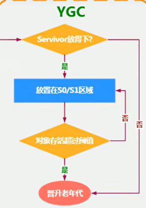

> 垃圾回收时用户线程会阻塞! 避免频繁的FGC!

## 3.3 垃圾标记算法

* 引用计数

每个对象存储一个被引用次数, 当次数为0时作为垃圾

```
String s = new String()//引用次数=1
{
String s2 = s1//引用次数+=1
}
//引用次数-=1
```

问题: 循环引用时可能造成内存泄漏

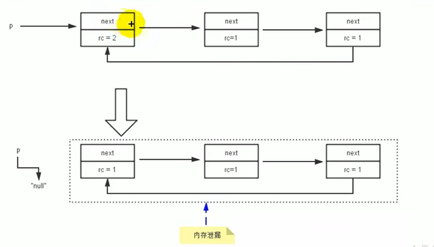

* 可达性分析

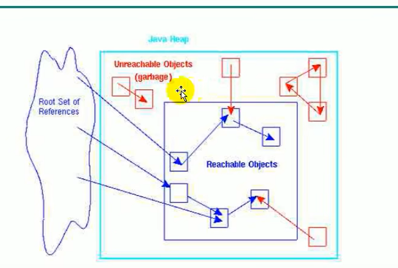

从GC Roots对象开始查找, 对于顺着引用链条没有找到该对象, 则该对象是垃圾

GC Root 常见的对象是

```
1. 局部变量
2. static变量
3. JVM内部常驻对象, 如NullPointerException、OutOfMemoryError、ClassLoader
```

## 3.4 finalize() & System.gc()

被标记为垃圾的对象, 进行垃圾回收前会调用finalize(), 再放到待回收队列中, 稍后再检查是否为垃圾

如果是则直接进行回收

如果在finalize()方法中使得对象回到了Root Set引用链上, 则对象会"复活"

System.gc()

```
不等old区满就申请调用fgc, JVM会在空闲时调用fgc, 不会立刻调用
```

## 3.5 垃圾清理算法

* 标记清除

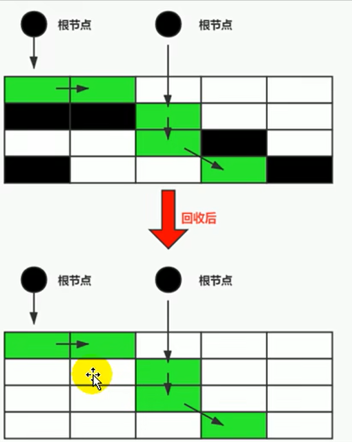

先顺着根节点查找标记不是垃圾的对象, 再顺序遍历把垃圾的空间放到空闲空间列表中

* 复制算法

将内存分为两份, 每次只使用一份, 只需要顺着根节点查找, 不需要顺序遍历

适合存活对象较少的内存区域(Eden)

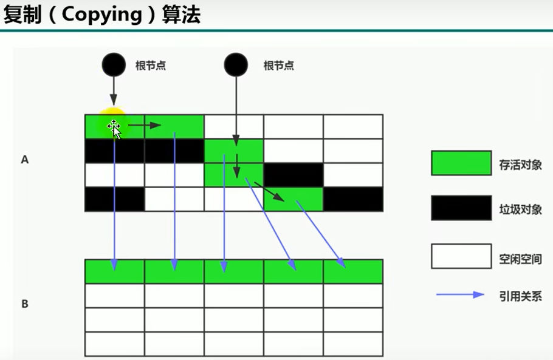

* 标记压缩


先顺着根节点查找标记不是垃圾的对象, 将其copy到一个顺序移动的指针的位置上

## 3.6 经典GC

```
-XX: +PrintGC //显示垃圾回收日志信息
-XX: UsebalabalaGC //明确使用某种gc
```

GC的性能指标

1. 吞吐量 = 垃圾回收的时间占比
2. 暂停时间 = 一次GC中STW时间

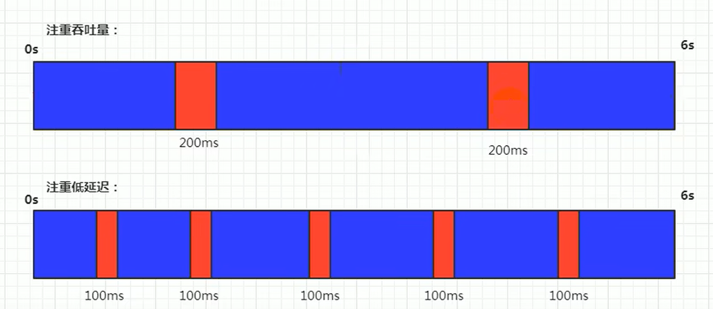


### 3.6.1 其他GC

Serial  GC

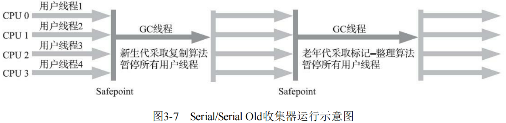采用单线程回收垃圾 ; 会有STW, **适合配置低(比如核心数=1)的机器**

---

ParNew GC

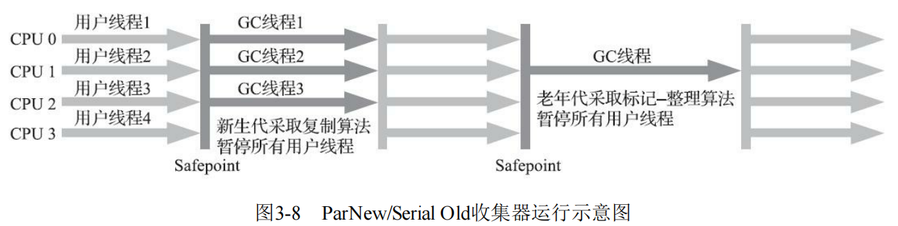

在Serial GC的基础上使用多个gc线程

### 3.6.4 CMS

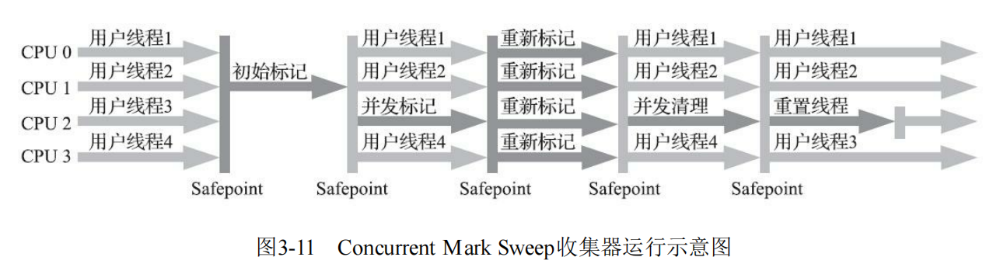

4个阶段

```
初始标记(STW) -> 并发标记 -> 重新标记 -> 并发清除(标记清除算法)
```

优点

```
STW时间短, 程序响应速度快
```

缺点

```
使用标记清除算法会导致内存碎片
并发清理阶段新产生的新垃圾无法回收(浮动垃圾)
```


### 3.6.5 G1

将内存分成多个小区域, 分为eden, servivor, old区


**垃圾清除使用复制算法**

G1优点

```
由于单次进行垃圾回收的粒度更小了, 可以设置单次STW的最大时间
```


## 3.7 四种Reference类型

Strong Reference

```
Object obj = new Object();
//引用赋值属于一个强引用, 垃圾收集器就永远不会回收掉被引用的对象
```

Soft Reference

```
//当内存不足时, JVM会将被软引用的对象当作垃圾清理
//软引用常用来引用缓存对象, 内存不足时清理缓存, 内存足够时使用缓存加快速度
SoftReference<Object> softObj = new SoftReference<>(new Object());//softObj 是一个soft ref
Object obj = softObj.get();//获得对象的强引用, 当内存不足导致对象被清理时返回null
```

Weak Reference

```
//被弱引用的对象在GC时会被回收不论内存是否足够(CMS gc在内存使用率80%就gc)
//实践: 弱引用缓存对象 
WeakReference<Object> weakObj = new WeakReference<>(new Object());//声明一个弱引用
//扩展: WeakHashMap是Entry为弱引用的Hashmap
```

Thantom Reference

```java
queue = new ReferenceQueue<>();//声明一个引用队列
PhantomReference<Object> phantomRef = new PhantomReference<Object>(new Object(), queue);
Object o = phantomRef.get();//o==null, 不能通过幽灵引用获取对象
//当对象被虚引用时相当于没有被引用, 可达性算法会忽略虚引用
//设置虚引用的目的是当对象被回收时(真正意义上的回收, finalize可能会导致对象复活), 会将一个ref对象放到引用队列中通知应用程序, 用于实现对象被回收后的后续处理
```

# 4. 执行引擎&本地方法&String

## 4.1 native方法

本地方法是使用native关键字的方法, 具体实现一般使用c/c++

```java
public  class IHaveNatives {
    public native void Native1(int x);
    native static public long Native2();
    native synchronized private float Native3(Object o);
    native void Native4(int[] array) throws Exception;
}
```


## 4.2 执行引擎结构

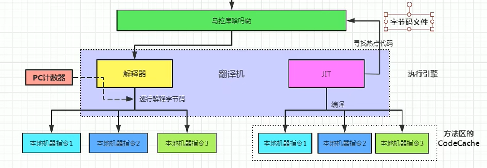

**JIT(just in time)和解释器**

```
解释器 在运行时负责将 iadd等字节码指令翻译成目标机器上的机器代码再执行, 执行速度慢(需要边翻译边执行)

JIT 对于热点方法(通过执行次数统计得出)直接把方法翻译成目标机器的机器代码
```

> JVM启动时, 主要是解释器在翻译字节码并执行, 此时执行效率低, 当执行时间长后, JIT优化可以提高执行效率 (热机性能高于冷机)

## 4.3 String的存储方式

JDK9+ 后String的存储方式

```
1. JDK8 字符串的值 private final char value[] 是一个UTF-16的字符数组; JDK9后使用byte[]数组并存储编码类型Asicc/utf-8/utf-16/utf-32
2. 被""包含起来的String字面值被存储到字符常量池中, String引用变量实质是指向常量池中的指针, 字符常量池中任意两个字符不同
```

字符串面试题解析

```
String s1 = "a";//s1指向常量池中的"a"
String s2 = new String("a") //s2指向heap中值为"a"的String对象
String s3 = "a" + "b"; //编译器优化, 直接在常量池中放入"ab", s3指向常量池中的"ab"
String s4 = s1 + "b"; //如果相加的字符串不是字面值, 使用StringBuilder在堆中创建一个新的值为"ab"的对象, 具体执行步骤为:
//1. sb = new StringBuilder
//2. sb.append(s1)
//3. sb.append("b")
//4. sb.toString() --> 在堆上创建一个String对象
//5. s4指向4创建的对象
//添加final的String类型在编译后视为字符串字面值
```

***补充: Java方法参数为基本类型是传递的值是一个副本, 参数是引用类型时传递的值是指针的副本***

**!!!数组属于引用类型**

## 4.4 字符串常量池StringTable

heap中的StringTable本质是一个HashTable


**JDK7+中的intern()函数作用**

查找字符串对象的值是否在常量池中, 如果在, 返回指向常量池中该值的指针

如果不在, 常量池中新建一个指向该对象的指针(索引为字符串的值), 返回指向常量池指针的引用

```
String s = new String("a");
String s1 = s.intern();//intern: "a"已经在常量池并返回指向常量池中"a"的指针
```
