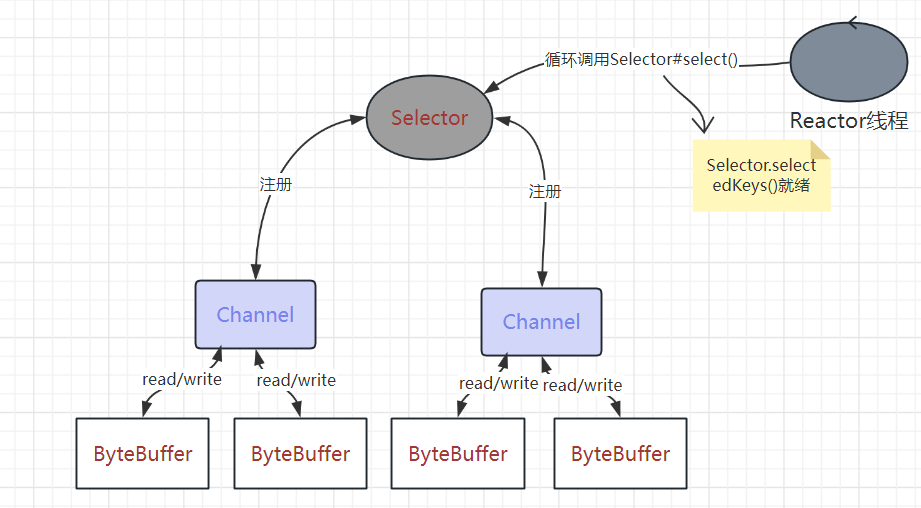
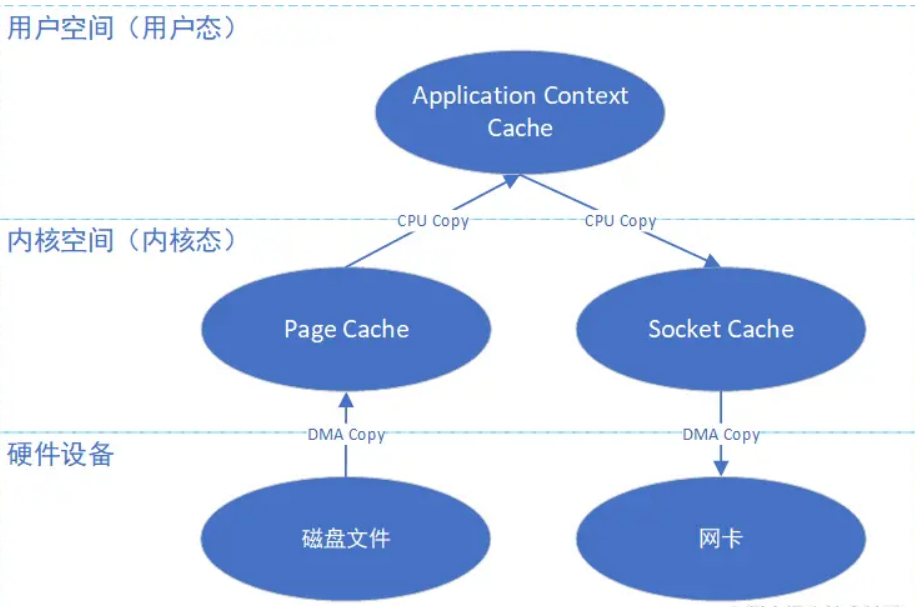
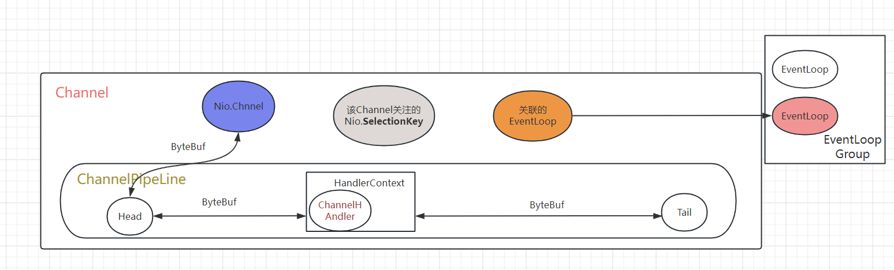
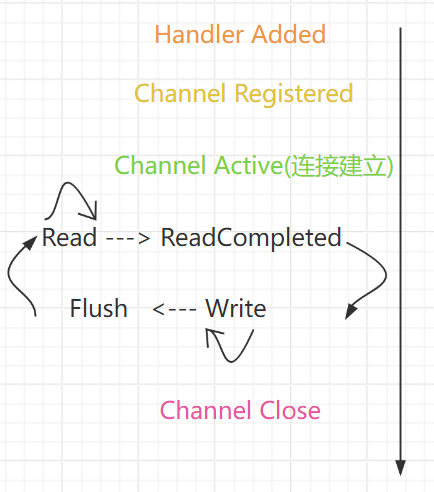

# 1. Java NIO

## 1. NIO

***讲一下Java NIO?***

```
Java NIO 主要包含三个抽象:
* Channel
* ByteBuffer
* Selector

Channel读写数据到ByteBuffer中
Channel可以注册到Selector中(返回SelectionKey)
Selector调用select方法进行nio, 获取IO就绪的SelectionKey集合
```



***讲一下SelectionKey?***

```
SelectionKey是对Channel和Selector之间注册关系的封装, 包含了:

* interest set: 注册的需要关注的IO事件

* ready set: 被选择时已就绪的IO事件

* attachment: 与注册相关联的ByteBuffer/Object
```

***`ServerSocketChannel`和 `SocketChannel`的可选择事件的差异?***

|                       | accept | read | write | connection |
| --------------------- | ------ | ---- | ----- | ---------- |
| ServerSocketChannel   | √     |      |       |            |
| SocketChannel(客户端) |        | √   | √    | √         |

## 2. 零拷贝

***什么是零拷贝?***

```
零拷贝指操作系统提供的系统调用mmap()和sendFile, 避免数据在内核缓冲区和应用程序缓冲区之间不必要的拷贝
```



***mmap和sendFile的区别?***

```
mmap(): 将应用程序的虚拟地址映射到内核空间上, 读写都是内核空间和外设之间读写

sendFile(): 直接在内核空间的两个缓冲区间进行数据拷贝
```

***说一下HeapByteBuffer和MappedByteBuffer的区别?***

```
* HeapByteBuffer: 底层使用JVM堆区的byte[]

* MappedByteBuffer底层使用mmap(), 使用内核区byte[]
```

## 3. 线程模型

***什么是Reactor模型(单Reactor多线程/主从Reactor模型)?***

```
Reactor线程在循环中使用NIO的方式监听就绪IO的事件, 将IO事件分发给Worker线程处理

根据Reactor线程和处理线程的数量又详细分为:

* 单Reactor单线程(如redis)

* 单Reactor多线程

* 主从Reactor(如netty服务端)
```

***什么是Proactor模型?***

```
一种AIO线程模型
```

# 2. Netty

## 1. Netty架构

***讲一下Netty的抽象层相关概念和各个抽象之间的关系?***

架构中主要包含的抽象概念有:

```
---架构
* Channel
* Pipeline
* ChannelHandler, ChannelHandlerContext

---并发和异步
* EventLoop(Group)
* Future, Promise

---缓存
* ByteBuf
```

抽象概念之间的关系:



## 2. ChannelHandler

***讲一下ChannelHandler的生命周期?***

在 `Netty.Channel`被注册到 `EventLoop` 后依次执行:



***使用 `Channel#fireXxx()`和 `ChannelHandlerContext.Xxx()`发布事件的区别?***

```
事件在pipeline中传播的起点不同, 通过Channel发布事件是在head/tail节点开始, context发布时间是在当前节点的下一个节点开始
```

## 3. Netty线程模型

***Netty的线程模型是怎样的?***

```
Netty中线程模型主要是有两个抽象:

* EventLoop: 单Reactor单线程模型, 内部周期性进行NIO的select()和Selectionkey的处理, 并执行任务队列中的任务

* EventLoopGroup: 线程池模型, 通过next()方法将注册Channel的任务委托给内部的EventLoop
```

***服务端两个EventLoopGroup分别负责什么?***

```
两个Group分别负责ServerSocketChannel和SocketChannel的NIO操作

* Boss Group中的线程负责选择ServerSocketChannel的ACCEPT事件并将连接后的SocketChannel注册到Child Group

* Child Group负责选择SocketChannel的Read Write事件
```
