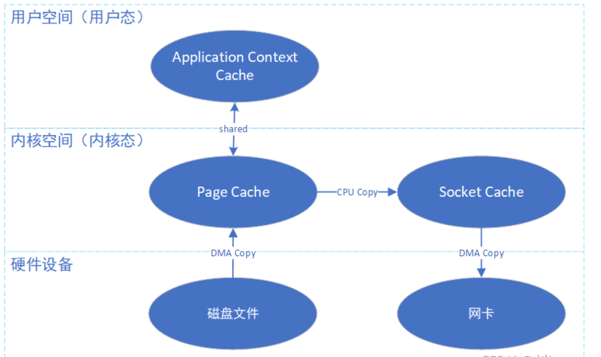
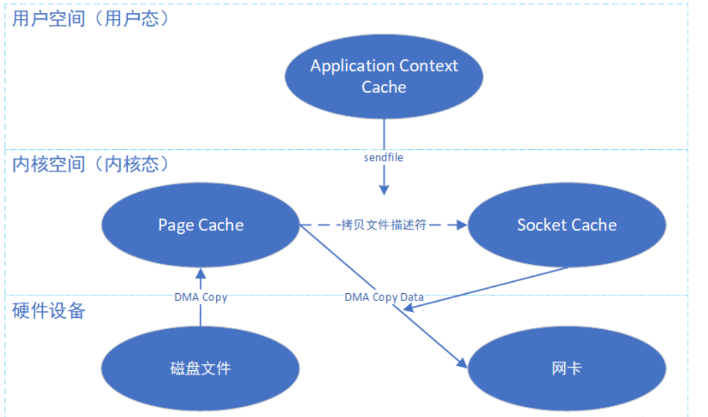

# 1. Java NIO

## 1. NIO

***讲一下Java NIO中的抽象类?***

```
Java NIO 主要包含三个抽象:
🌟 Channel: IO对象, 可以注册到Selector中(注册时需要指明可选择的IO事件)
🌟 ByteBuffer: 缓冲区, 可以作为Channel读写的对象
🌟 Selector: 调用select方法获取所有SelectionKey(注册的Channel+就绪IO事件)
```

## 2. Zero Copy

***什么是零拷贝?***

```
零拷贝指操作系统提供的mmap()和sendFile()等系统调用, 避免数据在内核缓冲区和应用程序缓冲区之间不必要的拷贝
```

***mmap和sendFile的区别?***

```
mmap: 将应用程序的虚拟地址直接映射到内核空间缓冲区的物理地址上(通过MMU实现)

sendFile: 直接在操作系统内核空间的两个缓冲区(也称文件描述符)间进行数据复制

🌙注意mmap性能低于sendFile
🌙mmap也可以作为进程间通信方式之一(共享内存)
```
mmap

sendFile


***Java NIO中HeapByteBuffer和MappedByteBuffer的区别?***

```
🌟 HeapByteBuffer: 底层使用JVM堆区的byte[]
🌟 MappedByteBuffer底层使用mmap(), 使用内核区byte[]
```

## 3. IO线程模型

***什么是Reactor模型?***

```
Reactor线程在循环中使用NIO的方式监听就绪IO的事件, 并将IO事件分发给Worker线程处理

根据Reactor线程和Worker线程的数量又详细分为:
🌟单Reactor单线程(如Redis, 一个线程同时负责select和处理)
🌟单Reactor多线程
🌟主从Reactor(如netty服务端)
```

***什么是Proactor模型?***

```
一种AIO线程模型
```

# 2. Netty

## 1. Netty简介

***讲一下Netty的设计思想?***
```
Netty核心思想为责任链模式, Netty实现了一套并发编程模型

🌟责任链模式
ChannelPipeline中包含多个ChannelHandler可以依次处理IO事件, 处理的中间结果可以保存在ChannelHandlerContext中
🌟并发编程模型
EventLoop(Group)为线程/线程池的实现, 并实现了ChannelFutrue和ChannelFutureListener用于异步编程


🌙Netty重新实现了Java NIO中的ByteBuffer和Channel为ByteBuf和Netty.Channel
```


## 2. ChannelHandler

***Channel和/ChannelPipeline/ChannelHander的关系?***
```
🌟 Channel和ChannelPipeline一对一绑死
🌟 一个ChannelPipeline可以添加/移除多个ChannelHandler
🌟 一个ChannelHandlere可以被添加到多个ChannelPipeline中, 但必须添加@Shared注解
```

***Channel的生命周期有哪些?***
```
1️⃣ channelRegistered: Channel被注册到EventLoop

2️⃣ channelActive: 网络连接建立

3️⃣ channelRead: 从Channel中读取到ByteBuf
3️⃣ channelReadComplete: 从Channel中读取到的数据小于BuyteBuf容量
3️⃣ channelWritabilityChanged: Channel可写状态发生变化(网络拥塞导致channel从可写变为不可写)

4️⃣ channelInactive: 网络连接断开

5️⃣ channelUnregistered: Channel被EventLoop注销
```

***ChannelHandler的生命周期有哪些?***
```
1️⃣ handlerAdded: ChannelHandler被添加到ChannelPipeline时

2️⃣ exceptionCaught: 之前的Handler中发生异常

3️⃣ handlerRemoved: ChannelHandler被移除出ChannelPipeline时
```

***什么情况下会在ChannelPipeline中触发事件?***
```
🌟 Channel/ChannelHandler的生命周期发生变化时(被动事件)
🌟 显式调用ChannelHandlerContext的方法发布主动事件时
🌟 显式调用ChannelPipeline/Channel的发布主动事件时

🌙 ChannelHandlerContext发布的事件起点为后续第一个Handler
🌙 调ChannelPipeline/Channel发布的事件传播起点为/尾部第一个Handler
🌙 ChannelHandler默认不传递事件, 可以继承ChannelHandlerAdapter(默认传递)
```

***常见的主动发布事件有哪些?***
```
🌟 write
🌟 read
🌟 flush(将缓冲区的数据刷到网卡中)
🌟 close
🌟 userEventTriggered
```

## 3. ByteBuf
***ByteBuf的优点?***
```
内存池化(Pooled Buffer)
```

## 4. Netty线程模型

***Netty的线程模型是怎样的?***

```
🌟EventLoop: 每个EventLoop为单Reactor单线程模型, 内部周期性进行NIO的select()和Selectionkey的处理, 并执行任务队列中的任务

🌟EventLoopGroup: 线程池模型, 通过next()方法获取下一个EventLoop将注册Channel的任务委托给内部的EventLoop
```

***如何使用EventLoop执行定时任务?***
```
eventLoop.scheduleAtFixedRate()或eventLoop.scheduleWithFixedDelay()
```
