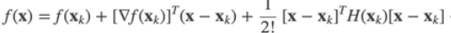

# 1. 单元微积分

## 1. 代数基础

***基本初等函数有哪些?***

```
>> 幂函数 x^a (多项式本质为幂函数的线性组合)
>> 指数函数 a^x
>> 对数函数 log
>> 三角函数 sin cos tan cot(=1/tan) sec(=1/cos) csc(=1/sin)
>> 反三角函数 arcsin(定义域-pi/2 ~ +pi/2) arccos(定义域0 ~ pi) arctan(定义域-pi/2 ~ +pi/2)
```

***常用于提取公因式的等式有哪些?***

1. 平方差公式
2. 立方差公式
3. 立方和公式


4. 平方和公式
5. 立方和公式


***如何推导三角函数的倍角公式?***

```
>> 倍角公式由和角公式推导出来
>> 和角公式可以通过几何证明
```

## 2. 极限

***如何求解复杂的极限表达式?***

```
>> 对于0/0或无穷/无穷或无穷-无穷类型, 提取并消去分子和分母中相同公因式

>> 夹逼定理: 如果f(x) <= g(x) <= h(x) 且 f和h的极限都为C, 那么g的极限也为C

>> 泰勒展开为多项式

>> 洛必达法则
```

***用通俗的话讲一下极限的epsilon-delta定义?***

```
a点周围总能找到一个区间(这个区间不包含a), 使得区间内所有自变量x的函数值f(x)都和常量C相差一个很小的值(epsilon)
```

## 3. 连续

***函数在一个点连续的定义是什么?***

如果一个函数在点a连续, 那么

$$
\lim_{x\to a} f(x) = f(a)
$$

***第一类间断点和第二类间断点的区别?***

```
第一类又称可取间断点, 可以通过重新定义该点函数值使得函数称为连续函数, 第二类则无法这样做
```

***讲一下介值定理(intermediate value theorm)?***

```
函数在连续区间[a, b]上, 对于f(a)和f(b)之间的任何一个值都可以取到
```

***什么是三大中值定理?***

```
>> 三大中值定理分别为: Roll/Lagrange/Cauchy中值定理, 罗尔中值定理是拉格朗日中值定理的特例

>> Lagrange中值定理: 对于光滑函数的一个区间, 区间内一定有一点的变化率等于这个区间从头到尾的总体变化率

>> Cauchy中值定理: 对于二维平面中一段光滑的曲线, 曲线上总有一点的切线方向和曲线从头到尾的向量方向相同 
```

## 4. 导数

***极限和导数的关系(导数是怎么定义的)?***

```
导数 = 切线的斜率 = 割线斜率的极限 = dy/dx
```

***基本初等函数的求导公式?***

所有求导公式都可以通过导数的极限表达式或求导法则推导出来, 分别是:

$$
\begin{align}
x^a  \to^{求导} a.x^{a-1}\\
a^x \to^{求导} \ln a.a^x\\
\log_ax \to^{求导} \frac{1}{\ln a.x}\\
\sin x \to^{求导} \cos x\\
\cos x \to^{求导} -\sin x\\
\tan x \to^{求导} \sec^2 x\\
\arcsin x \to^{求导} \frac{1}{\sqrt{1-x^2}}\\
\arccos x \to^{求导} \frac{-1}{\sqrt{1-x^2}}\\
\arctan x \to^{求导} \frac{1}{1+x^2}\\
\end{align}
$$

***哪些公式/法则经常用于求导数?***

$$
\begin{align}
乘法法则: f(x)g(x)  \to^{求导} fg^{'} + f^{'}g\\
除法法则: \frac{f(x)}{g(x)} \to^{求导} \frac{1}{g^2}.(gf^{'} - fg^{'})\\
反函数法则: f^{-1}(x) \to^{求导} \frac{1}{f^{'}(y)}\\
链式法则: f(g(x)) \to^{求导} \frac{df}{dg}. \frac{dg}{dx}
\end{align}
$$

***自然数e是怎么来的?***

$$
在计算f(x) = a^x的通用导数公式时, 出现了\lim_{k \to 0} (k+1)^{\frac{1}{k}}这个极限表达式, \\人为把这个表达式的结果定义为e
$$

***连续函数的导数=0时一定为极值点吗?***

```
不一定, 极值点处导数为0或者导数不存在
```

## 5. 微分

***什么是无穷小?***

无穷小是值相对的, **如果两个量都很小时,** **无穷小的那一个量更加微不足道**

$$
如果\lim_{y \to 0} \frac{O(y)}{y} = 0, 那么O(y)是y的无穷小
$$

***如何理解微分dy?***

$$
dy  = \Delta y + O(\Delta y) = \Delta y的等阶无穷小
$$

***如何求***

$$
x^2 + y^2 = 100 在(5, 5\sqrt{3})处切线的斜率?
$$

```
两边同时微分d(left)/dx = d(right)/dx, 然后变形出dy/dx(斜率)
```

## 6. 积分

***如何理解N-L公式?***

$$
\int_a^b F'(x)dx = \sum F'(x)dx = y轴变化值的和 = F(x)|_a^b
$$


***N-L公式和FTC(微积分基本定理)公式的关系是什么?***

```
FTC公式可由N-L公式推导出
```

$$
由于G(x) =\int_a^x f(t)dt = F(x)-F(a), 所以 G'(x) = f(x)
$$

***常用的积分技巧有哪些?***

```
>> 换微元法

>> 分部积分法: 将udv的积分 转化为 vdu的积分
```

***面积和体积在不同坐标系中对应的积分是什么?***

$$
面积 = 笛卡尔坐标中的曲线和x轴围成的面积: \int ydx
\\ =极坐标中的扇形面积: \frac{1}{2}\int r^2 d\theta
$$

$$
体积 = \int 垂直于x轴的切面面积S(x) dx
$$

## 7. 微分方程

***求解微分方程有哪些方法?***

```
>> 分离微元法: 将微分方程转化为 g(y)dy = f(x)dx的形式, 然后两边同时积分

>> 换元法
```

***什么是一阶线性微分方程?***

$$
方程中与y有关的项只包含y'和y, 即:
\\ 
\frac{dy}{dx} + P(x)y - Q(x) = 0
$$

## 8. 级数与微积分

***为什么要研究级数?***

```
现实生活中存在无穷项的数列求和的场景: 
   小球从空中开始自由落体, 每次反弹一半的高度, 求小球运动总长度
```

***级数的收敛和发散指的是什么?***

```
级数收敛 = 级数的和为常数
级数发散 = 级数的和为无穷大
```

***如何求幂级数的和函数S(x)?***

$$
S(x) = \sum_0^\infty a_n x^n
$$

```
>> 当an = 常数时, 直接使用等比数列求和公式
>> 当an != 常数时, 需要先对两边同时积分/求导, 将an转化为常数

```

***Taylor级数的核心思想是什么?***

```
核心思想: 如果两个函数在一个点的函数值且任意阶导数相同, 那么这两个函数在这个点周围的一个无穷小的领域上就是等价的
```

***说一下常见函数的Taylor展开式?***

$$
e^x = 1 + x + \frac{1}{2!}x^2 + \frac{1}{3!}x^3 + ... (收敛半径=+\infty)
\\
\sin x = x - \frac{1}{3}x^3 + \frac{1}{5}x^5 - \frac{1}{7}x^7 + ... (收敛半径=+\infty)
\\
\cos x = 1  - \frac{1}{2!}x^2 + \frac{1}{4!}x^4 - \frac{1}{6!}x^6 + ... (收敛半径=+\infty)
\\ \ln(x+1) = x - \frac{1}{2}x^2 + \frac{1}{3}x^3 - \frac{1}{4}x^4 + ... (收敛半径=1)
\\
(x+1)^a = 1 + ax + \frac{a(a-1)}{2!}x^2 + \frac{a(a-1)(a-2)}{3!}x^3 + ... (收敛半径=1)
\\
\frac{1}{1-x} = 1 + x^2 + x^3 + ... (收敛半径 = 1)
$$

***讲一下Fourier级数的核心思想和推导过程?***

核心思想

```
一个周期性函数等价于所有有相同周期的正弦函数之和(各个正弦函数振幅和初项可能不同)
```

推导过程

$$
1. 由核心思想可得:f(t) = C + \sum_1^{+\infty}A_n\sin (n \omega t + \varphi_n)
$$

$$
2. A_nsin(n\omega t + \varphi_n) \to^{三角和公式展开} a_n\cos(n\omega t) + b_n\sin(n\omega t)
\\ 
原式 \to^{变形为} f(t) = C + \sum_1^{+\infty} (a_n \cos(n\omega t) + b_n \sin(n \omega t))
$$

$$
3. 两边同时求[-\pi, +\pi]的积分), 可以求出C, a_n, b_n
$$

***什么是Fourier变换?***

$$
将时间-大小函数 g(t) , 变换为频率-振幅函数F(f) = \int_{-\infty}^{+\infty}g(t)e^{2\pi fti}dt
$$

# 多元函数微积分

## 1. 多元函数及其导数

***什么是多元函数?***

```
多元函数是指自变量是一个多维向量的函数

tips: 常见的多元函数的向量一般为2维或3维
```

***导数&偏导&方向导数&梯度分别的含义是什么?***

```
>> 导数是指y随x的变化率

>> 偏导是z在x切面或y切面上的随y或x的变化率

>> 方向导数是任意一个垂直x-y平面的切面上z随p的变化率

>> 梯度是与最大的方向导数同方向的一个向量, 单位向量与梯度的内积 === 方向导数
```


方向导数

$$
\begin{align*}

方向导数f^{'}_{\vec{e}}(x, y) &= \lim_{\sqrt{\Delta x^2 + \Delta y^2}\to 0}\frac{f(x+\Delta x, y+\Delta y) - f(x, y)}{\sqrt{\Delta x^2 + \Delta y^2}}
\\
&= (\frac{\delta z}{\delta x}, \frac{\delta z}{\delta y})^T \cdot(\cos{\theta}, \sin{\theta})
\\
&= <梯度\nabla z. 该方向上单位向量\vec{e}>

\end{align*}
$$

$$
这里的\nabla是一个记号, 表示(\frac{\partial}{\partial x},\frac{\partial}{\partial y})
$$

梯度

$$
\nabla z = (\frac{\partial z}{\partial x}, \frac{\partial z}{\partial y})
$$


***泰勒公式是如何从单元函数推广到多元函数的?***

```
>> f的导数 => f的梯度 (2阶梯度对应2阶Hessian矩阵)
```



## 2. 曲线积分

***曲线, 弧长, 曲率是怎么定义的?***

$$
二维/三维空间的曲线都可以由一个位置向量\vec{r}(t)表示
$$

$$
弧长=位置向量微元的模长的积分: s(t) = \int_{t_0}^{t} |d\vec{r}| = \int_{t_0}^{t} |\vec{r'}(t)|dt
\\ 
= \int ds = 笛卡尔坐标系\int \sqrt{(dx)^2 + (dy)^2} = 极坐标系\int \sqrt{(dr)^2 + (r.d\theta)^2}
$$

$$
曲率k = \frac{1}{R} = \frac{1}{\frac{ds}{d\theta}} = \frac{d\theta}{ds} 
\\
= \frac{|d\vec{e}|}{ds} (e为切线方向的单位向量)
\\
= \frac{|\vec{r}'(t) × \vec{r}''(t)|}{|\vec{r}'(t)|^3}
$$

## 3. 向量场及其导数

***什么是向量场?***

$$
向量场\vec{V}(t)是值域为向量的函数\\
向量场可以看作标量函数组成的向量, 例如:\vec{V}(t) = (f_1(t), f_2(t))
$$

***向量场的导数衡量了什么?***

$$
向量场\vec{V}(t) = (f_1(t), f_2(t))的导数是一个向量, \frac{d\vec{V}}{dt} = (f_1'(t), f_2'(t)), 
\\
衡量了向量\vec{V}随t变化的变化方向和变化速度
$$

***标量对向量的导数衡量了什么?***

$$
多元函数f(\vec{v})对向量\vec{v}的导数\frac{df}{d\vec{v}} 为梯度\nabla f, 
证明: \\ 
由于\frac{df}{d\vec{v}} . \frac{d\vec{v}}{dp} = \frac{df}{dp} 
\\= f在\vec{v}方向上的方向导数
\\= \nabla f. \vec{v}方向的单位向量
\\ = \nabla f . \frac{d\vec{v}}{dp}
$$

***什么是向量场的散度(divergence)和旋度(curl)?***

```
每一个向量场可以表示一个流体的流动方向和速度, 散度和旋度可以表示流体的特征
```

散度衡量了向量场某一个点周围的向量向外扩散的程度/向内收缩的程度

$$
向量场\vec{X}的散度
div(\vec{X}) 
\\ = \nabla . \vec{X} 
\\= (\frac{\partial{}}{\partial{x}}, \frac{\partial}{\partial{y}}) . (f_1, f_2) 
\\ = \frac{\partial{f_1}}{\partial{x}} + \frac{\partial{f_2}}{\partial{y}}
$$

旋度衡量了向量场中一个点周围的向量的旋转程度和旋转轴的方向

$$
向量场\vec{X}的旋度
curl(\vec{X}) 
\\= \nabla \times \vec{X}
\\= (\frac{\partial{}}{\partial{x}}, \frac{\partial}{\partial{y}}) \times (f_1, f_2)
$$
