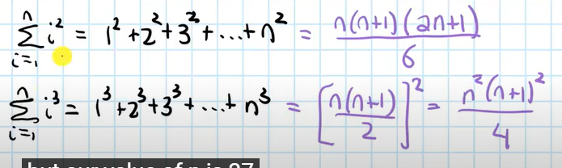

# 1. 单元微积分

## 1. 代数基础

**_基本初等函数有哪些?_**

```
>> 幂函数 x^a (多项式本质为幂函数的线性组合)
>> 指数函数 a^x
>> 对数函数 log
>> 三角函数 sin cos tan cot(=1/tan) sec(=1/cos) csc(=1/sin)
>> 反三角函数 arcsin(定义域-pi/2 ~ +pi/2) arccos(定义域0 ~ pi) arctan(定义域-pi/2 ~ +pi/2)
```

**_常用于提取公因式的等式有哪些?_**

1. 平方差公式
2. 立方差公式
3. 立方和公式


4. 平方和公式
5. 立方和公式



**_如何推导三角函数的倍角公式?_**

```
>> 倍角公式由和角公式推导出来
>> 和角公式可以通过几何证明
```

## 2. 极限

**_如何求解复杂的极限表达式?_**

```
>> 对于0/0或无穷/无穷或无穷-无穷类型, 提取并消去分子和分母中相同公因式

>> 夹逼定理: 如果f(x) <= g(x) <= h(x) 且 f和h的极限都为C, 那么g的极限也为C

>> 泰勒展开为多项式

>> 洛必达法则
```

**_用通俗的话讲一下极限的 epsilon-delta 定义?_**

```
a点周围总能找到一个区间(这个区间不包含a), 使得区间内所有自变量x的函数值f(x)都和常量C相差一个很小的值(epsilon)
```

## 3. 连续

**_函数在一个点连续的定义是什么?_**

如果一个函数在点 a 连续, 那么

$$
\lim_{x\to a} f(x) = f(a)
$$

**_第一类间断点和第二类间断点的区别?_**

```
第一类又称可取间断点, 可以通过重新定义该点函数值使得函数称为连续函数, 第二类则无法这样做
```

**_讲一下介值定理(intermediate value theorm)?_**

```
函数在连续区间[a, b]上, 对于f(a)和f(b)之间的任何一个值都可以取到
```

**_什么是三大中值定理?_**

```
>> 三大中值定理分别为: Roll/Lagrange/Cauchy中值定理, 罗尔中值定理是拉格朗日中值定理的特例

>> Lagrange中值定理: 对于光滑函数的一个区间, 区间内一定有一点的变化率等于这个区间从头到尾的总体变化率

>> Cauchy中值定理: 对于二维平面中一段光滑的曲线, 曲线上总有一点的切线方向和曲线从头到尾的向量方向相同
```

## 4. 导数

**_极限和导数的关系(导数是怎么定义的)?_**

```
导数 = 切线的斜率 = 割线斜率的极限 = dy/dx
```

**_基本初等函数的求导公式?_**

所有求导公式都可以通过导数的极限表达式或求导法则推导出来, 分别是:

$$
\begin{align}
x^a  \to^{求导} a.x^{a-1}\\
a^x \to^{求导} \ln a.a^x\\
\log_ax \to^{求导} \frac{1}{\ln a.x}\\
\sin x \to^{求导} \cos x\\
\cos x \to^{求导} -\sin x\\
\tan x \to^{求导} \sec^2 x\\
\arcsin x \to^{求导} \frac{1}{\sqrt{1-x^2}}\\
\arccos x \to^{求导} \frac{-1}{\sqrt{1-x^2}}\\
\arctan x \to^{求导} \frac{1}{1+x^2}\\
\end{align}
$$

**_哪些公式/法则经常用于求导数?_**

$$
\begin{align}
乘法法则: f(x)g(x)  \to^{求导} fg^{'} + f^{'}g\\
除法法则: \frac{f(x)}{g(x)} \to^{求导} \frac{1}{g^2}.(gf^{'} - fg^{'})\\
反函数法则: f^{-1}(x) \to^{求导} \frac{1}{f^{'}(y)}\\
链式法则: f(g(x)) \to^{求导} \frac{df}{dg}. \frac{dg}{dx}
\end{align}
$$

**_自然数 e 是怎么来的?_**

$$
在计算f(x) = a^x的通用导数公式时, 出现了\lim_{k \to 0} (k+1)^{\frac{1}{k}}这个极限表达式, \\人为把这个表达式的结果定义为e
$$

**_连续函数的导数=0 时一定为极值点吗?_**

```
不一定, 极值点处导数为0或者导数不存在
```

## 5. 微分

**_什么是无穷小?_**

无穷小是值相对的, **如果两个量都很小时,** **无穷小的那一个量更加微不足道**

$$
如果\lim_{y \to 0} \frac{O(y)}{y} = 0, 那么O(y)是y的无穷小
$$

**_如何理解微分 dy?_**

$$
dy  = \Delta y + O(\Delta y) = \Delta y的等阶无穷小
$$

**_如何求_**

$$
x^2 + y^2 = 100 在(5, 5\sqrt{3})处切线的斜率?
$$

```
两边同时微分d(left)/dx = d(right)/dx, 然后变形出dy/dx(斜率)
```

## 6. 积分

**_如何理解 N-L 公式?_**

$$
\int_a^b F'(x)dx = \sum F'(x)dx = y轴变化值的和 = F(x)|_a^b
$$


**_N-L 公式和 FTC(微积分基本定理)公式的关系是什么?_**

```
FTC公式可由N-L公式推导出
```

$$
由于G(x) =\int_a^x f(t)dt = F(x)-F(a), 所以 G'(x) = f(x)
$$

**_常用的积分技巧有哪些?_**

```
>> 换微元法

>> 分部积分法: 将udv的积分 转化为 vdu的积分
```

**_面积和体积在不同坐标系中对应的积分是什么?_**

$$
面积 = 笛卡尔坐标中的曲线和x轴围成的面积: \int ydx
\\ =极坐标中的扇形面积: \frac{1}{2}\int r^2 d\theta
$$

$$
体积 = \int 垂直于x轴的切面面积S(x) dx
$$

## 7. 微分方程

**_求解微分方程有哪些方法?_**

```
>> 分离微元法: 将微分方程转化为 g(y)dy = f(x)dx的形式, 然后两边同时积分

>> 换元法
```

**_什么是一阶线性微分方程?_**

$$
方程中与y有关的项只包含y'和y, 即:
\\
\frac{dy}{dx} + P(x)y - Q(x) = 0
$$

> 一阶线性方程和高阶微分方程没有通用的解法, 一般通过推导出的公式直接解

**_常见的微分方程的解法?_**

$$
\begin{align*}
&y'' + ay' + by = 0
\end{align*}
$$

$$
\begin{align*}
&y' + ay = 0
\end{align*}
$$

## 8. 级数与微积分

**_为什么要研究级数?_**

```
现实生活中存在无穷项的数列求和的场景:
   小球从空中开始自由落体, 每次反弹一半的高度, 求小球运动总长度
```

**_级数的收敛和发散指的是什么?_**

```
级数收敛 = 级数的和为常数
级数发散 = 级数的和为无穷大
```

**_如何求幂级数的和函数 S(x)?_**

$$
S(x) = \sum_0^\infty a_n x^n
$$

```
>> 当an = 常数时, 直接使用等比数列求和公式
>> 当an != 常数时, 需要先对两边同时积分/求导, 将an转化为常数

```

**_Taylor 级数的核心思想是什么?_**

```
核心思想: 如果两个函数在一个点的函数值且任意阶导数相同, 那么这两个函数在这个点周围的一个无穷小的领域上就是等价的
```

**_说一下常见函数的 Taylor 展开式?_**

$$
e^x = 1 + x + \frac{1}{2!}x^2 + \frac{1}{3!}x^3 + ... (收敛半径=+\infty)
\\
\sin x = x - \frac{1}{3}x^3 + \frac{1}{5}x^5 - \frac{1}{7}x^7 + ... (收敛半径=+\infty)
\\
\cos x = 1  - \frac{1}{2!}x^2 + \frac{1}{4!}x^4 - \frac{1}{6!}x^6 + ... (收敛半径=+\infty)
\\ \ln(x+1) = x - \frac{1}{2}x^2 + \frac{1}{3}x^3 - \frac{1}{4}x^4 + ... (收敛半径=1)
\\
(x+1)^a = 1 + ax + \frac{a(a-1)}{2!}x^2 + \frac{a(a-1)(a-2)}{3!}x^3 + ... (收敛半径=1)
\\
\frac{1}{1-x} = 1 + x^2 + x^3 + ... (收敛半径 = 1)
$$

**_讲一下 Fourier 级数的核心思想和推导过程?_**

核心思想

```
一个周期性函数等价于所有有相同周期的正弦函数之和(各个正弦函数振幅和初项可能不同)
```

推导过程

$$
1. 由核心思想可得:f(t) = C + \sum_1^{+\infty}A_n\sin (n \omega t + \varphi_n)
$$

$$
2. A_nsin(n\omega t + \varphi_n) \to^{三角和公式展开} a_n\cos(n\omega t) + b_n\sin(n\omega t)
\\
原式 \to^{变形为} f(t) = C + \sum_1^{+\infty} (a_n \cos(n\omega t) + b_n \sin(n \omega t))
$$

$$
3. 两边同时求[-\pi, +\pi]的积分), 可以求出C, a_n, b_n
$$

**_什么是 Fourier 变换?_**

$$
将时间-大小函数 g(t) , 变换为频率-振幅函数F(f) = \int_{-\infty}^{+\infty}g(t)e^{2\pi fti}dt
$$

# 多元函数微积分

## 1. 多元标量函数

**_什么是多元函数?_**

```
多元函数是指自变量是一个多维向量的函数
```

**_导数&偏导&方向导数&梯度分别的含义是什么?_**

```
>> 导数是指y随x的变化率

>> 偏导是z在x切面或y切面上的随y或x的变化率

>> 方向导数是任意一个垂直x-y平面的切面上z随p的变化率

>> 梯度是与最大的方向导数同方向的一个向量(与等高线垂直的向量), 单位向量与梯度的内积 === 方向导数
```

$$
\begin{align*}

方向导数f^{'}_{\vec{e}}(x, y) &= \lim_{\sqrt{\Delta x^2 + \Delta y^2}\to 0}\frac{f(x+\Delta x, y+\Delta y) - f(x, y)}{\sqrt{\Delta x^2 + \Delta y^2}}
\\
&= (\frac{\delta z}{\delta x}, \frac{\delta z}{\delta y})^T \cdot(\cos{\theta}, \sin{\theta})
\\
&= <梯度\nabla z. 该方向上单位向量\vec{e}>

\end{align*}
$$

$$
这里的\nabla是一个记号, 表示(\frac{\partial}{\partial x},\frac{\partial}{\partial y})
$$

$$
梯度\nabla z = (\frac{\partial z}{\partial x}, \frac{\partial z}{\partial y})
$$

**_梯度为零向量的点一定是局部最大/最小值对应的点吗?_**

```
不一定, 可能为鞍点, 局部最大/最小点还需要满足泰勒展开式二次项的系数大于0:
```

$$
f_{xx}(\vec{v}_0)f_{yy}(\vec{v}_0) - [f_{xy}(\vec{v}_0)]^2 > 0
$$

**_讲一下拉格朗日系数最优化方法?_**

```
Lagrange multiplier最优化方法利用了极值点处约束方程g和收益方程f梯度方向相同, 从而求出带约束的极值点
```


$$
设约束方程为g(\vec{v}) = C, 收益方程为f(\vec{v}),
\\则沿着约束方程对应的线会跨越f的等高线,
当:\\
\nabla g = \lambda\nabla f
\\
时, f(\vec{v})取极值
$$

## 2. 向量场

**_什么是向量场?_**

$$
向量场\vec{V}(t)是值域为向量的函数\\
向量场可以看作标量函数组成的向量, 例如:\vec{V}(t) = (f_1(t), f_2(t))
$$

**_向量场的导数衡量了什么?_**

$$
向量场\vec{V}(t) = (f_1(t), f_2(t))的导数是一个向量, \frac{d\vec{V}}{dt} = (f_1'(t), f_2'(t)),
\\
衡量了向量\vec{V}随t变化的变化方向和变化速度
$$

**_多元函数对自变量向量 v 的导数是什么?_**

$$
多元函数f(\vec{v})对向量\vec{v}的导数\frac{df}{d\vec{v}} 为梯度\nabla f,
证明: \\
由于\frac{df}{d\vec{v}} . \frac{d\vec{v}}{dp} = \frac{df}{dp}
\\= f在\vec{v}方向上的方向导数
\\= \nabla f. \vec{v}方向的单位向量
\\ = \nabla f . \frac{d\vec{v}}{dp}
$$

**_f(t) = [x(t), y(t)]如何对 t 求导?_**

```
使用链式法则
```

$$
\frac{df}{dt} = \frac{df}{d\vec{v}} . \frac{d\vec{v}}{dt} = \nabla f. [\frac{dx}{dt}, \frac{dy}{dt}]
$$

**_自变量为多维向量的向量场的散度(divergence)和旋度(curl)衡量了什么?_**

```
每一个自变量为多维向量的向量场可以表示一个流体的流动方向和速度, 散度和旋度可以表示流体的特征
```

散度衡量了一个点周围极小球体表面流体的总体通量是向外(div > 0)还是向内

$$
向量场\vec{X}的散度
div(\vec{X})
\\ = \nabla . \vec{X}
\\= (\frac{\partial{}}{\partial{x}}, \frac{\partial}{\partial{y}}) . (f_1, f_2)
\\ = \frac{\partial{f_1}}{\partial{x}} + \frac{\partial{f_2}}{\partial{y}}
$$

旋度衡量了一个点周围的流体透过与旋转轴平行的十字平面(两个平面)的逆时针通量

$$
向量场\vec{X}的旋度
curl(\vec{X})
\\= \nabla \times \vec{X}
\\= (\frac{\partial{}}{\partial{x}}, \frac{\partial}{\partial{y}}) \times (f_1, f_2)
$$

## 3. 二维平面上的微分

**_一个多元标量函数的 Laplacian 衡量了什么?_**

$$
Laplacian(f) = \Delta f = f的梯度的散度 = \nabla. \nabla f
$$

```
Laplacia衡量了一个点周围点的平均函数值 - 该点的函数值:
>> 如果Laplacian(f) > 0, 表明在谷底
>> 如果Laplacian(f) < 0 表明在峰顶
```

**_Jocabian 矩阵的基本思想是什么?_**

```
任何一个非线性变换, 在一个点的无穷小附近可以近似看作线性变换, 这个线性变换对应的矩阵就是Jocabian矩阵
```

$$
一个非线性变换\vec{V}(\vec{w}) = (P(\vec{w}), Q(\vec{w})) 在\vec{w}_0附近的近似线性变化将:\\
1. 基(dx, 0) 变为(\frac{\partial P}{\partial x}, \frac{\partial Q}{\partial x})
\\
2. 基(0, dy) 变为(\frac{\partial P}{\partial y}, \frac{\partial Q}{\partial y})
$$

$$
Jocabian矩阵相当于将向量\vec{w}指向的位置的无穷小附近进行了线性变换:\\

\begin{bmatrix}
\frac{\partial P}{\partial x} & \frac{\partial P}{\partial y}  \\
\frac{\partial Q}{\partial x} & \frac{\partial Q}{\partial y}  \\
\end{bmatrix}
$$

## 4. 多元标量函数的近似

**_如何求平面 `z = f(x, y)`在一个点 `v0`的切平面?_**

```
类比单元函数f(x)的切线为y = f(x0) + f'(x0). (x - x0), 切平面为:
```

$$
z(\vec{v}) = f(\vec{v}_0) + \nabla f(\vec{v}) . (\vec{v} - \vec{v}_0)
$$

> 切平面在切点附近可以作为原函数的线性近似

**_如何推导出 f(x, y)在一点附近的二次(quardratic)近似?_**

$$
设(x_0, y_0)附近的二阶近似为Q(x, y), 则Q的函数应当满足形式:\\
Q(x, y) = f(x_0, y_0) + f_x(x_0, y_0)(x - x_0) + f_y(y - y_0) + \\
\frac{1}{2} f_{xx} (x - x_0)^2 + f_{xy}(x-x_0)(y - y_0) + \frac{1}{2} f_{yy} (y - y_0)^2
\\
这样Q与f在该点的函数值, 一阶偏导, 二阶偏导都相同
$$

**_多元函数的泰勒公式的核心思想是什么?_**

```
核心思想: 如果两个多元函数在同一点处的xy的各种偏导相同并且函数值相同, 那么这两个函数在这一点的极小领域相同
```

多元函数的泰勒公式使用向量可以记作:

$$
f(\vec{v}) = f(\vec{v}_0) + \nabla f(\vec{0}) . (\vec{v} - \vec{v}_0) + \frac{1}{2!} (\vec{v} - \vec{v}_0)^TH_f(\vec{v}_0)(\vec{v} - \vec{v}_0) + ...
$$

$$
H_f(\vec{v}_0)为f在点\vec{v}_0处的二阶Hessine矩阵:
\begin{bmatrix}
f_{xx}(\vec{v}_0)&f_{xy}(\vec{v}_0)\\
f_{yx}(\vec{v}_0)&f_{yy}(\vec{v}_0) \\
\end{bmatrix}
$$

## 5. 曲线积分

**_曲线的参数方程是什么?_**

$$
空间的曲线等价于一个单变量位置向量: \\\vec{r}(t) = (x(t), y(t))
$$

**_什么是弧长?弧长的微元 ds 和其他微元的关系?_**

$$
弧长= 曲线向量微元的模长的积分: s(t) = \int_{t_0}^{t} |d\vec{r}|  = \int_{t_0}^{t} |\vec{r'}(t)|dt\\
直角坐标系中: ds = \sqrt{(dx)^2 + (dy)^2}\\
极坐标系中: ds = \sqrt{(dr)^2 + (r.d\theta)^2}
$$

**_什么是曲率?_**

$$
曲率k = \frac{1}{曲率半径R} = \frac{1}{曲率半径\frac{ds}{d\theta}} = \frac{d\theta}{ds}

\to^{复杂推导} = \frac{|\vec{r}'(t) × \vec{r}''(t)|}{|\vec{r}'(t)|^3}
$$

**_定义在二维平面的向量场 f 沿曲线的点积积分什么情况下和曲线的路径无关?_**


$$
当向量场\vec{f}为某个函数F(\vec{v})的梯度时, 积分\int_{\vec{r}_0}^{\vec{r}_1} \vec{f}. d\vec{r}等价于F(\vec{v}_1) - F(\vec{v}_2)
\\
此时积分值与路径无关
$$

> 由此可以推导出如果向量场为某个函数的梯度, 那么向量场与曲线的点积积分绕一圈 = 0

## 6. 多重积分

**_如何求 f(x, y)与 x-y 平面围成的体积?_**

$$
面积 = \int f(x, y) dS = = \int \int f(x, y)dxdy = \int [\int f(x, y)dx]dy = \int [\int f(x, y)dy]dx
$$

**_一个曲面的参数方程是什么?_**

$$
三维空间中的曲面都可以表示为两个参数的参数方程: \\
\vec{r} (s, t) = (x(s, t), y(s, t), z(s, t))
$$

**_曲面面积的微元和参数微元 ds/dt 的关系是什么?_**

$$
d \sigma = d\vec{r} 在s方向差值向量和t方向差值向量的叉乘的范数
\\
= |\frac{\partial \vec{r}}{\partial s} ds × \frac{\partial \vec{r}}{\partial t} dt|
\\
= |\frac{\partial \vec{r}}{\partial s} × \frac{\partial \vec{r}}{\partial t}|dsdt
$$


**_如何简单描述旋度定理?_**

$$
旋度定理: 向量场\vec{F}沿平面边界逆时针方向积分\oint_c \vec{F}.d\vec{r} \\
= 向量场在该平面内的旋度的积分 \iint_S (\vec{\nabla} ×\vec{F}).d\vec{S}
$$


> Tips: Green'Theorem 是旋度定理的二维形式

$$
Green Thorem: 向量场\vec{F}=(P, Q, 0)沿封闭曲线C的逆时针积分\oint_c \vec{F}.d\vec{r} \\
=curl(\vec{F})在C围成的区域S的积分\iint_S curl(\vec{F}).d\vec{S}
\\ = \iint_S (0, 0, \frac{\partial Q}{\partial x} - \frac{\partial P}{\partial y}). (0, 0, 1)dS
\\= \iint_S (\frac{\partial Q}{\partial x} - \frac{\partial P}{\partial y})dS
$$

**_散度定理说明了什么?_**

$$
散度定理: \\
单位时间内流体对应的向量场\vec{F}通过某个封闭曲面C的通量\oint_C\vec{F}.d\vec{S}\\
\\=散度在这个封闭空间中的积分: \iiint_V\vec{\nabla}.\vec{F}. dV
$$
