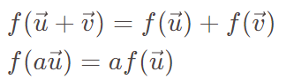
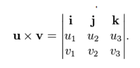

# 1. 向量

## 1. 范数和内积

***向量的范数(norm)和内积(inner production)有什么实际意义?***

```
>> 向量的范数表示向量的长短

>> 向量的内积表示两个向量的对齐程度
```

***欧几里得空间(Euclidean Space)中向量的L2范数和内积如何计算?***

$$
内积 = <\vec{u}, \vec{v}> = u_1v_1 + u_2v_2 + u_3v_3 = |\vec{U}|.|\vec{V}|.cos(\theta)
$$

$$
L2范数 = |\vec{u}|_{L2} = \sqrt{<\vec{u}, \vec{u}>} = \sqrt{u_1^2 + u_2^2 + u_3^2}
$$

***函数和向量有什么关系? ***

```
>> 一个函数可以看作是一个无穷维度的向量(每一个x可以看作一个维度, 该维度的值为f(x))
```

$$
函数||f||的范数 = \sqrt{\int f^2 dx}
$$

$$
函数f和函数g的内积<<f, g>> = \int (f.g)  dx\\
$$

## 2. 线性映射

***线性变换的代数含义?***



***线性映射(linear map)和仿射(affine map)的区别?***

```
仿射变换本质上是先对进行线性变换, 再进行平移
```

***讲一下Schmidt正交化算法?***

```
>> 算法目的: 将一个非正交基向量集合转为正交单位基向量集合

>> 算法思想: 递归算法, 一个向量A减去A在当前正交集合的每个向量方向上的投影分量后, 再单位化, 最后加入正交集合

>> 为什么要正交化和单位化?: 任意一个向量 === 该向量在各个正交基向量上的投影分量之和
```

## 3. 叉积

***叉积在三维空间中的含义?***

```
两个向量的叉积: 
* 方向 = 垂直于这两个向量组成的平面, 遵循右手法则

* 长度 = 两个向量围成的四边形的面积
```

***如何快速记忆一个三维向量的叉积公式?***

```
使用行列式可以快速记忆叉积计算公式
```



***叉积在二维空间中的含义?***

```
>> 二维向量的叉积是一个标量, 大小为两个向量围成图形的面积

>> (x1, y1) × (x2, y2) = x1y2 - y1x2
```

***如何求两个向量的夹角?***

$$
\mathbf{u}\cdot(\mathbf{v}\times\mathbf{u})=\det(\mathbf{u},\mathbf{v},\mathbf{u})=0
$$

```
>> 夹角 =  arccos (两个向量的内积 / 两个向量的范数乘积)

>> 夹角 = arcsin (两个向量的叉积的范数 / 两个向量的范数乘积)
```

## 4. 虚数和向量

***为什么会有虚数单位i?***

```
每个一个复数对应一个二维向量, 一个复数乘i 等价于 对应的二维向量逆时针转90度 
```

***复数的幂有什么实际含义?***

***Euler方程?***

# 2. 矩阵

## 1. 矩阵和向量

***一个矩阵向量方程可以表示哪些实际含义?***

```
>> 一个矩阵可以表示一个向量线性变换
例如: Ax表示向量x的线性变换

>> 一个矩阵可以表示一个线性方程组
例如: Ax = b 

>> 矩阵列向量的线性组合
```

## 2. 矩阵代数

***如何求解一个矩阵向量方程式Ax = b?***

```
1. 写出增广矩阵

2. 进行初等行变换, 变成阶梯型矩阵

3. 找到自由变量, 对每一行进行反代求出所有变量
```

***初等行变换有哪三种, 行变换的代数含义是什么?***

```
初等行变换包括: 
>> 交换两行
>> 单独一行乘一个常数
>> A行加上B行的倍数

对矩阵A进行初等行变换等价于: 一个特定的矩阵I'.A
```

***Ax = 0 和 Ax = b的解集的关系是什么?***

Ax=0

$$
齐次线性方程的解为\vec{x}_{齐次} = a\vec{u} + b\vec{v}, 
\\其中a,b为自由变量, \vec{u}和\vec{v}为常向量
$$

Ax=b

$$
齐次线性方程的解为\vec{x}_{非齐次} = \vec{p} + \vec{x}_{齐次}, \\
\vec{p}为一个Ax = b的一个特解
$$

> 对于Ax=0, 自由变量的个数为零 等价于 方程只有一个解(x = 0)

***逆矩阵的几何含义是什么, 如何求逆矩阵?***

```
>> 几何含义: 原矩阵对应的线性变换的逆变换

>> 对增广矩阵进行初等行变换可以求逆矩阵: (A, E) => (E, A^(-1))
```

## 3. 加速矩阵运算

***为什么使用矩阵分块的方法计算矩阵乘法?***

```
>> 对于稀疏矩阵, 分块后有大量的0矩阵, 可以加快乘法

>> 更好地利用cache
```

***求解线性方程Ax=b时为什么要对系数矩阵进行LU分解?***

```
进行LU分解后, 当b变换时就可以快速地计算出x

原理: 分解后原方程变为两个方程: Ux = y; Ly = b, 由于L和U为阶梯矩阵可以快速计算出y, 然后计算出x
```

## 4. 行列式

***矩阵的行列式的几何含义是什么?***

```
>> 行列式 === 矩阵列向量围成的面积/体积

>> 所以有公式: 行列式|a, b, c| = (a×b).c
```

***行列式在线性方程组求解中的作用?***

```
对于A为方阵的线性方程组 Ax = b, det(A)可以用于
1. 判断方程组是否有唯一解

2. 根据Cramer's Rule快速求解

```

## 5. 矩阵的特征

***什么是矩阵的秩, 有什么用?***

```
>> 定义: 矩阵进行行变换后得到的阶梯型矩阵的非零行的个数

>> rank(A) 为方程组Ax = b的非自由变量的个数
```

***一个矩阵的特征向量和特征值的含义?***

```
>> 几何定义: 特征向量在经过矩阵A对应的线性变换后向量的方向不改变(Ax = kx)

>> 特征向量就是矩阵对应的变换的方向, 特征值就是该方向的变换率, 经过无数次矩阵对应的变换后, 向量无限接近变换率最大的特征向量的方向
```

***如何加快计算迭代的矩阵向量乘积?***

迭代的矩阵向量乘积的递推公式如下:

$$
\vec{x}_{k+1} = A\vec{x}_k (k=1, 2, 3, ...)
$$

```
对于该计算, 可以将初始向量的特征向量的线性组合 x = aU + bV, 进而求出通项公式
```

## 6. 对称矩阵
