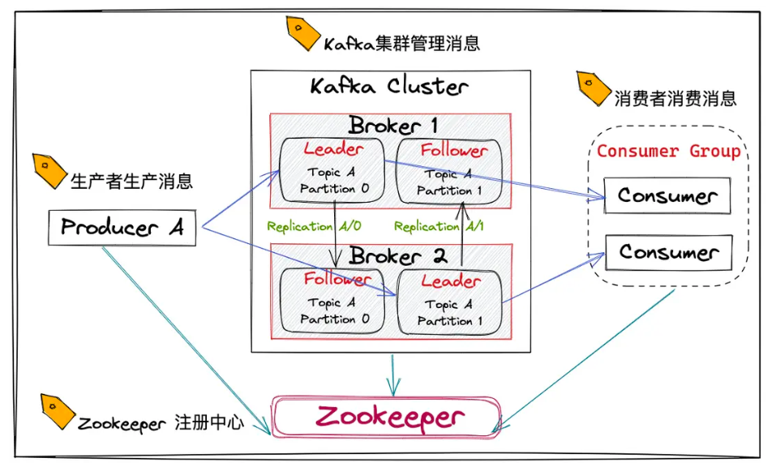

# 1. Kafka 简介

## 1. 术语

_讲一下 kafka 的架构中的角色和组件?_

```
* Producer
* Broker
* Consumer Group
* Consumer
* Controller Broker: 特殊的Broker, 额外承担一些功能(例如Broker数量变化时重新选择主分片)
* Topic: 消息队列的名称
* ZooKeeper: 保存kafka集群元信息
```



_kafka 是如何进行分片(partition)和备份(replica)的?_

```
* 对Topic进行分片(一个Topic被拆分为多个分片)

* 每个分片采用一主多从进行备份, 客户端只能读写主分片, 从分片不提供服务
```

_AR ISR OSR 的关系?_

```
* AR: 一个分片的所有副本
* ISR(in-sync-replica): 同步进度合格的副本
* OSR(out-sync-replica): 同步进度过慢的副本

AR = ISR + OSR
```

## 2. 背景

_什么技术和设计使得 Kafka 吞吐量大?_

```
* PageCache

* Zero Copy

* 磁盘顺序IO
```

_有哪些功能实现会用到 kafka?_

```
* 日志收集, 用于进一步分析

* 流量削峰
```

_kafka 相较于其他 MQ 中间件的特点?_

# 2. 架构和设计

## 1. 组件细节

_kafka 集群中 controller 的选举机制?_

```
broker启动后监听zookeeper中的值为controller的znode, 如果znode发生变化, 采用FCFS的方式抢占znode
```

_kafka 集群如何解决 controller 的脑裂问题?_

```
每次选举出的controller都有一个epoch number, 该值递增, controller在放松命令给broker时会带上epoch number, broker忽略更小的epoch number对应的命令
```

_producer 是如何讲消息发送给 broker 的?_

```
按batch发送, 减少网络IO次数
```

_consumer 为什么采用 poll 方式, 不适用 push 方式?_

```
* 使用push方式可能造成consumer消费速率和push速率不匹配

* 使用poll方式可以通过参数控制轮询间隔
```

## 2. 数据生产

_Kafka 如何决定一个 Message 放到哪个分片?_

```
* 如果有key, 使用hash(key)取模决定

* 没有key会使用RR算法或随机

tip: 可以使用自定义partitioner分区策略
```

_讲一下 kafka 的 ack 参数?_

```
ack = 0: 不需要broker应答

ack = all:主从同步复制后应答

ack = 1: 主从异步复制后应答
```

_ack>0 时 producer 重试发送消息会造成什么问题, 如何解决?_

```
可能造成重复消费消息以及消息乱序问题

解决方法: 配置中开启幂等性, kafka内部通过producerId+Seq实现幂等性
```
