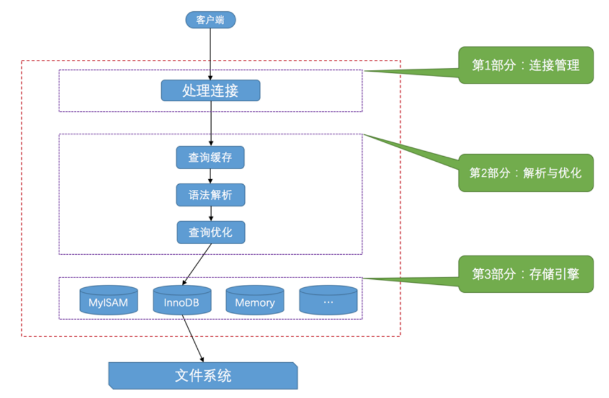

# 1. mysql 简介

## 1. 关系型数据库理论

**_关系型数据库的约束类型有哪些?_**

```
主键约束Primary Key
非空约束Not Null
唯一约束Unique
外键约束Foreign Key
默认约束Default
检查约束Check
```

**_关系型数据库的三范式指的是什么, 必须要遵循三范式吗?_**

```
1NF: 属性是原子的
2NF: 非主键完全依赖于主键
3NF: 非主键之间不存在传递性依赖
```

**_什么是视图, 什么是存储过程?_**

视图是使用 QL 语句定义的一张逻辑上的表, 没有物理表对应

```sql
-- 创建视图
CREATE VIEW view_name AS
SELECT * FROM table WHERE ...
```

存储过程相当于一个数据库的函数

```sql
-- 创建存储过程
CREATE PROCEDURE get_customer_orders(IN customer_id INT)
BEGIN
    SELECT order_id, order_date, total_amount
    FROM orders
    WHERE customer_id = customer_id;
END;
```

**_内连接, 左外连接, 全外连接的区别?_**

内连接和外连接的区别: 外连接中, 即使一张表中有一条行记录匹配不到另一张表中的任何一行, 也会保留一条值为 null 的连接记录

左外连接至少保留左边的表中的一行, 全外连接左表和右表都至少保留一行

**_count(`_`**)**和 count(1)和 count(字段)的区别?\***

count(字段)当字段为 null 时不会计数

count(_)和 count(1)都可以统计行数, 但一般来说存储引擎会对 count(`_`)进行性能上的优化

**_深分页问题如何解决?_**

-   使用缓存, 将分页查询结果缓存
-   使用一个游标字段, 字段值随分页增加递增, 每次获取前一页的最后一个值 X, 用来作为条件>X 从而实现走索引

**_drop truncate delete 的区别?_**

-   delete 遵循事务机制(其他两个不是事务), 作用是条件删除表的记录
-   drop 直接删除表(包括表的结构), truncate 删除表所有记录, 不删除表

**_union 和 union all 的区别?_**

union 会去重, union all 不会

## 2. mysql server 架构

**_mysql 服务器采用分层架构, 具体怎么分的?_**

```
从上到下分为:
连接管理层: 进行连接的安全验证和连接池管理
解析优化层: 查询缓存, 进行词法分析, 语法解析, 通过SQL处理器, 查询优化器生成查询计划
存储引擎层: 执行查询
文件系统: 操作系统的文件系统, 保存了表的物理结果
```



## 3. 存储引擎

**_常用的存储引擎有哪些, 它们之间有哪些区别?_**

常用的存储引擎: Innodb, MyISAM, Memory

Innodb 和 MyISAM 的区别:

```
* Innodb支持事务, MyISAM不支持
* Innodb支持行锁级别的锁粒度, MyISAM的锁粒度级别为表锁
* Innodb支持外键, MyISAM不支持
* Innodb使用聚簇索引, MyISAM使用非聚簇索引
```

Memory 是使用内存的存储引擎

**_如何使用 SQL 语句设置/切换表的存储引擎?_**

```sql
ALTER TABLE table_name ENGINE = MYISAM

CREATE TABLE table_name(
 ...
) ENGINE = InnoDB
```

## 4. mysql server 调控

**_如何对 mysql 服务器进行个性化设置?_**

通过设置系统变量来对服务器进行设置, 系统变量可以通过配置文件设置, 也可以通过指令 `SET GLOBAL 变量名 = 值`设置

可以通过 `SHOW VARIABLES LIKE 'xxx'` 查看系统变量的值

**_如何查看 mysql 服务器运行状态?_**

通过指令查看状态变量 `SHOW STATUS LIKE 'xxx'`

**_表的字符集使用 utfmb3 和 utfmb4 有什么区别?_**

uftmb3 是 utf-8 的子集, 最大字符编码长度为 3 字节, **不包含表情符号**

utfmb4 是完整的 utf-8 编码

# 2. Innodb

## 1. 表的存储

**_Innodb 中表是如何存储的?_**

表存储在文件系统中, 读写表时先将表文件读取到内存缓冲池中(以 16KB 大小的页为基本单位), 读写完成后再刷新到文件中

**_一个页中行记录是如何存储的?, 如何进行查找的?_**

一个页中的行记录使用**单链表**连接, 并且链表至少有一个最大记录和最小记录

查找记录时**对单链表的目录进行二分查找,** 快速定位到要查找的记录所在的 slot


## 2. 记录行的存储

**_Innodb 中行格式有哪些?_**

常见的行格式: Compact, Dynamic, Compressed

**_简单说一下你知道的行格式具体是怎样的?_**

一行记录由: `变长字段长度列表+null值列表+记录头+记录数据` 组成

其中 null 值列表使用一个 bit 位记录一个字段是否位 null


**_记录头中记录了什么信息?_**

-   **trx_id:** 事务 id, 用于 mvcc
-   **roll_ptr**: 用于 mvcc
-   **row_id**: 行 id, 自动生成

**_如果一行记录太长了, 导致一个页放不下, 如何存储?_**

对于过长的字段(如 varchar 最大字节长度为 65535), 在原本存储字段值的地方存储一个**溢出指针**, 指向存放溢出数据的页

## 3. 索引

**_Innodb 为什么使用 B+树作为索引, 而不使用 B 树, AVL?_**

-   B+树相较于 B 树支持范围查找(叶节点使用双向链表连接)
-   B+树相较于 AVL 来说, 树的高度更小, 磁盘 IO 的次数更少

**_索引的分类有哪些?, 什么是回表?_**

```
* 聚簇索引: 完整的记录在B+树索引的叶节点上
* 二级索引: 索引的叶节点只保存记录的主键, 如果需要查找完整的记录需要回到聚簇索引中查找(回表)
* 联合索引: 多个字段按照字典序排序, 构成一个索引
```

**_什么是最左匹配原则?_**

要使用联合索引, 作为条件的字段必须覆盖联合索引的左前缀

**_索引 B+树为什么高度一般不超过 3 层?_**

页的大小为 16KB, 假设一个页存储 1000 条记录, 3 层能够存储 10^9 条记录, 这个数量一般来说已经足够

**_索引什么情况下会失效?_**

-   索引字段进行计算时发生了类型转化 / 使用了函数转换
-   联合索引没有按照最左匹配原则
-   特殊的查询条件, 如 NOT NULL, !=, like+"%"通配符作为前缀

**_什么字段适合建立索引, 建立索引有哪些技巧, 使用索引有哪些注意事项?_**

-   重复度小的字段适合作为索引
-   频繁作为查询条件和排序条件和分组条件的字段适合作为索引
-   不要建立过多的索引
-   表太小也不要建立索引

**_为什么建议使用自增主键?_**

避免新增记录导致的频繁的**页分裂**

# 3. 事务和锁

## 1. 事务简介

**_什么是事务, 事务的 ACID 特性的是什么?_**

事务通俗的讲就是一段**要么全部执行, 要么全部不执行**的 SQL

```
A: 原子性: 要么全部执行, 要么全部不执行
C: 一致性: 事务执行前后数据库保持一致性
I: 隔离性: 不同事务之间的执行互不影响
D: 持久性: 事务对数据库的影响是永久的
```

**_事务隔离级别有哪些, 每个隔离级别会导致的问题?_**

```
RU:  一个事务内可以读取到还未提交的事务进行的更改, 会有脏读问题
RC: 一个事务内只能读取到已经提交的事务的更改, 会有不可重复读问题
RR(innodb默认隔离级别):  一个事务期间数据的值在事务开始和结束时一致, 会有幻读问题
SERIAL: 事务之间串行执行
```

## 2. MVCC

**_RC, RR 隔离级别下是如何进行快照读的/MVCC 原理?_**

每条行记录中的记录头中包含**rollback_pointer 指针**和写入该记录的事务 id: **transaction_id**, 由 roll_ptr 指针构成了一个版本链(旧记录存储在**undo log**中), 每次查询的时候会生成一个 ReadView, ReadView 定义了当前事务可见的记录的 transaction_id 的范围, 然后顺着版本链查找记录, 如果记录不可见则跳过

## 3. 锁

**_锁的分类有哪些, CRUD 各自会加什么锁?_**

锁分类:

```
* 互斥锁 SELECT ... FOR UPDATE
* 共享锁 SELECT ... IN SHARE MODE

* 行锁
* 表锁
* 表意向锁: 申请行锁前需要先申请表意向锁
* 自增锁: 自增主键递增时需要申请自增锁

* 记录锁: 修改记录前先申请记录锁
* 间隙锁: 插入数据前需要申请间隙锁
* 临键锁: 记录锁 + 记录旁边的间隙锁
* 隐式锁
```

-   SELECT: 互斥锁/共享锁
-   DELETE: 互斥锁
-   UPDATE: 先加互斥锁(读), 在按照情况加 INSERT 对应锁(修改了主键的情况)
-   INSERT: 加插入意向锁, 隐式锁(使用事务 id 实现)

## 4. 日志

_如何解决事务的持久性问题?_

```
Write Ahead Log(WAL)思想, 在写入磁盘前先写入日志, 例如Innodb执行事务时:

1. 修改buffer pool中的数据页
2. 将修改过程记录到内存中的redo log buffer中
3. 事务要提交时, 将redo log从内存刷新到磁盘, 状态为Commit Record, 此时事务提交成功
4. 定时(Checkpoint时)将buffer pool中的脏数据页刷新到磁盘中, 刷新后将磁盘中的redo log状态标记为End Record

tip: 在数据库crash后的重启阶段, 会先执行redo log中状态为Commit Record的记录, 恢复内存中丢失的数据页
tip: 第2步中, redo log中一条记录的结构为(页号, 偏移号, 修改后的数据)
tip: 第4步中, 实际写入到磁盘时还会经过os级别的文件系统缓存, 但innodb默认会立刻fsync
```

_为什么有了 redo log 还需要 undo log?_

```
仅仅有redo log不能保证原子性, 例如一个事务修改了所有页面, buffer pool中的部分脏页面必须在事务提交前刷新到磁盘上(steal策略)
```

# 4. 调优相关

## 1. Explain

**_EXPLAIN 可以做什么? 结果中重要的列有哪些?_**

explain+DQL 语句可以查看执行计划, 执行计划中重要的字段:

```
* key: 使用到的索引
* type: 查询方式
* key_len: 使用到的索引的长度
* rows: 预估行数
* Extra: 有助于查询优化的额外信息
* table: 查询的哪个表
```

**_type 有哪些?_**

```
* 全表扫描: ALL
* 索引全扫描: Index
* 索引范围扫描: Range
* 索引的等值查询: eq_ref
* 不适用索引页不扫描表: NULL
```

## 2. 分库分表

**_什么是雪花算法, 为什么使用雪花算法而不是表的自增 ID?_**

雪花算法生成的 ID 结构: `1个标志位+41位时间戳+10位机器码+12位序列号`

```
使用雪花算法的原因:
* 分库分表导致表的自增id可能相同, 使用雪花算法可以生成全局唯一id且这些id大致递增, 避免B+树索引频繁的节点分裂

* 即使不是分库分表, 单一表中使用自增id会导致表锁, 高并发下性能差
```

**_分库分表有哪些方式?_**

分为垂直分表和水平分表, 垂直分表将一个表中不常使用的字段和常用字段拆分到不同表中, 水平分表将一张表中的记录拆分到不同表当中

## 3. 主从数据库

**_什么是主从架构, mysql 中如何实现主从同步的?_**

主服务器负责写入, 通过同步机制同步到从服务器, 从服务器负责响应读请求

mysql 中通过 binlog 实现主从同步
