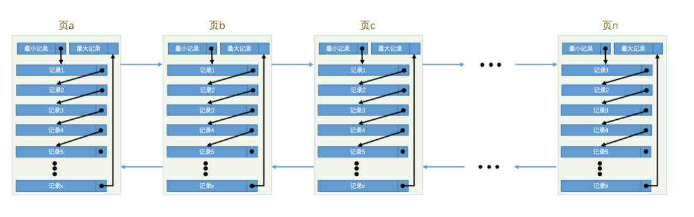
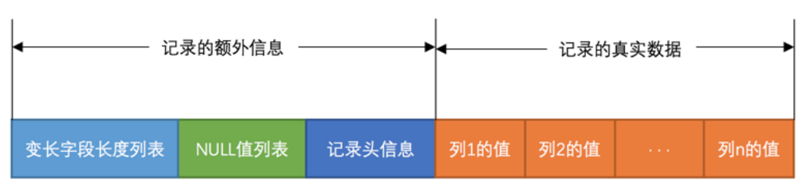

# 1. MySQL 简介

## 1. 关系型数据库理论

**_(constraint)类型有哪些?_**

```
🌟 主键约束Primary Key
🌟 非空约束Not Null
🌟 唯一约束Unique
🌟 外键约束Foreign Key
🌟 默认约束Default
🌟 检查约束Check
```

**_关系型数据库的三范式指的是什么?_**

```
1NF: 字段是原子的
2NF: 只有一个主键
3NF: 字段之间不存在传递性依赖, 都必须直接依赖主键

🌙 有时不一定严格遵循三范式, 为了加快查询速度存储冗余数据
```

**_什么是视图(View)和存储过程(Stroed Procudure)?_**

```
🌟视图是使用DQL语句定义的一张逻辑上的表(CREATE VIEW)
🌟存储过程=数据库函数(CREATE PROCEDURE)
```


## 2. SQL 查询

**_DDL/DML/DQL/DCL 的区别?_**

```
🌟 DDL(Database define language): 如create/drop/alter table
🌟 DML(Database manipulate language): 如insert/delete/update table
🌟 DQL(Datebase query language): 如select table
🌟 DCL(Datebase control language): 如commit/rollback grant/revoke
```

**_SELECT 语句的语法?_**

```sql
/* 普通查询 */
SELECT a,b,c
FROM table
WHERE a>1 AND b>2
ORDER BY a ASC,b DESC
LIMIT 0,10

/* 聚合查询 */
SELECT a,count(*)
FROM table
WHERE b > 0
GROUP BY a
HAVING a != 1
```

**_内连接/外连接/全外连接的区别?_**

```
🌟 内连接: 行A和行B符合连接条件 => 行A-行B
🌟 左外连接: 行A与任何行都不符合连接条件 => 行A-NULL
🌟 右外连接: 任何行与行B都不符合连接条件 => NULL-行B
🌟 全外连接: 左外连接+右外连接
```

**_count(🌟)/count(1)/count(字段)的区别?_**

```
🌟 count(*)和count(1)都可以统计总行数, 但数据库一般只对count(*)有性能优化
🌟 count(字段A)只统计字段A NOT NULL的行的数量
```

**_深分页为什么慢?_**

```sql
SELECT * FROM user ORDER BY ctime LIMIT 1000000,10
上面的这行SQL会先查二级索引"ctime", 会先遍历前1000000行记录, 因为每个B+树索引的节点不存储行数, 仅存储最大最小值!
```

**_深分页问题如何解决?_**

```sql
游标法, 上面的SQL可以改为:
SELECT * FROM user WHERE ctime > 上次查询结果最大的ctime ORDER BY ctime LIMIT 10

🌙 遇到深分页问题, 尽量使用游标查询(或说服产品使用瀑布流)
```

**_drop/truncate/delete 的区别?_**

```
🌟 drop: 删除表的数据和元信息
🌟 truncate: 删除表的数据
🌟 delete: 按事务的方式删除满足条件的行
```

**_union 和 union all 的区别?_**

```
union合并两个集合时会去重, union all不会;

🌙 union去重时会, 每一列数据都相同才会判定为相同
```

**_字符集 utfmb3 和 utfmb4 的区别?_**

```
🌟 utfmb3是uft8的子集, 单个字符最大编码长度为3byte
🌟 utfmb4是完整的uft8, 单个字符最大编码长度为4byte, 支持表情字符

🌙 如无特殊要求, 使用utfmb4字符集; 字符比较规则(Collation)使用utf8mb4_unicode_ci
```

***哪些常用的数据类型的存储空间是固定的?***
```
🌟 bigint = 64位整数
🌟 int = 32位整数
🌟 char = 255个字符
🌟 tinyint/boolean = 8位整数
🌟 timestamp = 4字节长度的时间戳(最大值=2038年)

🌙 固定长度的数据类型的显示宽度如bigint(M)中的M仅仅在ZEROFILL生效, 对数值范围无影响
```

***有常用的不定长的数据类型?***
```
🌟 datetime(M): 默认精确到秒, M=3时精确到毫秒(占用更大存储空间)
🌟 varchar(M): 最大存储M个字符
```

## 3. MySQL Server

**_MySQL服务器采用分层架构是怎样的?_**
```
从上到下分为:
1️⃣ 连接池管理层: 连接池管理+鉴权
2️⃣ SQL解析层: 解析并优化SQL, 调用存储引擎层接口并将结果处理后返回给客户端
3️⃣ 存储引擎层: 可以使用不同的存储引擎(MyISAM, InnoDB, Memory), 负责与文件系统交互
4️⃣ 文件系统
```

***为什么Innodb的页大小为16KB但MySQL单行长度限制约为64KB?***
```
单行长度限制=64KB是在服务层限制的, 页大小=16KB是在存储引擎层的实现

🌙 当单行长度过大时(超出>16KB)时, Innodb在Dynamic行格式下会采用指针和溢出页的方式存储Blob/Text/最长的varchar字段
```

## 4. 存储引擎

**_常用的存储引擎有哪些, 它们之间有哪些区别?_**

```
🌟Innodb: 支持事务, 行锁 
🌟MyISAM: 不支持事务, 表锁
🌟Memory: 基于内存而不是文件系统
```

# 2. Innodb

## 1. 表的存储

**_Innodb中是如何存储表的?_**
```
🌟 表本身就是一个B+树索引(聚簇索引), B+树的一个节点对应一个16KB大小的页
🌟 聚簇索引使用主键id进行排序
🌟 一个页内部维护一个单链表, 单链表的节点为数据节点或页指针
🌟 聚簇索引的root页常驻内存, 其他页在使用时才加载到内存的buffer pool中
```

**_为什么在单页中支持对行记录的二分查找?_**
```
页存储了一个Page Diretory指针数组, 每个指针指向行记录开始位置, 便于进行二分查找 
```


## 2. 行格式

**_Innodb中行格式(Raw Format)有哪些?_**
```
有4种行格式: Compact, Redundant, Compressed, Dynamic

🌙 默认行格式为Dynamic, 一般业务场景也推荐使用Dynamic
```

**_Dynamic行格式是怎样的?_**
```
变长字段长度列表+null列表+行元数据+数据
```


**_行元数据记录了什么?_**
```
🌟 roll_ptr: 用于 mvcc
🌟 row_id
🌟 trx_id: 用于 mvcc
```

**_如果一行记录太长了如何存储?_**
```
对过长的字段使用指针和溢出页的方式存储
```

## 3. 索引

**_Innodb为什么使用 B+树作为索引, 而不使用B树?_**
```
B+树索引可以支持范围查询
```

**_什么是聚簇索引/二级索引/联合索引?_**
```
🌟 聚簇索引(clustered index): 以id建立的索引, 叶节点存储全部字段
🌟 二级索引(secondary index): 以字段A排序的索引, 叶节点存储(A, id)
🌟 联合索引: 以多个字段(A, B)排序的索引, 叶节点存储(A, B, id)

🌙 聚簇索引就是表本身
```

**_什么是最左匹配原则?_**
```
要使用联合索引时, 作为查询条件的字段必须覆盖联合索引的左前缀
```

**_什么是回表?_**

```
"select * from table where ctime > 10"执行时会:
1️⃣ 查二级索引"ctime"获取id
2️⃣ 按id查询聚簇索引获取全部字段(回表)

🌙 如果二级索引可以满足查询结果要求, 会直接返回不用回表
```

**_B+树索引为什么高度一般不会超过3层?_**

```
一个页大小为16KB可以存储约1000条记录, 3层的B+树可以存储10^6条记录
```

**_索引什么情况下会失效?_**
```
🌟联合索引没有遵守最左匹配原则
🌟查询条件中对索引字段进行计算/函数/类型转换
🌟查询条件为!= / NOT NULL / like '%abc'
```

**_什么字段适合建立索引?_**
```
🌟 前缀区分度高的字段
🌟 频繁作为查询条件或排序条件或分组条件的字段

🌙 索引本质上是空间换时间, 过多索引会影响DML语句性能
🌙 对姓名等字段reverse后再建立索引
```

**_为什么建议使用自增主键?_**
```
在插入数据时使用自增主键可以减少聚簇索引的页分裂
```

# 3. 事务和锁

## 1. 事务简介
**_什么是事务?_**
```
要么全部成功, 要么全部失败的一组动作

例如: A向B转账时, A账户扣款和B账户加款两个动作必须为事务
```
**_事务的ACID特性?_**

```
A: 原子性: 要么全部执行, 要么全部不执行
C: 一致性: 事务执行前后数据库保持一致性(不破坏数据的约束)
I: 隔离性: 不同事务之间的执行互不影响
D: 持久性: 事务对数据库的影响是永久的
```

**_事务隔离级别有哪些? 每个隔离级别会导致的问题?_**

```
RU:  一个事务内可以读取到还未提交的事务进行的更改, 会有脏读问题
RC: 一个事务内只能读取到已经提交的事务的更改, 会有不可重复读问题
RR:  一个事务期间数据的值在事务开始和结束时一致, 会有幻读问题
SERIAL: 事务之间串行执行

🌙 一般使用RR级别
```

## 2. MVCC

**_RC/RR隔离级别下的MVCC原理?_**
```
🌟 MVCC依赖于行记录头中的rollback_ptr指针和transaction_id
🌟 rollback_ptr指向undo log中的历史版本文件链表
🌟 每次查询时根据当前事务id, 判断事务可见的最新历史版本

❓如果查询时当前事务只能读到历史版本, 还需要单独对undo log 进行一次磁盘IO吗?
👄 大多数情况不需要, 因为快照读时历史版本大概率在buffer pool的undo log页中
```

## 3. 锁

***锁的作用?***
```
在多个事务并发执行时, 保证事务的隔离性
```

**_锁的分类有哪些?_**

```
🌟 互斥锁(X锁): SELECT ... FOR UPDATE
🌟 共享锁(S锁): SELECT ... IN SHARE MODE

🌟 行锁
🌟 表锁
🌟 表意向锁(IX IS锁): 申请行锁前需要先申请表意向锁
🌟 自增锁: 自增主键递增时需要申请自增锁

🌟 记录锁(Record Lock): 修改记录前先申请记录锁
🌟 间隙锁(Gap Lock): 插入数据前需要申请间隙锁
🌟 临键锁(Next key Lock): 记录锁 + 记录旁边的间隙锁
```

## 4. 日志

_讲一下redo log是如何生效的?_

```
Write Ahead Log(WAL)思想:

1️⃣ 修改buffer pool中的数据页
2️⃣ 将修改过程记录到内存中的redo log buffer中
3️⃣ 事务要提交时, 将redo log从内存刷新到磁盘, 状态为Commit Record, 此时事务提交成功
4️⃣ 定时(Checkpoint时)将buffer pool中的脏数据页刷新到磁盘中, 刷新后将磁盘中的redo log状态标记为End Record

🌙 在写redo log时是追加文件, 速度很快
🌙 在数据库crash后的重启阶段, 会先执行redo log中状态为Commit Record的记录, 恢复内存中丢失的数据页
🌙 第4步中, 实际写入到磁盘时还会经过os级别的文件系统缓存, 但innodb默认会立刻fsync
```

_为什么有了redo log还需要undo log?_
```
undo log提供了对事务回滚和MVCC的支持
例如:
一个事务修改了所有页面导致buffer pool中的部分脏页面必须在事务提交前刷新到磁盘上(steal策略), 此时如果没有undo log, 就会导致未提交事务的却修改了DB, 如果事务在之后提交不成功就会破坏事务的原子性
```

# 4. 调优

## 1. Explain

**_EXPLAIN 可以做什么?_**

Explain+DQL 语句可以查看执行计划, 执行计划中重要的字段有:

```
🌟 type: 查询方式
🌟 key: 使用到的索引
🌟 rows: 预估需要扫描行数
🌟 filtered: WHERE子句过滤了行数占比(%)

🌙 使用explain只能查看执行计划, 并没有实际执行SQL!
```

**_查询方式有哪些?_**

```
🌟 全表遍历: all
🌟 索引上全量遍历: index
🌟 索引范围扫描: range
🌟 索引的等值查询: ref
```

## 2. 分库分表
***分库分表有哪些方式?***
```
🌟 水平分表: 数据库A存储记录a, b, c; 数据库B存储记录e, f, g;
🌟 垂直分表: 数据库A存储字段record.a, record.b, record.c; 数据库B存储字段record.e, record.f, record.g;

🌙 分库分表用于提升性能, 当单表预估行数>2000W时可以考虑分库分表
🌙 多数情况下, 优先考虑对冷数据进行归档避免行数过多
```

***分库分表需要处理的难点?***
```
🌟 id不能使用数据库自增id: 需要使用分布式自增id
🌟 特殊SQL(self-join)无法支持, 聚合查询需要广播查询再由分片中间件聚合(数据量过大有性能风险)
🌟 多库之间的分布式事务: 一般使用柔性事务(如TCC, 最大努力通知)
```

***如何生成分布式自增ID?***
```
🌟 Snowflake ID: 雪花ID = 时间戳+机器节点ID+机器生成序列号, 其中机器ID使用Zookeeper维护
优点: 数据更安全, 无法通过ID判断记录的个数
缺点: 系统时间回拨时可能会导致ID重复, 可以本地缓存上一次发号的时间戳判断时间戳是否回拨, 如果回拨则不可用

🌟 Leaf ID: 一次性获取一段ID并缓存到本地, 使用数据库存储段长和MaxId
缺点: 可以通过ID大致判断记录个数

🌙 Snowflake和Leaf都不能保证严格递增, 只能保证趋势递增
```

# 5. MySQL集群

***MySQL的集群架构是什么?***
```
采用主从架构, 主服务器负责响应写请求, 从服务器负责响应读请求; 主从服务器之间通过binlog异步复制
```

