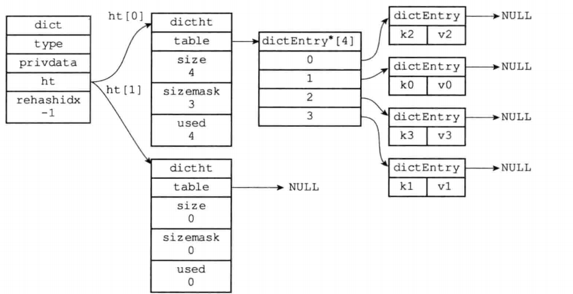
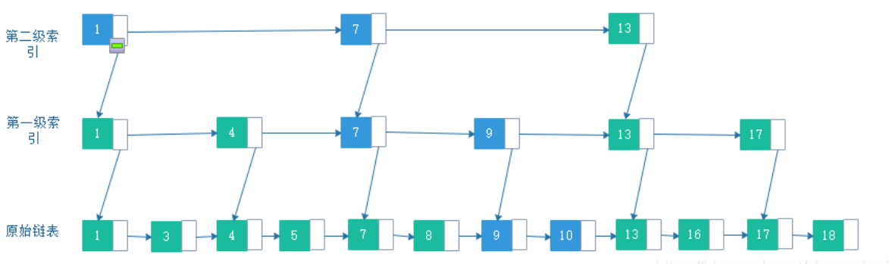
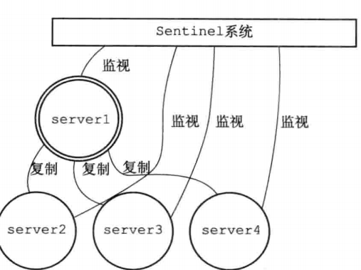

# 1. Redis介绍

## 1. 数据类型和数据结构

***redis五大常用数据类型是什么, 三大扩展类型是什么?***

基本类型: string, list, hash(哈希表), set, zset(可排序的集合)

扩展类型: geospitial(地理位置), hyperloglog(统计UV), bitmap

***什么是SDS?***

redis中的数据结构, 用于存储字符串, 相较于c语言字符串增加了字符串长度和缓冲区

```c
struct Sds {
    int len;
    int freeLen;
    char buf[];
};
```

***redis中哈希表扩容/缩容 是如何进行的, 如何解决哈希冲突的?***

redis通过**拉链法**解决hash冲突, redis中一个哈希表实际上由两个散列表组成ht[0]和ht[1], 当负载因子过大或过小时, 会进行**渐进式rehash**

**渐进式rehash**: `每次对哈希表进行CRUD时, 除了完成指定的CRUD操作, 还会将一个散列表中少量的节点值通过rehash搬到另一个散列表中, 多次操作后缩容/扩容完成`



***什么是跳表?跳表查找的时间复杂度是多少?***

跳表本质上是一个链表, 但链表的节点有不同的level, 每个level都对应一个指针指向链表中下一个>=该level的节点, **更高级的level的指针实质上构成了低级level指针的索引**



**`新插入的节点需要随机level(越高等级的level概率呈指数级下降), 如果概率成指数级下降, 对跳表的基本操作的时间复杂度为log(N)`**

***什么是intset?***

intset内部维护一个i**nt_8类型数组和int的编码方式**, 不同的编码方式中一个元素占用的数组单元格个数不同(编码为int_64时一个int占数组8个单元格)

**当往intset中添加值较大/小的int时, 所有记录都会升级编码方式,** 使用更长的单元格存储


***什么是ziplist?***

redis使用连续的存储空间实现的列表, 列表每一项长度不定(需要记录每一项的长度), 每一项可以存储数组和整数值

ziplist中可能会发生**连锁更新, 但概率很低**

***什么是redisObject?***

redis中所有类型都统一为redisObject, **不同类型看作是redisObject的编码**, 具体实现可以采用不同的数据结构

## 2. redis特点

***redis为什么快?***

```
* 使用内存存储数据, 内存io速度快
* 单线程避免了多线程的锁竞争和上下文切换
* IO使用了IO多路复用
```

# 2. Redis单机

## 1. 内存淘汰策略

***什么是Redis内存淘汰策略? 淘汰策略有哪些?***

redis基于内存, 当内存不足时redis会淘汰部分键值对, 如何淘汰键值对就是淘汰策略, 常见的淘汰策略有:

```
* random: 随机淘汰
* ttl: 淘汰TTL最小
* lru: 根据LRU算法淘汰
* 禁止淘汰键值对, SET操作会报错
```

## 2 过期键删除策略

***Redis中是如何删除过期键值对的?***

redis采用惰性删除和定期删除相结合的方式删除过期键

* 惰性删除: 当对键值对操作时, 如果检测到已经过期, 则删除
* 定期删除: 每隔一段时间删除过期字典中少量的过期键

## 3 持久化机制

***什么是AOF和RDB?***

* AOF是redis持久化机制之一, 当对数据库进行修改操作时, redis会往aof文件中追加修改指令, 当需要进行恢复时, 重新执行这些指令
* RDB时redis持久化机制之一, redis将数据库快照保存到rdb文件中, 每次启动时读取rdb文件进行恢复

> AOF优先级比RDB高, Redis服务器重启时优先使用AOF进行恢复;
>
> 使用配置文件/命令行参数开启redis持久化

***持久化常用的指令有哪些?***

```
异步写入AOF文件: BGREWRITEAOF
异步写入RDB文件: BGSAVE
```

***AOF文件过大影响写入速度怎么办?***

redis会对aof文件进行重写, **重写时根据数据库快照中的键值对, 生成对应的写入指令**, 然后将这些写入指令添加到aof文件中

***AOF和RDB各自的优缺点?***

```
RBD: 
优点---恢复速度块
缺点---持久化间隔长, 可能丢失的数据多
AOF: 
优点---间隔短, 丢失的数据少
缺点---恢复速度慢
```

# 3. Redis集群

## 1. 主从架构

***redis主从架构的是怎样架构的?***

一个主从架构中有**一个主服务器(负责写请求), 多个从服务器(负责读请求), 和多个哨兵**, 哨兵负责监控主从服务器和其他哨兵的状态, 当主服务器挂掉时, 会从从服务器中重新选举出一个主服务器(**故障转移**)



***Redis中主从服务器是如何进行数据同步的?***

```
* 从服务器/挂掉后重启的主服务器 在第一次连上主服务器后全量复制主服务器的数据

* 随后主服务器被写入数据后使用增量复制的方式异步复制到从服务器
```

***Redis中主从服务器数据一致性问题是什么 怎么解决?***

主从异步复制导致的问题:

```
* 异步复制丢失问题: 主节点被写入数据后来不及同步到从节点就宕机导致写入的数据丢失


* 脑裂问题: 主节点由于网络分区问题可以被访问, 但主节点连接不到从节点群, 网络恢复后主节点中的新写入数据由于进行全量复制导致丢失
```

通过参数设置 `y秒内至少有x个从节点` 进行了主从同步来减少丢失的数据

```
min-slaves-to-write x
min-slaves-max-lag y
```

## 2. 集群

***什么是redis集群?***

一个redis集群中有多个主节点, 主节点之间会互相保存数据副本, 对其中一个主节点发起的请求会被路由到集群中特定的节点


***什么是一致性hash算法?***

一致性hash算法适用于分布式系统中, 相较于传统的hash算法, **避免了节点故障时数据的大量迁移**

```
一致性hash算法的哈希空间是一个环, 节点和数据都会映射到环中的虚拟node上, 当一个节点发生故障时, 数据会被迁移到患上最近的节点上
```

redis采用slot的机制, **一个slot对应一致性hash算法中虚拟hash环上的一个node**,  一个redis实例负责特定范围的slot

# 4. 缓存相关问题

## 1. 缓存穿透, 击穿, 雪崩

**什么是缓存穿透, 缓存击穿, 缓存雪崩, 如何解决?**

缓存穿透

```
大量请求访问数据库中不存在的数据, 导致请求穿透缓存层到持久层
解决方法: 缓存空值/bloomFilter
```

缓存击穿

```
大量请求同时访问过期的缓存, 导致请求击穿到持久层
解决方法: 在热点数据过期前提前加载到缓存中/使用互斥锁保证同时只有一个相同的请求访问持久层
```

缓存雪崩

```
短暂时间内大量缓存失效导致请求大量到达持久层
解决方法: 过期时间尽量区分开/使用多级缓存
```

***什么是bloomFilter, 如何减小bloomfilter的误判率?***

用于判断数据一定不存在的一种数据结构, **使用一个bitmap和多个hash函数**, 对于一个数据, 通过多个hash函数映射到bitmap上不同位置上的1, 如果查找时发现某一位不为1则肯定不存在该数据

**提高bitmap大小**可以减少误判率

***什么是双key缓存热点数据, 相对与单key的优点?***

```
双key缓存数据是指使用一个key缓存过期时间(该key的过期时间短), 另一个key缓存数据(过期时间长)

* 查询数据时, 先查询过期时间key, 如果存在则查询热点数据key
* 如果不存在, 重新写入过期时间key, 随后访问数据库更新热点数据(包括其过期时间)

相对于单key缓存热点数据, 避免了缓存击穿问题
```

## 2. 缓存一致性问题

***什么是缓存一致性?***

```
当对数据库中数据进行修改后, 缓存和数据库中的数据无法实现事务上的一致性, 这就是缓存一致性问题
```

***如何确保缓存一致性?***

```
如果对一致性要求不高, 只需要设置redis缓存的过期时间

如果对一致性要求较高,  可以采用先更新数据库, 再删除缓存 + (延迟双删)
```

***为什么采用删除缓存而不是更新缓存?***

```
更新操作可能会延迟导致缓存中的是脏数据
```

## 3. 分布式锁

***如何使用Redis指令实现分布式锁?***

使用Redis的 `setnx expire get del` 指令可以实现分布式锁

```
-----------获取锁有两步操作----------
setnx <lock_name> <process_id>
设置一个锁, 如果设置成功表明获取锁成功, 否则获取锁失败

expire <lock_name> <max_lock_duration> 
给锁设置过期时间, 防止进程挂掉造成的死锁

-----------释放锁有两步操作--------------
get <lock_name>
释放锁前需要get锁的value判断是否为process_id, 如果不是说明锁过期了, 防止误删了其他线程的锁

del <lock_name>
如果是直接删除
```

**通过LUA脚本保证加锁和释放锁过程的原子性**

```
lua脚本原子性的原因: redis单线程执行一个lua脚本时不会执行其他lua脚本和命令
```

***使用分布式锁过程中当前持有分布式锁的业务超时了怎么办?***

设置定时任务在锁快要超时时续约

```
Redission中的WatchDog机制每10s自动续约30s
```

***如何保证主从异步复制导致的分布式锁问题?***

```
使用多个不会同时宕机的主节点
获取锁时需要确保一定比例(Redission中为50%)的Redis主节点上SETNX成功 
```

## 4. 业务实现

***如何使用redis实现排行榜功能?***

使用 `zset` 实现排行榜, **用户id作为key, 排序字段映射为score**

可以将多个排序字段映射为score不同权重位上实现多字段排序

***如何使用redis实现文章点赞计数?***

* 使用 `hash `存储文章点赞信息 `[uid, 点赞次数]`, 点赞时 `increby(1)`
* 使用 `set`存储文章点赞信息 `{uid1, uid2}`

***如何使用redis统计UV?***

精确统计使用 `set`

不需要精确统计使用 `hyperloglog`

***如何使用redis实现附近的人的功能?***

使用 `Geospatial`

***如何使用redis实现短信验证码/会话管理功能?***

redis保存键值对:  `[uid, token/code]` **并设置过期时间**

***如何使用redis实现分布式全局唯一ID?***

使用指令:  `INCR AND GET`

***如何redis实现分布式接口限流?***

使用 `zset` 作为滑动窗口 或者 使用 `list` 作为令牌桶

***如何使用redis实现接口幂等性?***

当请求成功响应后向redis中保存 `[api_id + uid + 请求参数hash值, 请求次数+1] ` 并设置一定的过期时间, 新请求需要确保redis中无相关key/请求次数小于限制次数

***大Key如何删除?***

```
对于value占用内存特别大的键值对, 需要分批次删除, 避免一次性删除导致redis阻塞请求
```
