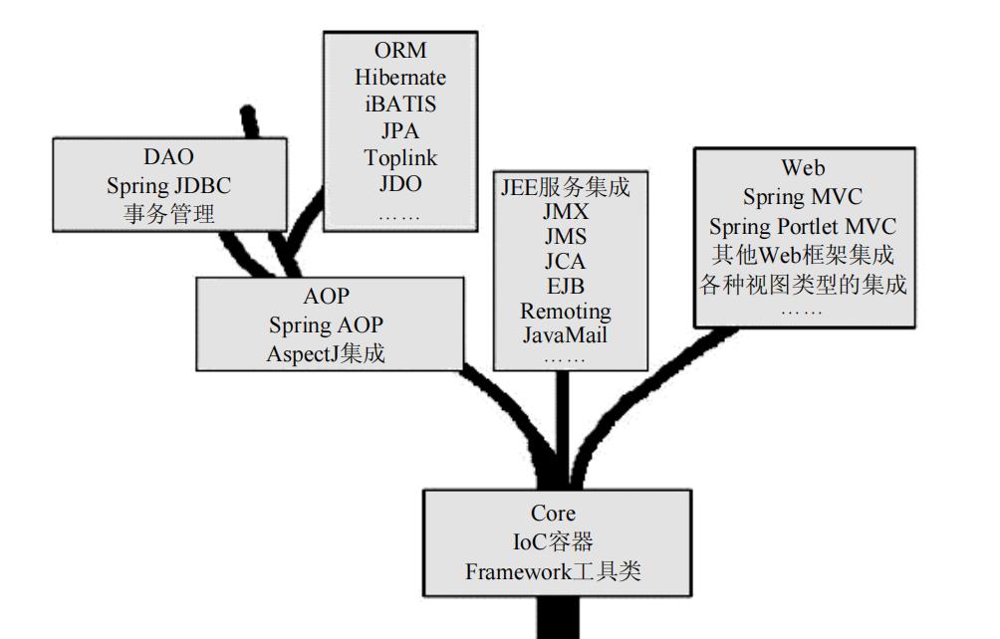

# 0. IOC

## 0.1 Spring框架结构

Spring框架结构



## 0.2 IOC容器和DI

2.4

IOC有什么用? DI有什么用?

IOC容器继承关系和对应的功能?

依赖注入的方式?

## 0.3 BeanFactory

BeanFactory作用?

Bean的注册方式有哪些?

IOC容器如何获取Bean定义到生成BeanFactory的过程?

常用的XML配置文件格式?

# 1. Spring Freamwork

## 1.1 Ioc容器的使用(xml配置)

```xml
	<!--ioc,di 依赖-->
        <dependency>
            <groupId>org.springframework</groupId>
            <artifactId>spring-context</artifactId>
            <version>5.3.20</version>
        </dependency>
```

在spring的配置文件中注册bean

```xml
<!--2. 通过xml文件配置bean的bean_id和类名-->
<bean id="bookService" class="xyz.spider.helo.service.impl.BookServiceImpl"></bean>
```

获取IOC容器, 并获取Bean

```java
    public static void main(String[] args) {
//        3. 通过xml配置文件获取ioc容器类ApplicationContext
        ApplicationContext ctx =
                new ClassPathXmlApplicationContext("spring_config.xml");
//        4. 通过id获取bean
        BookServiceImpl bookService = (BookServiceImpl) ctx.getBean("bookService");
//        5. 使用bean
        bookService.save();
    }
```

> 面试题: BeanFactory和FactoryBean的区别?
>
> Ioc容器的顶层接口类为BeanFactory**,** 所有Ioc容器都继承自这个接口
>
> 继承FactoryBean `b` 的类在容器中注册后会作为Bean

## 1.2 依赖注入(xml配置)

配置Bean如何注入属性值

```xml
    <bean id="bookService" class="xyz.spider.helo.service.impl.BookServiceImpl">
<!--    1. 使用依赖注入需要先配置依赖的属性 name: 属性名, ref: 类型的bean id-->
        <property name="bookDao" ref="bookdao"></property>
    </bean>
```

注入后的属性值可以正常使用

```java
    private BookDao bookDao;
    @Override
    public void save() {
        System.out.println("BookServiceImpl.save()");
        bookDao.save();
    }
```

## 1.3 Bean扩展

* Bean生命周期

分配内存 -> 构造方法执行 -> 属性注入 -> bean初始化钩子方法 -> bean销毁钩子方法

* Bean的scope
  分为singleton和prototype, 分别代表管理的类是单例/原型创建多个对象

## 1.4 Ioc&DI的注解开发

配置类

```java
@Configuration//注册为配置类
@ComponentScan("xyz.spider.helo")//指定需要扫描的bean的包
@PropertySource("classpath:jdbc.properties")//导入properties配置文件
@Import(DbConfig.class)//导入其他配置类
public class SpringConfig {//主配置类
    //注册bean
    @Bean//通过工厂方法注册
    public MySqlDataSource mySqlDataSource(){
        return new MySqlDataSource();
    }
}
```

Bean类

```java
@Component//注册为bean
//@Controller
//@Service
//@Repository

//设置bean的scope
@Scope("prototype")
public class BookServiceImpl implements BookService {
    @Autowired //自动注入引用值
    private BookDao bookDao;
    @Value("wangshihan")//自动注入基本类型
    String name;
    @Value("${jdbc.name}")//使用properties文件中的变量
    String jdbcName;
}
```

通过配置类使用Ioc容器

```java
    public static void main(String[] args) {
//       1. 创建配置类对应的ioc容器
        AnnotationConfigApplicationContext ctx =
                new AnnotationConfigApplicationContext(SpringConfig.class);
//        2. 获取并使用bean
        BookServiceImpl bean = ctx.getBean(BookServiceImpl.class);
        bean.save();
    }
```

## 1.5 AOP注解开发

Aop面向切面编程, 便于在原有功能上进行增强

```
        <dependency>
            <groupId>org.aspectj</groupId>
            <artifactId>aspectjweaver</artifactId>
            <version>1.9.7</version>
        </dependency>
```

开启Aop注解开发

```java
@Configuration
@ComponentScan("xyz.spider.helo")
@EnableAspectJAutoProxy// 1. 在配置类中开启aspect注解开发
public class SpringConfig {
}
```

在切面类中配置切入哪里以及切入内容

```java
@Component
@Aspect
public class Advices {
//切入哪里?
    @Pointcut("execution(void xyz.spider.helo.service.BookService.save())")
    private void pointA(){}

//切入内容
    @Before("pointA()")
    public void printTime(){
        System.out.println(System.currentTimeMillis());
    }
}
```

切入点表达式可以使用通配符..和*

```
execute(* xzy..DataDao.save(*))
```

**通知类型还可以为**@Around @After

# 2. Spring事务

事务四大特性ACID

* 原子性: do nothing or all
* 一致性: 事务前后数据库的完整性没有被破坏
* 隔离性: 事务并发执行时可以保证不同执行顺序不影响最终的数据(通过事务的隔离级别实现)
* 持久性: 事务对数据库的修改是永久的

## 1.1 声明式事务管理

编程式事务: 需要开发者在代码中手动管理事务的开启、提交和回滚等操作, 开发者可以通过API自己控制事务

声明式事务: 开发者可以只使用注解或基于配置的XML来管理事务, 声明式事务的管理是使用AOP实现的，本质上就是在目标方法执行前后进行拦截。

```xml
<!--        1. 导入spring-tx(spring声明式事务管理依赖)-->
        <dependency>
            <groupId>org.springframework</groupId>
            <artifactId>spring-tx</artifactId>
            <version>5.3.20</version>
        </dependency>
```

开启声明式事务

```java
@Configuration
@ComponentScan("xyz.spider.helo")
@EnableTransactionManagement// 启动声明式事务管理
public class SpringConfig {
}
```

使用注解

```java
    @Transactional// 2. 声明方法为事务方法, 方法执行前开启事务, 结束后提交事务, 有异常回滚
    public void draw(int money);
    @Transactional(isolation = Isolation.READ_COMMITTED)//设置事务隔离级别
    public void deposit(int money);
    @Transactional(propagation = Propagation.MANDATORY)//设置事务传播级别
    public void transfer(int money);
```

## 1.2 事务隔离级别

`Isolation.READ_UNCOMMITTED` : 事务期间其他事务写入的未提交的数据也有效___脏读问题

`Isolation.READ_COMMITTED` :  事务期间其他事务写入的提交后的数据有效__不可重复读问题

` Isolation.REPEATABLE_READ`: 事务期间不允许其他事务对同一个数据进行修改提交(增删可以提交)__幻读问题

`Isolation.SERIALIZABLE` : 事务期间不允许其他事务对同一个数据进行增删改提交_性能问题

## 1.3 事务传播级别

一个事务中, 可能会含有多个子事务, 前者为事务发起者, 后者为事务加入者

比如在转账事务中, 包含减少金额事务和增加金额事务

事务的传播就是事务发起者和事务加入者之间的关系

```
Propagation.REQUIRED(默认值)
```

只有在需要的时候才开启新事务(如果已经有事务发起者, 则使用事务发起者的事务)

```
Propagation.REQUIRES_NEW
```

新建一个事务(事务发起者的事务先挂起, 执行事务加入者的事务)

# 3. SpringMVC

## 3.1 原理图


## 3.2 流程

1. 依赖导入

```xml
<!--        原生servlet-api-->
        <dependency>
            <groupId>javax.servlet</groupId>
            <artifactId>servlet-api</artifactId>
            <version> 2.2</version>
        </dependency>
<!--        springmvc-->
        <dependency>
            <groupId>org.springframework</groupId>
            <artifactId>spring-webmvc</artifactId>
            <version>5.3.22</version>
        </dependency>
```

---

2. 在web.xml(JavaWeb应用的配置文件)中注册DispatcherServlet

```xml
    <!--1. 在web.xml  注册  DispatcherServlet-->
    <servlet>
        <servlet-name>springmvc</servlet-name>
        <servlet-class>org.springframework.web.servlet.DispatcherServlet</servlet-class>
        <init-param>
            <param-name>contextConfigLocation</param-name>
		<!--spring的配置文件-->
            <param-value>classpath:spring-config.xml</param-value>
        </init-param>
        <!--启动级别-1(在web容器启动时就启动DispatcherServlet)-->
        <load-on-startup>1</load-on-startup>
    </servlet>
    <!--  /:匹配所有的请求（不包括.jsp） -->
    <servlet-mapping>
        <servlet-name>springmvc</servlet-name>
        <url-pattern>/</url-pattern>
    </servlet-mapping>
```

---

3. 在Spring配置文件中配置Springmvc需要的组件

```xml
<!--    HandlerMapping-->
    <bean class="org.springframework.web.servlet.handler.BeanNameUrlHandlerMapping"/>
<!--    HandlerAdapter-->
    <bean class="org.springframework.web.servlet.mvc.SimpleControllerHandlerAdapter"/>
    <!--ViewResolver-->
    <bean class="org.springframework.web.servlet.view.InternalResourceViewResolver" id="InternalResourceViewResolver">
	<!--该视图解析器会先将Handler返回的ModelandView中的view字符串添加前后缀, 再来解析视图位置-->
        <!--前缀-->
        <property name="prefix" value="/WEB-INF/jsp/"/>
        <!--后缀-->
        <property name="suffix" value=".jsp"/>
    </bean>
```

---

4. 写一个Controller的实现类完成业务

```java
//写一个Controller接口的实现类
public class HelloController implements Controller {
    @Override
    public ModelAndView handleRequest(HttpServletRequest request, HttpServletResponse response) throws Exception {
//        业务代码...
//        返回ModelAndView
        ModelAndView mv = new ModelAndView();
        mv.addObject("key", "value");
        mv.setViewName("test");
        return mv;
    }
}
```

## 3.3 注解开发示例

### 3.3.1  声明Controller

*@Controller*---将Controller注册到IOC容器

*@RestController*---所有方法默认加上@ResponseBody的Controller

*@RequestMapping @GetMapping   @PostMapping* ---如何映射url

```java
@Controller
@RequestMapping("/hello")
public class HelloController{
    //资源的url为 host/hello/test
    @RequestMapping("/test")
    public String test(Model model){
        System.out.println("测试中...");
        model.addAttribute("msg", "123");
        return "test";//ViewResolver会解析到该字符串对应的视图
    }
}
```

### 3.3.2 前后端传参

*@RequestParam @ParaVariable* ---query传参和restful风格传参

```java
    @GetMapping("/add")
    //host/add?a=1&b=2
    public String add1(@RequestParam int a, int b, Model model){
        model.addAttribute("ret", a+b);
        return "resultPage";
    }

    @PostMapping("/add/{a}/{b}")
    //host/add/1/2
    public String add2(@PathVariable int a, @PathVariable int b, Model model){
        model.addAttribute("ret", a+b);
        return "resultPage";
    }
```

*@ResponseBody*

默认Controller中的方法返回值会被封装成**ModelAndView**然后交由视图解析器, 解析后的页面返回前端;  添加@ResponseBody后返回值为字符串时, **直接返回前端字符串**, 返回值为Object时先使用**默认序列化器Jackson序列化**成字符串, 再返回前端.

> 易踩坑点: JackSon序列化使用getter方法, 所以对象的属性必须包含get方法

*@RequestBody*

将请求体中JSON字符串封装为对象, *注意form-data的格式时请求体不是Json字符串 而是 `p=v&s=1`的格式*

### 3.3.3 参数的验证

*@Validated*

用于RequestBody的请求体对象的校验

```java
    public Result updateBrand(@PathVariable("id") Long id,
                              @RequestBody @Validated PmsBrand pmsBrandDto,
                              BindingResult result) {
        //result是校验结果
        result.getAllErrors()
        //其他处理
}
```

属性值验证相关注解

```java
    @NotNull
    @Size(max=32,message="code is null")
    private String code;

    @NotBlank
    @Size(max=32,message="product is null")
    private String product;

@AssertFalse 校验false
@AssertTrue 校验true
@DecimalMax(value=,inclusive=) 小于等于value，inclusive=true,是小于等于
@DecimalMin(value=,inclusive=) 与上类似
@Max(value=) 小于等于value
@Min(value=) 大于等于value
@NotNull  检查Null
@Past  检查日期
@Pattern(regex=,flag=)  正则
@Size(min=, max=)  字符串，集合，map限制大小
@Validate 对po实体类进行校验
```

# 4. SpringBoot

### 4.1 启动类和配置文件

所有Springboot项目继承同一个父项目

自动导入常用依赖并进行版本控制

```xml
    <parent>
        <groupId>org.springframework.boot</groupId>
        <artifactId>spring-boot-starter-parent</artifactId>
        <version>2.6.11</version>
        <relativePath/> <!-- lookup parent from repository -->
    </parent>
```

Springboot应用启动类

```
@SpringBootApplication
//启动类本身也是配置类
//自动扫描启动类同目录及以下的所有bean
public class SbDemoApplication {

    public static void main(String[] args) {
        SpringApplication.run(SbDemoApplication.class, args);
    }

}
```

Springboot应用配置文件为 `classpath: /application.yml`, 可以通过下面的方式将文件中的属性值注入到配置类中

```
@ConfigurationProperties(prefix = "user")//将yml文件中user前缀的变量注入到配置属性类中
@Value("${jwt.name}")//将变量注入的属性中
```

主配置文件application.yml中使用spring.profiles.avtive开启多环境配置

```
spring:
  profiles:
    active: deploy  # application-deploy.yml中的配置生效
```

### 4.2 自动配置原理

springboot中有一些常用配置类(会被自动扫描), 但这些配置类在@ConditionalOnxxx

注解下, 条件成立才注册bean. 例如SpringMvcAutoConfig配置类只有在Ioc容器中有DispatcherSevlet时才会生效

`spring-boot-test-autoconfigure-2.6.11.jar` 下有常用的配置类信息

### 4.3 spring-web-mvc 的自动配置类

自动配置的静态资源路径映射Handler

会将 `http:host/**/test.js` 映射到 `classpath: /static/**/test.js` 等四个路径

```
private static final String[] CLASSPATH_RESOURCE_LOCATIONS = 
new String[]{"classpath:/META-INF/resources/", "classpath:/resources/", "classpath:/static/", "classpath:/public/"};
```

自动配置的欢迎页Handler  将 `http:host/` 映射到  `/static/index.html`
