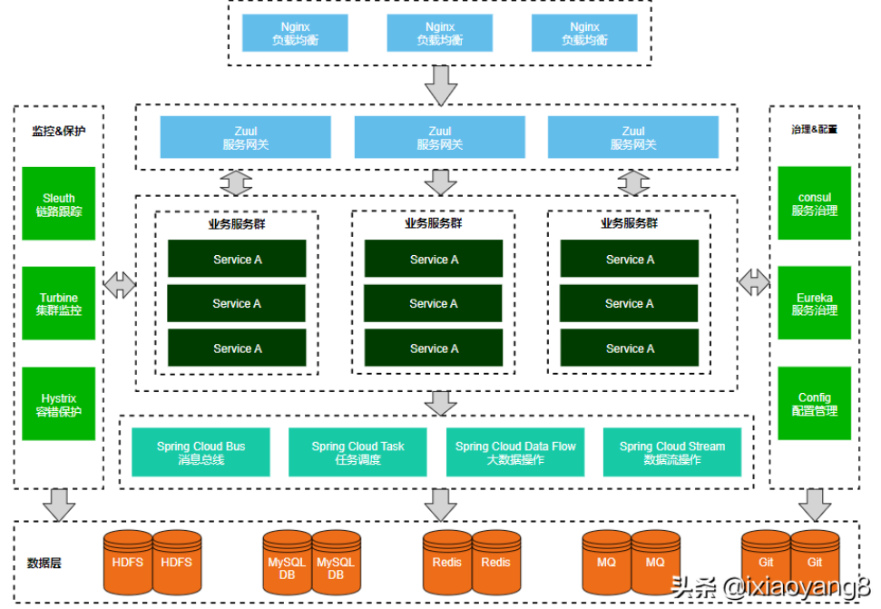
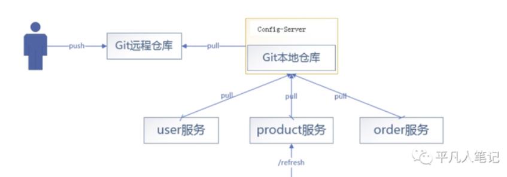
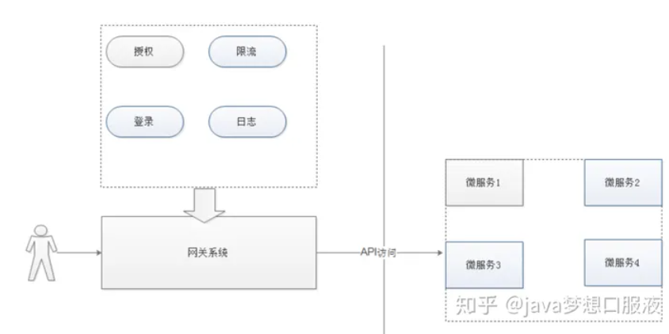

## 微服务应用架构



***微服务架构相较于单机架构的优点和缺点?***

```
优点: 
* 各个微服务之间耦合度低, 易于开发, 维护, 拓展系统
* 整个系统不会受限于单机的硬件瓶颈

缺点: 
* 分布式系统相关问题: 如分布式事务, 网络压力
* 运维困难
```

# 1. 服务治理

## 1.1 服务注册中心

***什么是服务注册和服务发现?***

```
服务发现: 客户端获取服务注册中心的服务表(ip:port -> 服务名)的过程

服务注册: 客户端将自己注册到服务注册中心的服务表中
```

***服务注册中心如何维护服务表?***

```
每隔一段时间服务注册中心会发送心跳连接请求到服务注册者
```

## 1.2 服务调用

***常用的服务调用方法有哪些?***

* RestTemplate(http客户端)
* OpenFeign(http客户端)
* RPC协议

## 1.3 服务降级和服务熔断

## 1.4 配置中心

***配置中心是什么?***

```
配置中心是一个特殊的微服务, 保存所有配置文件, 其他微服务通过服务调用获取配置文件
```



## 1.5 网关

***网关的作用?***

```
* 日志
* 安全控制
* 限流, 负载均衡
```



# 2. 分布式系统理论基础

## 1. 负载均衡和限流

***常见的负载均衡算法有哪些?***

```
* 随机
* 轮询
* hash: 根据客户端请求进行hash映射到服务器
* 加权: 使用响应时间/当前连接次数等信息对服务器进行加权, 选择最好的那个服务器
```

***常见的限流算法有哪些?***

滑动窗口算法

```
滑动窗口代表一个定长的时间段, 维护这个时间段内所有被成功处理的请求, 当一个新请求到来时, 将窗口滑动到当前时间并判断此时窗口内请求数量是否超过限制
```

漏桶算法

```
新请求到达时放入一个等待队列, 当队列超过最大限制时降级, 请求处理线程从队列中获取请求
```

令牌桶算法

```
一个线程以固定的速率向令牌桶中放入令牌, 桶满时则丢弃, 一个请求达到时获取令牌才能被响应
```

## 2. 分布式经典理论

***什么是CAP理论, Redis单机/主从分别实现了CAP中的哪几个?***

```
CAP定义: 一个分布式系统不同同时兼顾C-强一致性, A-可用性 ,P-分区容错性

C: 读操作能够读到最新写入的数据(分布式系统中所有节点同步完数据后才能接受请求)
A: 分布式系统即使在部分机器宕机的情况下也能够在规定时间内返回正确的响应
P: 分布式系统出现分区后, 各个分区能够响应请求

Redis单机实现了C, 主从实现类AP, 分布式系统中P不可避免
```

***什么是强一致性, 什么是最终一致性?***

```
强一致性: 所有节点阻塞直到数据同步完成
最终一致性: 节点不用阻塞, 但必须保证所有节点最后的数据一致
```

***什么是BASE理论?***

```
BA: 基本可用: 大多数情况服务可用, 不可用时降级
S: 软状态: 允许不同节点上数据同步出现延迟
E: 最终一致性: 一段时间后节点数据一致
```

***什么是RPC?***
