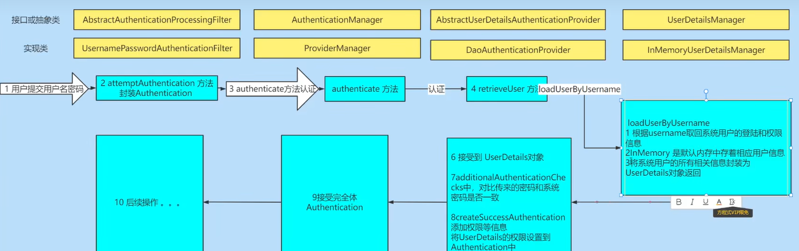
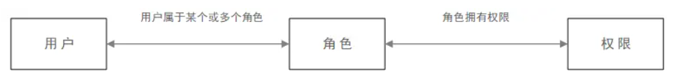

## 1. 认证方式介绍

### 1.1 Cookie和Session是什么

* Cookie

  服务器创建Cookie(一个Cookie包含一个键值对&有效时间&有效路径), 然后放到响应头中, 浏览器接收到响应后会保存并管理Cookie, 再次访问同一个服务器时的同一个端口时会在请求头中携带相应的Cookie
* Session

  由于Http协议无状态, 所以在第一次访问TomCat等Servlet容器时, 容器会创建键值为JSESSIONID的Cookie, Servlet容器通过这个JSESSIONID对应内存中一个Session对象, Session对象存储会话相关数据, 30min/浏览器关闭后Session对象失效

### 1.2 基于Cookie的认证方式

服务器在认证成功后发送cookie并自己在数据库中存储一份该cookie和具体用户映射关系, 以后用户用户每次访问可以根据cookie进行授权

由于Cookie完全由浏览器保存并进行过期删除, 所以这种方式不安全

### 1.3 基于JWT的认证方式

JWT(Java Web Token)方式: 服务器在用户认证后发送给浏览器JWT, JWT包含用户id和过期时间, 采用加密算法加密. 用户每次访问需要携带JWT, 服务器只需要根据加密算法验证signature即可

JWT由三个部分组成：base64UrlEncode(header).base64UrlEncode(payload).signature

* header = 存储元数据的JSON字符串
  ```js
  {
    "alg": "HS256",
    "typ": "JWT"
  }
  ```
* payload = 自定义的数据的JSON字符串
  ```js
  {
      "iss": "admin",          //该JWT的签发者
      "iat": 1535967430,        //签发时间
      "exp": 1535974630,        //过期时间
      "nbf": 1535967430,         //该时间之前不接收处理该Token
      "sub": "www.admin.com",   //面向的用户
      "jti": "9f10e796726e332cec401c569969e13e"   //该Token唯一标识
  }
  ```
* signature = 通过加密算法生成的字符串
  ```js
  HMACSHA256(
    base64UrlEncode(header) + "." +
    base64UrlEncode(payload),
    123456
  )
  ```

> Base64是一种二进制到文本的编码方式。如果要更具体一点的话，可以认为它是一种将 `byte`数组编码为ASCII字符串的方法，从而将ASCII中不可见字符去除便于网络传输。

# 2. 工具包

## 2. 1Jwt

```xml
        <!--JWT(Json Web Token)-->
        <dependency>
            <groupId>io.jsonwebtoken</groupId>
            <artifactId>jjwt</artifactId>
            <version>0.9.0</version>
        </dependency>
```

使用Map创建Jwt字符串

```java
    private String generateJwt(Map<String, Object> claims) {
        return Jwts
                .builder()
                .setClaims(claims)
                .setExpiration(new Date(System.currentTimeMillis() + expirationSeconds * 1000))
                .signWith(SignatureAlgorithm.HS512, secret)
                .compact();
    }
```

解析Jwt字符串

```java
      Claims  claims = Jwts.parser()
                    .setSigningKey(secret)
                    .parseClaimsJws(jwt)
                    .getBody();
```

# 3. Spring Security + JWT

## 3.1 Security原理

```xml
        <!--SpringSecurity-->
        <dependency>
            <groupId>org.springframework.boot</groupId>
            <artifactId>spring-boot-starter-security</artifactId>
        </dependency>
```

Spring security 使用多个Servlet过滤器形成一个过滤器链, 拦截请求并进行认证和鉴权.

Filter在拦截到特定请求后, 会调用**AuthenticationManager**认证方法, 认证过程中调用**UserDetailsService**获取用户信息对象**UserDetails,** 密码校验成功后封装成**Authentication**



默认的UserDetailsService从内存中获取账号信息, 默认的认证异常处理方式是重定向到登录表单

默认的认证成功的Authentication会存储到Session域中

## 3.2 自定义jwt认证授权

### 3.2.1 配置类

```java
@Configuration
@EnableWebSecurity//开启Spring Security
@EnableGlobalMethodSecurity(prePostEnabled = true)// 开启方法鉴权
public class SpringSecurityConfig extends WebSecurityConfigurerAdapter {
    //数据库服务
    @Resource
    private UmsAdminService umsAdminService;
    //自定义的认证鉴权异常处理类
    @Resource
    private RestfulAuthenticationEntryPoint entryPoint;
    @Resource
    private RestfulAccessDeniedHandler deniedHandler;

    //配置密码编码器, 便于注册服务和登录服务使用
    @Bean
    public PasswordEncoder passwordEncoder() {
        return new BCryptPasswordEncoder();
    }

    //自定义的Filter, 用于根据请求头中的jwt进行认证
    @Bean
    public JwtFilter jwtFilter() {
        return new JwtFilter();
    }

    //security配置
    @Override
    protected void configure(HttpSecurity http) throws Exception {
        http
                // 添加jwt认证过滤器
                .addFilterBefore(jwtFilter(), UsernamePasswordAuthenticationFilter.class)
                // 由于使用jwt, 所以关闭session, csrf, 允许cors
                .cors().and().sessionManagement().sessionCreationPolicy(SessionCreationPolicy.STATELESS).and().csrf().disable()
                // 资源的访问控制
                .authorizeRequests().antMatchers("/admin/**").permitAll()
                // 允许跨域预请求
                .antMatchers(HttpMethod.OPTIONS).permitAll()
                //// 允许静态资源
                .antMatchers(HttpMethod.GET, "/", "/**/*.html", "/**/*.css", "/**/*.js", "/**/*.ico", "/swagger-ui/**", "/swagger-resources/**", "/v3/**").permitAll().anyRequest().authenticated();
        //异常处理
        http.exceptionHandling().accessDeniedHandler(deniedHandler).authenticationEntryPoint(entryPoint);
    }

    //配置UserDetailsService, 自定义认证过程中如何获取用户信息
    @Bean
    public UserDetailsService userDetailsService() {
        return new UserDetailsService() {
            @Override
            public UserDetails loadUserByUsername(String username) throws UsernameNotFoundException {
                UmsAdmin adminByUsername = umsAdminService.getAdminByUsername(username);
                if (adminByUsername == null) {
                    throw new UsernameNotFoundException("用户名错误");
                }
                //返回自定义的UserDetail实现类
                return new AdminUserDetail(adminByUsername, umsAdminService.getPermissions(adminByUsername.getId()));
            }
        };
    }
}
```

### 3.2.2 自定义登录注册接口

**注册**要使用SpringSecurity提供的密码编码器加密密码后再存入数据库, 避免明文存储密码

```java
        //将密码进行加密操作
        String encodedPassword = passwordEncoder.encode(umsAdmin.getPassword());
        umsAdmin.setPassword(encodedPassword);
        umsAdminMapper.insert(umsAdmin);
```

**登录**成功返回Jwt

调用自定义的UserDetailsService的loadUserByUsername()方法获取数据库的用户信息, 验证密码时需要使用密码编码器

```java
    @Override
    public String longIn(String username, String password) {
        String token = null;
        try {
            UserDetails userDetails = userDetailsService.loadUserByUsername(username);
            if (!passwordEncoder.matches(password, userDetails.getPassword())) {
                throw new Exception("用户名或密码不正确");
            }
            token = jwtTokenUtil.generateToken(userDetails);
        } catch (Exception e) {
            e.printStackTrace();
        }
        return token;
    }
```

### 3.2.3 实现UserDetails接口

```java
public class AdminUserDetail implements UserDetails {
    private UmsAdmin umsAdmin;
    private List<UmsPermission> permissions;

    public AdminUserDetail(UmsAdmin umsAdmin, List<UmsPermission> permissions) {
        this.umsAdmin = umsAdmin;
        this.permissions = permissions;
    }

    @Override
    public Collection<? extends GrantedAuthority> getAuthorities() {
        return permissions.stream()
                .filter(p -> p.getValue() != null)
                .map(p -> new SimpleGrantedAuthority(p.getValue()))
                .collect(Collectors.toList());
    }
    //...
}
```

### 3.2.4  添加JwtFilter

添加JwtFilter实现获取请求头中的jwt并认证, 认证成功将Authentication存入SecurityContext

```java
public class JwtFilter extends OncePerRequestFilter {
    @Value("${jwt.httpHeaderKeyName}")
    private String jwtHttpHeaderKeyName;
    @Resource
    private UserDetailsService userDetailsService;
    @Resource
    private JwtUtil jwtUtil;

    @Override
    protected void doFilterInternal(HttpServletRequest request, HttpServletResponse response, FilterChain filterChain) throws ServletException, IOException {
        String jwtString = null;
        try {
            jwtString = request.getHeader(jwtHttpHeaderKeyName);
        }catch (Exception e){
            //认证失败
            filterChain.doFilter(request, response);
            return;
        }
        if (jwtString != null) {
            String username = jwtUtil.getUserNameFrom(jwtString);
            if (username != null) {
                //获取认证&权限信息, 存入SecurityContext中
                UserDetails userDetails = userDetailsService.loadUserByUsername(username);
                if (jwtUtil.validateToken(jwtString, userDetails)) {
                    //UsernamePasswordAuthenticationToken是Authentication实现类
                    UsernamePasswordAuthenticationToken token = new UsernamePasswordAuthenticationToken(userDetails, null, userDetails.getAuthorities());
                    SecurityContextHolder.getContext().setAuthentication(token);
                }
            }
        }
        filterChain.doFilter(request, response);
    }
}
```

### 3.2.5 声明方法鉴权

使用 `@PreAuthorize` 可以验证SecurityContext中的Authentication是否有权限

```java
    @GetMapping("/test")
    @ApiOperation("测试接口")
    @PreAuthorize("hasAuthority('test')")
    public String test(){
        log.debug("hello, world");
        return "hello, world!";
    }
```

`@PreAuthorize` 中的方法还支持自定义

### 3.2.6 认证鉴权异常处理类

当Filter链走完时还没有认证信息会报认证异常, 访问的方法没有权限会报鉴权异常, 自定义处理类可以返回前端提示信息或选择重定向到特定网页

```java
// 配置认证失败处理类
@Component
public class RestfulAuthenticationEntryPoint implements AuthenticationEntryPoint {
    @Override
    public void commence(HttpServletRequest request, HttpServletResponse response, AuthenticationException authException) throws IOException, ServletException {
        response.setCharacterEncoding("UTF-8");
        response.setContentType("application/json");
        response.getWriter().println(JSONUtil.parse(Result.authenticationFail(authException)));
        response.getWriter().flush();
    }
}

//配置鉴权失败处理类
@Component
public class RestfulAccessDeniedHandler implements AccessDeniedHandler {
    @Override
    public void handle(HttpServletRequest request, HttpServletResponse response, AccessDeniedException accessDeniedException) throws IOException, ServletException {
        response.setCharacterEncoding("UTF-8");
        response.setContentType("application/json");
        response.getWriter().println(JSONUtil.parse(Result.authenrizationFail(accessDeniedException)));
        response.getWriter().flush();
    }
}
```

## 3.3 RBAC

Role based access control 是一种权限控制方法



这种权限控制方法易扩展和修改
