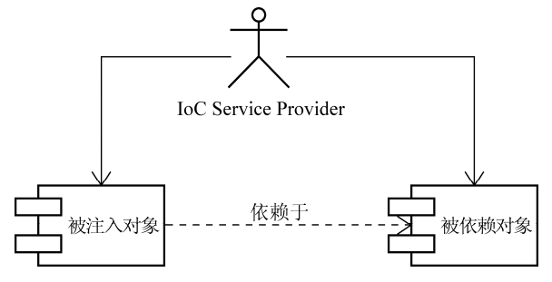
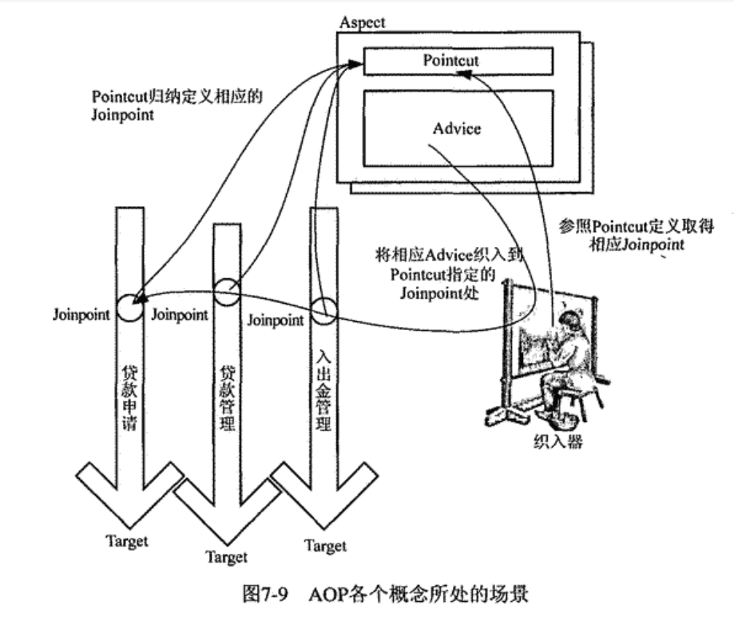
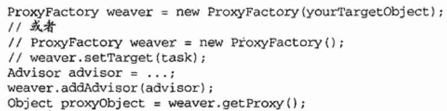
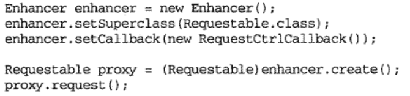
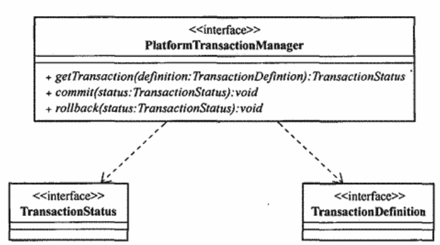

# 1. IOC

## 1. IOC 介绍

_IOC 是什么?_

```
由IOC容器关联对象之间的依赖关系, 解耦业务对象
```



_IOC 容器注入依赖对象的方式有哪些?_

```
* 构造器注入

* setter方法注入

tip: spring框架中使用反射注入
```

_SpringIOC 容器继承关系?_

```
* BeanFactory是spring中最基础的ioc容器

* ApplicationContext继承自 BeanFactory, 实现了额外的功能
```

## 2. Bean

_什么是 Bean?_

```
被Spring IOC 容器管理的对象称为Bean
```

_Spring 是如何获取一个 Bean 的依赖信息的?(Spring 如何注册一个 Bean?)_

```
1. 读取配置文件或通过反射(包扫描的方式)读取Bean的依赖信息为BeanDefinition

2. 使用所有依赖信息构造BeanDefinitionRegistry

tip: 使用@ComponentScan注解或在配置文件中添加<<context:component-scan>开启包扫描
```

_BeanFactory 和 FactoryBean 两个接口的区别?_

```
>> BeanFactory: 所有IOC容器的基接口, 提供基本的IOC功能

>> FactoryBean: 注册实现了该FactoryBean的类时, 会间接注册另一个Bean
```

_第三方包中的类如何注册为 Bean?_

```
* spring中使用FacotoryBean

* springboot中使用@Bean注解
```

_Bean 的 Scope 有哪些?_

```
>> singleton(默认scope): 每次从容器中获取的bean是同一个对象

>> prototype: 每次从容器中获取的bean是新的对象
```

## 3. Bean 的生命周期

_讲一下 bean 的生命周期?_

```
1. 通过反射调用构造函数实例化对象(Instantiation)

2. 依赖注入

3. 初始化: 该阶段可以进行数据库连接等操作

4. 使用和销毁
```

_如何在 BeanFacotry 实例化后执行回调?_

```
往容器中注册BeanFactoryPostProcessor的子类, 重写方法会被视作回调函数

tip: 常见的应用是在回调中替换注册信息中的占位符, 例如PropertySourcesPlaceholderConfigurer
```

_Spring 提供了许多 XxxAware 接口, 这些接口作用是什么?_

```
用于特殊依赖的注入

例如: BeanNameAware, BeanFactoryAware, ApplicationContextAware
```

_如何在 Bean 实例阶段和初始化阶段前后添加回调?_

```
* 实例化阶段
>> 实现InstantionAwareBeanPostProcessor中的两个方法

* 初始化阶段
>> 实现BeanPostProcessor中的两个方法
```

_Bean 的 init 方法和 destory 方法会在什么时候执行?_

```
init()和destory()分别在使用Bean前后执行

tip: 使用@PostConstruct 和 @PreDestory可以标注这个方法, 也可以在配置文件中配置
```

_懒加载和预加载 Bean 的区别?_

```
Bean为懒加载时, 会在getBean()时才会开始生命周期, 预加载Bean则会在容器启动时就开始

tip1: 默认为预加载, 使用@Lazy注解指定Bean懒加载
```

## 4. ApplicationContext

_ApplicationContext 除了作为 IOC 容器还有哪些功能?_

```
* 资源加载
applicationContext.getResource("url")

* 国际化支持
applicationContext.getMessage("key", null, Locale.CHINA)

* 容器事件支持
>> 通过applicationContext.publishEvent()发布事件, 实现了ApplicationListener的Bean会监听事件

tip1: 使用国际化支持时需要先往容器中注册MessageSource
tip2: 可以使用注解@EventListener标注Bean的方法作为监听事件发生时的回调

```

_JAVA SE 如何提供国际化支持?_

```java
// 使用ResourceBundle+配置文件实现
ResourceBundle resourceBundle = ResourceBundle.getBundle("baseName", Locale.CHINA);
resourceBundle.getString(key) // 返回baseName_zh_CN.properties文件中的键值对的值
```

## 5. 基于注解的开发

_如何开启 Spring 的注解开发?_

```
在 spring 配置文件中加入<context:component-scan>

tip: springboot默认开启包扫描, 不用额外配置
```

_@Autowired 和 @Resource 的区别?_

```
* @Autowired 优先使用ByType的方式注入

* @Resource("beanID") 优先使用byID的方式注入

tip1: 可以使用@Qualifier指明beanId
tip2: 当需要注入的类型为 Collection 时, 会将容器内所有符合要求的类型都注入到容器中
```

_哪些 Spring 注解的作用是注册 Bean?_

```
* 类注解: @Component @Service @Controller @Mapper @Configuration

* 方法注解: @Bean
```

_Spring 中@Import 注解的作用?_

```
当Spring扫描到Bean被@Import及其子注解标注时, 会注册Import注解参数中的类作为Bean

tip: @Import常见的应用为@EnableXxx注解
```

# 2. AOP

## 1. AOP 理论

**_AOP 中的各种概念的含义?_**

```
joinpoint: 可以切入的点
pointcut: 对一类可以切入的点的描述
advice: 需要切入的逻辑
aspect: 对pointcut和advice的模块化封装
wave: 切入的过程
waver: 执行切入过程的角色
target: 被切入的对象
```



**_Advice 有哪些类型?_**

```
Before Advice: 方法执行前的通知
After Returning Advice
After Throwing Advice
After Advice: 方法执行后的通知, 不论方法是否抛异常还是执行成功返回值
Around Advice
```

**_Java 中实现 AOP 常见的方法?_**

```
使用JDK动态代理
使用CGLIB等动态字节码增强库实现动态代理
```

**_Aop 具体应用场景有哪些?_**

```
* 日志/系统监控: 将方法的调用情况记录下来
* 缓存
* 事务管理
* 访问控制: 如果没有权限则拒绝访问
* 异常处理: 当发生uncheckedException时通知管理员
```

## 2. SpringAop 原理

SpringAop 采用动态代理的方式在代理对象中织入切面, 如果被代理对象实现类接口采用 JDK 动态代理, 否则采用 CGLIB 库实现动态代理

具体代理代码如下



**_JDK 动态代理如何实现?_**

```
关键方法Proxy.newProxyInstance(), 关键类InvocationHandler
!!!JDK通过动态代理生成的代理对象和被代理对象必须实现同样的接口
```

```java
public static void main(String[] args) {
    Subject subject = new Subject();
// JDK生成的代理对象会赋值给接口
ISubject iSubject = (ISubject) Proxy.newProxyInstance(ClassLoader.getSystemClassLoader(),
Subject.class.getInterfaces(), new MyInvocationHandler(subject));
iSubject.hello();
}
static class MyInvocationHandler implements InvocationHandler {
    private Object target;
    public MyInvocationHandler(Object target) {
        this.target = target;
}
    @Override
public Object invoke(Object proxy, Method method, Object[] args) throws Throwable {
        System.out.println("前置通知");
Object ret = method.invoke(target, args);
System.out.println("后置通知");
        return ret;
}
}
```

**_CGLIB 动态代理如何实现?_**

```
通过Enhancer生成一个类的子类对象(代理对象), 重写了非final方法用来织入切面
```



## 3. SpringAOP 使用

1. 将一个 POJO 声明一个为一个 Aspect
2. 开启 `@EnableAspectJAutoProxy`

```java
@Component
@Aspect
public class MyAspect {
    @Pointcut("execution(void spider.myspr.aop.Test.hello())")
    public void onMethodExecution() {}

    @Before("onMethodExecution()")
    public void beforeAdvice() {
        System.out.println("i will say hello");
    }

    @After("onMethodExecution()")
    public void afterAdvice() {
        System.out.println("i have said hello");
    }
}
```

**_@EnableAspectJAutoProxy 的作用?_**

```
开启自动代理, 会往容器中注册一个AnnotationAwareAspectJAutoProxyCreator(是一个BeanPostProcessor)用于自动识别带@Aspect的bean并为Aspect类中描述的需要代理的对象生成代理对象, 也可以注册XxxAdvisor, 根据XxxAdvisor中描述的对象生成代理对象
```

**_Aop 失效的场景?_**

```
* target对象中需要代理的方法是final方法, 会导致代理对象无法重写该方法, aop失效
* target对象中需要代理的方法A的方法体中调用了target对象中另一个需要代理的方法B, 在代理对象中调用A()会使得B()的通知失效
```

## 4. 三级缓存机制

**_什么是三级缓存?_**

```
singletonObjects: 缓存初始化完成后的bean对象
earlySingletonObjects: 缓存提前进行AOP织入后的代理对象
singletonFactories: 缓存bean的ObjectFactory对象
```

**_为什么是三级而不是二级缓存?_**

如果只有循环依赖问题理论只需要二级缓存就可以解决, 引入 `earlySingtonObjects`的作用是缓存早期代理对象


# 3. 事务管理

## 1. Spring 事务基本盖帘

**_事务的 ACID 特性指什么?_**

```
* 原子性: 如果事务执行失败则回滚
* 一致性: 事务前后数据库的完整性没有被破坏
* 隔离性: 事务并发执行时可以保证不同执行顺序不影响最终的数据(通过事务的隔离级别实现)
* 持久性: 事务对数据库的修改是永久的
```

**_事务的隔离级别有哪些?_**

```
Isolation.READ_UNCOMMITTED : 事务期间其他事务写入的未提交的数据也有效-脏读问题

Isolation.READ_COMMITTED :  事务期间其他事务写入的提交后的数据有效-不可重复读问题

Isolation.REPEATABLE_READ: 事务期间不允许其他事务对同一个数据进行修改提交(增删可以提交)-幻读问题

Isolation.SERIALIZABLE : 事务期间不允许其他事务对同一个数据进行增删改提交-性能问题
```

**_事务的传播行为指什么? 有哪些传播行为?_**

在一个@Transactional 方法 A 内部调用了另一个@Transactional 方法 B 时, B 方法的行为为传播行为

```
Propagation.REQUIRED: 当前没有事务新建事务, 当前有事务则加入
Propagation.SUPPORTS: 不新建事务, 当前有事务则加入

Propagation.REQUIRES_NEW: 新建一个事务, 如果之前有事务则挂起
Propagation.NESTED: 新建一个嵌套事务(嵌套事务失败时, 外层事务也失败)
Propagation.NOT_SUPPORTED: 不新建事务, 如果之前有事务则挂起


Propagation.MANDATORY: 方法执行前必须有一个事务, 否则抛异常
Propagation.NEVER: 方法执行前必须没有一个事务, 否则抛异常
```

## 2. Spring 事务管理架构

**_spring 事务管理中重要的类以及类的作用?_**

```
TransactionDefinition: 包含事务的隔离级别, 传播行为, 超时时间等事务定义信息
TransactionStatus: 事务状态
PlatformTransactionManager: 负责管理与线程绑定的连接上下文(jdbc中是Connection对象), 隔离了不同连接技术事务管理api的差异从而提供了统一的接口(不同的数据库连接技术对应不同的实现类, 如JDBC对应DataSourceTransactionManager)
```



## 3. 声明式事务

**_声明式事务管理实现原理?_**

```
包含被@Transactional标注的方法的对象, 会通过aop在方法执行前使用PlatformTransactionManager获取与当前线程绑定的数据库连接上下文(在jdbc中是Connection)并开启事务, 在方法内部所有dao与数据库连接都使用同一个连接上下文, 当方法结束时, PlatformTransactionManager根据是否抛出特定异常决定是否回滚事务, 最后关闭连接上下文并与当前线程解绑
```

**_声明式事务什么情况下会失效?_**

```
* 事务方法为final方法(aop失效)
* 事务方法被同一个对象里的其他方法调用时(aop失效)
* 事务方法为private方法时(spring规定的)
```

**_编程式事务如何使用?适用情况?_**

编程式事务适合多线程情况下

```java
PlatformTransactionManager transactionManager = ...;  // 根据具体数据库技术获取相应的txmanager
DefaultTransactionDefinition txDef = new DefaultTransactionDefinition();
txDef.setPropagationBehavior(TransactionDefinition.PROPAGATION_REQUIRED);
// 获取事务状态
TransactionStatus txStatus = transactionManager.getTransaction(txDef);
        try {
            // 在此执行涉及数据库或其他资源的操作

            // 操作成功完成后，提交事务
            transactionManager.commit(txStatus);
        } catch (Exception ex) {
            // 发生异常时，回滚事务
            transactionManager.rollback(txStatus);
            throw ex;
        }
```

# 4. SpringMVC

## 1. 框架原理

**_Springmvc 基本组件有哪些, 各自的作用?_**


```
DispatherServlet: 是一个Servlet, 拦截了所有请求, 并统一分发给特定的Handler(HandlerAdpater将Controller适配为Handler)

HandlerMapping: 负责请求到Handler的映射, 返回处理链(包含Handler和拦截器以及异常处理器)

Handler: 处理请求并返回ModelAndView

ViewResolver: 接受ModelAndView, 返回View, View的输出流写入响应体
```

**_讲一下 Springmvc 处理链中的拦截器和异常解析器?_**

```
拦截器:  在Handler处理请求前,后以及视图渲染完这三个时刻进行拦截

异常解析器: 处理器链中抛出了异常时异常解析器处理并返回默认的ModelAndView
```


## 2. 基于注解的开发

### 4.2.1 Controller

**_Controller 及其方法上常用的注解有哪些?_**

```
>> @Controller @RestController(标注所有方法均为@ResponseBody方法)

>> @RequestMapping @GetMapping @PostMapping

>> @ResponseBody(标注方法返回值不用视图解析器解析, 直接走JackSon序列化器序列化为响应体)
```

> 易踩坑点: Jackson 序列化对象时对象必须有 getter 方法

**_没有被 `@ResponseBody`标注的方法的返回类型可以是什么?_**

```
>> ModelAndView Model View

>> String (视图名称)
```

### 4.2.2 传递参数和依赖

**_Controller 的方法会自动注入依赖的参数类型有哪些?_**

```
>> HttpServletRequest/HttpServletResponse/HttpSession/WebRequest: Servlet的请求响应类

>> InputStream/OutputStream/Reader/Writer: 请求或响应IO流

>> Map/ModelMap/ModelAndView: 要返回的ModelView对象

>> BindingResult: 注入参数被验证框架验证的结果
```

**_query 参数/form 表单提交参数/multipart 参数如何绑定?_**

```
使用@RequestParam
```

**_如何绑定路径参数?_**

```
使用@PathVariable
```

**_请求体如何绑定为方法参数?_**

```
@RequestBody: 将请求体的JSON通过反序列化器映射为POJO
```

**_如何添加请求中不存在但需要的绑定参数?_**

```
实现HandlerMethodArgumentResolver子类, 并通过WebMvcConfigurer配置
```

## 3. MVC 配置

> Tips: SpringMVC 的配置类需要继承自 WebMvcConfigurer)

**_如何配置拦截器 `(HandlerInterceptor)`?_**

```
重写配置类的addInterceptors()
```

**_如何配置序列化器 `(HttpMessageConverters)`?_**

```
注册类型为HttpMessageConverters的Bean
```

**_如何配置参数解析器(`ArgumentResolvers`), 参数解析器的作用?_**

```
重写配置类的addArgumentResolvers(), 参数解析器可以自定义Controller方法的参数绑定逻辑
```

**_如何配置静态资源处理器(ResourceHandler)?_**

```
重写配置类的addResourceHandlers()
```

> !!! 易踩坑点: 在通过前端路由实现的单页面应用中, 资源处理器应当:
>
> -   对所有请求路径不匹配/static/\* 的请求, 返回 index.html;

**_如何处理跨域问题?_**

```
浏览器根据同源策略, XHR请求中的域名如果和当前域名不同, 会拦截该跨域请求; 服务器默认也会拦截跨域请求(除非配置了允许的跨域)
```

解决方法:

```
>> SpringMVC服务器通过配置类的addCorsMappings()方法配置服务器允许的跨域

>> 浏览器可以通过JsonP等技术绕开跨域限制, 也可以直接使用允许跨域的浏览器
```

# 5. SpringBoot

## 1. springboot 介绍

-   springboot 基于 spring 框架, 采用"约定大于配置"的方式简化了 spring 的配置(自动配置第三方依赖只需要一个 `spring-boot-starter-Xxx` jar 包)
-   `spring-boot-starter-web` 采用内嵌 tomcat 服务器
-   一个 springboot 应用的程序入口如下

```java
@SpringBootApplication
public class MyApplication {
    public static void main(String[] args) {
        ConfigurableApplicationContext context = SpringApplication.run(MysprApplication.class, args);
}
}
```

## 2. @SpringBootApplication

**_springboot 自动配置原理?_**

主启动类的注解 `@SpringBootApplication` 是一个组合注解, 其组成注解和作用包括

```
@SpringBootConfiguration: 启动类会被当做一个配置类注册
@ComponentScan: 进行包扫描, 注册bean(默认扫描启动类同包下的类)
@EnableAutoConfiguration: @Import导入EnableAutoConfigurationImportSelector
```

`EnableAutoConfigurationImportSelector` 这个类通过 `SpringFactoriesLoader`获取 `spring.factories` 文件中声明的配置类全类名列表, **并通过反射机制注册 bean 到容器中**

```java
List<String> configurations = SpringFactoriesLoader.loadFactoryNames(this.getSpringFactoriesLoaderFactoryClass(), this.getBeanClassLoader());
```

> !!! 易踩坑点: jar 包中的配置类无法通过包扫描注册

**_jar 包是什么, jar 包约定的目录结构是什么?_**

一个普通 java 程序被打包后形成的文件称为 jar 包, 可以通过 `java Xxx.jar`直接执行

jar 包约定目录结构

-   META-INF/
-   com/demo/...或资源文件夹

```
* META-INF下包含jar包元信息, 主要是清单文件（MANIFEST.MF），其中包含了关于JAR包的版本、作者、依赖等信息
* ClassLoader.getResourceAsStream/loadClass默认起始路径为jar包的根路径
```

使用 `springboot-maven-plugin`打包后的 jar 包, `org/...`下是 springboot 主程序, `BOOT-INF/lib`下包含依赖库的 jar 包使得打包后的 jar 包**可以直接独立运行**

> 易踩坑点: 如果打包后的 jar 包不直接包含依赖库的 jar 包, 需要运行的主机上 "jvm 的 classpath 变量/环境变量 CLASSPATH " 对应的路径下有依赖的 jar 包


## 3. 配置文件

**_springboot 如何导入配置文件中的属性值?_**

使用 `@PropertySource() `导入配置文件的所有属性, 使用 `@Value/@ConfigurationProperties(prefix = "")`注入

```java
@PropertySource("classpath:my_application.yml")
@Configuration
public class AppConfig {
}

//----------------------------------------

    @Value("${myapp.property}")
    private String myProperty;

//----------------------------------------

@Component
@ConfigurationProperties(prefix = "myapp")
// 如果这个类没有被@Component标记, 需要其他被注册的类
// 标注@EnableConfigurationProperties({MyProperties.class})
public class MyProperties {
    private String property;
}
```

**_多配置文件如何设置?_**

主配置文件 `application.yml`中设置 `spring.profiles.active: Xxx` 启用从配置文件 `application-Xxx.yml`
