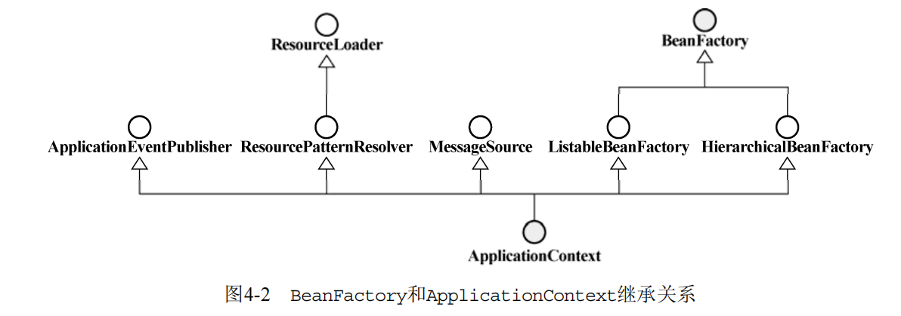
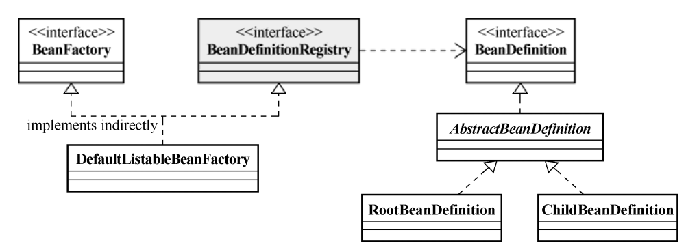
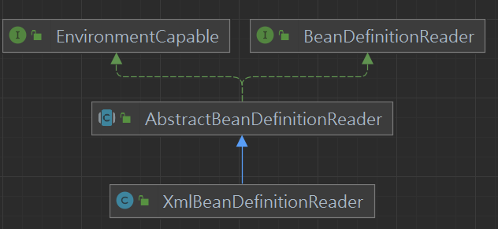
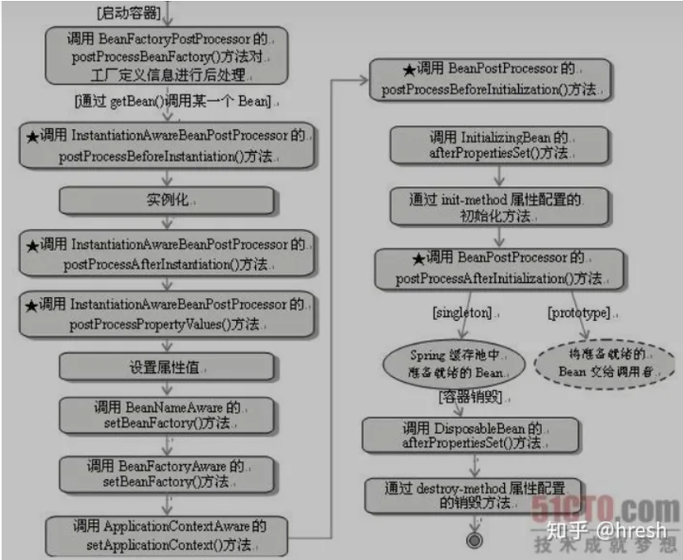
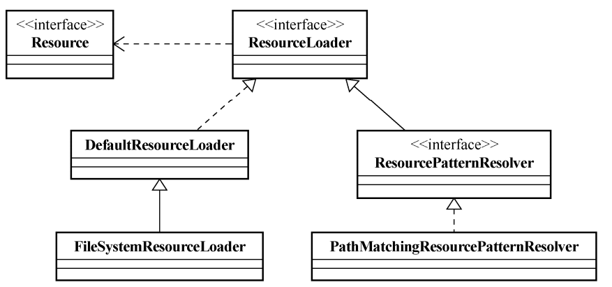
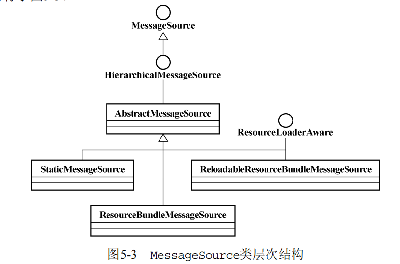
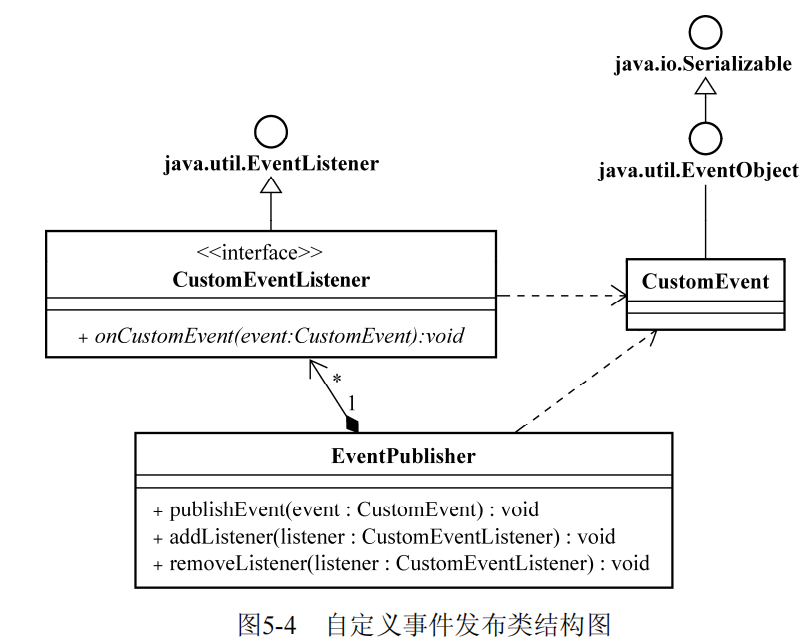

# 1. IOC

## 1.1 IOC介绍

***IOC是什么?***

```
在一个对象需要使用被依赖对象时, 由IOC Service Provider(通常指IOC容器)主动提供被依赖对象, 而不是对象自己取获取被依赖对象
好处: 解耦了业务对象之间的绑定关系
```


***IOC容器注入依赖的方式?***

```
1. 构造器注入
IOC容器负责管理被注入对象的构造过程, 会检查构造函数的参数列表并注入依赖
```

```
2. setter方法注入
IOC容器调用被注入对象的setter方法注入依赖
```

```
3. 接口注入(不提倡, 有侵入性代码)
被注入对象需要额外实现一个接口, 接口中包含注入依赖的方法, IOC容器调用注入依赖的方法实现依赖注入
```

***SpringIOC容器继承关系和对应的功能?***

* BeanFactory是spring中最基础的ioc容器(仅提供依赖管理和依赖注入服务)
* ApplicationContext继承自BeanFactory, 实现了额外的功能(如AOP, 事务管理)



## 1.2 Bean的注册和BeanFactory的构造

***Bean注册过程中的重要类有哪些?***

* BeanDefinition: 包含一个Bean的所有依赖信息, 用于BeanDefinitionRegistry的构造
* BeanDefinitionRegistry: 包含多个Bean的依赖信息



* AbstractBeanDefinitionReader: 从配置文件中读取出BeanDefinitionRegistry(如果使用xml配置文件则使用XmlBeanDefinitionReader)



***BeanFactory的构造方式?***

1. 通过代码注册Bean, 构造BeanFactory

```java
    public BeanDefinitionRegistry getBeanDefinitionRegistryByCode() {
        BeanDefinition myBeanDefinition = new RootBeanDefinition(MyBean.class);
        BeanDefinitionRegistry beanDefinitionRegistry = new SimpleBeanDefinitionRegistry();
        beanDefinitionRegistry.registerBeanDefinition("myBeanId", myBeanDefinition);
        return beanDefinitionRegistry;
    }
```

2. 通过AbstractBeanDefinitionReader读取spring配置文件, 构造BeanFactory

```java

    public BeanDefinitionRegistry getBeanDefinitionRegistryByConfigurationFile() {
        AbstractBeanDefinitionReader reader = new XmlBeanDefinitionReader(new SimpleBeanDefinitionRegistry());
        reader.loadBeanDefinitions(new ClassPathResource("spring-config.xml"));
        return reader.getRegistry();
    }
```

3. 通过注解+包扫描

```java
@Component
public class MyBean {
    @Resource
    String name;
}
```

!!!包扫描程序会扫描指定包下的类然后构造BeanFactory, 如果检查到特定注解, 则自动确定依赖关系

```
// spring中通过xml配置文件开启包扫描
<context:component-scan base-package="com.Xxx.Xxx"></context:component-scan>

// springboot中通过注解@ComponentScan开启包扫描
```

***第三方Bean如何注册?***

* springboot中使用@Bean注解

```java
@Configuration
public class SpringBootConfig {
    @Bean
    public MyBean getBean() {
        MyBean myBean = new MyBean();
        // 通过代码的方式注入依赖到myBean...
        return myBean;
    }
}
```

* 配置文件将FactoryBean的实现类作为注册对象(`FactoryBean被注册到IOC容器时, IOC容器会将getObject()的返回值注册为Bean, 该bean的id为注册FactoryBean时配置文件中指明的id`)

```java

public class MyFactoryBean implements FactoryBean {

    @Override
    public MyBean getObject() throws Exception {
        MyBean myBean = new MyBean();
        // 使用代码注入依赖...
        return myBean;
    }

    @Override
    public Class<?> getObjectType() {
        return MyBean.class;
    }

    @Override
    public boolean isSingleton() {
        return true;
    }
}
```

## 1.3 Bean的使用

* bean为其他bean对象注入依赖

```java
@Component
public class MyBean {
    @Resource
    AnotherBean b;
}
```

* 如果在非bean对象中需要使用bean, 使用 `ApplicationContextAware` 实现类获取ioc容器, 再调用 `getBean()`方法

```
ApplicationContextAware的实现类在被注册到ioc容器中时, 会调用其setApplicationContext(当前ioc容器)
```

```java
@Component
public class MyAppContext implements ApplicationContextAware {
    public ApplicationContext applicationContext;
    @Override
    public void setApplicationContext(ApplicationContext applicationContext) throws BeansException {
        this.applicationContext = applicationContext;
    }

    public ApplicationContext getApplicationContext() {
        return applicationContext;
    }
}
```

## 1.4 Bean的scope

***Bean的Scope有哪些, 具体作用?***

```
singleton(默认scope): 每次从容器中获取的bean是同一个对象
prototype: 每次从容器中获取的bean是新的对象

还有三个不常用且仅在WebApplicationContext中生效的scope:
request / session / global session
```

## 1.5 Bean的生命周期

***bean的生命周期?***

```
1. IOC容器启动
2. (getBean()方法调用时开始)时实例化(instantiation)
3. 属性注入(Populate properties)
4. 初始化(initialization)
5. 使用(in use)
6. 销毁(destory)
```



### 1.5.1 BeanFactoryPostProcessor

在BeanFactory启动后会调用 `postProcessBeanFactory()`方法

```java
@Component
public class MyPostProcessor implements BeanFactoryPostProcessor, Ordered {
    @Override
    public void postProcessBeanFactory(ConfigurableListableBeanFactory configurableListableBeanFactory) throws BeansException {
    }
    @Override
    public int getOrder() {
        return 0;
    }
}
```

***s**pring提供的常见的BeanFactoryPostProcessor有哪些?***

```
PropertySourcesPlaceholderConfigurer: 替换注册信息中属性值为${占位符}的属性为.properties文件中的值
```

### 1.5.2 XxxAware

实现了XxxAware接口的bean会在属性注入结束后调用XxxAware接口定义的方法保存依赖

```java
@Component
public class ApplicationCtxManager implements ApplicationContextAware {
    public ApplicationContext applicationContext;

    @Override
    public void setApplicationContext(ApplicationContext applicationContext) throws BeansException {
        this.applicationContext = applicationContext;
    }
}

```

### 1.5.3 BeanPostProcssor

包含两个方法, 分别在bean初始化前后调用, 将 `BeanPostProcssor`注册到 `ApplicationContext`中即可生效

```java
@Component
public class MyBeanProcessor implements BeanPostProcessor {
    @Override
    public Object postProcessAfterInitialization(Object bean, String beanName) throws BeansException {
        return bean;
    }

    @Override
    public Object postProcessBeforeInitialization(Object bean, String beanName) throws BeansException {
        return bean;
    }
}
```

### 1.5.4 init/destory方法

init()/destory()分别在bean初始化后, bean被销毁前调用

```java
@Component
public class MyBean {
    @PostConstruct
    public void init() {
        System.out.println("bean实例化完成");
    }

    @PreDestroy
    public void close() {
        System.out.println("bean即将被销毁");
    }
}
```

## 1.6 ApplicationContext的扩展功能

### 1.6.1 资源加载

**spring包下资源加载相关的重要类有哪些?**



```java
// ResourceLoader可以加载一个资源
public interface ResourceLoader {
    String CLASSPATH_URL_PREFIX = "classpath:";

    Resource getResource(String location);

    @Nullable
    ClassLoader getClassLoader();
}
// ResourcePatternResolver可以根据pattern加载多个资源
public interface ResourcePatternResolver extends ResourceLoader {
    String CLASSPATH_ALL_URL_PREFIX = "classpath*:";

    Resource[] getResources(String locationPattern) throws IOException;
}
```

!!! `ApplicationContext`实现了 `ResourcePatternResolver`接口, 可以进行资源加载

### 1.6.2 国际化支持

***JAVA SE如何提供国际化支持?***

```java
// 通过两个重要的类Locale和ResourceBundle实现
//Locale
        String lang = "en"; // 英文地区
        String country = "US"; // 美国
        Locale us = new Locale(lang, country);
        Locale myLocal = Locale.CHINA; // new Locale("zh", "CN")

//ResourceBundle
        String baseName = "baseName";
        ResourceBundle resourceBundle = ResourceBundle.getBundle(baseName, Locale.CHINA);
        String key = "greeting";
        // 读取classpath:baseName_zh_CN.properties文件中的greeting属性
        String greetingMsg = resourceBundle.getString(key);
```

***Spring的如何提供国际化支持?***

使用 `MessageSource`代替 `ResourceBundle`的作用



```java
@Component
public class MyClass implements MessageSourceAware {
    private MessageSource messageSource;
@Override
public void setMessageSource(MessageSource messageSource) { // 容器中需要先注册MessageSource
this.messageSource = messageSource;
}
    public void doSomething() {
        //获取key=greeting的值
String message = messageSource.getMessage("greeting", null, "Default Greeting", Locale.getDefault());
System.out.println(message);
}
}
```

!!! `ApplicationContext`实现了 ` MessageSource`接口

### 1.6.3 容器内事件处理

***JavaSE的事件监听机制?***



***Spring容器的事件机制?***

`ApplicationEvent ApplicationListener ApplicationEventPublisher`分别继承了JavaSE中对应的类

ApplicationContext继承了 `ApplicationEventPublisher` , 当注册Bean时会记录所有的 `ApplicationListener`, 调用 `publishEvent()`时会发布给记录的Listner

下面是一个自定义事件监听器和发布器示例:

```java
@Component
public class MyEventListener implements ApplicationListener<MyEvent> {
    @Override
    public void onApplicationEvent(MyEvent event) {
        System.out.println("监听到我的自定义事件触发了, 时间触发时间:" +
                new SimpleDateFormat("yyyy-MM-dd HH:mm:ss").format(new Date(event.getTimestamp())));
    }
}
```

```java
@Component
public class MyEventPublisher implements ApplicationEventPublisherAware {
    public ApplicationEventPublisher evtPublisher;
    @Override
    public void setApplicationEventPublisher(ApplicationEventPublisher applicationEventPublisher) {
        this.evtPublisher = applicationEventPublisher;
    }

    public void publish(MyEvent event){
        this.evtPublisher.publishEvent(event);
    }
}
```

## 1.7 基于注解开发

在sprin配置文件中加入 `<context:component-scan>` 开启包扫描, 会扫描指定包下的所有类, **同时往容器中注册注解处理相关的BeanPostProcessor**

**@Autowired @Resource**

```
两者均可用于属性和方法上, 用于注入属性值(依靠反射机制)/方法参数/构造器参数
@Autowired默认ByType, 冲突时采用ByName
@Resource("beanId")默认byName, 没提供id使用ByType, 可以使用@Qualifier指明beanId
```

> !!! 当需要注入的字段类型为List/Map类型时, 会将容器内所有符合要求的类型都注入到List/Map(key为beanId)中

**@Component @Lazy**

```
@Component用于类上表明这是一个需要注册的bean, 可以使用带语义的@Service, @Controller...实现同样的效果

@Lazy指明一个bean是否懒加载(默认true, @Lazy(false)预加载)
```

**@Configuration @Bean**

```
@Configuration标注的类作为配置类(Configuration类会被注册到ioc容器中)(相当于一个xml配置文件)

@Bean标注的方法返回对象会被注册为Bean
```

**@Import**

```
如果一个被注册到ioc容器的中bean, bean.getClass().getAnnotations()包含@Import, 那么ioc容器会注册value中指明的class作为bean
```

@Import常常用于自定义的注解@EnableXxx, 用来手动注册模块(一个模块中包含多个需要注册的类)

```java
@Import({Blue.class, Red.class})
public @interface EnableColor {
}
```

# 2. AOP

## 2.1 AOP介绍

***AOP中的各种概念的含义?***

```
joinpoint: 可以切入的点
pointcut: 对一类可以切入的点的描述
advice: 需要切入的逻辑
aspect: 对pointcut和advice的模块化封装
wave: 切入的过程
waver: 执行切入过程的角色
target: 被切入的对象
```


***Advice有哪些类型?***

```
Before Advice: 方法执行前的通知
After Returning Advice
After Throwing Advice
After Advice: 方法执行后的通知, 不论方法是否抛异常还是执行成功返回值
Around Advice
```

***Java中实现AOP常见的方法?***

```
使用JDK动态代理
使用CGLIB等动态字节码增强库实现动态代理
自定义类加载器: 类加载器在加载类时织入逻辑
直接生成java源码: 将要织入的逻辑代码直接生成到源码文件中
```

***Aop具体应用场景有哪些?***

```
* 日志/系统监控: 将方法的调用情况记录下来
* 缓存
* 事务管理
* 访问控制: 如果没有权限则拒绝访问
* 异常处理: 当发生uncheckedException时通知管理员
```

## 2.2 SpringAop原理

SpringAop采用动态代理的方式在代理对象中织入切面, 如果被代理对象实现类接口采用JDK动态代理, 否则采用CGLIB库实现动态代理

具体代理代码如下


***JDK动态代理如何实现?***

```
关键方法Proxy.newProxyInstance(), 关键类InvocationHandler
!!!JDK通过动态代理生成的代理对象和被代理对象必须实现同样的接口
```

```java
public static void main(String[] args) {
    Subject subject = new Subject();
// JDK生成的代理对象会赋值给接口
ISubject iSubject = (ISubject) Proxy.newProxyInstance(ClassLoader.getSystemClassLoader(),
Subject.class.getInterfaces(), new MyInvocationHandler(subject));
iSubject.hello();
}
static class MyInvocationHandler implements InvocationHandler {
    private Object target;
    public MyInvocationHandler(Object target) {
        this.target = target;
}
    @Override
public Object invoke(Object proxy, Method method, Object[] args) throws Throwable {
        System.out.println("前置通知");
Object ret = method.invoke(target, args);
System.out.println("后置通知");
        return ret;
}
}
```

***CGLIB动态代理如何实现?***

```
通过Enhancer生成一个类的子类对象(代理对象), 重写了非final方法用来织入切面 
```


## 2.3 SpringAOP使用

1. 将一个POJO声明一个为一个Aspect
2. 开启 `@EnableAspectJAutoProxy`

```java
@Component
@Aspect
public class MyAspect {
    @Pointcut("execution(void spider.myspr.aop.Test.hello())")
    public void onMethodExecution() {}

    @Before("onMethodExecution()")
    public void beforeAdvice() {
        System.out.println("i will say hello");
    }

    @After("onMethodExecution()")
    public void afterAdvice() {
        System.out.println("i have said hello");
    }
}
```

***@EnableAspectJAutoProxy的作用?***

```
开启自动代理, 会往容器中注册一个AnnotationAwareAspectJAutoProxyCreator(是一个BeanPostProcessor)用于自动识别带@Aspect的bean并为Aspect类中描述的需要代理的对象生成代理对象, 也可以注册XxxAdvisor, 根据XxxAdvisor中描述的对象生成代理对象
```

***Aop失效的场景?***

```
* target对象中需要代理的方法是final方法, 会导致代理对象无法重写该方法, aop失效
* target对象中需要代理的方法A的方法体中调用了target对象中另一个需要代理的方法B, 在代理对象中调用A()会使得B()的通知失效
```

## 2.4 AOP和三级缓存机制

***什么是三级缓存?***

```
singletonObjects: 缓存初始化完成后的bean对象
earlySingletonObjects: 缓存提前进行AOP织入后的代理对象
singletonFactories: 缓存bean的ObjectFactory对象
```

***为什么是三级而不是二级缓存?***

如果只有循环依赖问题理论只需要二级缓存就可以解决, 引入`earlySingtonObjects`的作用是缓存早期代理对象


# 3. 事务管理

## 3.1 事务中重要概念

***事务的ACID特性指什么?***

```
* 原子性: 如果事务执行失败则回滚
* 一致性: 事务前后数据库的完整性没有被破坏
* 隔离性: 事务并发执行时可以保证不同执行顺序不影响最终的数据(通过事务的隔离级别实现)
* 持久性: 事务对数据库的修改是永久的
```

***事务的隔离级别有哪些?***

```
Isolation.READ_UNCOMMITTED : 事务期间其他事务写入的未提交的数据也有效-脏读问题

Isolation.READ_COMMITTED :  事务期间其他事务写入的提交后的数据有效-不可重复读问题

Isolation.REPEATABLE_READ: 事务期间不允许其他事务对同一个数据进行修改提交(增删可以提交)-幻读问题

Isolation.SERIALIZABLE : 事务期间不允许其他事务对同一个数据进行增删改提交-性能问题
```

***事务的传播行为指什么? 有哪些传播行为?***

在一个@Transactional方法A内部调用了另一个@Transactional方法B时, B方法的行为为传播行为

```
Propagation.REQUIRED: 当前没有事务新建事务, 当前有事务则加入
Propagation.SUPPORTS: 不新建事务, 当前有事务则加入

Propagation.REQUIRES_NEW: 新建一个事务, 如果之前有事务则挂起
Propagation.NESTED: 新建一个嵌套事务(嵌套事务失败时, 外层事务也失败)
Propagation.NOT_SUPPORTED: 不新建事务, 如果之前有事务则挂起


Propagation.MANDATORY: 方法执行前必须有一个事务, 否则抛异常
Propagation.NEVER: 方法执行前必须没有一个事务, 否则抛异常
```

## 3.2 Spring事务管理架构

***spring事务管理中重要的类以及类的作用?***

```
TransactionDefinition: 包含事务的隔离级别, 传播行为, 超时时间等事务定义信息
TransactionStatus: 事务状态
PlatformTransactionManager: 负责管理与线程绑定的连接上下文(jdbc中是Connection对象), 隔离了不同连接技术事务管理api的差异从而提供了统一的接口(不同的数据库连接技术对应不同的实现类, 如JDBC对应DataSourceTransactionManager)
```


## 3.3 声明式事务和编程式事务

***声明式事务管理实现原理?***

```
包含被@Transactional标注的方法的对象, 会通过aop在方法执行前使用PlatformTransactionManager获取与当前线程绑定的数据库连接上下文(在jdbc中是Connection)并开启事务, 在方法内部所有dao与数据库连接都使用同一个连接上下文, 当方法结束时, PlatformTransactionManager根据是否抛出特定异常决定是否回滚事务, 最后关闭连接上下文并与当前线程解绑
```

***声明式事务什么情况下会失效?***

```
* 事务方法为final方法(aop失效)
* 事务方法被同一个对象里的其他方法调用时(aop失效)
* 事务方法为private方法时(spring规定的)
```

***编程式事务如何使用?适用情况?***

编程式事务适合多线程情况下

```java
PlatformTransactionManager transactionManager = ...;  // 根据具体数据库技术获取相应的txmanager
DefaultTransactionDefinition txDef = new DefaultTransactionDefinition();
txDef.setPropagationBehavior(TransactionDefinition.PROPAGATION_REQUIRED);
// 获取事务状态
TransactionStatus txStatus = transactionManager.getTransaction(txDef);
        try {
            // 在此执行涉及数据库或其他资源的操作
  
            // 操作成功完成后，提交事务
            transactionManager.commit(txStatus);
        } catch (Exception ex) {
            // 发生异常时，回滚事务
            transactionManager.rollback(txStatus);
            throw ex;
        }
```

# 4. SpringMVC

## 4.1 原理图和重要Bean

***springmvc基本组件有哪些, 各自的作用?***


```
DispatherServlet: 是一个Servlet, 拦截了所有请求, 并统一分发给特定的Handler(Controller的HandlerAdpater是Handler的一种)

HandlerMapping: 负责url到Handler的映射, 返回HandlerExecutionChain(包含Handler和HandlerInterceptor)

HandlerAdpater: 处理请求并返回ModelAndView

ViewResolver: 接受ModelAndView, 返回View, View通过response对象的输出流将视图返回给前端(不同模板引擎会有不同的ViewResolver实现)
```

***Springmvc中其他次要组件和作用?***


```
MultipartReslover: 如果是文件上传请求, 会将HttpServletRequest封装为一个 MultipartHttpServletRequest

HandlerInterceptor(拦截器): 在Handler处理请求前,后以及视图渲染完这三个时刻进行拦截和处理

HandlerExceptionResolver: 如果Handler抛出了异常没有返回预期的ModelAndView, 有这个组件根据异常处理并返回ModelAndView(一般是404/默认请求失败视图)
```

## 4.2 注解开发

### 4.2.1 controller

***springmvc如何声明一个controller?***

```java
@Controller
public class TestController {
    @RequestMapping("/test")
    public ModelAndView test() {
        System.out.println("test success");
        ModelAndView modelAndView = new ModelAndView();
        modelAndView.addObject("obj", new Object());
        modelAndView.setViewName("test");
        return modelAndView;
    }
}
```

!!! 扩展的注解有 `@RestController, @ResponseBody(返回的对象不经过ViewResolver, 走序列化器, 默认序列化器为MappingJackson2HttpMessageConverter) @GetMapping, @PostMapping`

> 易踩坑点: JackSon序列化使用getter方法, 所以对象的属性必须包含getter方法

!!! @Controller生效原理: `RequestMappingHandlerMapping将url映射到被@Controller和@RequestMapping标注的方法上`

### 4.2.2 传递参数和依赖

***springmvc框架会给被映射的方法自动注入相关依赖的参数类型有哪些?***

```
HttpServletRequest/HttpServletResponse/HttpSession/WebRequest: 注入servlet技术的request/response/session对象/spring封装的request对象

InputStream/OutputStream/Reader/Writer: 注入request/response对应的io流

Map/ModelMap/ModelAndView/String(视图名称): 注入Handler将要返回的ModelView对象

BindingResult: 注入参数验证结果
```

***query参数或路径参数如何映射到方法参数?***

```
如果方法参数类型是基本类型+String, 默认将与方法的参数名同名的参数绑定, 除非使用@RequestParam指定query参数名或路径参数名(扩展注解: @PathVariable)


如果方法参数类型是除String外的Object子类, 将参数绑定到对象的同名字段
```

```java
    @GetMapping("/add")
    //  /add?a=1&b=2
    public String add1(@RequestParam("a") int aaa, int b){
        return "resultViewName";
    }

    @PostMapping("/add/{a}/{b}")
    //  /add/1/2
    public String add2(@PathVariable int a, @PathVariable int b){
        return "resultViewName";
    }
```

> 易踩坑点: 表单提交方式是一种特殊的POST请求, 表单数据被编码成a=1&b=2的形式到请求体中, 但服务器依然把这些参数视作query参数

***请求体如何绑定到方法参数?***

```
@RequestBody: 将请求体的JSON通过反序列化器映射为POJO
```

***如何添加请求中不存在但需要的绑定参数?***

```
继承HandlerMethodArgumentResolver类, 并通过WebMvcConfigurer配置

使用WebMvcConfigurer还可以配置HandlerInterceptor/跨域处理
```

***绑定后的方法参数如何验证字段合理性?***

使用javax.validation.Valid注解标注需要验证的参数, BindingResult接受验证结果

```java
    @PostMapping("/register")
    public String registerUser(@Valid User user, BindingResult bindingResult) {
        if (bindingResult.hasErrors()) { // 验证结果出错了
            return "error_page";
        }
        return "redirect:/success";
    }
```

定义验证规则使用JSR规范下的注解标注方法参数的类型(可以通过继承@Constraint自定义验证注解)

## 4.3 前端与后端配置

***如何通过映射到静态资源(html/css/js)?***

自定义WebMvcConfigurer

```java
@Configuration
public class MvcConfig implements WebMvcConfigurer {
    @Override
    public void addResourceHandlers(ResourceHandlerRegistry registry) {
        registry.addResourceHandler("/static/**")
                .addResourceLocations("classpath:/static/");
    }
}
```

> !!!易踩坑点:
>
> 前端路由实现原理: 通过js监听url路径变化, 判断新url是否符合路由规则里, 如果符合则跳转页面, 否则展示默认路由页面, 不会将请求发送到后端
>
> 通过异步请求(XmlHttpRequest)的请求不会被路由拦截, 访问的才是后端的静态资源

***什么是跨域请求? 如何处理跨域问题?***

```
浏览器根据同源策略, 从js代码请求的后端接口的ip不能与当前打开页面的ip不同, 不同时拦截请求
服务器也默认不会允许用户发起请求的页面的ip与服务器ip不同, 不同时拒绝请求
```

服务器可以通过配置来允许跨域请求, 不支持CROS的浏览器通过特定的技术来绕过跨域(如JSONP)

springmvc配置跨域

```java
@Configuration
public class CorsConfig implements WebMvcConfigurer {
    @Override
    public void addCorsMappings(CorsRegistry registry) {
        registry.addMapping("/**")
                .allowedOrigins("*")  // 设置允许跨域访问的源地址，可以使用 * 表示允许所有来源
                .allowedMethods("*")  // 设置允许的HTTP方法，如 GET、POST 等
                .allowedHeaders("*")  // 设置允许的请求头，默认允许所有请求头
                .allowCredentials(true);  // 是否允许发送Cookie信息
    }
}
```

# 5. SpringBoot

## 5.1 springboot介绍

* springboot基于spring框架, 采用"约定大于配置"的方式简化了spring的配置(自动配置第三方依赖只需要一个 `spring-boot-starter-Xxx` jar包)
* `spring-boot-starter-web` 采用内嵌tomcat服务器
* 一个springboot应用的程序入口如下

```java
@SpringBootApplication
public class MyApplication {
    public static void main(String[] args) {
        ConfigurableApplicationContext context = SpringApplication.run(MysprApplication.class, args);
}
}
```


## 5.2 @SpringBootApplication

***springboot自动配置原理?***

主启动类的注解 `@SpringBootApplication` 是一个组合注解, 其组成注解和作用包括

```
@SpringBootConfiguration: 启动类会被当做一个配置类注册
@ComponentScan: 进行包扫描, 注册bean(默认扫描启动类同包下的类)
@EnableAutoConfiguration: @Import导入EnableAutoConfigurationImportSelector
```

`EnableAutoConfigurationImportSelector` 这个类通过 `SpringFactoriesLoader`获取 `spring.factories` 文件中声明的配置类全类名列表, **并通过反射机制注册bean到容器中**

```java
List<String> configurations = SpringFactoriesLoader.loadFactoryNames(this.getSpringFactoriesLoaderFactoryClass(), this.getBeanClassLoader());
```

> !!! 易踩坑点: jar包中的配置类无法通过包扫描注册

***jar包是什么, jar包约定的目录结构是什么?***

一个普通java程序被打包后形成的文件称为jar包, 可以通过`java Xxx.jar`直接执行

jar包约定目录结构

* META-INF/
* com/demo/...或资源文件夹

```
* META-INF下包含jar包元信息, 主要是清单文件（MANIFEST.MF），其中包含了关于JAR包的版本、作者、依赖等信息
* ClassLoader.getResourceAsStream/loadClass默认起始路径为jar包的根路径
```

使用 `springboot-maven-plugin`打包后的jar包, `org/...`下是springboot主程序,  `BOOT-INF/lib`下包含依赖库的jar包使得打包后的jar包**可以直接独立运行**

> 易踩坑点: 如果打包后的jar包不直接包含依赖库的jar包, 需要运行的主机上 "jvm的classpath变量/环境变量CLASSPATH "   对应的路径下有依赖的jar包


## 5.3 配置文件

***springboot如何导入配置文件中的属性值?***

使用 `@Value/@ConfigurationProperties(prefix = "")`

```java
    @Value("${myapp.property}")
    private String myProperty;
//----------------------------------------

@Component
@ConfigurationProperties(prefix = "myapp")
public class MyProperties {
    private String property;
}
```

***多配置文件如何设置?***

主配置文件 `application.yml`中设置 `spring.profiles.active: Xxx` 启用从配置文件 `application-Xxx.yml`
