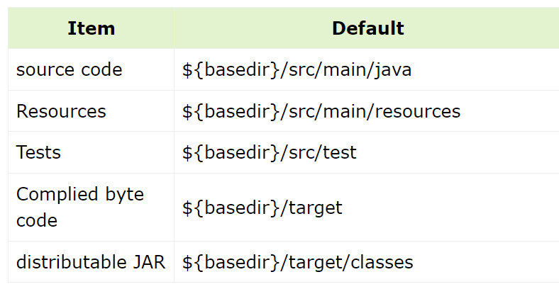

# 1. Maven

## 1. Maven 简介

_为什么你使用 Maven?_

```
如果不使用Maven, 需要手动完成以下步骤:

1. 使用javac编译出所有class文件
2. 使用jar打包class文件, 资源文件以及第三方jar包
3. 使用java运行jar包和测试jar包
4. 将jar包发送并部署到服务器
```

_怎样理解 Maven 中的约定大于配置(Convention Over Configuration)?_

maven 中的属性都有默认值(在 super pom 中可以查看), 下面是常用的默认值:



_怎样统一个项目中所有人员使用的 maven 版本?_

```
1. 在项目中使用mvn -N wrapper:wrapper 生成 mvnw.cmd/mvnw和mavenwarpper文件夹

2. 使用 mvnw替代 mvn 指令
```

_如何使用 maven 创建一个空 Java 项目?_

```
mvn archetype:generate
```

## 2. POM

_怎么标识唯一的项目?_

```
使用GAV坐标
```

_讲一下 POM 的继承体系?_

```
>> 所有POM默认继承自Super POM

>> 子POM可以覆盖父POM中的配置

tips: 子项目中有<parent>, 父项目中<package>pom<package> 并且有<modules>
```

_插件中的 goals 和 phase 是什么?_

```
>> goals指插件内部的指令, 一个插件可能有多个goals


>> 可以在<execution>标签中绑定phase和部分goals, 绑定的goals会在该阶段执行

tip1: 使用mvn <phase>可以按顺序依次执行到指定阶段
tip2: 可以直接使用mvn <plugin>:<goal>执行插件内部指令
tip3: maven插件本质也是一个jar包, 因为maven运行在jvm中
```

_讲一下 Maven 中 Build Lifecycle 中主要的 phase?_

```
* compile

* test

* package

* install: 安装到本地仓库

tip: 上述phase都由MAVEN提供默认的插件
```

_profile 的作用?_

```
profile标签中的配置只有在满足profile的条件时才会生效
```

> 当多个 profile 同时生效时, 会合并 profile

## 3. 依赖管理

_依赖常用的 `<scope>` 有哪些?_

```
* complie/默认: (会放入打包后的jar中)

* test: 测试代码需要的依赖(不会放入打包后的jar中)

* optional: 无依赖传递性的依赖(避免依赖冲突)

* provided: 由运行环境提供的依赖(不会放入打包后的jar中)

```

_版本号 `1.0-SNAPSHOT` 中的 SNAPSHOT 有什么含义?_

```
maven在每次编译时, 会尝试获取并使用最新子版本
```

_什么是依赖冲突, 如何解决?_

```
两个版本的依赖都存在时, maven可能会选择低版本的依赖, 导致不能使用高版本特性

tip: 解决方法为使用<dependancyManagement>锁定高版本
```

_maven 查找依赖时遍历代码仓库的顺序是什么?_

`local repository  =>  mirror 镜像仓库  =>  remote repositroy(默认包含central仓库: https://mvnrepository.com/)`

_maven offline 模式是什么?_

```
maven查找依赖时仅仅在本地仓库查找
```

# 2. Gradle

## 1. Gradle 概述

_Gradle Wrapper 是什么?_

```
为了统一项目使用的Gradle版本, 使用项目文件夹中的Gradle Wrapper代替Gradle

tip1: 使用gradlew指令替代gradle
tip2: 使用gradle wrapper指令可以生成wrapper相关文件
```

_如何新建一个 gradle 结构的项目?_

```
gradle init
```

_Gradle 中的 User Home 的作用?_

```
该路径通常是~/.gradle, 用于保存Gradle本地插件/依赖/构建缓存
```

_Gradle 为什么要使用 Client+Deamon 的方式?_

```
避免Deamon JVM的冷启动, 每执行一个指令仅仅启动Client JVM
```

_Gradle 的生命周期分为哪三步?_

```
1. Initialization: 执行settings.gradle代码

2. Configuration: 执行build.gradle代码, 构建Project对象和Task对象

3. Execution: 执行Task和Project中定义的回调
```

## 2. Groovy 概述

_Groovy 和 Java 语言的联系是什么?_

```
* 两者代码都会被编译为字节码运行在JVM上

* 两者都使用同一个标准库

* Groovy有更多的语法糖
```

_讲一下 Groovy 中的闭包特点?_

```
>> 一个闭包是一个Closure对象, 其中的代码可以委托给其他对象执行

>> Groovy语法允许闭包放在方法右括号后作为最后一个参数使用, 如println {//闭包代码}

```

## 3. Gradle API

_Gradle 中的 Project 类和 Task 类的作用是什么?_

```
使用指令gradlew (:子项目name:)<task名称>可以执行任务

tip1: 使用gradle tasks查看所有任务
tip2: 一个任务可以依赖其他任务(Task#dependsOn方法)
```

_build.gradle 中调用的方法来自于哪一个类?_

```
Project类

例如:apply plugin "java" 等价于执行Project#apply()
```

_Gradle 中插件的作用?_

```
插件本质上是一段可以复用的代码, 应用插件相当于将插件的代码复制到build.gradle中
```

# 3. CMake
