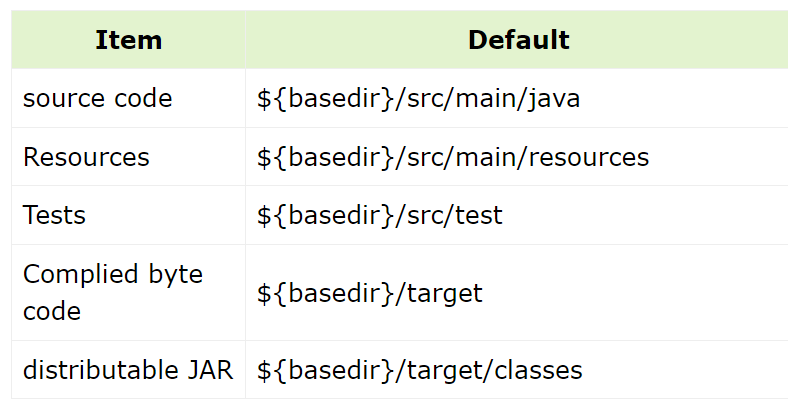

# 1. Maven

## 1. Maven 简介

**_为什么你要使用 Maven?_**

```
如果不使用Maven, 需要手动使用javac编译出所有class文件并使用jar打包class文件和资源文件, 使用java运行jar包和测试
```

**_怎样理解 Maven 中的约定大于配置(Convention Over Configuration)?_**

maven 中使用的属性都有默认值(在 super pom 中可以查看), 下面是常用的默认值:



**_怎样统一个项目中所有人员使用的 maven 版本?_**

```
1. 在项目中使用mvn -N wrapper:wrapper 生成 mvnw.cmd 脚本和maven/文件夹

2. 使用 mvnc.cmd 替代 mvc 指令
```

**_如何修改 Maven 的全局配置?_**

```
修改%MAVEN_HOME%/conf/settings.xml
```

**_如何使用 maven 创建一个空 Java 项目?_**

```
mvn archetype:generate
```

## 2. POM

**_怎么标识唯一的项目?_**

```
使用GAV坐标
```

**_讲一下 POM 的继承体系?_**

```
>> 所有POM继承自Super POM

>> 子POM可以覆盖父POM中的配置
```

**_讲一下 Maven 中 Build Lifecycle 中主要的 phase?_**

```
* clean
* compile
* test
* package
* install
```

**_定义插件时 goals 和 phase 有什么用?_**

```
* goals指插件内部的指令
* phase指插件关注的生命周期阶段

使用 mvc <phase> 或 mvn <plugin>:<goal>执行插件
```

**_profile 的作用?_**

```
profile中的配置只有在满足profile的条件时才会生效
```

> 当多个 profile 同时生效时, 会合并 profile, 按照 ` pom.xml > settings.xml`的优先级覆盖

## 3. 依赖管理

**_依赖的 `<scope>` 有哪些?_**

```
* complie/default: (编译需要的依赖)
* runtime: 运行需要的依赖
* test: 测试需要的依赖
* optional: 无依赖传递性的依赖
* provided: 由运行环境提供的依赖
```

**_版本号 `1.0-SNAPSHOT` 中的 SNAPSHOT 有什么含义?_**

`maven在每次编译时, 会尝试获取并使用最新子版本`

**_如何添加文件系统中的依赖?_**

`将依赖的scope设置为system并指定路径`

```xml
<scope>system</scope>
<systemPath>${basedir}\src\lib\ldapjdk.jar</systemPath>
```

**_什么是依赖冲突, 如何解决?_**

```
* 依赖冲突: 两个依赖项的GA相同但Version不同时, maven可能会选择低版本的依赖, 此时可能导致依赖
另一个高版本的其他依赖项不能正常使用

>>> 解决方法: exclue(排除依赖) / dependancyManagement(版本锁定)
```

**_maven 查找依赖的顺序?_**

`local repository  =>  mirror  =>  remote repositroy(such as the central)`

_maven offline 模式有什么用?_

# 2. CMake
