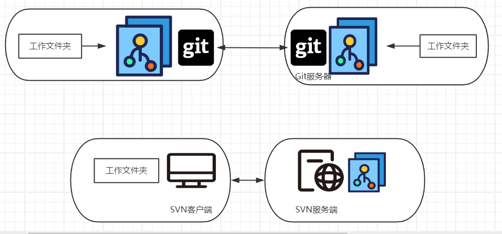

# 1. SVN

_SVN 是集中式的版本控制工具体现在哪里?_

```
客户端只有一个工作区版本, 服务器会保存所有历史版本和分支

tip: 常用的SVN客户端为Tortoise SVN和服务端为VisualSVN Server
```

_如何使用 SVN 对项目进行进行版本控制?_

```
1. checkout
>> 将服务器上最新的版本复制到本地工作区

2. update
>> 将服务器上的最新版本合并进本地工作区(可能需要合并冲突)

3.commit
>> 将本地工作区上传到服务器作为最新版本, commit需要先进行update

4. revert
>> 将本地工作区上做的新修改全部丢弃
```

# 2. Git

## 1. 基本使用

_Git 和 SVN 的主要区别?_

```
1. Git是分布式, SVN是集中式
>> Git本地保存了版本树, 而SVN本地只有一个工作区

2. 分支的实现方式不同
>> SVN通过文件副本实现分支(分支合并困难), Git通过指针的方式实现
```



_如何使进行代码版本管理?_

```
1. 初始化Git本地仓库
git init

2. 添加当前文件夹进暂存区, Git开始跟踪当前文件夹
git add .

3. 将工作区提交到本地仓库作为当前分支下一个节点
git commit -m "提交信息"

tip1: 已存在的远程git仓库直接使用git clone可以fork到本地
tip2: 本地仓库存储在".git"目录下
```

_如何查看文件的跟踪状态?_

```
git status
```

_如何配置 Git 用户和邮箱?_

```
git config --global user.name Shihan Wang
git config --global user.email 75361240+spiderxi@users.noreply.github.com
```

_如何进行分支管理?_

```
1. 查看当前分支
git branch

2.从当前分支处新建一个分支
git branch <新分支名字>

3. 将工作区更新为分支最新节点
git checkout <分支名字>

4. 将其他分支合并到当前分支
git merge <分支名字>

5. 查看分支图: git log --graph
```

_reset 和 revert 的区别?_

```
两者都用于回滚错误的提交内容, 但HEAD指针的移动方式不同:

>> reset: 将提交了错误内容的节点删除, HEAD指针前移
>> revert: 新建一个提交节点用于删除错误内容, HEAD指针后移

tip: 要当前分支回滚到上一个版本可以分别使用命令: git reset --hard HEAD^ 和 git revert HEAD^
```

_merge 和 cherry-pick 的区别?_

```
merge用于合并一个分支到当前分支, cherry-pick用于合并单个提交到当前分支
```

_Git 中标签的作用?_

```
使用tag替代提交节点的commit ID便于记忆

tip1: 使用git tag <标签名称> 添加标签
tip2: 使用git checkout <标签名称> 可将工作区替换为指定标签
```

_gitignore 文件的作用?_

```
git在添加跟踪文件或文件夹时会忽略gitignore中声明的文件和文件夹
```

## 2. 远程协作

_git 如何添加和查看远程仓库?_

```
1. 查看仓库
git  remote  -v

2.添加仓库
git  remote  add  <远程仓库名称例如origin>  <远程仓库URL>
```

_如何拉取和推送仓库中所有分支?_

```
git  push  <仓库名> --all
git  pull  <仓库名> --all

tip: 推送时, 相同名称的分支会进行merge操作, 发生merge冲突需要拉取解决冲突
```

_pull 和 fetch 的区别?_

```
>> fetch仅仅拉取远程仓库R的一个分支X到本地, 拉取后的分支在本地的名称为R:X

>> pull = fetch + merge
```

_远程仓库认证方式有哪些?_

```
1. token(使用token字符串作为密码)

2. ssh
>> 使用git提供的工具ssh-keygen生成公钥私钥密钥对, 将公钥上传到远程仓库
>> 使用ssh协议访问远程仓库

3. username+password(用户名+密码)
```

## 3. Git 规范

_GitFlow 分为哪五个分支?_

```
>> master: 线上分支

>> hotfix: 从master分支派生, 用于修复线上bug, 最终会合并到master

>> develop: 开发分支

>> feature: 从develop分支派生, 用于开发新特性, 最终会合并到develop

>> release: 从develop分支派生, 软件正式发布后该分支会被删除
```

_Git Commit Message 的格式是什么?_

```
<提交类型>: <提交描述>

tip: 常见的提交类型有feat|fix|doc|test
```
