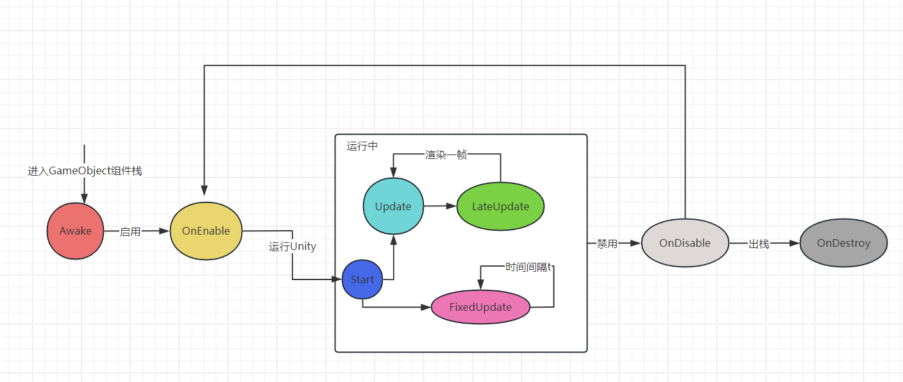

# 1. 预设组件

## 1. 组件基础

_Unity 游戏中 Scene GameObject MonoBehaviour 之间的关系是什么?_

**_Unity 组件本质上是什么?_**

```
一个组件本质上是一个MonoBehaviour子类, 通过组件的hook方法中定义GameObject的行为
```

**_Material 组件的作用?_**

```
Material组件用于渲染物体表面的呈现效果, 由多个Shader和颜色等参数组成

Shader: GPU渲染管道的中的程序, 用于给几何体顶点和片元渲染
```

**_讲一下 Unity 组件的生命周期?_**



**_Unity 中不同组件间组件方法执行的顺序?_**

```
>> 相同优先级: 栈顶先执行, 栈底最后执行

>> 不同优先级: 优先级高的先执行
```

## 2. 图像与音频

_讲一下 Unity 中的图层?_

```
>> 一个组件属于一个图层, 最多可以有32个图层

>> 组件默认属于Default Layer

>> 摄像头可以筛选可见的图层
```

_实时灯光和烘焙灯光的区别?_

_摄像机的深度表示什么?_

_将一下 AudioListener 和 AudioSource?_

_渲染器纹理是什么?_

_如何将用户鼠标的点击映射到刚体上?_

## 3. 地形

## 4. 角色和刚体

_离散碰撞检测和连续碰撞检测的区别?_

_碰撞和触发的区别?_

_什么是铰链?_

## 5. 动画和特效

## 6. 导航

## 6. Unity Editor

_什么是 Gizmos?_

_如何快速复制一个物体并同时修改所有复制体?_

```
使用prefab, 一个prefab相当于一个类, 修改类后可以应用到所有实体
```

_如何让一个物体吸附到另一个物体上?_

```
选中物体后按住V键, 移动物体直到顶点吸附后松开V键
```

如何快速跳转到物体所在位置?

```
双击物体对应的文件或点击场景中的物体再按F键
```

_如何打开控制台?_

```
Ctrl + Shift + C
```

# 2. UnityEngine

## 1. GameObject & MonoBehaviour & Object

_获取一个场景中的 GameObject 有几种方式?_

_如何创建和销毁一个 Unity Object?_

## 2. Application & Debug & Time

## 3. SceneManager & AsyncOperation

_为什么要异步加载场景?_

## 4. Vector & Quaternion & Transform

## 5. Input

_Input 类的作用?_

_什么是虚拟按键和虚拟轴?_

_触摸的阶段 TouchPhase 有哪些?_
