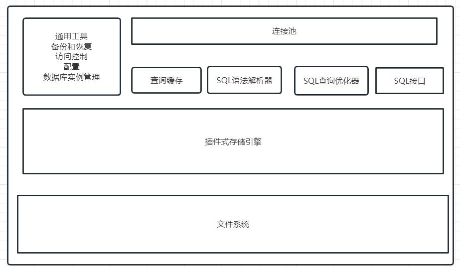
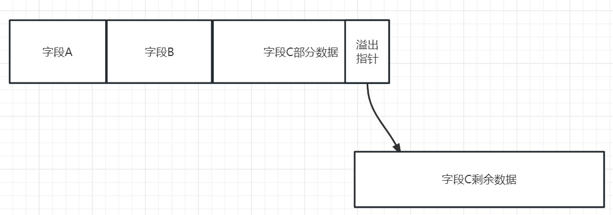
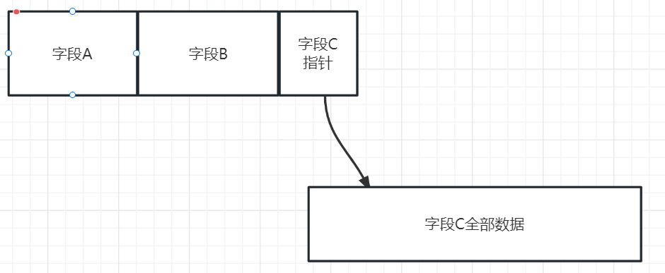
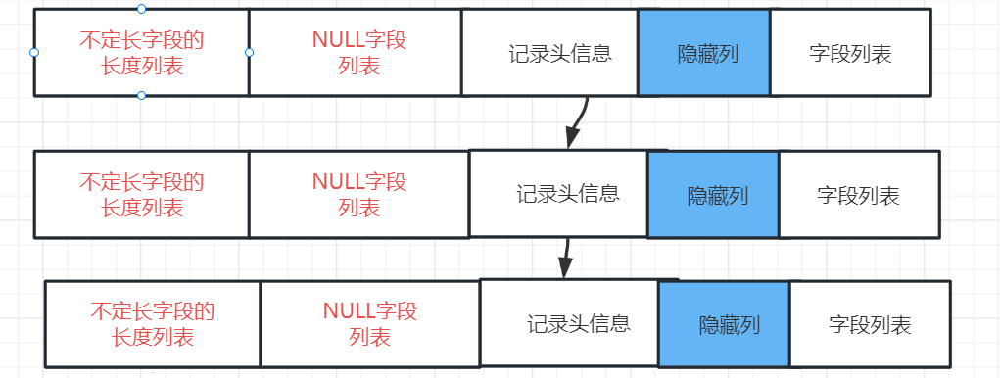
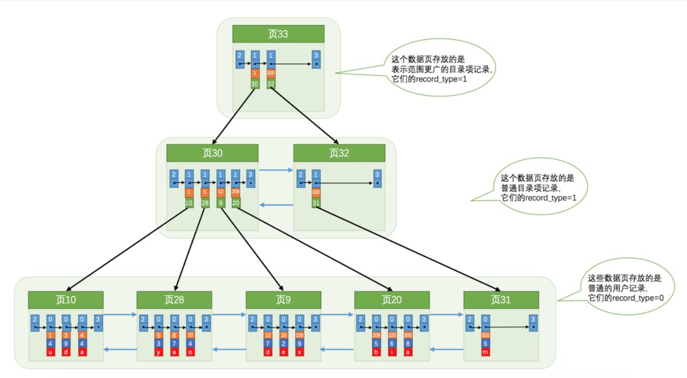
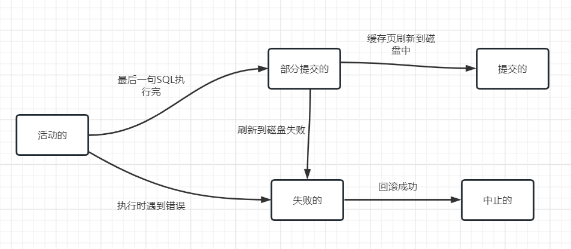
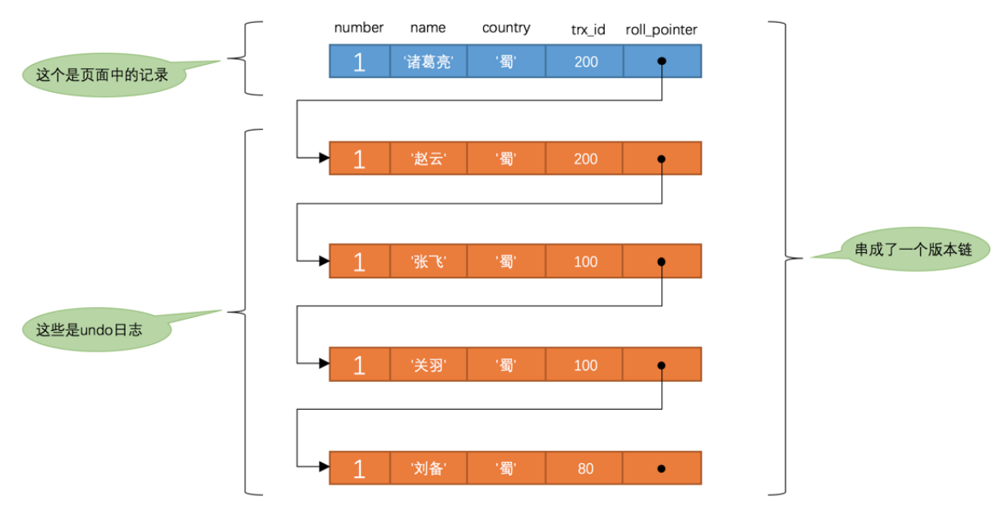

# 0. 数据库理论和SQL

## 0.0 范式和约束

三大范式

```
1NF: 属性是原子的, 不可再分的
2NF: 满足1NF的同时, 主键与非主键之间有完全函数依赖
3NF: 满足2NF的同时, 不能存在传递性函数依赖(主键-> 非主键 -> 非主键)
```

约束

```
非空约束: NOT NULL
唯一约束: UNIQUE
主键约束: PRIMARY KEY
外键约束: FOREIGN KEY
检查约束: CHECK age > 30
默认约束: DEFAULT
```

## 0.1 常用的SQL语句

SQL语句分类

```
DQL(查询), DML(更新, 删除, 修改), DDL(修改表格式), DCL(数据库用户权限管理)
```

DQL分页查询

```sql
SELECT *
FROM student s, teacher t
WHERE s.sid > 16 AND t.tid IN (1, 2, 3)
GROUP BY s.cid
HAVING s.cid != 1
ORDER BY s.name DESC
LIMIT 10
```

DML

```sql
UPDATE student SET name='李四' WHERE id = 1;

DELETE FROM student WHRER id = 1;

INSERT INTO student VALUES(null, "张三", 19, "MALE");
```

truncate table | delete | drop的区别

```
* delete 修改删除标志位, 是一个事务
* truncate 立刻释放磁盘空间, 不是事务
* delete 和 truncate 只删除表的内容, drop 会删除表结构
```

## 0.2 常用的类型

char/varchar(M)

```
char最多255字节, varchar最多2^16-1个字节
```

text/blob

```
text是长文本, blob是二进制文件
```

int/decimal(M, N)

```
int 4字节整数
decimal(M, N): N位小数, M-N位整数
```

# 1. MySQL服务器

## 1.0 安装和配置

安装后的程序

```
mysqld: mysql服务端
mysql: mysql客户端
```

指定配置文件

```shell
mysqld --defaults-file="...../my.ini"
```

**系统变量**表示MySQL的设置, **状态变量**表示当前运行状态, 可以查看和修改

```sql
SHOW GLOBAL VARIABLES like 'max_connections'
SHOW GLOBAL STATUS like 'thread%'
SET GLOBAL max_connections = 50
```

## 1.1 MySQL架构



```
连接池: 负责创建和管理连接线程池
查询缓存: 一个Hash表, key为SQL语句字符串, value为查询结果, SQL语句中不能包含函数
SQL接口: SQL基本操作的接口, 具体实现由存储引擎负责
```

## 1.2 存储引擎

最常用的存储引擎有: ***Innodb(适合OLTP), 以及MyISAM(适合OLAP)***, 两者区如下

|               | MyISAM                 | Innodb         |
| ------------- | ---------------------- | -------------- |
| 是否支持事务? | ×                     | √             |
| 锁粒度        | 表锁                   | 行锁           |
| MVCC          | ×                     | √             |
| 聚集索引      | × (.myi 和 .myd 文件) | √ (.ibd 文件) |

常见的还有**Memory存储引擎**

```
Memory引擎特点: 完全使用内存, 使用Hash索引
```

设置表的存储引擎

```sql
CREATE TABLE `表名`  (
  `person` varchar(255) NULL,
  `id` int NOT NULL,
  PRIMARY KEY (`id`)
) ENGINE = InnoDB;
```

## 1.3 字符

* 各字符集及其特点

```
ascii: 一个字节一个英文字符
gbk: 两个字节一个汉字字符
uft8: 1~4个字节一个字符
utf16: 2~4字节一个字符
```

> MySQL中将utf8详细区分为uft8mb3和uft8mb4, **后者包含一些4字节的表情字符**

* varchar和char的区别

char类型固定长度为255字节, varchar(M)表示最大长度为m个字符(m*字符集字符的平均字节 < 2^16-1)

# 2. Innodb存储引擎

## 2.0 innodb特性


## 2.3 行格式

**compact 行格式**


```
不定长字段包括: varchar类型, 使用utf8编码的char(x)
NULL字段列表使用bitmap存储, 1表示字段为null, 0表示不是null
隐藏列包括: row_id  transaction_id roll_pointer
```

compact行格式中当字段过长导致一个页(16KB)放不下时, 使用数据+溢出指针



**Compress**行格式 和 **Dynamic**行格式中,字段过长时只使用溢出指针



**Compress**格式下, 会使用**压缩算法**对页面进行压缩

页面中的所有行由记录头信息的指针连接形成一个**单链表**



## 2.4 索引

### 2.4.0 索引的数据结构

Innodb和MyISAM使用 **B+树索引结构,** Memory使用**Hash索引**



**正常情况下b+树高度<=3** (假设一个页16KB存储1000条记录, 3层b+树最多可以存储10^9条记录)

### 2.4.1 索引的分类

聚簇索引, 唯一索引, 二级索引, 联合索引

```
聚簇索引: B+树索引的叶节点中存放完整记录, 不用回表
唯一索引: 索引字段的值唯一(可以为null)
二级索引: B+树索引的叶节点存放主键, 需要回表
联合索引: 记录之间的排序使用多个字段的字典序
```

MyISAM索引和Innodb索引的区别

```
Innodb中默认为主键添加聚簇索引
MyISAM中没有聚簇索引, 数据存放在一个文件中(.myd), 索引存放在另一个文件中(.myi), 默认为主键添加二级索引
```

### 2.4.2 索引的创建和使用

创建索引

```sql
Alter Table <table_name> Add Index <idx_name> (字段1, 字段2);
CREATE INDEX idx ON user(a, b, c)
```

索引在以下情况下会失效

```
联合索引不符合最左匹配原则
查询条件为 LIKE '%AA'
查询条件中包含 函数 or 运算
特殊的查询条件如 or/!=
```

覆盖索引

```
避免使用select *, 从而使查询字段都在索引字段中避免回表的额外消耗
```

适合做索引的字段

```
区分度高的字段
经常作为查询条件的字段
修改频率低的字段
长度较短的字段
```

索引下推

```
高版本的MYSQL中, 服务器会将一些查询条件下推给存储引擎, 从而减少需要回表的行数
```

使用自增主键

```
使用自增主键避免插入过程中频繁发生页面分裂
```

前缀索引

```sql
对于较长的字段, 可以使用字段的前缀建立索引
ADD INDEX user(name(10))
```

## 2.6 表连接

**驱动表和被驱动表**

```
连接过程中只遍历一遍的表成为驱动表(外循环), 否则成为被驱动表

在连接过程中, 会先对驱动表执行单表查询, 查询的结果作为新的驱动表
```

**内连接和外连接**

```sql
内连接相当于笛卡尔乘积
From stu, cls Where stu.cid = cls.cid
From stu Inner Join cls on stu.cid = cls.cid

外连接分为左外连接和全外连接, 左外连接是指坐标的所有记录在连接后至少有一行, 如果没有使用null补充
```

Where和Join On的区别

```sql
在连接条件中, 只属于一个表的条件使用where, 两个表的条件使用on

select * from 
stu left join cls on stu.cid = cls.cid
where stu.sid > 18 and cls.cid < 16;
```

## 2.7 特殊查询

### 2.7.1 count(*)

InnoDB由于支持并发事务, 所以表的统计数据采用**抽样估计,** MyISAM由于使用表锁, 表的统计数据是**精确值**

*count(字段) count(1) count(*)区别*

```
count(字段) 如果字段值为null时不会统计, 使用全表扫描

count(1)与count(*)在Innodb中等效, 会使用较短的二级索引进行查询优化

MyISAM中count(*)直接返回统计信息中的行数
```

### 2.7.2 limit

使用查询 `limit offset, length`, 存储引擎层会返回长度为offset+len的行记录, 如果offset很大, length很小, 就会造成**深分页问题**

*深分页问题解决方法*

1. 如果是id这种自增增主键, 使用 `order by + where id > 上一页最大id + limit` 这时存储引擎值返回len长的行记录
2. 使用缓存, 缓存分页查询结果

# 3. Innodb事务

## 3.1 事务介绍

acid

```
a: 原子性    	要么不做, 要么全做
c: 一致性	事务结束后数据库中的数据需要满足约束
i: 独立性	并发事务不会影响执行结果
d: 持久性	事务提交后对数据的改变是永久的
```

事务SQL

```sql
BEGIN;

//事务SQL

IF .... ROLLBACK;
COMMIT;
```

事务状态



## 3.2 事务隔离级别

四大隔离级别

```
RU: 读未提交  	一个事务可以读取到其他事务未提交的数据 (脏读问题)
RC: 读已提交  	只能读到已经提交的数据(不可重复读)
RR: 可重复读	一个事务内读取的同一个记录永远相同(幻读问题)
SE: 可串行化	强制事务串行执行
```

Innodb默认隔离级别为**RR,** 使用**间隙锁**解决幻读问题

## 3.3 日志

* redo日志是一个逻辑日志, 用于保证事务持久性
* undo日志是一个物理日志, 用于回滚事务, 保证事务原子性
* 二进制日志(bin log)只会记录写入操作, 用于主从同步和数据库备份

为什么使用redo log?

```
如果一个缓存页一有修改就刷新到磁盘, 效率很低(需要频繁的随机IO)
redo log是顺序IO, 速度快
```

redo long buffer刷到磁盘的时机

```
* 缓存页空间不足时会刷新
* 事务提交时会刷新
* 后台进程定时刷新
```

bin log 格式

```
statement: 记录原始SQL
row: 记录行变化
mixed: 两者混合
```

## 3.5 MVCC

MVCC原理

```
每条记录包含隐藏列 trx_id, roll_ptr, 表示最后修改这条记录的事务id和历史版本指针

历史版本指针指向undo日志中的历史版本记录形成一个版本链
```



在**RC隔离级别**下,  **每次SELECT**会生成一个**READ VIEW**  (READ VIEW 包含当前事务可见的事务_id范围)

在**RR隔离级别**下,  第一次**SELECT**会生成一个**READ VIEW**

```
如果一个版本的trx_id不在read view 范围内, 就顺着版本链查找历史版本
```

## 3.6 锁

### 3.6.0 锁的种类

Innodb锁包含行锁和表锁, MyISAM只有表锁, 具体的锁类型包括:

* 共享锁

```sql
select * from table Where id=1 in share mode
```

* 排他锁

```sql
select * from table for update
```

* 乐观锁: 总是假设其他事务不会修改数据, 仅仅在写入数据时进行版本号验证, **适合读较多**的场景
* 悲观锁: 总是假设其他事务会修改数据, 读取数据时加排他锁, **适合写较多的场景**
* 记录锁

```sql
update user set name='wsh' where id=1
// 锁的范围[1, 1]
```

* 间隙锁(gap lock)

```sql
update user set name='wsh' where id>1 and id<10
// 锁的范围(1, 10)
```

* 临键锁(next-key lock)

```sql
update user set name='wsh' where id>1 and id<=10
// 锁的范围(1, 10], 临界锁的范围是一个前开后闭区间
```

* 意向共享锁和意向排他锁

获取行的S/X锁前要先获取表的IS/IX锁, 意向共享/排他锁用来快速判断表中是否有行持有S/X锁

* 插入意向锁

插入意向锁本质是一个间隙锁, 一个事务插入记录前需要先加插入间隙的插入意向锁 `(l, r)`

### 3.6.1 SQL语句如何加锁

SELECT

```
SELECT ... //MVCC, 不加锁
SELECT ... IN SHARE MODE // 加S锁
SELECT ... FOR UPDATE // 加X锁
```

UPDATE/DELETE/INSERT加各种类型的X锁

```
INSERT加锁流程
1. 在要插入的间隙加插入意向锁
2. 插入记录并对记录加X锁(实际上是隐式锁机制, 隐式锁不算锁)
```

DDL语句加表锁

# 4. 备份和调优

## 4.1 SQL优化

### 4.1.0 SQL的执行顺序

1. 根据From和Join确定要查询的表和如果进行表连接
2. 根据Where条件筛选符合条件的行记录
3. 根据GroupBy进行分组
4. 根据Having条件筛选分组
5. 根据Select查询相关的字段和聚合函数结果
6. 对Select的结果使用distinct去重, orderBy排序
7. 最后使用limit进行分页

```sql
SELECT (Distinct) ... 
FROM ... LEFT JOIN ... ON
WHERE ...
GROUP BY ...
HAVING ...
ORDER BY ... (DESC)
LIMIT (start, ) [length]
```

### 4.1.1 查看SQL执行计划

使用 `Explain + SQL语句`查看SQL的执行计划, 查看执行计划时并不会真正执行SQL

执行计划中重要的字段包含:

| 字段    | 含义                                                                                |
| ------- | ----------------------------------------------------------------------------------- |
| id      | 使用了Union关键字时(如SQL1 Union SQL2), id不相同<br />同一个SQL语句中的子查询id相同 |
| table   | 从那张表中获取数据                                                                  |
| type    | 查询类型                                                                            |
| key     | 使用了哪些索引字段                                                                  |
| key_len | 使用索引的字节长度                                                                  |

**常见的查询类型**

| 类型   | 解释                   |
| ------ | ---------------------- |
| const  | 使用索引查找唯一的一行 |
| eq_ref | 使用索引连接唯一的一行 |
| range  | 使用索引进行范围扫描   |
| index  | 扫描二级索引           |
| ALL    | 扫描聚簇索引           |

### 4.1.1 慢SQL优化

慢SQl优化流程:

```
* 哪些是慢查询? -->查看慢查询日志
* 是否是网络/磁盘IO速度导致慢? --> 测试网络速度和磁盘IO速度
* 是否锁竞争导致慢? --> 查看是否出现了死锁
* 是否是索引问题导致速度慢? --> 查看执行计划
* 是否是服务器流量过大导致速度慢? --> 分库分表+主从架构读写分离
```

**在配置文件中开启慢查询日志功能**

```
// 慢查询日志功能
slow_query_log=1 
slow_query_log_file=/var/lib/mysql/atguigu-slow.log 
long_query_time=3 
log_output=FILE
```

**死锁排查和解决**

使用 `SHOW ENGINE INNODB STATUS`查看最近一次死锁日志, 重点关注**事务持有的锁和正在等待的锁,** 找到死锁产生原因后改写SQL避免死锁产生

## 4.2 分库分表

* 分库: 将不同业务的数据拆分到不同数据库实例中
* 分表: 将一张表拆分成多张表中(分为**垂直分表和水平分表**)

垂直分表

```
将长度较长的字段/使用频率低的字段单独拆成一张表
缺点: 查询时可能需要额外的join操作
```

水平分表

```
将大表水平切割成多个子表
缺点: 聚合查询/排序时要查询多张表再合并查询结果, 不能使用表的自增主键
```

雪花算法: 分表后不能使用自增id, 否则全局id可能不唯一, 使用雪花算法生成全局唯一自增id

```
雪花算法生成的id共64bit, 格式为: 0 + 41bit时间戳 + 10bit机器码 + 12bit自增序列号
```

## 4.3 主从架构

什么是主从架构?

```
一个主服务器负责写请求, 多个从服务器负责读请求, 主服务器需要将数据同步给从服务器
```

主从同步机制

```
当从服务器连接到主服务器后, 主服务器后台线程会将bin log 日志内容发送给从服务器, 从服务器接收到内容后会写入relay log, 从服务器的后台线程会将relay log 日志中的内容写入从服务器的表中
```
