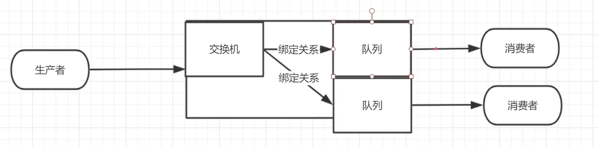
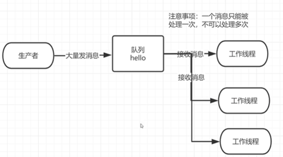
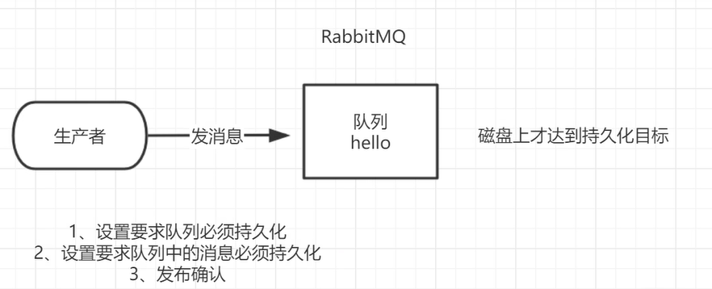
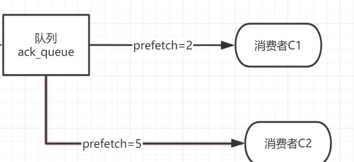
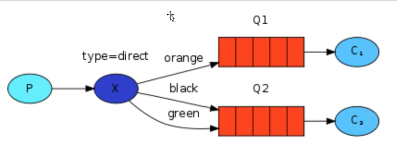
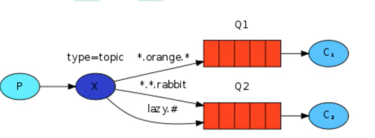
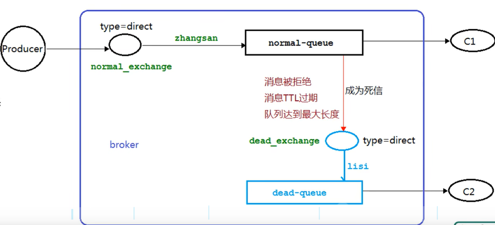

# 1. RabbitMQ 介绍

MQ作用: 

```
1. 流量削峰填谷
2. 系统解耦: 一个子系统不可用时, 消息放在消息队列中, 等子系统恢复后可以继续运行
3. 异步处理: 当某个子系统处理时间较长且具体不确定时, 处理完成时使用消息队列异步通知其他系统, 避免其他系统等待
```

MQ分类:

```
kafka: 适用于大数据, 吞吐量高
rocketmq: 阿里从kafka修改而来, 适合金融领域
rabbitmq: erlang语言开发
```

## 1.1 Rabbitmq通信模型

通信模型





默认发送消息给不同的工作线程时采用的策略时轮询分发

术语:

**broker**: 一个rabbitmq服务器, 负责接收和分发消息

**Vhost**: 一个rabbitmq服务器会有多个虚拟的消息服务器, 每个vhost隔离

**Channel**: 一个TCP连接对应多个Channel, Channel之间完全隔离, 是逻辑上的一个连接, 目的是降低多个TCP连接的巨大开销

**Exchange**: 交换机, 有不同的类型, 负责将消息分发到不同队列中, 不同类型的交换机分发策略不同

## 1.2 安装

安装rabbitmq需要先安装erlang语言环境, 注意rabbitmq和erlang语言版本的对应关系, 不符合的版本可能导致不兼容

安装web管理插件

```
rabbitmq-plugins enable rebbitmq_management
```

启动rabbitmq(启动可能需要一些时间)

```
rabbitmq-server start
```

添加用户和权限

```
rabiitmqctl add_user wsh 123456
rabiitmqctl set_user_tag wsh administrator
rabiitmqctl list_users //列出所有用户
//给用户特定的vhost的权限
rabbitmqctl set_permissions -p "/" wsh ".*" ".*" ".*"
```

启动成功后服务器端口默认为5672, 管理端口为15672


# 2. RabbitMQ机制

## 2.1 消息应答和确认发布

* 消息应答

消费者在接收到消息后, 消息队列不会立刻删除该消息, 需要消费者应答后才删除, 避免消息丢失

如果一个消费者未应答的消息过多时, 消息队列不会再发送消息给该消费者, 如果长时间未应答, 该消息会重新入队

* 确认发布



当消息被消费者应答/未应答后, 开启确认发布机制的消费者可以使用异步确认发布机制调用回调函数, 实现特定功能


## 2.2 持久化

消息队列的服务器宕机时, 消息可能会丢失.

可以设置重要的消息队列持久化, 这样重要的消息队列可以存储到磁盘中, 即使宕机消息也不会丢失

## 2.3 预取值



消费者可以设置预取值, 这样消费能力强的消费者会被分发更多的消息

## 2.4 交换机类型

* 默认交换机: 一个交换机对应一个队列, 消息只会发送到该队列
* fanout: 会发送消息到和交换机绑定的所有队列中, 每个队列一份
* direct: 根据routing key来发送消息到队列

到P发布消息时选择的routing key = "black" 时, 消息会被交换机发送到q2




* topic: routing key可以使用通配符的direct交换机

与队列绑定时的routing key 必须是以点连接的字符串, 可以使用*匹配一个单词, #匹配多个单词

以下图为例, 发布消息时, routing key = "hello.orange.rabbit "的消息会被 q1, q2接收



## 2.5 死信队列和延迟队列

什么是死信?

```
被否定应答的消息
or TTL到了的消息
or 队列满时再插入的消息
```

将一个重要业务的队列配置死信队列, 避免消息丢失, 死信队列架构图如下



死信队列并不是什么特殊的队列，只不过是绑定在死信交换机上的队列。死信交换机也不是什么特殊的交换机，只不过是用来接受死信的交换机，所以可以为任何类型.

在声明队列的时候绑定死信交换机即可给队列绑定死信队列

**延迟队列**就是TTL过期的死信队列, 当消息过期时, 交由另外的一个消费者处理
