# 1. Redis中的数据结构

## 1.1 SDS

SDS定义

```c
struct Sds {
    int len;
    int freeLen;
    char buf[];
};
```

**SDS相较于C语言字符串数组的优点**

```
* O(1)时间获取字符串长度
* 避免了字符串拼接时可能的缓存区溢出情况
* 避免了字符串长度变化时频繁地进行重分配内存
```

SDS应用

```
SET msg "hello, world" 
这条命令中"msg"和"hello, world"的类型都是SDS
```

## 1.2 链表

链表定义

```c
    struct ListNode {
        struct ListNode *pre;
        struct ListNode *next;
        void *value;
    };

    struct List {
        ListNode *head;
        ListNode *tail;
        unsigned long len;
        void (*free)(void *ptr);
        void (*match)(void *ptr, void *key);
        void* (*dup)(void *ptr);
    };
```

链表特点

```
* 双向链表
* 使用void指针实现多态链表
```

## 1.3 字典

字典定义

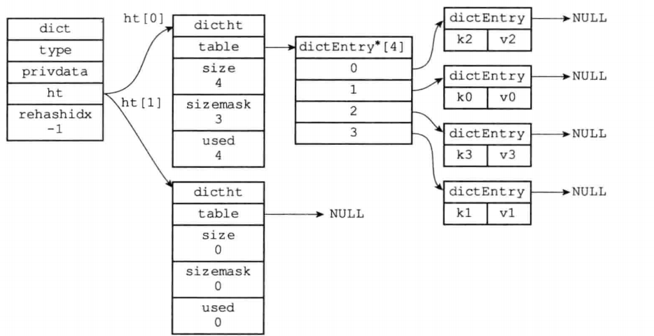

字典特点

```
* 使用两个hash table, 当扩展/缩容时, 通过rehash将一个hash table中的节点复制到另一个hash table中
* rehash过程是渐近的, 不会一次性把大量节点rehash
* hash冲突使用链表法解决
* 当负载因子<0.1 || 负载因子 > 1时会扩展和缩容
```

## 1.4 跳表

跳表原理图

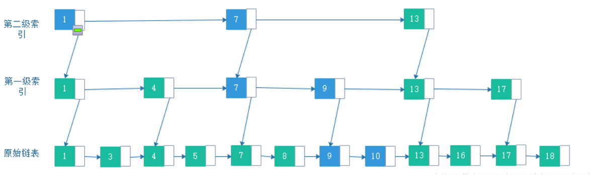

**为了防止跳表退化为单链表, 新插入的节点需要随机level(越高等级的level概率越低)**

Redis中的跳表结构

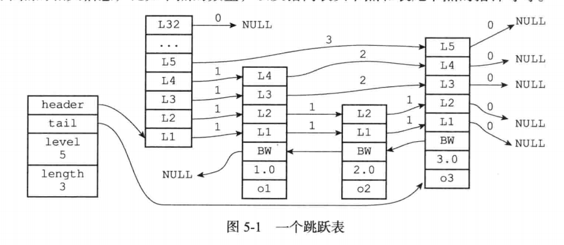

* 跳表查询和插入修改的**时间复杂度都是Log(N),**
* Redis中每一级的level指针还**额外记录跨度, 便于计算节点的Rank**
* **大小排序按照(score, key)的字典序**

## 1.5 intset & ziplist

* **inset结构**

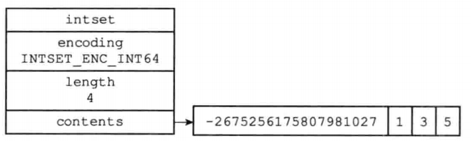

***当存放的int过大/过小时, 数组中所有元素都需要升级(如int32 -> int64)***


* **zipList结构**

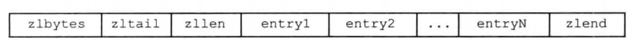

ziplist是用连续存储空间存储list元素的数据结构, **每个entry不定长, 不定类型, 需要额外记录长度和类型**

entry结构

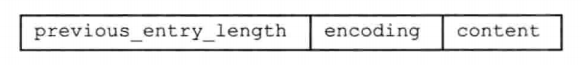

## 1.7 redisObject

**redis中各种类型的键值对都是一个redisObject, 不同编码对应不同底层实现**

RedisObject结构

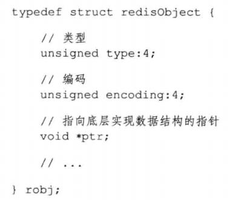

类型和编码以及对应的底层实现

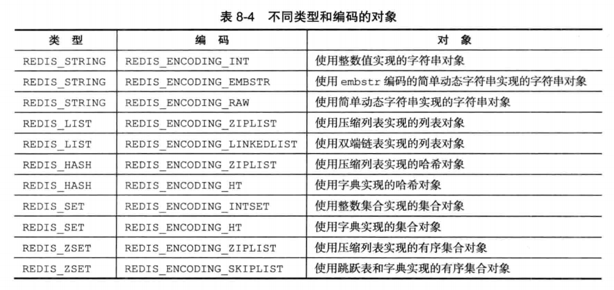

# 2. Redis单机

## 2.1 常用命令

```
SET key value
GET key
SELECT 0

EXPIRE key 5
EXPIREAT key 1377257300 //时间戳
TTL key
```

## 2.2 过期key的删除

redis中**默认16个数据库**

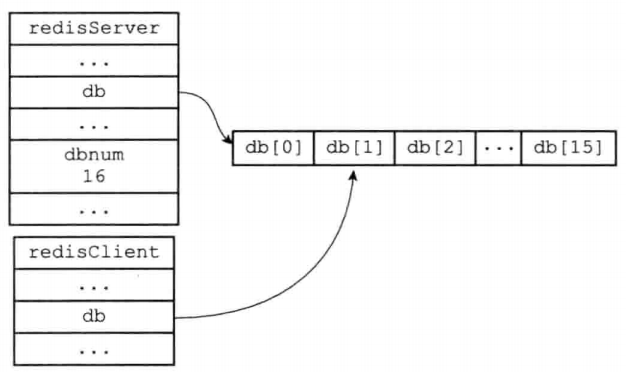

一个数据库主要由**一个保存所有键值对的字典和一个expire字典组成**

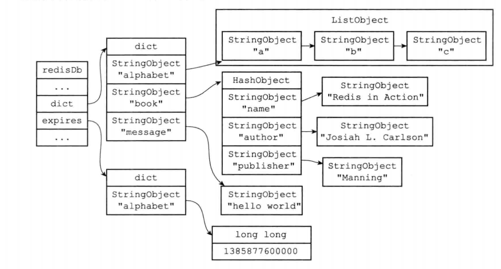

***expire字典中记录key过期的时间戳***

**过期键的删除**

```
redis采用惰性删除+定期删除的方式删除过期key

惰性删除: GET key时检查是否过期, 过期就删除
定期删除: 每个一段时间, 从上次定期删除的结束位置开始, 统一删除少量过期键
```

## 2.3 RDB和AOF

**rdb文件保存了redis数据库的快照**, 文件对于部分类型可能使用压缩算法

生成rdb文件指令

```
SAVE //主进程不响应客户端命令, 直到备份完毕
BGSAVE //新建一个子进程负责备份
```

**aof文件保存了所有执行过的命令,** 当aof文件过大时可以使用**BGWRITEAOF进行AOF重写**

```
* 实际上执行过的指令先写入内存中的aof_buf, 根据参数决定是否立刻同步到文件中

* BGWRITEAOF会创建一个子进程进行备份, 避免主进程阻塞

* AOF重写原理是对数据库进行扫描, 直接生成添加key-value的命令

* AOF重写期间如果主进程执行了写入命令, 会同时写入数据库和AOF重写缓冲区, 缓冲区最后会同步到重写后   的AOF文件中
```

***AOF持久化优先级比RDB文件高**, Redis服务器重启时优先使用AOF*


## 2.4 Pipeline

pipeline是redis客户端和服务器之间的缓冲, pipeline等客户端发送的命令积累到一定数量后才会发送给服务器执行

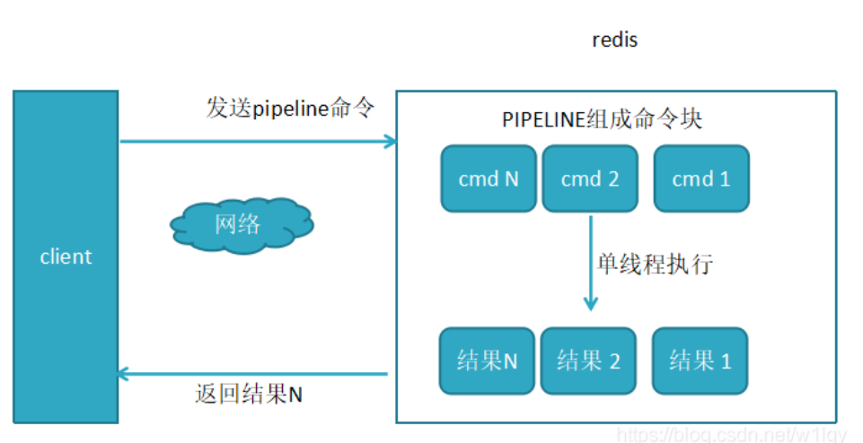

## 2.5 事件驱动和IO多路复用

redis使用**单线程通过IO多路复用的方式监听多个socket**, 每个socket准备就绪时触发一个**文件事件**, 并将文件事件分配给对应的处理器

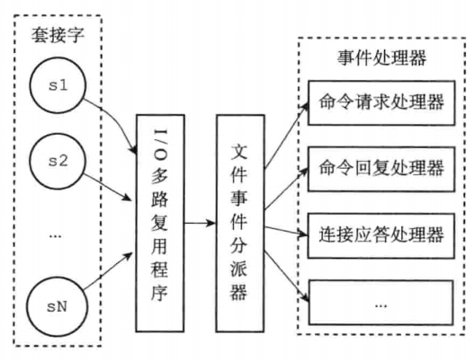

除了文件事件外redis还有**定时事件**

# 3. Redis集群

## 3.1 主从复制

* 从服务器在第一次连接到主服务器时**使用rdb文件进行一次全量复制**
* 如果从服务器短暂与主服务器失联后再次连接会触发**部分同步**
* 主服务器执行写命令后会将**命令传播给**从服务器

> 同步指令为PSYNC


## 3.2 哨兵模式

哨兵模式架构

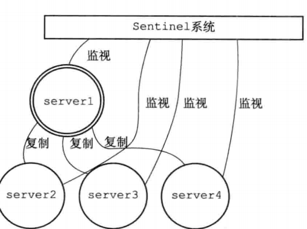

**故障恢复**

```
当多个sentinel实例判断主节点发生故障后, 会选举出一个主sentinel负责这次故障恢复

主sentinel从从节点中选出一个主节点, 并将其他从节点和原来的主节点设置为新主节点的从节点
```

## 3.3 集群

建立集群指令

```
CLUSTER MEET
```

一个集群包含16384个slot, **需要将所有slot分配给集群中的节点**

```
CLUSTER ADDSLOTS 0 1 ... 1000
```

**集群重定向**

```
当访问的key不属于当前节点的负责的slot时, 返回一个MOVED错误, 客户端根据错误信息重定向到正确的节点
```

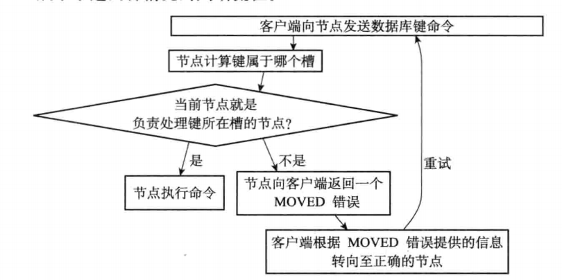

# 4. Redis高级功能

## 4.1 事务

事务流程(开启事务->命令入队->执行), **Redis事务不支持回滚**

```
MULTI //开启一个事务
SET name wsh
SET age 1
EXEC //执行事务
```

**WATCH:** 乐观锁机制, 当WATCH的键值对值被修改后, EXEC执行失败

```
WATCH name
MULTI
SET name 1
EXEC // 失败
```

**Redis事务特性**

```
A: 原子性-单个指令具有原子性, 事务不具备原子性
C: 一致性-
I: 隔离性-单线程能保证隔离
D: 开启了AOF的立刻刷新时有持久性
```

# 5. 面试补充

## 5.1 缓存穿透, 击穿, 雪崩


**缓存穿透**

```
频繁查询不存在的数据, 每次都经过redis缓存和数据库, 导致数据库承受不住
解决方法: redis缓存空值(设置较短过期时间)/bloom filter 
```

> bloom filter: 由一个bitmap和若干个hash函数构成, key通过hash函数映射到bitmap上的多个1, 查询时如果有1个bit==0, 则肯定不存在

**缓存击穿**

```
热点数据失效瞬间遇到大量请求, 请求转移到数据库
解决方法: 热点数据不过期/使用互斥锁 
```


**缓存雪崩**

```
大量热点缓存在短时间同时失效, 导致请求堆积到数据库
解决方法: 热点数据过期时间随机
```


## 5.2 Redis快的原因

```
1. 使用内存存储
2. 单线程避免了并发控制上锁和多线程之间的上下文切换
3. 使用多路复用io
```

## 5.3 缓存和数据库的一致性

更新数据库+更新缓存的问题

```
两个线程并发更新同一个数据, 可能会造成缓存和数据库中不一致, 如
A: 数据库value->1
B: 数据库value->0
B: redis value->0
A: redis value->1
```

**更新数据库+删除缓存先后**

```
先更新数据库, 再删除缓存

为了确保两项都执行, 可以异步重试
```

## 5.4 内存淘汰策略

当内存不足时, redis会根据一定策略淘汰掉一些key-value

```
* LRU
* RANDOM
* TTL(将要过期的键淘汰)
* LFU(访问频次最低的淘汰)
```

LFU算法实现

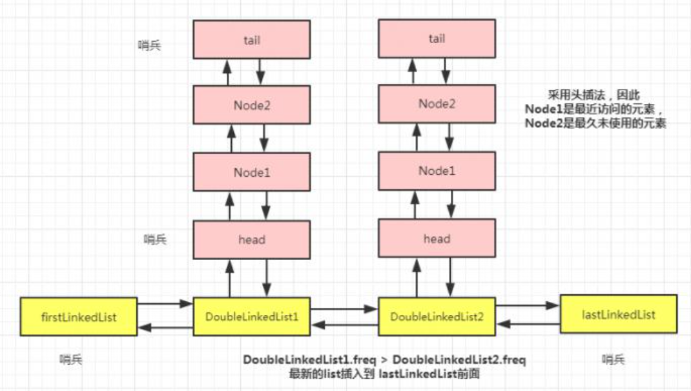

## 5.5 Redis实现具体业务

实现消息队列

```
list
```

实现延迟队列

```
zset
```

实现排行榜

```
zset
```

实现点赞

```
hash<string, set<string>>
```

实现短信验证码

```
string + expire
```
