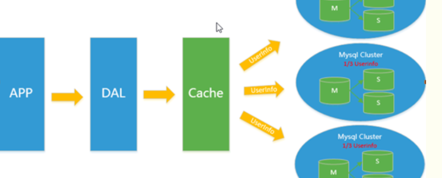
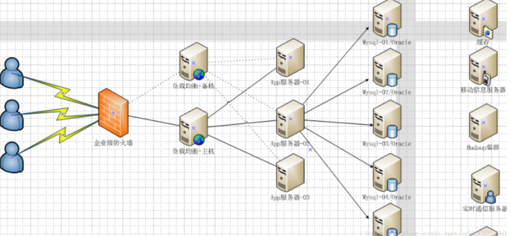

网课资源: [狂神说-redis](https://www.bilibili.com/video/BV1S54y1R7SB)

# 1. 什么是NoSQL? 为什么使用NoSQL?

## 1.1 架构发展史

90年代，一个网站的访问量一般都不大，用单个数据库完全可以轻松应付


DAL : Data Access Layer（数据访问层 – Hibernate，MyBatis）

数据量的总大小一个机器放不下时, 数据的索引（B+ Tree）一个机器的内存放不下时, 访问量(读写)一个实例不能承受时, 需要重构数据库

---

**Memcached(缓存)+MySQL+垂直拆分 架构**

Memcached作为一个独立的分布式的缓存服务器，为多个web服务器提供了一个共享的高性能缓存服务


---

**主从读写分离**

由于数据库的写入压力增加，Memcached只能缓解数据库的读取压力。读写集中在一个数据库上让数据库不堪重负，大部分网站开始使用主从复制技术来达到读写分离，以提高读写性能和读库的可扩展性。


---

**分库分表+水平拆分+mysql集群**

在Memcached的高速缓存，MySQL的主从复制，读写分离的基础之上，这时MySQL主库的写压力开始出现瓶颈，而数据量的持续猛增，由于MyISAM在写数据的时候会使用表锁，在高并发写数据的情况下会出现严重的锁问题，大量的高并发MySQL应用开始使用InnoDB引擎代替MyISAM。

> MyISAM 表锁，InnoDB 行锁



关系数据库很强大，但是它并不能很好的应付所有的应用场景。MySQL的扩展性差（需要复杂的技术来实现），大数据下IO压力大，表结构更改困难。

---

现代的架构



## 1.2什么是NoSQL

NoSQL(NoSQL = Not Only SQL )，意即“不仅仅是SQL”泛指非关系型的数据库。随着互联网web2.0网站的兴起，传统的关系数据库在应付web2.0网站，特别是超大规模和高并发的SNS类型的web2.0纯动态网站已经显得力不从心，暴露了很多难以克服的问题，而非关系型的数据库则由于其本身的特点得到了非常迅速的发展。

NoSQL代表:  MongDB、 Redis、Memcache

NoSQL四大类型: KV键值对型, 图关系数据库, 文档数据库(和JSON一样), 列存储数据库(用于分布式)

# 2. Redis环境手工配置

## 2.1环境配置流程

解压压缩包

```
tar -zxvf <压缩包>
```

编译解压后的源码(需要gcc)

```
make
```

安装编译后的模块

```
make install
```

找到安装后的redis模块路径(一般为/usr/local/bin/)

启动redis服务端, 参数为redis配置文件(解压后的压缩包里有redis.conf)

配置文件+&可以守护进程后台运行

```
redis-server <配置文件>&
```

使用redis-cli客户端测试redis命令

```
redis-cli (-h <主机> -p <端口号>)
```

## 2.2基本命令和工具

测试连接

```
ping
```

关闭服务器

```
shutdown
```

向数据库添加键值对

```
set <key> <value>
```

向数据库获取值

```
get <key>
```

退出redis-cli

```
exit
```

---

redis自带性能测试工具: redis-benchmark

# 3. Redis基本命令

## 3.1基本命令

选择数据库(默认使用0号数据库, 默认配置16个数据库)

```
select <number>
```

获取数据库大小

```
DBSIZE
```

清空当前数据库/全部数据库

```
flushdb/flushall
```

---

获取所有符合模式的key

```
keys <pattern>
```

是否存在特定的key

```
exists <key>
```

弃用键值对

```
expire <key> <second>
```

获取键值对生存时间ttl(弃用倒计时)

```
ttl <key>
```

移动键值对到其他数据库

```
move <key> <db-number>
```

获取key对应的value的类型

```
type <key>
```

---

设置键值对并设置释放时间

```
setex <key> <value> <sec>
```

如果不存在键值对时添加键值对

```
setnx <key> <value>
```

批量添加键值对, 获取键的值

```
mset <ket> <value> [<key> <value> ...]
mget <key> [<key> ...]
```

返回原来的值并设置为新值

```
getset <key> <newValue>
```

Redis命令查询网站

> https://redis.io/commands/

## 3.3五大类型

### 3.3.1 string

```
append <key> <str>
strlen <key>
getrange <key> <start> <end(include)>
setrange <key> <offset> <replacement>
//以string形式表示的数字可以进行+ -
incr <key>
decr <key>
incrby <key> <increment>
decrby <key> <decrement>
```

### 3.3.2 list

向list左右插入值

```
lpush <list-key> <value> [value ...]
rpush <list-key> <value> [value ...]
```

获取列表中的值

```
lrange <list-key> <start> <end(-1 if it is list end+1))>
lindex <list-key> <index>
```

列表其他操作

```
lset <list-key> <index> <newValue> 
lpop <list-key>
rpop <list-key>
ltrim <list-key> <start> <end>
lrem <list-key> <count> <value>
llen <list-key>
```

### 3.3.3 set

```
sadd <set-key> <value> [value...]
smembers <set-key>
sismember <set-key> <value>
srem <set-key> <value> [value...]
//获取集合大小
scard <set-key>

//随机获取元素
srandmember <set-key> <number>
//随机删除元素
spop <set-key>

//集合间移动元素
smove <set-key1> <set-key2> <value>

//集合运算
sdiff <set-key1> <set-key2>
sunion <set-key1> <set-key2>
sinter <set-key1> <set-key2>
```

### 3.3.4 hash

```
hset <hash-key> <field> <value> 
hget <hash-key> <field>
hmset <hash-key> [field value ]+
hmget <hash-key> [value ]+
hgetall <hash-key>
hdel <hash-key> <field>
```

其他命令大致就是命令前加h, 不赘述.

### 3.3.5 zset

zset是一个set, 不过可以根据每个元素的score排序

```
zadd <zset-key> <score> <value>
zrangebyscore <zset-key> <min(-inf if no min)> <max(+inf if no max)>
//获取score在指定区间的元素个数
zcount <zset-key> <min> <max>
```

其他命令大致就是set命令的s替换为z, 不赘述.

## 3.4 三种特殊类型

### 3.4.1 geospatial

添加, 地理位置信息, 经纬度

```
geoadd <geo-set-key> <longtitude> <lantitude> <member-name>
```

获取直线距离

```
geodist <geo-set-key> <name1> <name2> [km/m]
```

获取指定位置周围半径的地理位置

```
georadius <geo-set-key> <longtitude> <lantitude> <radius> <m/km> [withcoord] [withdist] [count <count-number>]
georadiusbymember <geo-set-key> <member-name <radius> <m/km>
```

### 3.4.2 hyperloglog

hyperloglog被用于统计UV（Unique Visitor，独立访客）

HyperLogLog是用来做基数统计的算法，它提供不精确的去重计数方案（这个不精确并不是非常不精确），标准误差是0.81%

算法原理: https://blog.csdn.net/qq_41125219/article/details/119776824

```
pfadd <key> [element]+
pfcount <key>
//将两个pf集合合并成一个
pfmerge <merged-key> <key1> <key2>
```

### 3.4.3 bitmap

bit序列

```
//设置bit
setbit <bitmap-key> <offset> <0/1>

getbit <bitmap-key> <offset>

//统计1的个数
bitcount <bitmap-key> [start end]
```

# 4. Redis事务

## 4.1事务机制

单个 Redis 命令的执行是原子性的，但 Redis 没有在事务上增加任何维持原子性的机制，所以 Redis "事务"的执行并不是原子性的。

"事务"可以理解为一个打包的批量执行脚本，但批量指令并非原子化的操作，中间某条指令的执行时抛error不会导致前面已做指令的回滚，也不会造成后续的指令不做。

开始事务

```
multi
```

命令入队

```
输入多个命令即可
错误的命令格式会导致exec时整个事务的所有命令都不执行
```

顺序执行事务中的所有命令

```
exec
```

取消事务

```
discard
```

## 4.2 乐观/悲观锁

悲观锁并发控制实际上是 **“先取锁再访问”的保守策略** ， **为数据处理的安全提供了保证** 。

相对于悲观锁，在对数据库进行处理的时候，乐观锁并不会使用数据库提供的锁机制。**一般的实现乐观锁的方式就是记录数据版本。**提交的时候**数据版本变化会导致提交失败**

redis-server是单线程的, 但可以开启多个redis-cli连接同一个server, 当两个客户端同时对相同数据进行事务操作时, 需要加锁, watch对应乐观锁

```
//监视键值对是否改变
watch <key>+

mulit
//command 1
//command 2
exec

// 如果开启监视(watch)到-事务开始执行(exec)期间 监视的键值对有变化就会导致事务中所有命令都不执行
```

取消监控

```
unwatch
```

# 5. Redis客户端

Jedis是Redis的一种Java客户端

## 5.1 Jedis原生API

```
        <!-- https://mvnrepository.com/artifact/redis.clients/jedis -->
        <dependency>
            <groupId>redis.clients</groupId>
            <artifactId>jedis</artifactId>
            <version>4.3.0</version>
        </dependency>
```

---

Jedis使用方法

```
    public static void main(String[] argus){
//       1. 构造连接实例
        Jedis jedis = new Jedis("1.13.20.141", 6379);
//      2. 执行方法(方法名与redis-cli命令相同)
        System.out.println(jedis.ping());
//      3. 关闭连接
        jedis.close();
    }
```

## 5.2 Spring-Data-Redis

* Spring Data Redis 介绍

Spring Data框架包含多种数据库客户端的的抽象 (Jdbc, mongoDb, redis)和以及一些扩展功能

Redis客户端具体实现不止Jedis, 还包含Lettuce,  Spring-Data-Reids提供RedisTemplate对象对具体实现进行了更高层次的封装，它提供了连接管理，序列化(序列化器实现)等功能.

```
        <dependency>
            <groupId>org.springframework.boot</groupId>
            <artifactId>spring-boot-starter-data-redis</artifactId>
        </dependency>
```

* spring-data-redis自动配置

```yaml
spring:
  redis:
    host: localhost # Redis服务器地址
    database: 0 # Redis数据库索引（默认为0）
    port: 6379 # Redis服务器连接端口
    password: # Redis服务器连接密码（默认为空）
    jedis:
      pool:
        max-active: 8 # 连接池最大连接数（使用负值表示没有限制）
        max-wait: -1ms # 连接池最大阻塞等待时间（使用负值表示没有限制）
        max-idle: 8 # 连接池中的最大空闲连接
        min-idle: 0 # 连接池中的最小空闲连接
    timeout: 3000ms # 连接超时时间（毫秒）
```

---

* RedisTemplate使用

导入依赖后可以通过RedisTemplate这个类使用相关的Redis客户端API

```
    @Resource
    private RedisTemplate redisTemplate;

    @Test
    void contextLoads() {
        //使用: 对于不同的类型XX, .opsForXX.命令()
        redisTemplate.opsForValue().set("hello", "world");
        redisTemplate.opsForList().leftPush("my-list", "list-item-1");
  
    }
```

*RedisTemplate默认序列化器JdkSerializationRedisSerializer, 也可以自定义序列化器*

*StringTemplate是RedisTemplate `<String, String>`的子类, 一般业务StringTemplate足够*

# 6. Redis进阶知识

## 6.1 Redis持久化

redis 提供了两种持久化的方式，分别是 **RDB** （Redis DataBase）和 **AOF** （Append Only File）。

RDB，简而言之，就是在不同的时间点，将 redis 存储的数据生成快照并存储到磁盘等介质上；

AOF，则是换了一个角度来实现持久化，那就是将 redis 执行过的所有写指令记录下来，在下次 redis 重新启动时，只要把这些写指令从前到后再重复执行一遍，就可以实现数据恢复了。

## 6.2 主从复制/集群

### 6.2.1 主从复制概念

主从复制，是指将一台Redis服务器的数据，复制到其他的Redis服务器。前者称为主节点(master/leader)，后者称为从节点(slave/follower) ; 数据的复制是单向的，只能由主节点到从节点。Master以写为主，Slave以读为主。默认情况下，每台Redis服务器都是主节点


主从复制作用:

* 提高服务器的读写负载能力
* 实现了数据的备份
* 当主节点出现问题时，可以由从节点提供服务，实现快速的故障恢复

需要访问集群时客户端的访问地址填写**所有主从服务器地址**

---

**主从机同步原理:**

每次从机连接到主机后/主机启动后, 主机会把数据库复制到从机(全量复制)

主机进行写命令时, 会将命令发送到从机(增量复制)

### 6.2.2 哨兵模式架构(sentinel)


哨兵作为一个单独的程序,  通过发送命令，等待Redis服务器响应，从而监控监视主从服务器是否alive.

如果主机宕机, 会进行故障切换(FailOver)

故障切换(FailOver): 当**多个**哨兵监测到主机不可用时那么哨兵之间就会进行一次投票选取一个从机作为新的主机。

---

启动哨兵程序

```
redis-sentinel <sentinel配置文件>
```

配置文件极简版

```
sentinel monitor <master-name> <master-host> <master-port> <min-for-failover>
```

## 6.3 缓存穿透&击穿&雪崩

**缓存穿透**：高并发访问缓存和存储层中都没有的数据, 每次请求都会到存储层，从而压垮数据库。

**解决方法**:

* 存储层没有查到的数据, 在缓存中添加空值键值对并设置较短的过期时间.
* 给缓存添加BloomFilter, 对于一定不会有的数据直接过滤掉

> BloomFilter 是由一个固定大小的位图（bitmap）和K个映射函数组成的。当有变量被加入集合时，通过 K 个映射函数将这个变量映射成位图中的 K 个点，把它们置为 1查询某个变量的时候我们只要看看这些点是不是都是 1 就可以大概率知道集合中有没有它了如果这些点有任何一个 0，则被查询变量一定不在。

---

**缓存击穿:**  缓存中的热点数据失效后短暂时间内面临高并发访问

**解决方法**: 热点数据不过期

---

**缓存雪崩:** 缓存中的多个热点数据在短时间内一起失效

**解决方法**: 将热点数据缓存失效时间分散开
