# 1. The Internt

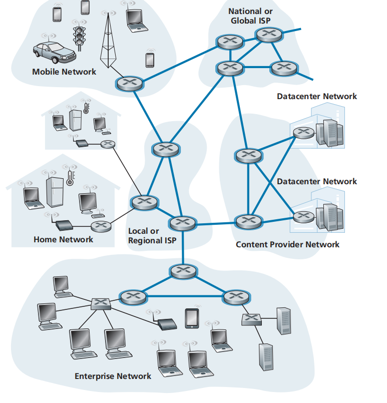

```
the internet is a network of networks
```

## 1.1 Packets Switch

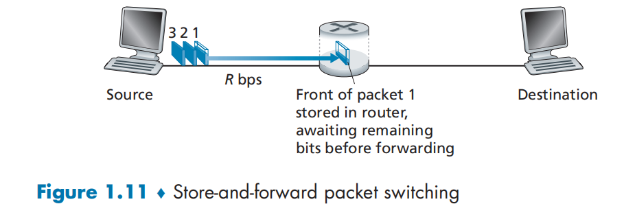

```
一个大文件会被拆分为多个packets传输
packets经过多个被link连接的link-switch和router到达目的地
```

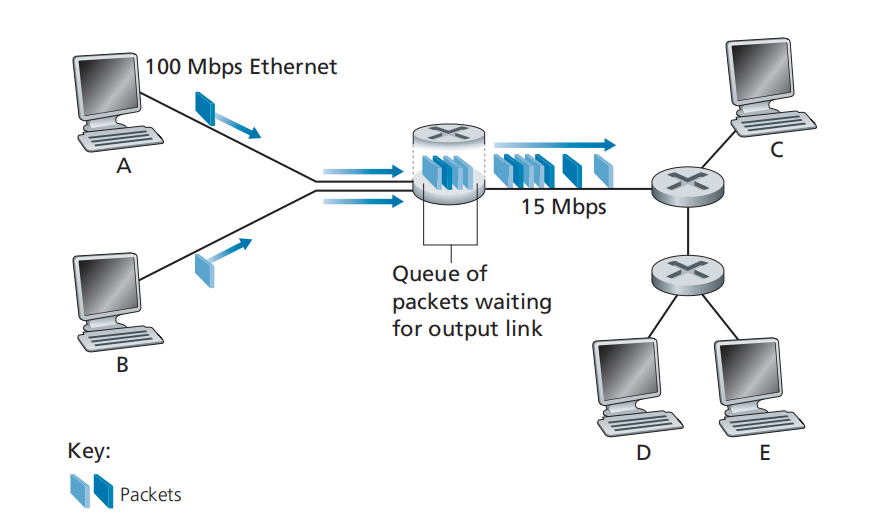

```
当congestion时, packet会进入queue, 当queue满了, packet会loss
```

## 1.2 Delay Loss Throughput

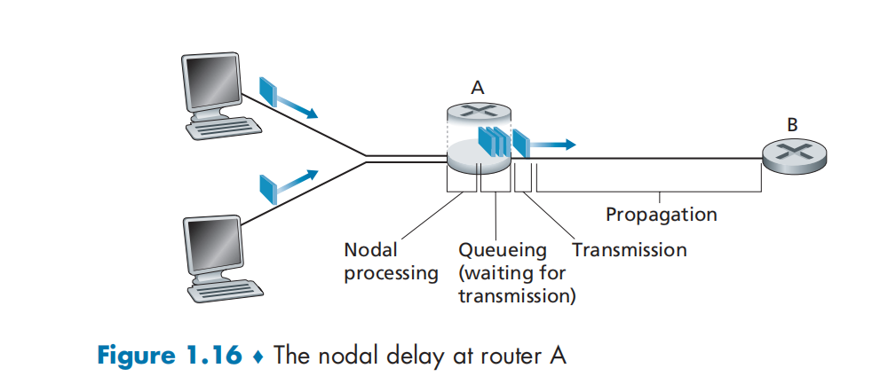

```
Processing Delay: 节点检查packet的header并判断投递到哪条线路的延迟
Queuing Delay: 网络拥塞, 排队延迟
Transmission delay:  将 packet 放入link的延迟, =(Length Of packet)/(rate of link)
propagation delay: 在link上传播的延迟
```

假设节点收到packet速率为a packet/sec 每个packet长度L, link传输速率为R bits/sec

```
traffic intensity = La/R
```

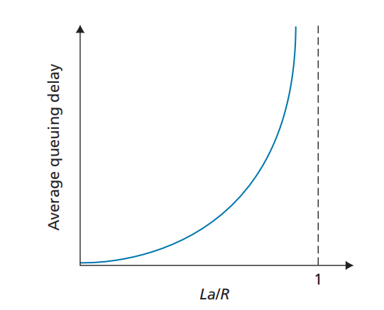

```
traffic intensity与平均queuing dealy关系
```

Throughput

```
throughput=接收方通过网络接收信息的速率 (bits/sec)
```

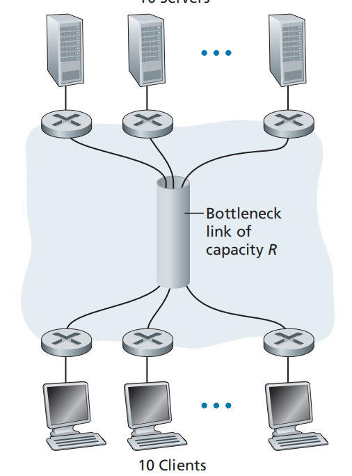

```
当多个link串联时, 总的throughput取决于throughput最小的link(bottleneck link)
```

## 1.3 Layered Architecture

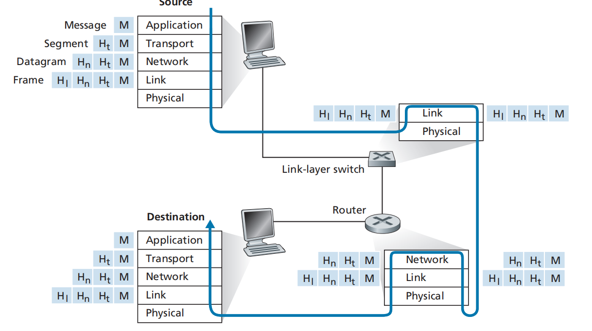

```
每层向上提供服务(encapsulation思想), top-down分别为:
Application layer
Transport layer
Network layer
Link layer
Physical layer
```

## 1.4 Network Security

```
常见的网络攻击分为
1. denial-of-service (DoS) attacks
2. 通过网络传播Malware(危险的软件)
3. 在router/switch/host上使用packet sniffer获取packet的copy窃取敏感数据
4.  IP spoofing caused by anyone可以轻易发送一个包含任意source-ip, destionation-ip, content的packet
```

常见Dos攻击

```
1. Bandwidth flooding: 发送大量packet到目标主机导致主机的link阻塞, 不能接收合法的packet
2. Connection flooding: 发送大量half-open or fully open TCP connections, 导致host不能响应合法连接
3. Vulnerability attack: 发送well-crafted messages给目标主机的应用/OS, 引发漏洞
```

# 2. Application Layer

## 2.1 Http概述

http&web概述

```
1. 一个web网页由html文件和referenced objects组成(jepg, mp3), 每个object都有url
2. http协议transport层使用tcp, http是stateless的
3. http server 默认端口80
```

Non-persistent Vs Persistent Http

```
Non-persistent:
 tcp connection open -> 最多传输一个object -> tcp connection close
persistent:
  tcp connection open -> 传输多个objects -> tcp connection close
```

Non-persistent http 需要两个RTT, 对于一个网页需要并行建立多个tcp connection

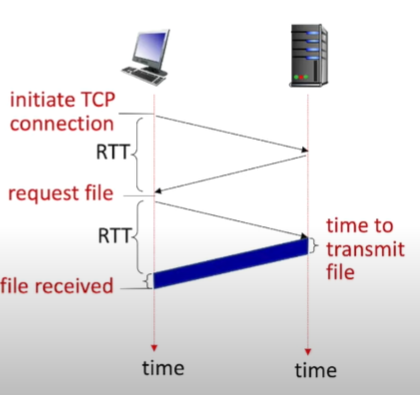

Http1.1使用Persistent http

## 2.2 Http请求响应格式

* 请求格式

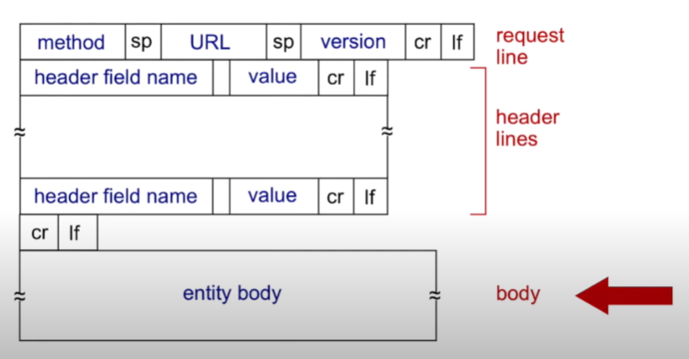

> CRLF是windows中的换行符 CR是Mac 换行符, LF是Unix中的换行符

* 响应格式

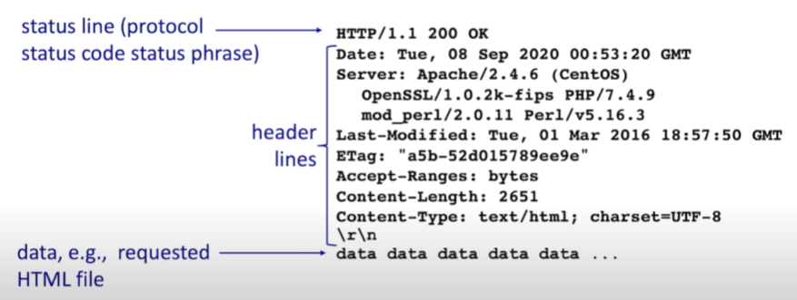

* 常见响应码

```
1XX: 请求正在处理中
200: ok
301: 永久重定向
400: 请求格式错误
401: 认证失败
403: 权限不足
404: not found
500: 服务器内部错误
```

* cookie

```
1. server响应header lines中添加 set-cookie: ...
2. cookie被browser管理
3. client以后请求的header lines 中都会添加cookie: ...
4. server管理cookie和user的对应关系(存数据库或缓存)
```

## 2.3 web cache&conditional get

* web cache

```
1. server响应的header lines 中添加Cache-Control: max-age=<sec> 允许缓存
```

允许缓存后可以直接请求local web cache server

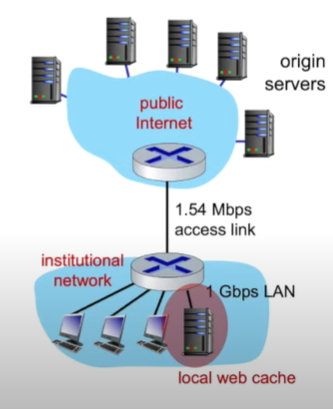

* Conditional http get

如果缓存中的object过时则响应新的object

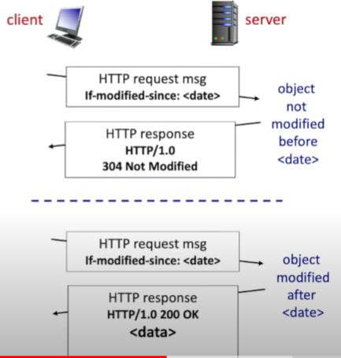

## 2.4 HTTP2&3

Http2的对比http1.1的改进

```
1. 会将首个的object 分成多个frame响应, 减轻HOL Blocking
2. 响应object的顺序基于object priority而不是request order
3. 会push client未被请求的object
```

Http3

```
1. 添加security
2. 添加per object error&congestion control over UDP
```

## 2.5 SMTP&IMAP

SMTP default port: 587


* SMTP协议与HTTP类似

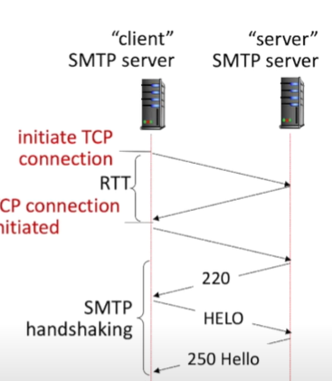

常见响应码220(服务器响应确认) 250(发送成功确认) 221(SMTP连接关闭)

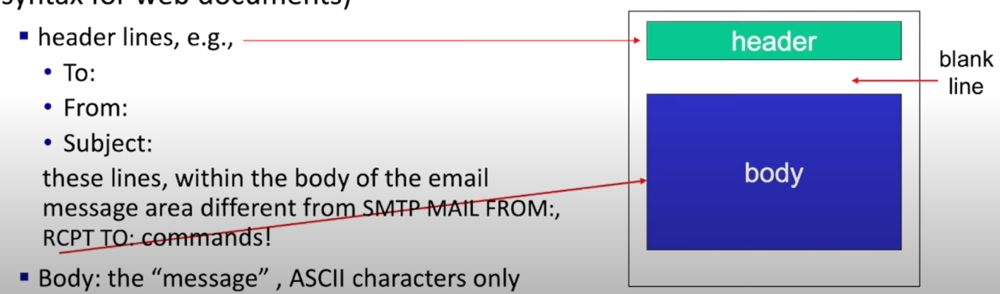

## 2.6 DNS

* DNS概述

```
1. DNS提供hostname->单个/多个ip的转换服务, 采用分布式,分层servers
2. Root DNS server, TDL DNS server均有镜像server
```

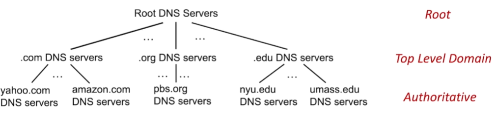

* 获取ip过程

```
1. 查询本机dns缓存
2. 查询local dns server缓存
3. local dns server查询root server, 获取TDL server 
4. local dns server查询TDL server, 获取authoritative server
5. local dns server查询authoritative server获取ip
6. local dns server 返回本机ip
```

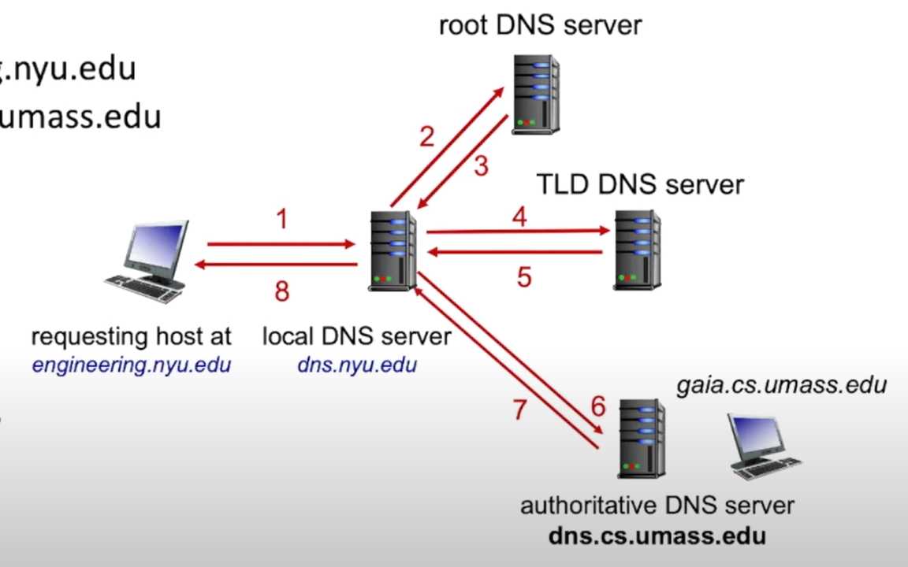

* DNS Resource Record格式

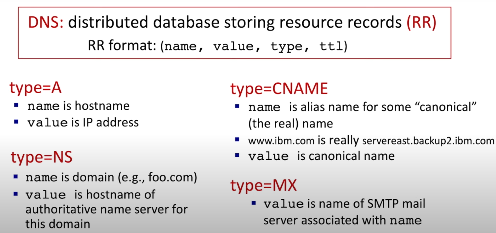

## 2.7 CDN(video stream为例)

大型视频网站需要存储大量的video, 采用单个Server会有single point of failure和congestion problem 采用CDN

CDN(content delivery network)

```
1. CDN服务器分布在网络边缘, 存储video等热点数据
2. client请求closer CDN server获取数据
3. PCDN使用P2P技术, 将用户主机作为CDN server
```

## 2.8 FTP

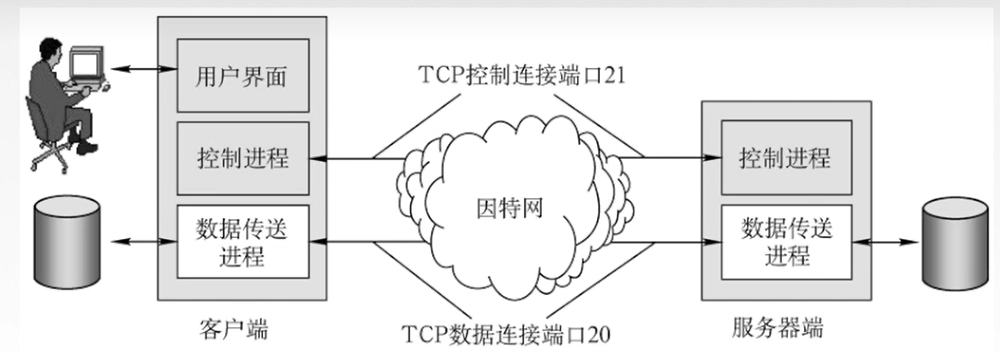

# 3. Transport layer

## 3.1 UDP

UDP特点:

* UDP不建立连接, Sender方只负责发送, 不关心Receiver是否接收到正确的Packet
* UDP提供不可靠的传输层服务, 即Sender发送报文1 2 3, Receiver收到的可能是1 3/ 1 2/ 3 2 1/ 1 2 4

Header包含 源Port+目标Port + Segment长度(单位Byte) + CheckSum 均为2Byte长度

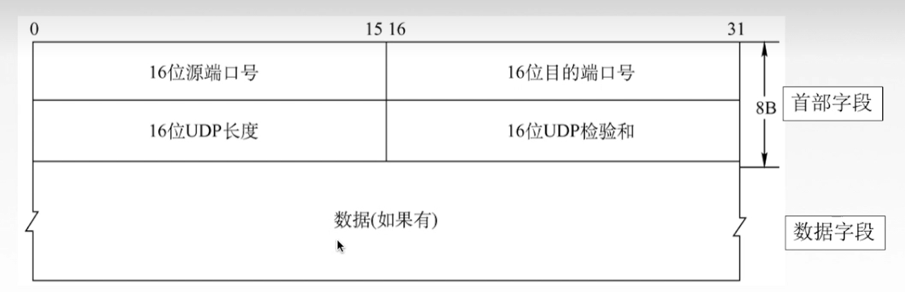


## 3.2 TCP

TCP 特点:

* 提供可靠通信, 即Sender发送 1 2 3, TCP会确保Receiver收到的是1 2 3
* TCP数据传输前会先建立连接, 数据传输后会关闭连接, 是面向连接的

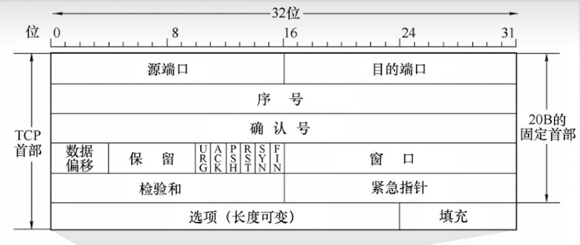

TCP Segment Header中:

* 数据偏移 = Header长度(Byte)/4

* seq = 负载数据的第一个字节的序号

```
如果发送的第一个Segment负载数据包含0-199th字节, seq = 0
发送的第二个Segment负载数据包含200-299th字节, seq = 200
```

* SYN = 1说明这个一个TCP连接请求建立segment
* ACK=1说明序号(ack)是有效的
* FIN = 1说明这是一个TCP连接关闭请求segment

## 3.3 TCP连接的建立和关闭

* 连接建立需要三次交互("三次招手")

1. Client.SYN = 1
2. Server.SYN = 1, ACK = 1
3. Clinet.ACK = 1 (负载数据)

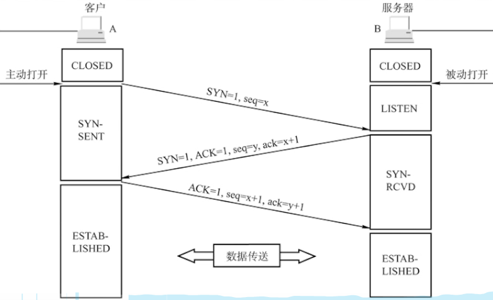

* 连接的释放需要四次交互("四次挥手")

1. Client.FIN = 1
2. Server.ACK = 1
3. Server.FIN = 1
4. Client.ACK = 1

2-3之间Server会发送数据给Client

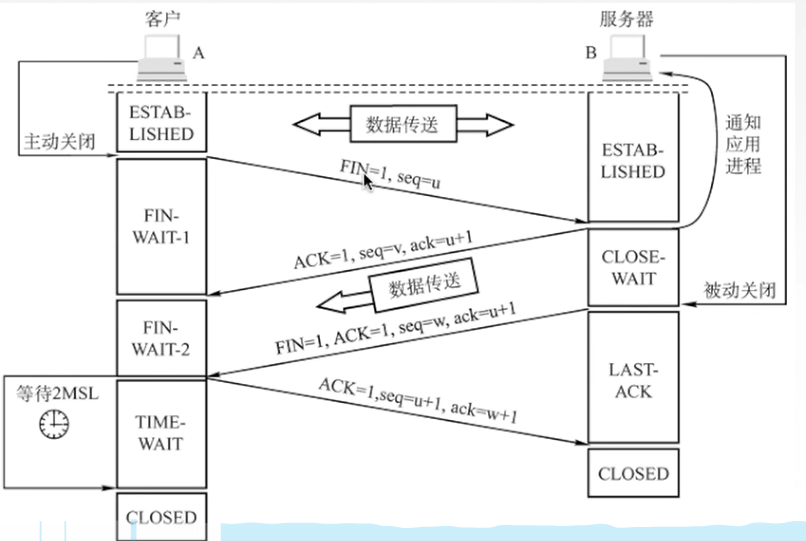

## 3.4 TCP可靠性的实现

总结: 滑动窗口+超时重传+冗余ACK

* 滑动窗口实际上就是发送/接收缓存

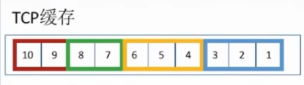

位于缓存中的segment可以同时发送, 当窗口前端的segment已经确认被Receiver正确收到后, 窗口移动一格

* 超时重传

当发送segment后经过一定时间后还没有收到ACK, 则重传该segment

> 重传间隔时间由被ACK的segment的RTT加权得到, 每收到ACK就更新RTTs, RTTs可以反映网络情况

* 冗余ACK

Sender同时发送seq = 1~10, 当Receiver接收到seq = 1 后没有接收到seq = 2而是直接接收到seq > 2的segment时, 会返回ack = 2, 当Sender接收到>=3个ack=2时会重传seq=2的segment

## 3.4 TCP拥塞控制

如何控制拥塞窗口的大小?

1. 开始时拥塞窗口大小呈2的指数增长
2. 超过阈值后线性增长
3. 发现网络拥塞后将拥塞窗口大小设置为最小值1, 并将阈值降低为发生拥塞时窗口大小的1/2

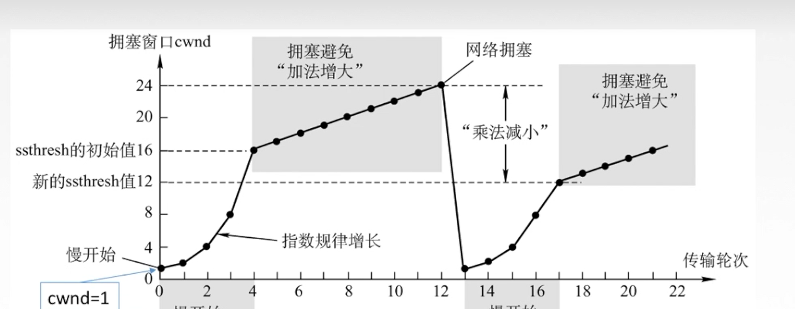


## 3.5 TCP流量控制

Receiver的ACK segment中 rwnd设置发送方滑动窗口的大小, 当Receiver滑动窗口满了, 可以设置rwnd = 0

发送方的rwnd=会定期向接收方探索新的rwnd

发送方的滑动窗口实际大小不仅取决于rwnd, 还取决与拥塞窗口大小

```
发送方滑动窗口大小 =  min(rwnd, 拥塞窗口大小)
```

# 4. Network Layer
