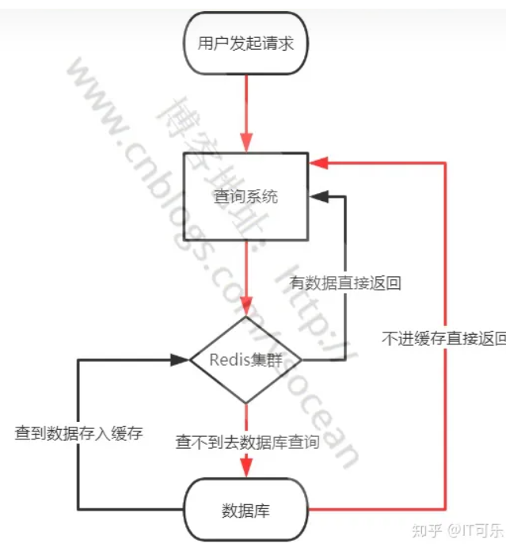

# 概念

## Redis为什么快?

```
1. 使用内存存储
2. 单线程避免了并发控制上锁和多线程之间的上下文切换
3. 使用多路复用io, 使用epoll系统调用
```

## 缓存三大问题



缓存穿透

```
频繁查询不存在的数据, 每次都经过redis缓存和数据库, 导致数据库承受不住
解决方法: redis缓存空值(设置较短过期时间)/bloom filter 
```

bloom filter原理

```
通过多个hash函数映射到bitmap的不同位置为1, 查询时如果有一个位置不是1则肯定不存在
```

缓存击穿

```
热点数据失效瞬间遇到大量请求, 请求转移到数据库
解决方法: 热点数据不过期/定时更新过期时间, 设置互斥锁 
```

缓存雪崩

```
大量热点缓存在短时间同时失效, 导致请求堆积到数据库
解决方法: 将热点数据的过期时间错开
```

## 缓存和数据库一致性问题

当数据库数据更新时, 缓存不会立刻更新, 会导致数据库和缓存不一致问题, 所以需要**更新数据库时需要删除缓存**

先删除缓存还是先更新数据库?

```
一般先更新数据库, 先删除缓存可能导致更新数据库期间, 读线程读取了脏数据到缓存中
先更新数据库缓存是脏数据的可能性小
```

先更新数据库一定不会发生不一致问题吗?

```
不一定, 如果在更新数据库期间, 缓存恰好失效, 读线程读取了数据库中的旧数据, 然后写入缓存在更新线程删除缓存之后, 就会不一致

解决方法为更新线程在删除缓存后, 将第二次删除缓存放到mq中, 延迟一顿时间后再次删除缓存
```

## Redis并发

redis如何保证高并发下不会出错

```
1. redis单线程, 且incr, decr等api是原子的
2. 可以使用分布式锁保障并发原子性
```

# Redis基础

## 类型和常用命令

查看符合模式的key

```
keys <pattern>
```

string类型命令

```
set <key> <value> <sec>
get <key> <value>
mset <key1> <value1> <key2> <value2>
mget <key1> <key2>
del <key>
expire <key> <sec>
persist <key>
```

五大基本类型: string list hash set zset(有序的set)

其他类型: geospitial, hyperloglog(统计uv, 底层算法是伯努利实验+概率估计), bitmap


## SDS

redis自定义的一个字符串数据结构

```
struct sdshdr{
     //记录buf数组中已使用字节的数量
     //等于 SDS 保存字符串的长度
     int len;
     //记录 buf 数组中未使用字节的数量
     int free;
     //字节数组，用于保存字符串
     char buf[];
}
```

可以o(1)获取字符串长度, 避免频繁的重新分配内存空间

## list, hash, zset实现

```
1. list:使用双端链表实现
2. hash: hash表可以扩容和缩容, 扩容和缩容时会创建一个新的hash表, 使用渐进式rehash, 可能同时维护两个hash表(put操作放到新hash表中, get查询两个hash表)
3. zset使用skiplist实现, 查询和增删更的复杂度均为logN, 且适合范围查询
```

# 数据存储

## 过期策略

常见的过期策略

```
1. 惰性删除: 只有读取数据时发现数据过期, 才删除数据
2. 定时删除: 每个一顿时间检查定时释放key的集合, 删除过期数据保障集合中过期数据稀疏
```


## 持久化

redis使用AOF/RDB进行缓存持久化

```
RDB:全量复制, 保存数据库快照
AOF: 增量复制, 将每个写命令/更新命令写入aof文件中
```

## Pipeline

pipeline是redis客户端和服务器之间的缓冲, pipeline等客户端发送的命令积累到一定数量后才会发送给服务器执行

# Redis集群

## 主从+哨兵集群

```
1. 主服务器负责写请求, 从服务器负责读请求
2. 主从服务器刚连接时进行一次全量复制, 当主服务器进行写时, 从服务器进行一次增量复制
3. 使用多个哨兵服务器监测所有服务器的状态, 如果多个哨兵认为某台服务器不可用则该服务器被移除集群, 如果主服务器不可用会从从服务器中重新选举主服务器
```

## Cluster

redis cluster本质上是多个主节点之间集群, 各个主节点之间保存数据的分片和副本, 通过冗余的方式来保障服务的高可用性

负载均衡算法使用一致性哈希算法, 一致性hash算法可以避免集群扩容时发生大量数据迁移

# 情景

## 如何实现排行榜?

使用zset, score根据比较字段优先级, 优先级高的字段占据高位

## 热点数据在单机如何优化?

将热点数据的key末尾添加随机数, 实现将相同的热点数据放到不同的服务器上
