# 1. 操作系统概述

## 1.2 操作系统如何启动

```
1. 通电后从ROM中将BIOS程序加载到内存中开始执行
2. BIOS会进行(POST)自我测试, 测试硬件是否ok
3. 通过MBR找到bootloader程序, 使用bootloader将硬盘中的os程序装入内存
4. 执行os程序, os接管计算机 
```

## 1.3 中断&系统调用

中断处理过程

```
0. 关中断
1. 保存进程的相关数据到栈中
2. 开中断
3. 执行中断处理程序
4. 关中断
5. 从栈中恢复进程的数据
6. 开中断
```

# 2. 进程

## 2.1 进程状态

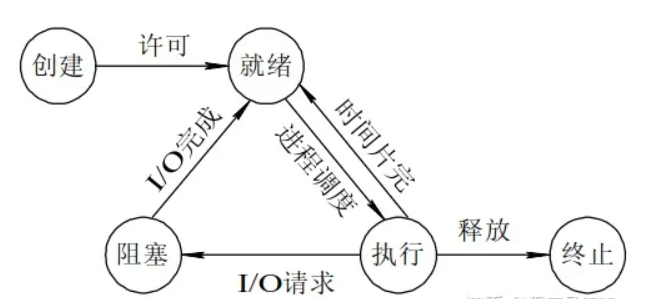

## 2.2 进程通信方式

共享存储

```
操作系统提供一个共享的存储空间, 互相通信的进程都可以访问这个共享存储空间但需要互斥访问
```

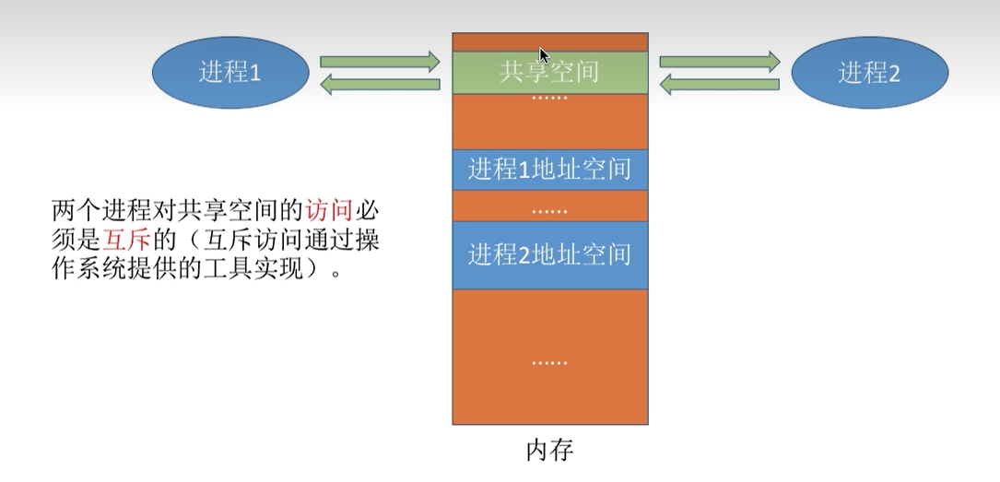

管道

```
操作系统在内存中开辟一个缓冲区作为管道(linux中的pipe文件), 一个进程只能往管道里写, 另外一个进程只能从缓冲区读, 一个管道是半双工通信
```

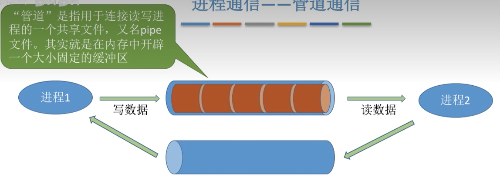

消息传递+消息队列

```
进程之间通信的信息被封装成消息, 通过操作系统放到接收消息进程的消息缓冲队列中
```

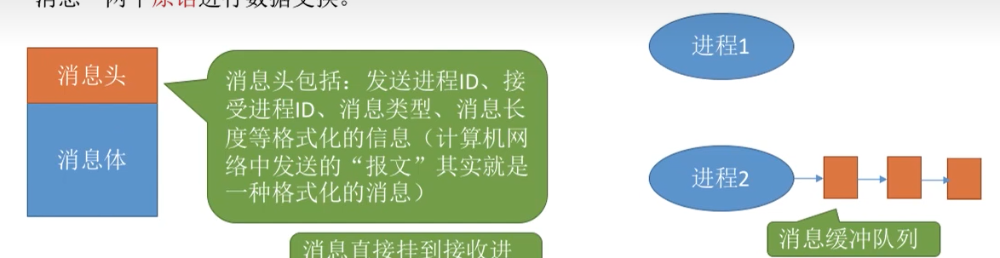

信号量

```
实际上是一个计数器, 用于进程之间的互斥, 包含p v操作
```

信号

```
linux操作系统中可以由内核/进程发送信号, 接收信号的进程需要强制对信号做出响应
```

## 2.3 用户级线程和内核级线程

```
ULT: 操作系统不可见, 使用应用程序实现
```

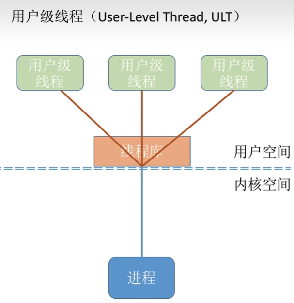

```
KLT: 由操作系统管理的线程, 操作系统可见
```

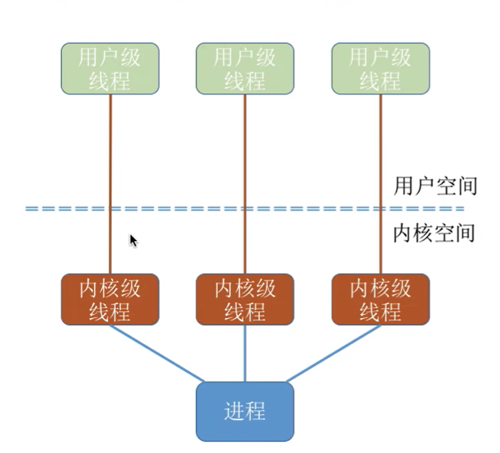

ULT和KLT可以同时支持

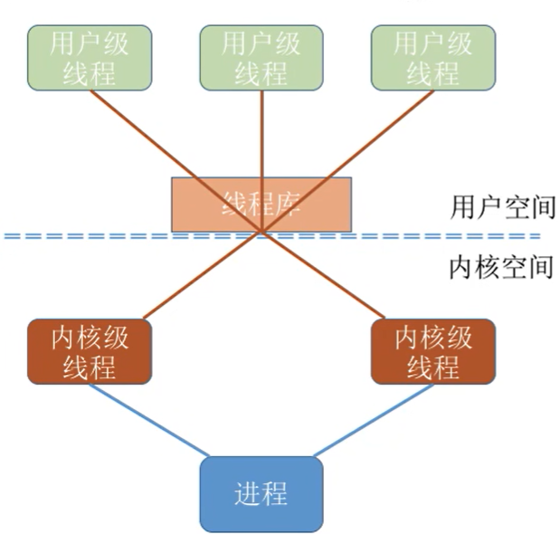

## 2.4 协程

```
协程是一种轻量级的虚拟线程, 一个线程可以有多个协程, 当协程IO阻塞时, 可以快速地切换到其他协程, 协程适合阻塞频繁的场景
```

## 2.5 进程调度算法

*FCFS: 先来先服务*


*SJF: 短作业优先*


HRRN: 高响应比优先


```
响应比高的任务优先服务
```

RR: 时间片轮换算法

```
为每个进程分配一定数量的时间片, 如果超出分配时间片还没有执行完就切换其他进程, 提前执行完会直接切换进程
```

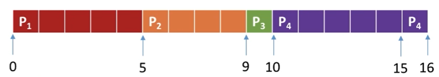

优先级调度

```
每个进程会有一个优先级, 每次选择优先级最高的进程执行!
```

多级反馈队列调度

```
有优先级不同的队列, 同优先级之间的调度使用RR,  同时高优先级队列中时间片时间更短
优先级高的队列中进入进程剥夺正在处理的低优先级进程的CPU
一个进程最先在优先级最高的队列中, 当分配的时间片内没有执行完会插入低优先级队列中
```

## 2.6 进程同步机制(用户进程)

信号量机制

```
wait(s), signal(s) 为原语操作, s表示资源的数量
```

管程

```
将管理的共享变量以及对共享变量的操作过程封装成一个Monitor对象
```

## 2.8 死锁

什么是死锁

```
多个进程之间的资源等待链形成环导致每个进程都阻塞的情况, 死锁的形成有四个条件:
1. 资源是互斥的, 不能多个进程共享
2. 进程是不可剥夺的, 不能强制终止进程
3. 进程持有资源且在等待其他资源
4. 资源等待链形成环

```

如果检测死锁和解决死锁?

```
检测资源分配图中是否存在环, 若存在则说明有死锁

操作系统对于死锁要么视而不见, 要么杀掉死锁环中的一个进程
```

如何避免死锁?

```
破坏死锁形成的四个条件
1. 资源共享
2. 资源等待时间过长时剥夺进程的执行权
3. 先获取所有资源再执行
```

# 3. 内存

## 3.1 页式存储

内存分为大小固定的页, 避免了内部碎片过大, 一个进程可以使用多个不连续的页

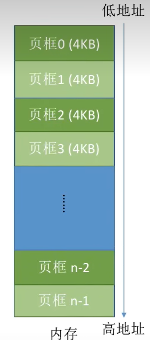

进程使用虚拟地址(虚拟页号+页内偏移), 需要通过主存中的页表(每个进程一个)查找到物理页号

## 3.2 段式存储器

程序被显式地分为多个长度不相等的段, 当执行一个段内的代码时不需要其他段, 通过主存中的段表找到段在主存中的起始地址和长度

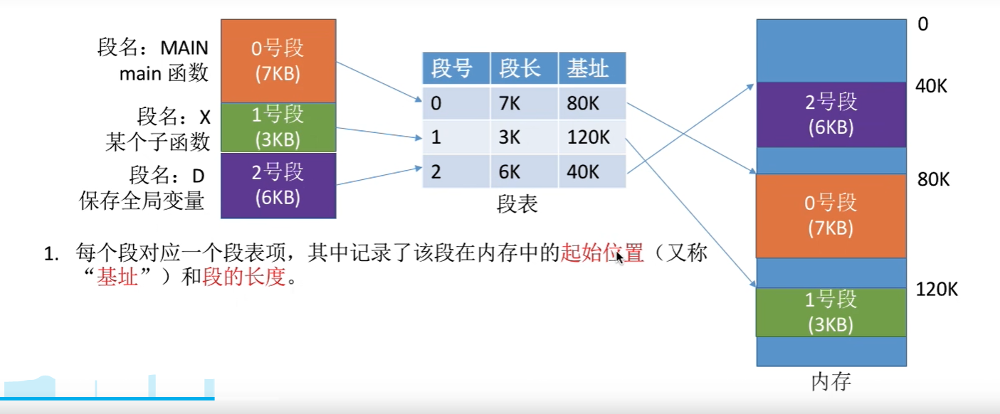

## 3.3 段页式存储器

程序被显式地分为多个长度不相等的段, 每个段对应一个页表

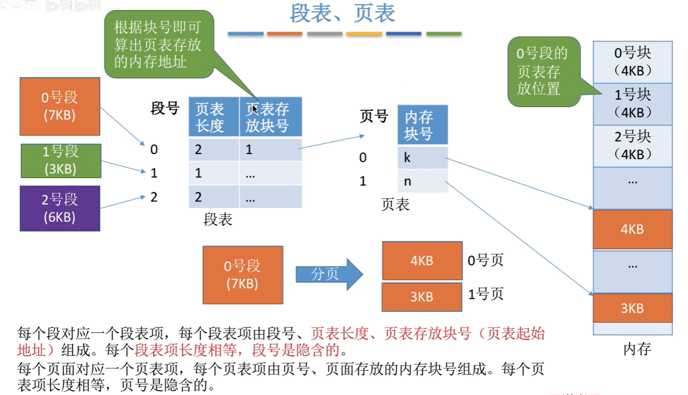

地址被分为段号, 页号, 页内偏移


## 3.4 虚拟存储器

程序使用的是虚拟地址(从0开始, 跟实际存储器的地址无关), 通过页表将虚拟页号转换成物理页号

页表项不仅包含物理页号, 还包含状态位(该物理页号是否在内存中), 脏位(是否被写入), 外存地址(该页对应外存中位置)

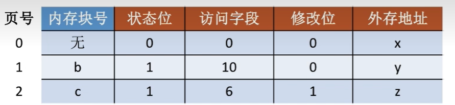

```
当程序需要页号为x的页时, 查询页表看是否在内存中, 如果不在就发生缺页中断, 从外存中调入内存的一个块中(替换算法替换掉其他页), 并将内存块号设置为调入的内存页号
```

## 3.5 页面置换算法

最佳置换算法(OPT)

```
替换掉以后最长时间不会使用的页面(需要能够预知以后会使用哪些页面)
```

先进先出(FIFO)

```
替换最先进入内存的页面
```

最近最少使用(LRU)

```
替换最久没使用过的页面
```

最少使用LFU

```
替换总使用次数最少的页面
```

时钟置换算法(CLOCK)

```
循环扫描内存中的页(所有内存中的页形成一个环形链表, 指针指向一个特定的页),  如果页在上一次扫描后没有被使用过, 则替换
```

## 3.6 交换区和抖动现象

外存分为IO速度更快的对换区和IO较慢的文件区, 缺页中断时根据局部性原理会从文件区预调入一些页面到交换区

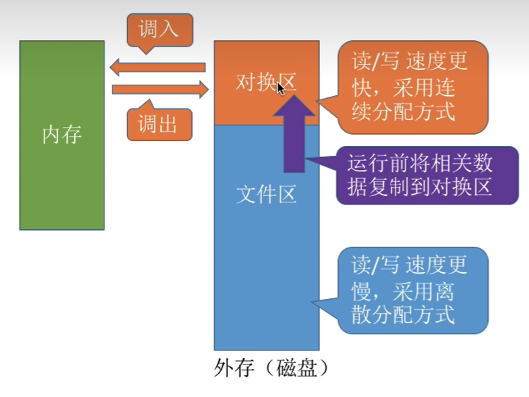

当操作系统给进程分配的最大内存页数量小于进程常用的页的数量时, 会频繁地发生缺页中断, 这种现象叫做抖动

# 4. 磁盘和外存

## 4.1 文件在外存中的显式链接存储

文件的逻辑地址高位为逻辑块号, 实际映射成物理块号从存储器中访问

文件目录项只记录文件的起始物理块号

操作系统在内存中维护一个FAT(文件分配表), 上面有每个物理块号的下一个块号, 物理块号之间形成一个链表

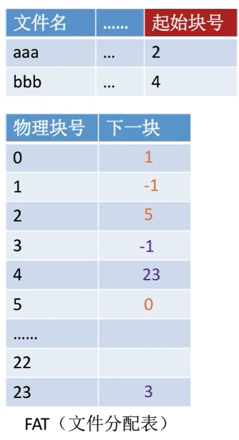

这样对于特定文件的特定块号, 操作系统可以之间计算出在外存中对应的块号

## 4.2 硬链接和软连接

硬链接: 文件目录项指向索引节点, 索引节点再指向文件物理地址(文件目录项相当于一个二级指针)

```
当删除硬链接时, 只会删除二级指针, 只有二级指针全部删除时才会删除一级指针(索引节点)
```

软连接: 相当于创建一个共享文件的快捷方式

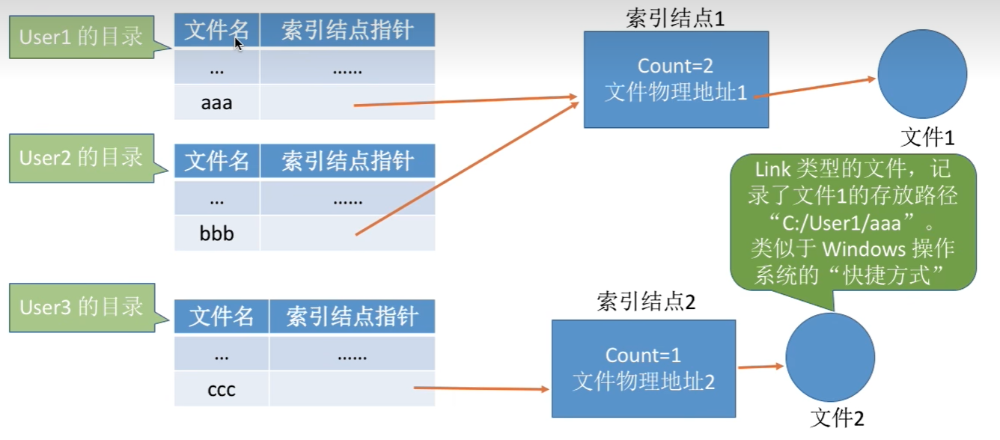

## 4.3 磁盘调度算法

磁盘分为柱+盘面+磁道+扇区, 读取时磁头指针会再不同磁道之间移动, 当多个进程需要访问磁盘时, 会访问不同的磁道, 这时需要调度磁头指针从而减少磁头指针移动的时间

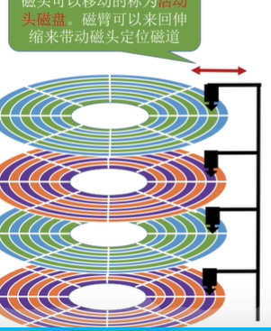

FIFS: 先来先服务

```
先请求访问的磁道先I/O, 如果连续请求访问的磁道距离过远耗时较长
```

SSTF: 最短寻找时间优先

```
每次将磁头移动到离当前磁道最近的需要IO的磁道(贪心算法, 可能造成饥饿)
```

SCAN: 扫描算法

```
磁头从最小磁道0号到最大磁道号之间循环移动
```

LOOK

```
SCAN算法的改进, 不必移动到最大磁道号/最小磁道号才转换方向, 只需要移动到最大请求的磁道号和最小请求的磁道号就转换磁头方向
```

C-SCAN C-LOOK

```
scan和look算法的改进, 将循环移动改为单向移动, 返回起点时直接快速移动
```

## 4.4 unix IO模型

BIO

```
调用系统调用后进程阻塞直到内核将数据从内核缓冲区复制到进程缓冲区
```

NIO

```
调用系统调用后, 如果内核缓冲区没有准备好直接返回错误码, 进程轮询
```

多路复用IO

```
调用系统调用select/poll/epoll后进程阻塞, 操作系统查询多个文件描述符, 至少有一个准备好了就返回
```

AIO

```
使用aio_read后直接返回, 程序继续执行, 当io完成时会执行回调程序
```

select/poll/epoll原理

```
select和poll采用轮询方式, 时间复杂度为O(n)
epoll 底层使用IO事件+红黑树+双向链表, 时间复杂度O(1)
```

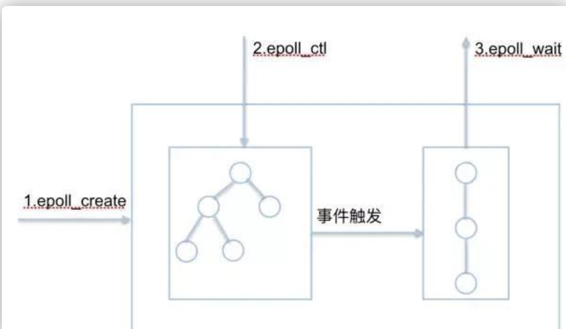
