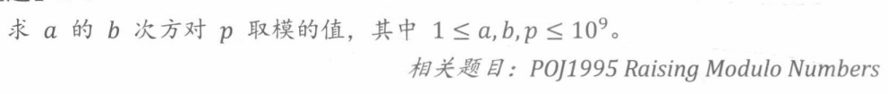
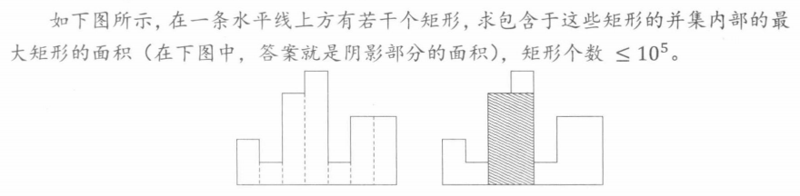
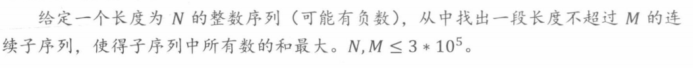
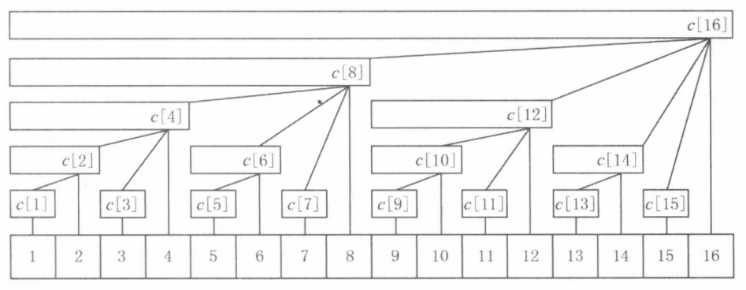
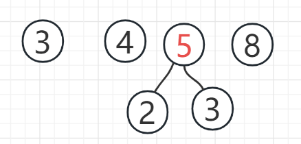
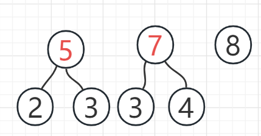
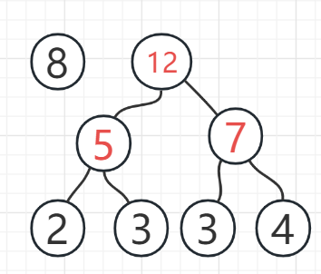
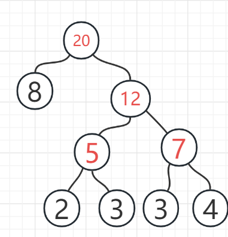

# 1. 基本算法

## 1.1 位运算

整数的表示和范围

```cpp
int 32位补码 maxValue > 2e9
long long 64位补码 maxValue > 9e18
```

特殊的xor运算的语义

```cpp
a xor 0xffffffff // 异或全1 = 按位取反
b xor 0x00000000 // 异或全0 = 不变
c xor 1 // 异或1 = 奇偶成对变换(0和1, 2和3, 4和5)
```

常见的位运算

```cpp
namespace bit { // 位运算
    int getKthBit(int a, int k = 0) { // 返回第k位
        return (a >> k) & 1;
    }

    void reverseKthBit(int &a, int k = 0) {// 第k位取反
        (a) ^= (1 << k);
    }

    void setKthBit(int &a, int k = 0, bool setToZero = true) { // 将第k位设置为0 or 1
        if (setToZero) (a) &= ~(1 << k);
        else (a) |= (1 << k);
    }

    int mul2N(int a, int n = 1) { // a*(2^n)
        return a << n;
    }

    int div2N(int a, int n = 1) { // a/(2^n), 向下取整
        return a >> n;
    }

    int lowbit(int a) { // 取整数a从右到左第一个1和右边所有0
        return a & (~a + 1);
    }

    int count1(int a) { // 统计正数a, bit位=1的个数
        if (a == 0)
            return 0;
        int ans = 1;
        int t = lowbit(a);
        while (t != a) {
            ans++;
            a -= t;
            t = lowbit(a);
        }
        return ans;
    }
}
```

`x >> 1` 与 `x / 2` 的区别 ?

```
x >= 0 时两者语义相同, 均向下取整
x < 0 时 >>向下取整, /向上取整
```

**例题**



```cpp
int pow(int a, int b, int p) { // a^b mod p
    if (p == 1) return 0;
    int ans = 1;
    while (b != 0) {
        if ((b&1) == 1) ans *= a;
        a = (long long) (a*a) % p;
        b >>= 1;
    }
    return ans;
}
```

## 1.2 递归&动规

递归问题四大要素

```
1. 寻找相似的子问题
2. 确认边界条件
3. 回溯
4. 剪枝
```

***例题***


```java
    private void dfs(int i, LinkedList<Integer> cur) {
        // 剪枝
        if (cur.size() > m || cur.size() + n - i + 1 < m) return;
        // 搜索边界
        if (i == n+1 && cur.size() == m) {
            System.out.println(cur);
            return;
        }
        dfs(i+1, cur);
        cur.add(i);
        dfs(i+1, cur);
        // 回溯
        cur.removeLast();
    }
```

## 1.3 前缀和&差分数组

**前缀和**: 前缀和数组可以快速求得子数组的和

```java
    // 返回前缀和数组
    private int[] preSum(int[] nums) {
        int[] preSum = new int[nums.length];
        int t = 0;
        for (int i = 0; i < nums.length; ++i) {
            preSum[i] = t = t + nums[i];
        }
        return preSum;
    }

//子数组nums[i, j]的和为 preSum[j] - preSum[i-1]
```

**差分数组**: 差分数组可以快速记录一个区间的变化

```java
    // 返回差分数组
    public int[] diff(int[] nums) {
        int[] diff = new int[nums.length];
        int t = 0;
        for (int i = 0; i < nums.length; ++i) {
            diff[i] = nums[i] - t;
            t = nums[i];
        }
        return diff;
    }

//nums[i, j]区间全部+1等价于 diff[i] += 1, diff[j+1] -= 1;
```

## 1.4 二分法

**整数的二分查找(两种形式)**

```java
    // 查找target或target的后继
    int geThan(int[] arr, int target) {
        int l = 0, r = arr.length;
        while (l < r) {
            int m = (l + r) >> 1;
            if (arr[m] < target) l = m + 1;
            else r = m;
        }
        // 所有数都小于target
        if (l == arr.length) return -1;
        return l;
    }

    // 查找target或target的前驱
    int leThan(int[] arr, int target) {
        int l = -1, r = arr.length - 1;
        while(l < r) {
            int m = (l + r + 1) >> 1;
            if (arr[m] > target) r = m - 1;
            else l = m;
        }
        return l;
    }
```

**两种形式的区分方法**

`m = (l + r) >> 1` 这种形式m不会取值为r, 所以r可以为arr.length, 适合找后继

`m = (l + r + 1) >> 1` 这种形式m不会取值为l, 所以l可以为-1, 适合找前驱

**实数域内二分**

```java
    // 实数二分法(以找平方根为例)需要设置精确度, l + 精确度 >= r 时停止二分
    double sqrt(double x) {
        double l = 0, r = x / 2, eps = 1e-5;
        while (l + eps < r) {
            double m = (l + r) / 2;
            if (m * m > x) r = m;
            else l = m;
        }
        return l;
    }
```

**求最优值转化为二分+判断**

最优化问题中如果评估方案的指标满足单调性(如果评估值X可行, 那么评估值Y>X也可行), 那么可用二分法求最小可行评估值

```java
    // 求最优化问题的最小值转为二分+判断 (假设: 如果judge(m) = true, 那么必有judge(m+1)=true)
    int binarySearch() {
        int l = 0, r = 1000; // 最优值的边界
        while (l < r) {
            int m = (l + r) >> 1;
            if (judge(m)) r = m;
            else l = m + 1;
        }
        return l;
    }
```

## 1.5 排序

**中位数**

```
中位数重要性质: 中位数到其他数的距离之和最小
O(N)复杂度求出中位数: 使用类似快排算法求解第K个数(k = n / 2)
O(NlogN)复杂度求出动态中位数: 使用大顶堆+小顶堆, 维护大顶对大小S和小顶堆大小s满足: s == S || s = S + 1
```

**排序中常见的问题**

```
第K大的数: 使用快速排序的思想可以在O(N)求出来
逆序对个数: 使用归并排序在合并两个子数组的时候统计逆序对个数, 复杂度O(NlogN)
```

# 2. 数据结构扩展

## 2.1 栈和队列

如何O(1)时间查询栈的特殊值?

```
使用另一个栈维护特殊值
```


如何用栈计算中缀表达式的结果?

```
1. 遇到操作数先将操作数入栈
2. 遇到操作符时判断栈顶的操作符, 如果当前操作符是), 不断计算栈顶的操作符直到栈顶为(, 如果当前操作符是+-*/时判断栈顶操作符的优先级是否更高, 更高时直接计算栈顶操作符
```

**单调栈/队列思想:** 使用单调栈/队列维护可能的解, 从而排除不可能的解





**优先队列**: O(logN)时间内求出最值

## 2.2 字符串

**KMP算法**

什么是KMP算法 ?

```
KMP算法可以求出字符串text[0~N]中是否包含子字符串pat[0~M], 以及子字符串pat的位置, 时间复杂度为O(M+N)
```

KMP算法的步骤 ?

```
1. 根据pat字符串求出next数组
2. 使用双指针进行匹配, 由于使用next数组, 指向text当前匹配位置的指针在匹配过程中不会回溯
```

KMP中next数组的含义 ?

```
next(i) = k 表示pat[0~i]这个字符串最大"对称度"为k, 如abcab中 前缀ab = 后缀ab, "对称度" = 2
```

KMP算法伪代码

```java
    public int kmp(String text, String pat) {
        int[] next = getNext(pat);
        for (int i = 0, j = 0; i < text.length() && j < pat.length();) {
            if (text.charAt(i) == pat.charAt(j)) { // 匹配成功
                i++;
                j++;
                if (j == pat.length()) return i - pat.length();
            } else {
                if (j != 0) j = next[j - 1];
                if (j == 0) i++;
            }
        }
        return -1;
    }
```

next数组的求法(KMP算法的精华所在) ?

```
定义: j是next(i)的候选值 等价于 pat[0~j-1] = pat[i-j+1~i]
可以通过反证法证明: 如果j时next(i)的侯选值, 那么next(i)的候选值中小于j的最大候选值为next(j)

要求next(i), 即从大到小判断 (next(i-1)的候选值+1) 是否为next(i)
```

```java
    int[] getNext(String pat) {
        int[] next = new int[pat.length()];
        for (int i = 1; i < pat.length(); i++) {
            // next[i-1]为初始候选值
            int k = i - 1;
            // 如果pat.charAt(next[k]) != pat.charAt(i), next[k]更新为下一个更小的候选值
            while (k != 0 && pat.charAt(next[k]) != pat.charAt(i)) k = next[k];
            if (pat.charAt(next[k]) == pat.charAt(i)) next[i] = next[k] + 1;
        }
        return next;
    }
```

## 2.3 Tire树

字典树的作用 ?

```
用于快速检索字符串集合中的某个字符串
```

字典树代码实现

```java
public class Tire {
    public TireNode root;
    private int charsetSize; // 一般为26
    private char minChar; // 一般为'a'
    // 往字典树中插入一个字符串s = inc(s, 1)
    public int inc(String s, int increment) {
        TireNode cur = root;
        int n = s.length(), idx;
        for (int i = 0; i < n; i++) {
            idx = s.charAt(i) - minChar;
            if (cur.chars[idx] == null) {
                cur.chars[idx] = new TireNode(charsetSize);
            }
            cur = cur.chars[idx];
        }
        cur.data += increment;
        return cur.data;
    }
}
```

*Tire树例题*


## 2.4 Huffman树

什么是Huffman树?

$$
\sum W_i * L_i 最小的树, 其中W_i = 叶节点权重, L_i为根到叶路径的长度
$$

k阶Huffman树构造方法 ?

```
1. 每次从森林中选择两个根节点值最小的树(假设根节点的值为x, y)合并为根节点值为x+y的新树
2. 初始森林中叶节点的数量n需要满足
```

$$
(n - 1) mod (k-1) == 0
$$

```
不满足时添加权重为负无穷的节点
```

## 2.5 并查集

什么是并查集 ?

```
并查集动态维护一个森林, 森林中每个树的所有节点属于一个集合(根节点为这个集合的代表元素), 并且任意两个集合之间的交集为空.

并查集支持以近似常量的复杂度对两个集合进行合并(merge)/查询某个元素属于那个集合(get)
并查集适合处理传递性关系(等于运算/无向图中两个节点是否连通)
```

并查集代码实现

```java
public class UnionSet {
    int[] father; // 记录每个节点的父节点
    int[] rank; // 记录树的大小
    public UnionSet(int size) {
        father = new int[size];
        rank = new int[size];
        Arrays.fill(rank, 1);
        for (int i = 0; i < size; i++) {
            father[i] = i;
        }
    }
    public int get(int id) {
        if (id == father[id]) return id;
        return father[id] = get(father[id]); // 路径压缩
    }
    public void merge(int id0, int id1) {
        int tree0 = get(id0);
        int tree1 = get(id1);
        if (tree1 == tree0) return;
        if (rank[tree0] > rank[tree1]) { // 按秩合并
            rank[tree0] += rank[tree1];
            father[tree1] = tree0;
        } else {
            rank[tree1] += rank[tree0];
            father[tree0] = tree1;
        }
    }
}
```

## 2.6 树状数组

树状数组使用一个树维护一个序列的前缀和, 可以在log(N)时间内查询前缀 / 进行单点增加



树状数组中tree[x]表示什么?

```
tree[x]表示arr[1~x]之间的一个小区间arr[x-lowbit(x)+1 ~ x]的和
```

如何查询前缀和?

```
arr[1~x]的和 = tree[x] + tree[x-lowbit(x)] + ...
相当于求节点tree[x]与左侧兄弟节点的和

tree[x]左侧兄弟节点为tree[x - lowbit(x)]
```

```java
    // 查询前缀和
    public int ask(int x) {
        if (x >= n) x = n - 1;
        x++;
        int sum = 0;
        for (; x > 0; x -= lowBit(x)) {
            sum += tree[x];
        }
        return sum;
    }
```

如何进行单点增加?

```
要想使arr[x]的值增加increment, 将从叶节点tree[x]到根节点的路径中所有节点的值增加increment

tree[x]的父节点为tree[x + lowbit(x)]
```


# 3. 解空间的搜索

## 3.1 DFS常见剪枝方法

```
1. 记忆化剪枝: 在对图使用DFS搜索时, 可以标记一个节点是否访问过, 如果访问过则在搜索时跳过

2. 优化搜索顺序: 先搜索规模小的子树, 再搜索规模大的子树

3. 可行性剪枝: 如果当前分支一定搜索不到答案, 立刻返回

4. 最优化剪枝: 如果确认当前分支以后可以搜索到的答案一定不会优于当前搜索到的最优答案, 立刻返回
```

## 3.2 BFS变形

什么是优先队列BFS?

```
一般的BFS问题等价于在边长均为1的图中搜索两点之间的最短路径
优先队列BFS等价于在边长不定的图中搜索两点之间的最短距离, 时间复杂度为N.log(N)
```

什么是A*算法?

```
在优先队列BFS的基础上, 使用未来代价预估函数costFuture(state) + 当前状态的代价costNow(state) 的值作为优先队列BFS排序的依据

必须满足条件: 未来代价预估函数costFuture(state) <= 当前状态到目标状态真实代价realCost(state), 才能保证: 到目标状态的最小代价路径先于其他路径出队
```

## 3.3 迭代加深

什么是迭代加深(ID-DFS)算法?

什么是IDA*算法?

# 4. 基础数学

## 4.1 质数

质数定义: `如果一个正整数x(x>=2), 满足2~x-1均不能整除x, 那么x是一个质数`

质数相关算法

```
// 判断一个数是否是质数
// 筛选出2~N之间的质数
```

# 背包问题

dp[i][j]表示前i个物品在容积不超过j时的最大价值

```
01背包问题状态转移方程
dp[i][j] = max(dp[i-1][j], dp[i-1][j-weight[i]] + value[i])

完全背包问题状态转移方程
dp[i][j] = max(dp[i-1][j], dp[i][j-weight[i]] + value[i])
```

# 并查集

```java
public class UnionFindSet {
    private int[] father; // idx的集合代表元素为father[idx]
    private int[] height; // idx为根节点的树的高度为height[idx]
    public UnionFindSet(int n) {
        father = new int[n];
        height = new int[n];
        for (int i = 0; i < n; i++) father[i] = i;
    }
    public int find(int idx) { // 返回idx所在集合代表元素
        if (father[idx] == idx) return idx;
        return father[idx] = find(father[idx]); // 缩短路径并返回代表元素
    }
    public void union(int x, int y) {
        int xf = find(x), yf = find(y);
        if (xf == yf) return;
        if (height[xf] > height[yf]) {
            father[yf] = xf;
            return;
        }
        father[xf] = yf;
        if (height[xf] == height[yf]) height[yf]++;
    }
    public boolean isInSameUnion(int x, int y) {
        return find(x) == find(y);
    }
}
```

# 最短路径算法

## Dijstra算法

算法适合场景: 求单点到图中其他所有点的最短路径, **单个路径长度>0**

算法思想: 每次从**没有访问过的节点**中选出离源点距离最短A节点, 用 `A节点到B的出边长+ 源点到A点距离`更新 `源点到B点最短距离`.

Java代码

```java
public int[] dijstra(int[][] graph, int source) {
    int n = graph.length;
    int[] curDist = new int[n];
    boolean[] visited = new boolean[n];
Arrays.fill(curDist, Integer.MAX_VALUE);
curDist[source] = 0;
    while (true) {
        int from = -1, minDist = Integer.MAX_VALUE;
        for (int i = 0; i < n; i++) {
            if (!visited[i] && curDist[i] < minDist) {
                minDist = curDist[i];
from = i;
}
            if (from == -1) return curDist;
            else {
                visited[from] = true;
                for (int to = 0; to < n; to++) {
                    curDist[to] = Math.min(curDist[to], graph[from][to] + curDist[from]);
}
            }
        }
    }
}
```

如果要求最短路径, 每次更新最短距离值时更新最短路径, 每次选取A点时使用A点的最短路径进行扩展

## Floyd算法

算法适合场景: 图中任意两点之间的最短路径

算法思想: 枚举每个点作为中点, 假设A->中点->B 的距离小于当前A->C, 更新A->C距离

```java
public int[][] floyd(int[][] graph) {
    int[][] dp = graph; //dp[i][j]表示i到j的最短距离, +INF 表示 不可达
int n = dp.length;
    for (int mid = 0; mid < n; mid++)
        for (int i = 0; i < n; i++)
            for (int j = 0; j < n; j++)
                dp[i][j] = Math.min(dp[i][j], dp[i][mid] + dp[mid][j]);
    return dp;
}
```

# 图最小生成树算法

在图中找到能够让N个节点直接相连/间接相连的N-1个边使得N-1个边之和最小

## Prim算法

算法思想

```
1 : 从全部节点集合V中任选一个点移动集合S中
2 : 从没有选择的边中找到最短的边E, 满足start(E)属于S, end(E)属于V
3 : 将end(E)从V中移动到S, E加入已经选择的边
4 : 重复2,3直到 S包含全部节点 or  (2)中找不到E
```

## Kruskal算法

# Huffman压缩算法

## huffman树构造

huffman树构造算法思想:

```
每次从森林中找两个根最小的树合并, 合并后的根为两者根节点和, 再将合并后的树加入森林
```


2 和 3 最小



3和4最小



5和7最小



8和12最小



## 编码和WSL

从根节点开始, 左0右1, 无重复前缀


```
8: 0
2: 100
4: 111
```

带权路径长度

```
WSL = 8*1 + 2*3 + 3*3 + 3*3 + 4*3
```
