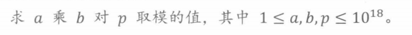
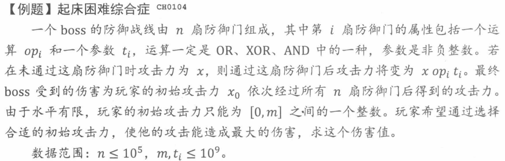
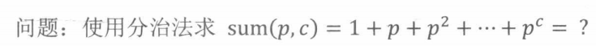
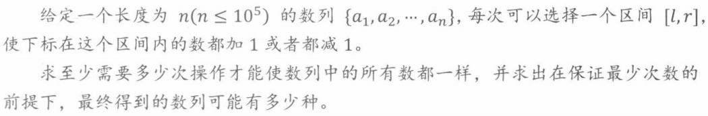
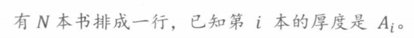
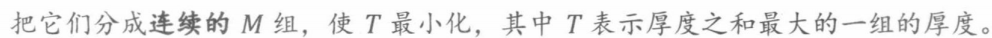
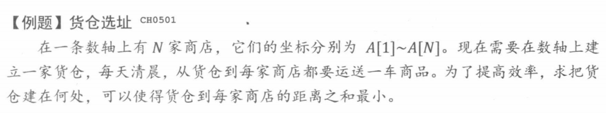
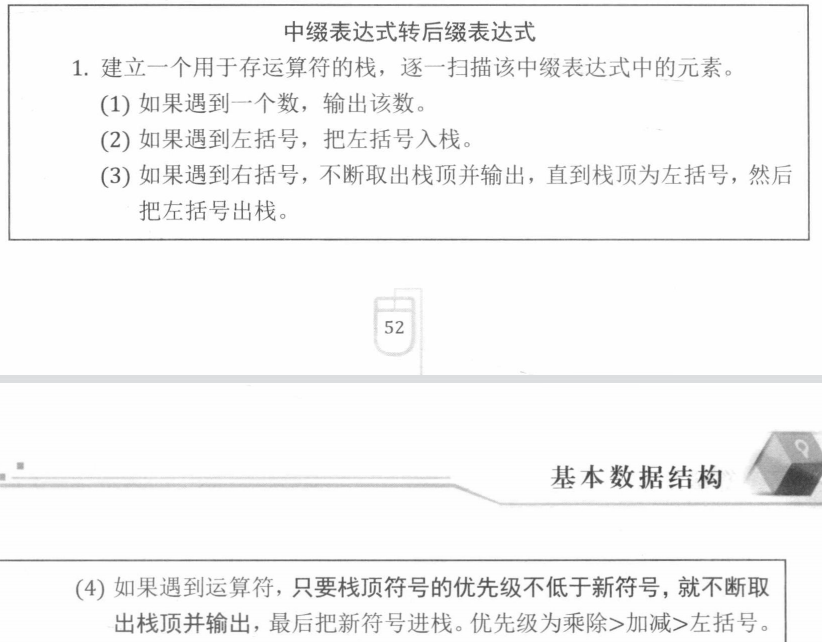

# 基本算法

## 位运算

整数的表示和范围

```cpp
int 32位补码 maxValue > 2e9
long long 64位补码 maxValue > 9e18
```

xor运算

```cpp
a xor 0xffffffff // 按位取反
b xor 0x00000000 // 不变
c xor 1 // 奇偶成对变换 0和1, 2和3, 4和5
```

常见的位运算

```cpp
namespace bit { // 位运算
    int getKthBit(int a, int k = 0) { // 返回第k位
        return (a >> k) & 1;
    }

    void reverseKthBit(int &a, int k = 0) {// 第k位取反
        (a) ^= (1 << k);
    }

    void setKthBit(int &a, int k = 0, bool setToZero = true) { // 将第k位设置为0 or 1
        if (setToZero) (a) &= ~(1 << k);
        else (a) |= (1 << k);
    }

    int mul2N(int a, int n = 1) { // a*(2^n)
        return a << n;
    }

    int div2N(int a, int n = 1) { // a/(2^n), 向下取整
        return a >> n;
    }

    int lowbit(int a) { // 取整数a从右到左第一个1和右边所有0
        return a & (~a + 1);
    }

    int count1(int a) { // 统计正数a, bit位=1的个数
        if (a == 0)
            return 0;
        int ans = 1;
        int t = lowbit(a);
        while (t != a) {
            ans++;
            a -= t;
            t = lowbit(a);
        }
        return ans;
    }
}
```

> 算数左移是向下取整, 负数时需要注意, 如-3>>1 == -2 and -1 >> 1 == -1

**例题**


```cpp
int pow(int a, int b, int p) { // a^b mod p
    if (p == 1) return 0;
    int ans = 1;
    while (b != 0) {
        if ((b&1) == 1) ans *= a;
        a = (long long) (a*a) % p;
        b >>= 1;
    }
    return ans;
}
```



```cpp
Long pow(Long a, Long b, Long p) { // a+b mod p
    if (p == 1) return 0;
    Long ans = 0;
    while (b != 0) {
        if ((b&1) == 1) ans = (ans + a) % p;
        a <<= 1;
        b >>= 1;
    }
    return ans;
}
```



```cpp
int calDamage(char *op, int *num, int n, int i, int cur) {
    for (int j = 0; j < n; ++j) {
        if (op[j] == '&') cur &= (num[j] >> i);
        else if (op[j] == '|') cur |= (num[j] >> i);
        else cur ^= (num[j] >> i);
    }
    return cur;
}
int boss(char *op, int *num, int n, int m) {
    int attack = 0, damage = 0;
    for (int i = 29; i >= 0; --i) {
        int cal0 = calDamage(op, num, n, i, 0);
        int cal1 = calDamage(op, num, n, i, 1);
        if (attack + (1 << i) <= m && cal1 > cal0) {
            attack += (1 << i);
            damage += (cal1 << i);
        } else damage += (cal0 << i);
    }
    return damage;
}
```

## 递归&动规

递归问题四大要素

```
1. 寻找相似的子问题
2. 确认边界条件
3. 回溯
4. 剪枝
```

**例题**


```java
    private void dfs(int i, LinkedList<Integer> cur) {
        // 剪枝
        if (cur.size() > m || cur.size() + n - i + 1 < m) return;
        // 边界条件
        if (i == n+1 && cur.size() == m) {
            System.out.println(cur);
            return;
        }
        dfs(i+1, cur);
        cur.add(i);
        dfs(i+1, cur);
        // 回溯
        cur.removeLast();
    }
```



```java
    private int pow(int a, int b) {
        if (b == 0) return 1;
        if (b == 1) return a;
        if ((b & 1) == 0) {
            int t = pow(a, b/2);
            return t*t;
        }
        return a*pow(a, b-1);
    }
    private int sum(int p, int c) {
        if (c == 0) return 1;
        if (c == 1) return 1+p;
        if ((c & 1) == 1) {
            int t = pow(p, (c+1)/2);
            return (1 + t) * sum(p, (c-1)/2);
        }
        int t = (int) Math.pow(p, c/2);
        return  t + (t * p + 1) * sum(p, c/2-1);
    }
```

## 前缀和&差分数组

前缀和数组可以**快速求得子数组的和**

```java
    // 返回前缀和数组
    private int[] preSum(int[] nums) {
        int[] preSum = new int[nums.length];
        int t = 0;
        for (int i = 0; i < nums.length; ++i) {
            preSum[i] = t = t + nums[i];
        }
        return preSum;
    }
```

子数组nums[i, j]的和为

```java
preSum[j] - preSum[i-1]
```

差分数组可以**快速记录一个区间的变化**

```java
    // 返回差分数组
    public int[] diff(int[] nums) {
        int[] diff = new int[nums.length];
        int t = 0;
        for (int i = 0; i < nums.length; ++i) {
            diff[i] = nums[i] - t;
            t = nums[i];
        }
        return diff;
    }
```

nums[i, j]区间全部+1等价于

```java
diff[i] += 1;
diff[j+1] -= 1;
```

**例题**



```java
    public int minOp(int[] nums) {
        // 差分数组, b[1] - b[n-1]必须都为0
        int n = nums.length, pos = 0, neg = 0;
        int[] b = new int[n];
        b[0] = nums[0];
        for (int i = 1; i < n; ++i) {
            b[i] = nums[i] - nums[i - 1];
            if (b[i] > 0) pos += b[i];
            else neg += b[i];
        }
        return Math.max(pos, neg);
    }
```

## 二分

整数二分查找

```java
    int binarySearch(int[] nums, int target) {
        int l = 0, r = nums.length-1;
        while (l < r) {
            int mid = (l+r) >> 1;
            if (nums[mid] == target) return mid;
            else if (nums[mid] < target) r = mid - 1;
            else l = mid + 1;
        }
        return -1;
    }
```

实数域内二分需要设置精确度

```java
    double sqrt(double power) { // 求平方根
        double l = 1, r = power;
        double eps = 1e-5; // 精确度
        while (l + eps < r) {
            double m = (l+r) / 2;
            if (m*m <= power) l = m;
            else r = m;
        }
        return l;
    }
```

**若可行解空间的解存在单调性(如果x可行, 那么 y <= x 必定可行), 可以对解空间二分查找最优解**

***例题***





```java
    boolean valid(int[] size, int m, int maxSize) {
        int cur = 0;
        for (int i = 0; i < size.length; ++i) {
            if (size[i] > maxSize) return false;
            if (cur + size[i] > maxSize) {
                cur = 0;
                m--;
            }
            cur += size[i];
        }
        return m >= 1;
    }

    int maxSum(int[] size, int m) {
        int sum = 0;
        for (int s: size) sum += s;
        int l = 0, r = sum;
        while (l < r) {
            int mid = (l+r) >> 1;
            if (valid(size, m, mid)) r = mid;
            else l = mid+1;
        }
        return l;
    }
```

## 排序

**中位数**在最优化问题中具有重要的性质, 中位数到其他数的距离之和最小

```
中位数求法: 对顶堆(一个大顶堆, 一个小顶堆)
```



其他排序中常见的问题

```
第K大的数: 使用快速排序的思想可以在O(N)求出来
逆序对个数: 使用归并排序在合并两个子数组的时候统计逆序对个数, 复杂度O(NlogN)
```

# 数据结构

## 栈

用额外栈的空间保存栈的状态变量


用栈计算后缀表达式并计算表达式结果




# 背包问题

dp[i][j]表示前i个物品在容积不超过j时的最大价值

```
01背包问题状态转移方程
dp[i][j] = max(dp[i-1][j], dp[i-1][j-weight[i]] + value[i])

完全背包问题状态转移方程
dp[i][j] = max(dp[i-1][j], dp[i][j-weight[i]] + value[i])
```

# 并查集

```java
public class UnionFindSet {
    private int[] father; // idx的集合代表元素为father[idx]
    private int[] height; // idx为根节点的树的高度为height[idx]
    public UnionFindSet(int n) {
        father = new int[n];
        height = new int[n];
        for (int i = 0; i < n; i++) father[i] = i;
    }
    public int find(int idx) { // 返回idx所在集合代表元素
        if (father[idx] == idx) return idx;
        return father[idx] = find(father[idx]); // 缩短路径并返回代表元素
    }
    public void union(int x, int y) {
        int xf = find(x), yf = find(y);
        if (xf == yf) return;
        if (height[xf] > height[yf]) {
            father[yf] = xf;
            return;
        }
        father[xf] = yf;
        if (height[xf] == height[yf]) height[yf]++;
    }
    public boolean isInSameUnion(int x, int y) {
        return find(x) == find(y);
    }
}
```

# 最短路径算法

## Dijstra算法

算法适合场景: 求单点到图中其他所有点的最短路径, **单个路径长度>0**

算法思想: 每次从**没有访问过的节点**中选出离源点距离最短A节点, 用 `A节点到B的出边长+ 源点到A点距离`更新 `源点到B点最短距离`.

Java代码

```java
public int[] dijstra(int[][] graph, int source) {
    int n = graph.length;
    int[] curDist = new int[n];
    boolean[] visited = new boolean[n];
Arrays.fill(curDist, Integer.MAX_VALUE);
curDist[source] = 0;
    while (true) {
        int from = -1, minDist = Integer.MAX_VALUE;
        for (int i = 0; i < n; i++) {
            if (!visited[i] && curDist[i] < minDist) {
                minDist = curDist[i];
from = i;
}
            if (from == -1) return curDist;
            else {
                visited[from] = true;
                for (int to = 0; to < n; to++) {
                    curDist[to] = Math.min(curDist[to], graph[from][to] + curDist[from]);
}
            }
        }
    }
}
```

如果要求最短路径, 每次更新最短距离值时更新最短路径, 每次选取A点时使用A点的最短路径进行扩展

## Floyd算法

算法适合场景: 图中任意两点之间的最短路径

算法思想: 枚举每个点作为中点, 假设A->中点->B 的距离小于当前A->C, 更新A->C距离

```java
public int[][] floyd(int[][] graph) {
    int[][] dp = graph; //dp[i][j]表示i到j的最短距离, +INF 表示 不可达
int n = dp.length;
    for (int mid = 0; mid < n; mid++)
        for (int i = 0; i < n; i++)
            for (int j = 0; j < n; j++)
                dp[i][j] = Math.min(dp[i][j], dp[i][mid] + dp[mid][j]);
    return dp;
}
```

# 图最小生成树算法

在图中找到能够让N个节点直接相连/间接相连的N-1个边使得N-1个边之和最小

## Prim算法

算法思想

```
1 : 从全部节点集合V中任选一个点移动集合S中
2 : 从没有选择的边中找到最短的边E, 满足start(E)属于S, end(E)属于V
3 : 将end(E)从V中移动到S, E加入已经选择的边
4 : 重复2,3直到 S包含全部节点 or  (2)中找不到E
```

## Kruskal算法

# Huffman压缩算法

## huffman树构造

huffman树构造算法思想:

```
每次从森林中找两个根最小的树合并, 合并后的根为两者根节点和, 再将合并后的树加入森林
```


2 和 3 最小


3和4最小


5和7最小


8和12最小


## 编码和WSL

从根节点开始, 左0右1, 无重复前缀


```
8: 0
2: 100
4: 111
```

带权路径长度

```
WSL = 8*1 + 2*3 + 3*3 + 3*3 + 4*3
```
