# 1. The Internt

## 1.4 网络安全

Dos攻击: (引起服务器无法响应正常请求的攻击)

```
1. 网络洪泛攻击: 发送大量网络请求到目标host导致主机的网络阻塞
2. SYN泛洪攻击: 发送大量TCP半连接, 占用服务器资源, 导致host不能响应合法连接
```

对称加密和非对称加密

```
对称加密: 加密和解密使用同一个密钥
非对称加密: 加密使用公钥, 私钥(私钥不对外公布)
```

XSS攻击

```
XSS攻击是指用户恶意地往网页中注入了一些脚本, 例如当用户在评论区输入html中的<button>标签，这个输入的内容不做处理会被浏览器渲染成网页中的一个按钮, 当用户点击这个按钮后可能导致cooike泄漏
```

SQL注入攻击

```
采用拼接SQL字符串导致的问题, 用户可以通过精心设计的查询条件来改变SQL的语义, 然后获取数据库中的信息
解决方法: 占位符+预编译SQL的方式
```

CSRF攻击

```
攻击者通过一些技术手段获取用户已经登录的网站的认证信息, 然后伪造成用户取请求服务器然后执行一些不安全的操作
```

## 1.5 OSI七层和TCP/IP五层

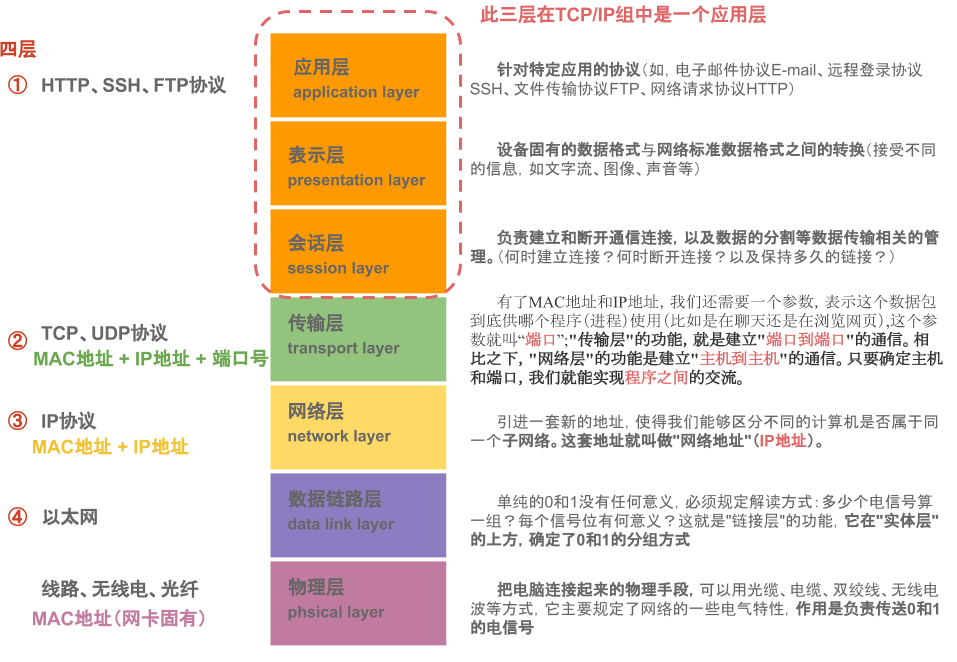

每一层常见协议

```
应用层: HTTP FTP DNS SSH
传输层: TCP UDP
网络层: IP ICMP ARP
链路层: 停等协议, GBN(回退N帧)协议
```

# 2. Application Layer

## 2.2 Http介绍

请求报文格式(请求行+请求头+请求体)

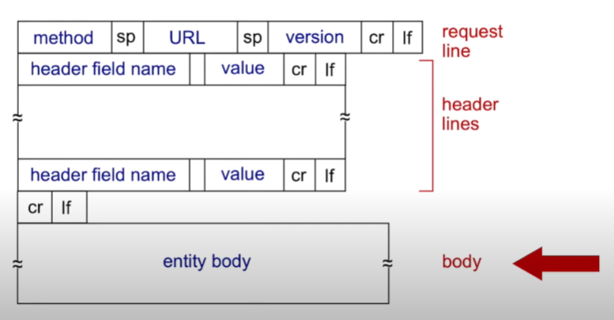

> CRLF是windows中的换行符 CR是Mac 换行符, LF是Unix中的换行符

响应报文格式

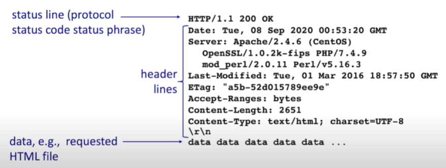

常见的请求方法

```
GET: 获取对象
POST: 不管存不存在, 添加对象
PUT: 更新已存在的对象
DELETE: 删除对象
```

> 幂等性: 多次请求对服务器的影响和单词请求对服务器的影响相同则有幂等性
>
> POST方法无幂等性

常见响应码

```
200: ok
301: 永久重定向
302: 临时重定向
400: (请求体/query参数错误)
401: 认证失败
403: 权限不足
404: not found
405: 请求方法不支持
500: 服务器内部错误
```

cookie&session

```
* 响应头中set-cookie字段表示浏览器需要新建一个cookie(键值对+过期时间+生效路径)
* 每次向同域名发送请求时请求头中需要携带cookie
* 一个特殊的cookie(key=sessionid)用来给服务器区分HTTP连接对应的session对象
```

## 2.4 HTTP各版本区别

### 2.4.1 Http1-3

HTTP1.0

```
只支持短连接: 每次请求都需要新建一个TCP连接
队头堵塞问题: HTTP1.0规定上一个请求得到响应后才可以发送下一个请求
```

HTTP1.0 => HTTP1.1:  **长连接**+**缓存**

```
* 默认支持长连接: HTTP header中Connection:keep-alive/false设置是否复用TCP连接
* 缓存控制: HTTP header中cache-control字段, 开启缓存后再请求时不会真正发送请求
```

HTTP1.1 => HTTP2.0: **多路复用**

```
* 多路复用: 服务器可以将一个消息拆分为更小的帧, 并行返回不同消息的帧(解决了队头阻塞问题)
```

HTTP2.0 => HTTP3.0: **quic协议**

```
使用quic协议替换tcp来解决tcp滑动窗口队头堵塞问题

quic协议实现了类似tls安全协议和tcp的可靠性和拥塞控制, quic协议基于udp
```

## 2.5 Https

HTTPS协议是通过http协议通信, 但对通信内容使用SSL协议进行加密, 默认端口443

SSL/TLS协议握手过程

```
1. 客户端向服务器发送客户端支持的加密套件和一个随机数, 服务器返回其数字证书, 包括公钥和要使用的密码套件和随机数
2. 客户端通过CA验证数字证书(数字签名的方式验证), 验证成功后使用服务器的公钥加密随机生成的主密钥并发送给服务器
3. 服务器使用自己的私钥解密客户端的主密钥，双方利用两次随机数和主密钥生成对称密钥, 之后使用
   对称密钥加密通信, 握手结束
```


## 2.6 DNS

*DNS服务:  将请求中的域名转成ip地址, **DNS服务器**默认端口53*

域名服务器分级, 根域名服务器和顶级域名服务器都有镜像服务器

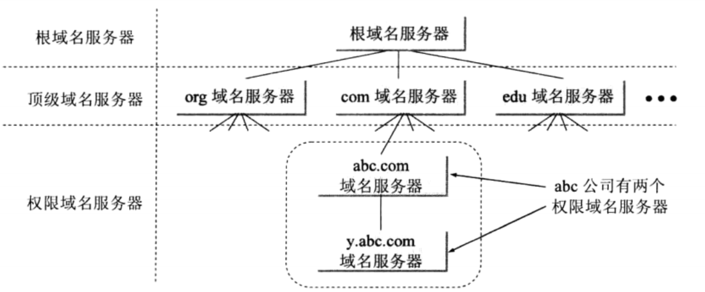

从域名到ip的过程

```
1. 查询本机dns缓存
2. 查询本地dns服务器
3. 本地dns服务器 => root dns服务器, 获取顶层dns服务器ip
4. 本地dns服务器 => 顶层dns服务器, 获取权威dns服务器ip
5. 本地dns服务器 => 权威dns服务器, 获取hostname对应的ip
6. 本地dns服务器返回ip
```

如果域名的ip变更会发生什么?

```
客户端通过dns/缓存获取到的ip是变更前的ip地址!!!
需要等待本地域名服务器缓存, 本机域名缓存失效后重新请求更高级的域名服务器, 新的ip才会生效
```

## 2.7 CDN

CDN(Content Delivery Network)的工作原理

```
将源站的资源缓存到位于网络边缘的CDN节点, 用户请求资源时，就近返回节点上缓存的资源, 避免源站点网络拥塞, 并加快用户的访问速度
```

**CDN应用场景:** 视频点播, 视频直播, 静态资源加速

CDN是如何实现同一个域名访问的确是不同的网络边缘节点的?


> A记录: 域名 => ip
>
> CNAME记录:  域名 => 域名
>
> MX记录: 邮件域名(qq邮箱的邮件域名为qq.com) => 邮件服务器域名/ip

## 2.8 其他协议

FTP协议用于文件传输

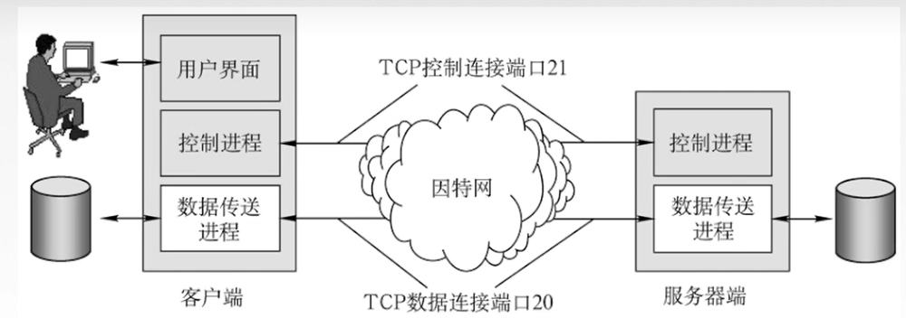

邮件传输协议SMTP, IMAP

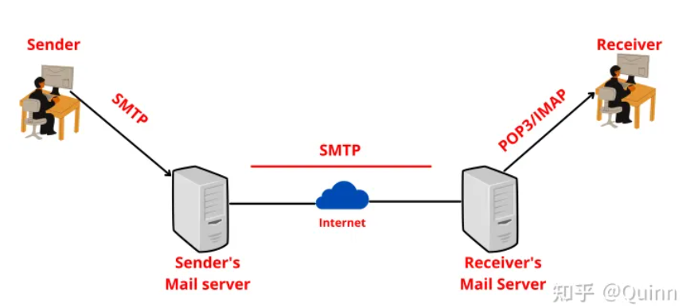

WebSocket协议

```
是一种全双工通信协议, 被用在即使通讯的场景中(即时游戏, 即时通讯)

!! socket是一种编程方式, socket对TCP/IP进行封装
```

# 3. Transport layer

## 3.1 UDP

UDP Heade

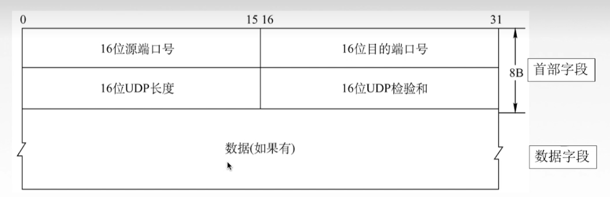

> TCP 会建立连接, 提供可靠的服务, 会进行拥塞控制和流量控制
>
> UDP 提供不可靠的服务

两者在应用层中使用情况

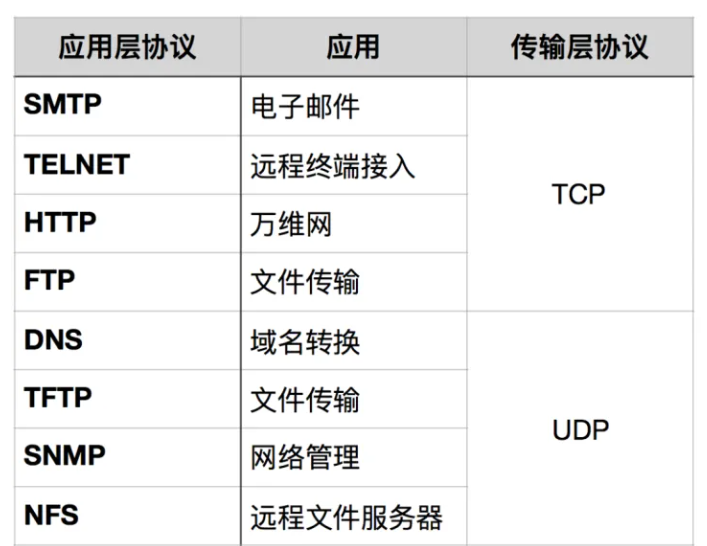

## 3.2 TCP介绍

TCP Header

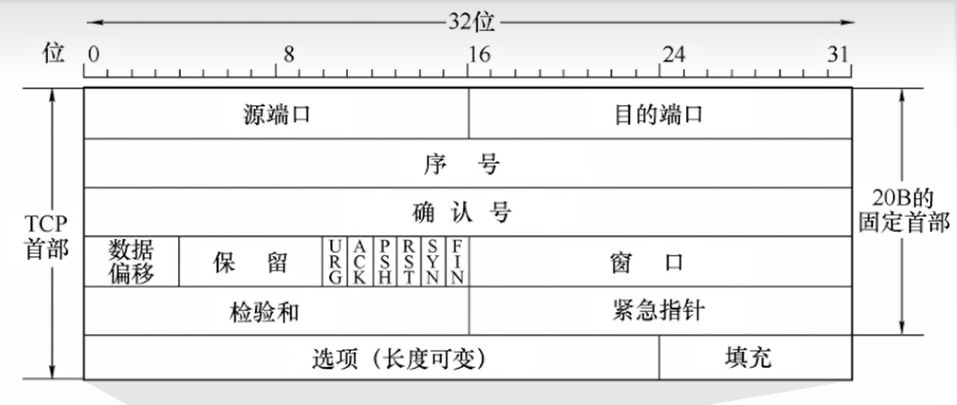

*注意: 其中序列号是数据负载起始位置的序列号, 1byte=1个序列*

## 3.3 TCP连接的建立和关闭

### 3.3.1 三次握手建立连接

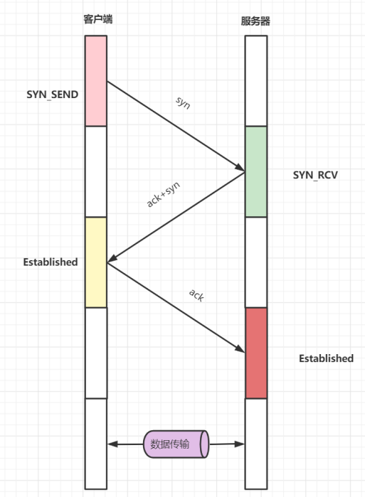

* **TCP为什么不是两次握手?**

假如是两次握手, 服务器返回SYN报文如果丢失, 服务器会直接建立连接等待客户端发送报文, 但此时客户端认为服务器拒绝连接不会发送报文/重新发送连接请求, 会浪费服务器的资源.

* TCP半连接和全连接队列
  当服务器在三次握手中返回SYN后, 会将连接放入半连接队列, 等待超时才移除
  如果服务器收到了客户端的ACK, 那么会将连接从半连接队列放入全连接队列

### 3.3.2 四次挥手关闭连接

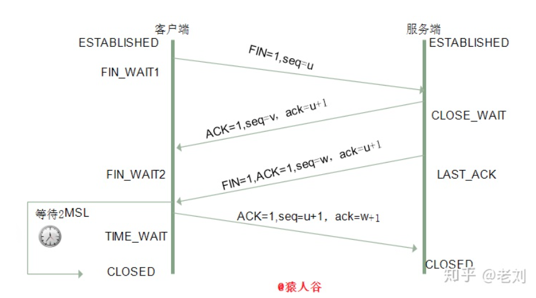

* **为什么需要四次挥手?**

TCP是全双工通信, 客户端和服务端都需要发送断开连接请求表示自己不会再接收报文, 都需要响应对方的断开连接请求避免对方认为网络问题重发请求

* **为什么等待2MSL而不是1MSL**

2MSL包含第四次挥手的时间和第四次挥手失败服务器重发第三次挥手的时间

## 3.4 TCP可靠性的保证

总结: TCP报文头校验码+丢弃重复报文+超时重传报文+滑动窗口+拥塞控制

* 滑动窗口实际上就是发送/接收缓存
* 超时重传

> 重传间隔时间由为RTT加权后的RTTs, RTTs可以反映网络情况

* 冗余ACK快重传: 多次接收到已经发送的报文的ack=x则直接重传不必等待超时

## 3.4 TCP拥塞控制

如何控制拥塞窗口的大小?

* 窗口增长方式: 低于阈值指数增长, 超过阈值线性增长
* 网络拥塞后将拥塞窗口大小设置为最小值1, 并将阈值降低为发生拥塞时窗口大小的1/2

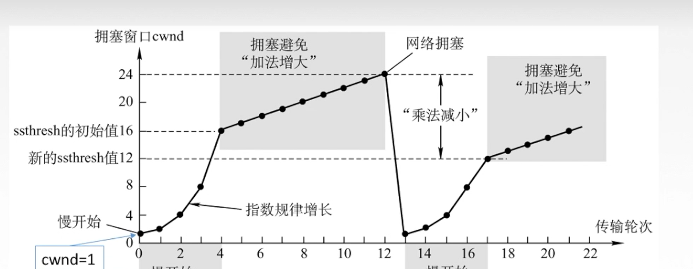

## 3.5 TCP流量控制

接收方响应的TCP header中**rwnd字段**设置流量控制窗口的大小

当接收方滑动窗口满了, 可以设置rwnd = 0

```
发送方滑动窗口大小 =  min(rwnd, 拥塞窗口大小)
```

## 3.6 TCP粘包拆包

粘包

```
发送端连续发送的多个小数据报在传输过程中可能被合并成一个大数据报发送
```

拆包

```
发送方如果放松的数据包过大, 可能拆分成多个小的数据报发送
```

解决方法:

```
数据流中添加特殊字符来作为分界符
```

## 3.7 TCP报文头结构

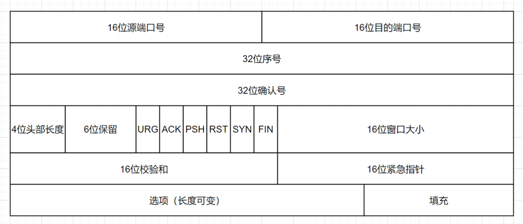

重要的字段

```
* 16bit源端口号, 目标端口号
* ack, seq
* 标志位
* 校验和
```

# 4. Network Layer

## 4.1 IP

IP header

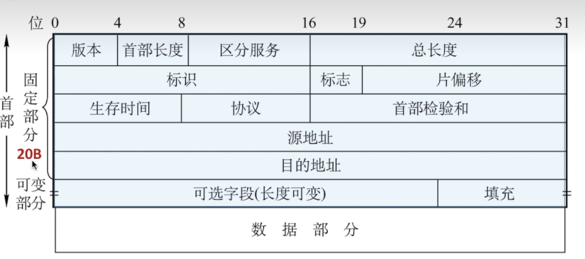

> 协议字段表示数据部分采用的协议(ICMP/OSPF)

## 4.2 IP地址的分类划分

> 所有IP地址划分方式中: 主机号全0 = 网络的地址, 主机号全1 = 网络中的广播地址

IP地址的分类划分中网络号长度固定为8/16/24

A类地址(网络号0-127)


```
网络号127 = 本地环回网络, 网络号0不可用
```

B类地址(网络号128-191)


C类地址(网络号192-223)


多播地址和保留地址(网络号224+)


## 4.3 IP地址的子网划分

子网划分中**网络号长度不固定, 根据子网掩码确定网络号长度**, 子网掩码为1的部分对应网络号


## 4.4 IP地址CIDR划分

使用斜线+网络号长度


## 4.5 路由器配置

默认网关

```
在同一子网下的主机通信不需要通过路由器, 直接通过交换机即可; 
在不同子网下的主机通信需要路由器转发, 默认网关就是主机在它所属子网下的路由器接口的IP地址
```

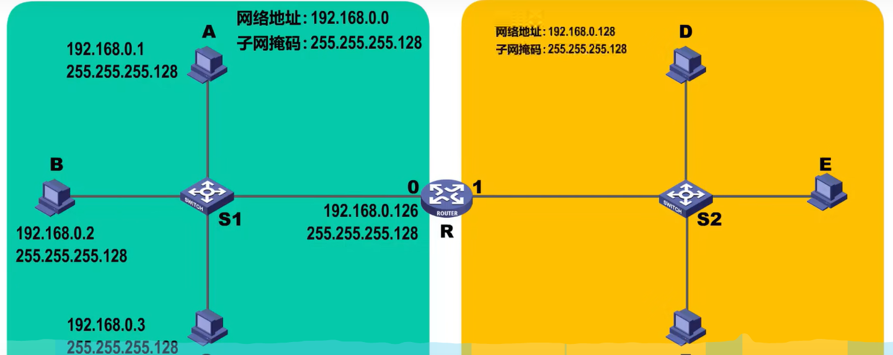

静态路由配置

```
对于网络拓扑变化不频繁的网络, 路由器的路由表可以人工配置
```

动态路由配置

```
动态路由配置通过路由器直接交换路由表实现, 具体可分为内部和外部路由协议
```

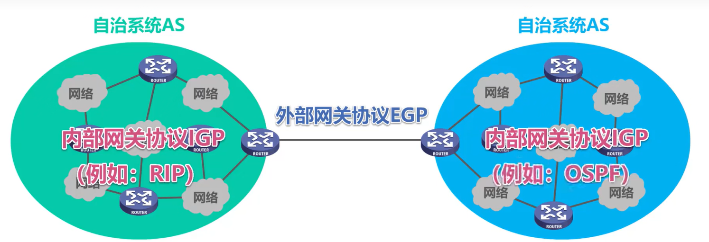

> 一个自治系统中所有路由器的路由协议一致且自治相同内部路由器可以相互连通

## 4.6 RIP&OSPF&BGP

RIP(基于UDP)

```
RIP协议中, 每个路由器维护到特定网络需要的跳数(>=16表示网络不可以到达), 
在直接相连网络变化时/RIP周期达到时,  发送RIP交换报文给相邻的路由器用于更新他们的路由表
路由器转发数据报时转发到最短跳数对应的接口中
```

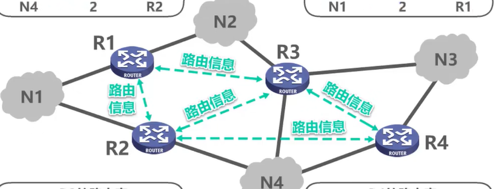

OSPF(基于IP)

```
网络中所有路由器都维护一个相同的整个网络拓扑图(节点由路由器和网络构成), 根据dijkstra算法直接计算最短路径
每个路由器有一个相邻路由器表, 相邻路由器之间发送不同的报文用于交换和确认信息
```

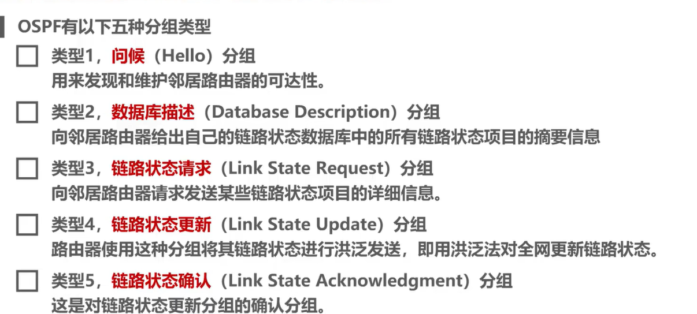

BGP协议用于不同自治系统的边界路由器路由信息交换

## 4.7 ICMP

ICMP报文分为差错报告报文和ICMP请求报文

```
 差错报告报文: 当数据报文在网络中传送发生异常时(丢弃/不可达/校验码错误/TTL过期), 会给源主机发送ICMP报文通知源主机
```


```
终点不可达: 路由器不知道如何转发报文时发出
源点抑制: 路由器知道如何转发报文, 但转发到的链路阻塞时发出
时间超过: 路由器收到TTL = 0 的报文时发出
参数问题: 路由器收到校验码错误的报文时发出
```

ICMP报文应用

* traceroute, 通过发送TTL递增的数据报实现
* ping, 通过向主机发送ICMP请求报文, 主机回复ICMP报文实现

## 4.8 VPN&NAT

VPN

```
将私有网络之间的IP数据报加密并封装成公共网络之间的IP数据报, 利用公共网络传输, 传输到目的私有网络后再解封装, 再传输到私有网络中的主机上
```

IP地址中10/192.168等开头的地址是私有网络中的地址


NAT

```
私有网络中的主机使用私有IP地址, 通过NAT路由器与公网连接
数据报在经过NAT路由器后会将私有网络的IP映射为NAT拥有的公网IP, 公网IP可以复用
```

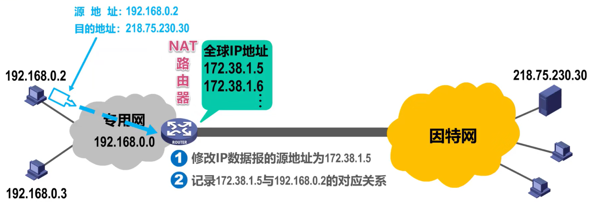

## 4.9 ARP协议

通过IP地址获取MAC地址的协议

```
一个主机中在网络中发送ARP广播报文, 如果对应IP地址的主机收到该报文, 则会返回自己的MAC地址
```
