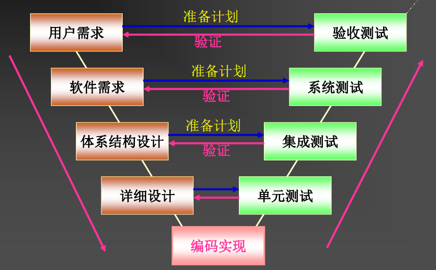
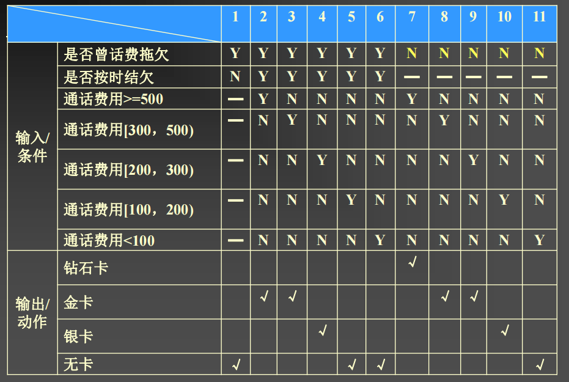
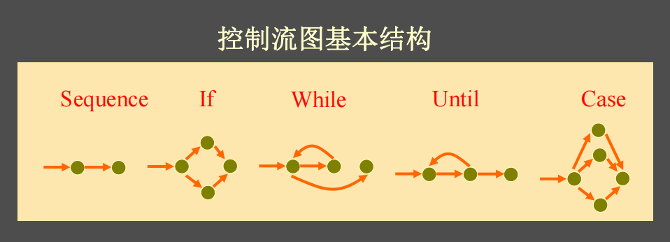
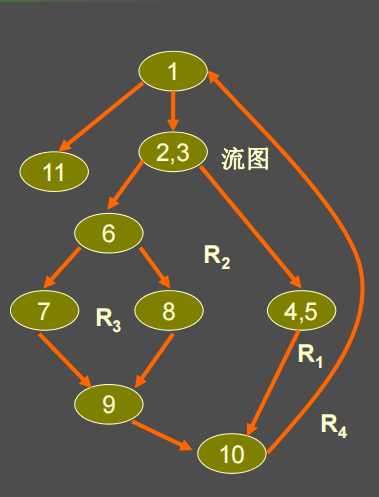
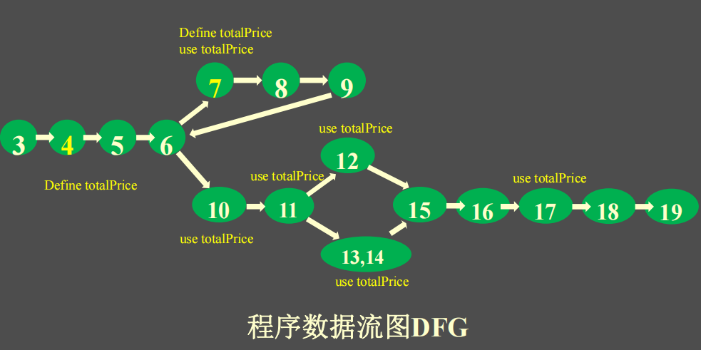

# 1. 引言

什么是软件, 什么是软件质量?

```
软件（Software）是一系列按照特定顺序组织的计算机指令和数据的集合。
软件质量就是软件与明确地和隐含地定义的需求相一致的程度
```

用户和开发人员关心的软件的哪几个方面?

```
软件产品能力（capability ）：能做什么，是否有新功能
软件产品质量（quality）：有多好，例如，性能如何？是否易维护
软件开发和运维成本（cost）
软件开发效率（efficiency）
```

全生命周期软件质量如何保证 ?

```
两种方式:
1. 先验方法：Software development management
2. 后验方法：Software defect / Fault detection
```

什么是软件缺陷？

```
软件缺陷指: 计算机软件或程序中存在的某种破坏正常运行的问题、错误，或者隐藏的功能缺陷。
例如: Bad Smell, 代码冗余, 运行结果错误, 系统复杂度高
```

# 2. 测试理论

## 2.1 开发者测试

定义

```
开发者测试（Developer Testing, DT），是指开发者所做的测试，有别于专职测试人员(来自测评机构)进行的测试活动, 可以发现和解决绝大多数代码缺陷.
```

### 2.1.0 V模型

```
用户需求分析 --- 验收测试
软件需求分析 --- 系统测试
软件体系结构设计 --- 集成测试
详细设计 --- 单元测试
```



### 2.1.1 单元测试

特点

```
 侧重于核实软件的最小可测试元素
 通常应用于实现模型中的模块[函数、类、WSDL服务等]
 主要做：功能正确的前提下的控制流和数据流的覆盖测试
 主要针对单元的内部结构
 更注重白盒测试
```

测试内容

```
 模块接口
 局部数据结构
 边界条件
 独立执行通路测试
 内部错误处理
```

### 2.1.2 集成测试

集成测试的两种方法

```
1. 非增式集成测试: 一步到位地把所有模块联合起来当作一个整体进行测试
2. 增式集成测试: 一次增加一个要的测试模块, 同已经测试好的模块结合起来进行测试.

两者可以从以下方面进行比较:
测试是否彻底? 错误定位难易? 测试的并行性是否好?
```

增式测试的两种方法

```
自顶向下结合: 主控模块作为测试驱动, 逐步替换桩模块并进行回归测试确保替换后的模块没有引入新错误
自底向下结合: 自己编写驱动程序协调测试用例的输入与输出, 从最底层的模块开始组装
```

### 2.1.3 系统测试和验收测试

定义

```
系统测试主要进行软件和硬件的联合, 需要模拟真实的运行环境

验收测试是指用户自定义测试用例的测试, 包括α测试和β测试
```

验收测试的两种类型

```
α测试是软件开发机构内部用户在开发即将完成时对应用进行的测试

β测试是软件的用户在软件发布之前在实际使用环境下进行的测试
```

### 2.1.4 回归测试

定义

```
确保软件增加/删除部分没有引起错误而进行的测试
```

回归测试的方法

```
* 全部再测试
* 按风险再测试
* 按依赖再测试
* 按频率再测试
* 按修改再测试
```

## 2.2 测试过程

```
1. 分析测试需求: 确定要测试什么
2. 计划: 确定测试计划
3. 设计: 测试用例和脚本设计
4. 开发: 搭建测试环境, 开发测试脚本和桩模块
5. 执行: 执行测试并生成Bug报告
6. 评估: 写测试分析报告
```

## 2.3 测试的分类

### 2.3.1 静态测试和动态测试

静态测试定义

```
不实际运行程序，而是通过检查和阅读等手段来发现错误并评估代码质量的软件测试技术。
```

静态测试的方法

```
走查：WalkThrough
审查：Inspection
评审：Review
审计：Auditing
```

动态测试定义

```
通过构造测试用例、执行程序、分析程序的输出结果这三种方法来对软件进行测试。
```

### 2.3.2 黑盒测试和白盒测试

定义

```
黑盒测试: 基于用户视角进行的测试, 把被测程序被当作一个黑盒
白盒测试: 基于源代码的测试, 尽可能覆盖代码实现的行为
```

黑盒测试优点

```
1. 与软件具体实现无关, 当软件实现发生改变可以用之前的测试用例
2. 设计测试用例可以和软件开发同时进行, 可以压缩项目时间
```

如何进行黑盒测试

```
* 正面测试: 测试程序对于预期输入能否产生正确的输出
* 负面测试: 测试程序对于非法输入是否会出现崩溃
```

# 3. 测试用例

## 3.1 黑盒测试用例生成

### 3.1.1 等价类划分法

什么是等价类, 有效等价类, 无效等价类?

```
对于一组输入, 软件会产生相同的行为, 那么这一组输入就称为等价类

合法的输入对应的等价类称为有效等价类
非法的输入对应的等价类称为无效等价类
```

等价类划分法步骤

```
Step1:选择划分准则（范围、取值、布尔、集合…）
Step2:根据准则确定有效等价类和无效等价类
Step3:从等价类中选取样本数据覆盖所有等价类
Step4:根据需求写预期结果
Step5:执行测试
```

### 3.1.2 因果图法

原因和结果的四种关系

```
* 恒等
* 非
* 与
* 或
```


4中输入约束和1种输出约束

```
输入约束: 互斥(E): 原因同时不成立 包含(I): 不会同时不成立 唯一(O): 有且仅有一个成立 要求(R): 同时成立
输出约束: 屏蔽(M)
```

因果图判定表



如果对于多个条件其输出动作一样, 而这多个条件只有一个不同, 其他都相同, 那么可以将相同的那个条件设置为无关条件来简化判定表


因果图判定法过程

```
Step1:分析规格说明书，识别原因和结果
Step2:在因果图连接原因和结果
Step3:标明原因之间以及结果之间的约束条件
Step4:因果图转换为因果图列表进而生成判定表
Step5:判定表的规则转换为测试用例
```

### 3.1.3 边界值分析法

定义

```
由于软件缺陷容易出现在边界处, 边界值分析法就是对输入或输出的边界值进行测试的一种黑盒测试方法。
```

边界分析法的测试用例

```
4n+1：基本边界测试: 一个变量为 min，min+1，nom,  max-1，max, 其他变量为nom
6n+1：健壮性边界测试: 一个变量为min-1，min，min+1，nom, max-1，max，max+1, 其他变量为nom
3m：边界条件测试: 一个变量可能的边界为k, 那么取其他条件固定, 这个变量k-1, k, k+1的测试用例
```


## 3.2 白盒测试用例生成

### 3.2.1 静态白盒测试

定义

```
在不执行软件的条件下有条理地仔细审查源代码，从而找出缺陷的过程
```

优点

```
* 可以尽早发现软件缺陷
* 可发现某些机器发现不了的错误
* 可为后续测试中设计测试用例提供思路
```

### 3.2.2 基于控制流的方法

基于控制流的测试方法分类

```
* 语句覆盖: 所有测试用例加起来, 每个statement都至少执行了一次
* 判定覆盖: 所有测试用例加起来, 每个if分支两边都进入过
* 条件覆盖: 所有测试用例加起来, 每个if(condition)中condition的子条件A, B都出现过T, 也都出现过F
* 判定条件覆盖
* 条件组合覆盖: 每个判定中条件的各种可能组合都至少出现一次
* 路径覆盖: 每条可能执行到的路径都至少经过一次(路径数随分支数指数级增加)
```

#### 3.2.2.1 基本路径覆盖

控制流图(CFG)



基本路径集合定义

```
在控制流图中一组从程序开始到程序结束的路径, 但这些路径中每个路径至少有一条边在其他路径中没有出现过
每一条基本路径在基于基本路径的测试中对应一个测试用例
```

基本路径数量度量-----圈复杂度==基本路径数量




基本路径的特性

```
* 任何其它路径都可以通过基本路径向量组合运算出来
* 基本路径集合不唯一

```

#### 3.2.2.2 循环处理方法

循环分类和对应的测试用例构造

```
简单循环: 分别让循环执行0, 1, 2 , m, n-1, n, n+1次
嵌套循环: 外层循环次数取最小值, 然后按简单循环的方式测试内层循环, 最后对内外层循环同时取最大最小循环次数进行测试
串接循环: 若两个循环独立则分别按照简单循环测试, 否则将前一个循环当作外层循环, 后一个当作内层循环
非结果循环: 先进性结构化, 再测试
```

### 3.2.3 基于数据流的测试

数据流图DFG: 在CFG的基础上标出use+变量和define+变量



定义节点和使用节点类型

```
谓词使用P-use: if(b>1)
计算使用C-use: x=3+b
输出使用O-use
定位使用L-use: a[b]
迭代使用I-use
```

定义-使用路径(du-path)

```
定义: 以定义节点为起点, 以使用路径为终点的路径
```

定义-清洁路径(dc-path)

```
定义: 只有起点是定义节点的du-path
```

Rapps-Weyuker Metrics 覆盖标准

```
All-Paths
All-Edges
All-Nodes
All-Defs
All-P-Uses
All-P-Uses/Some C-Uses
All-Uses
All-DU-Paths
```

# 4. 面向对象软件测试

# 5. 软件性能测试

软件性能定义

```
软件性能（ Software Performance ）是软件的一种非功能特性, 指软件完成功能的效果
性能测试指标例如: 响应时间, 吞吐量, 并发用户数, 资源利用率
```


## 5.1 性能测试

性能测试定义

```
性能测试是通过自动化的测试工具模拟多种正常、峰值以及异常负载条件来对系统的各项性能指标进行测试
```

性能测试的内容

```
负载测试
压力测试
容量测试
```
