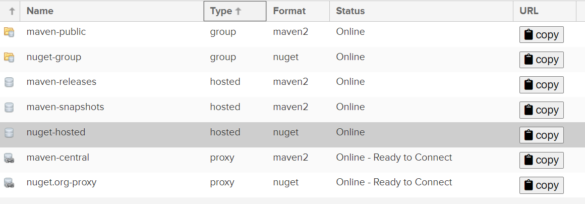

[尚硅谷-maven 学习视频](https://www.bilibili.com/video/BV12q4y147e4)

# 1. Maven基本使用

Maven是一个跨平台的项目管理工具。作为Apache组织的一个颇为成功的开源项目，其主要服务于基于Java平台的项目创建，依赖管理和项目信息管理，是一个自动化构建工具。

## 1.1 约定和配置

**配置:** maven配置文件路径:  `{maven根目录}/config/settings.xml`, 常用的配置如下

* `<localRepository>`: 本地仓库路径
* `<mirror>`: 配置远程仓库的镜像(默认远程仓库有[maven中央仓库](https://mvnrepository.com/))

---

**约定:** Maven创建的项目使用约定好的目录结构, 便于maven自动化构建项目

一个名叫Hello的项目的目录结构如下:


* pom.xml:  POM是项目对象模型(Project Object [Model](https://so.csdn.net/so/search?q=Model&spm=1001.2101.3001.7020))的简称,pom.xml是Maven项目中必备的文件. pom.cml包含项目的所有信息. 例如: 项目坐标, 项目依赖项
* src/main/: 项目代码和资源存放位置
* src/test/: 项目测试代码和资源存放位置
* src/main/resources下的资源文件打包后会放在/target/classes目录下, 和编译后的class文件一起

## 1.2 生命周期和插件

maven定义了一个项目的生命周期, 它包含了项目的 **清理** 、初始化、 **编译** 、 **测试** 、 **打包** 、集成测试、验证、**部署**和**站点**生成等几乎所有的构建步骤。

在每个生命周期, maven调用绑定在这个生命周期的插件的功能(goal), 实现在这个生命周期需要达成的目标。

maven插件本质是一个jar包, 也有gav坐标。

## 1.3 CLI 命令

Maven命令格式: **mvn <插件>:<插件命令**>, 所有命令需要在项目根目录下执行. 使用mvn需要添加 `<mave-root>/bin`到环境变量PATH中

创建项目

```
mvn archetype:generate
```

清理(删除target目录)

```
mvn clean
```

编译(生产target目录)

```
mvn compile
```

测试

```
mvn test-compile
```

打包(生成jar到target目录, 打包后会舍弃测试的代码和资源)

```
mvn package
```

安装(将生成的jar包安装到本地仓库)

```
mvn install
```

安装本地jar包到本地仓库

```
mvn install:install-file -Dfile=<软件包的位置> -DgroupId=<groupId> -DartifactId=<artifactId> -Dversion=<version> -Dpackaging=<软件包的类型jar/war>
```

## 1.4 pom.xml基础

**项目基本信息**

```
    <groupId>xyz.wsh</groupId>
    <artifactId>demo</artifactId>
    <version>0.0.1-SNAPSHOT</version>
    <name>demo</name>
    <description>demo</description>
    <package>jar<package>//打包方式(jar, war, pom)
```

---

**项目依赖项**(会从本地仓库查找, 本地仓库找不到会从远程仓库查找)

*依赖项都是打包后的jar, 里面是编译后的字节码, 不是源码!!!*

```
<dependencies>
        <dependency>
            <groupId>com.mysql</groupId>
            <artifactId>mysql-connector-j</artifactId>
            <version>1.0<version>
            <scope>runtime</scope>
        </dependency>
</dependencies>
```

Scope代表依赖项有效的范围

* compile: 默认值, 任何地方都可以使用
* test: 只能本项目的在src下的test文件夹下面才可以使用, **子项目中不可见**, 打包后舍弃
* provided: 意味着打包的时候不包进去，例如：servlet-api，运行项目时，容器已经提供.
* runtime: 会打包, 但在代码里面不可以使用(常见于接口具体实现的jar包, 强制程序员使用接口, 从而遵从依赖倒置原则)
* import: 直接导入该依赖项的所有依赖项

---

**依赖项传递和排除**

子项目会依赖父项目的依赖, 如果发生了相同依赖项版本冲突或者不同依赖项全类名冲突可以排除依赖的传递

```
<dependency>
    <groupId>junit</groupId>
    <artifactId>junit</artifactId>
    <version>4.12</version>
    <scope>test</scope>
    <exclusions>
        <exclusion>
            <groupId>xyz</groupId>
            <artifactId>a-id</artifactId>
        </exclusion>
    </exclusions>
</dependency>
```

## 1.5 项目继承

**子项目继承父项目后会间接依赖父项目中的依赖项**

父项目pom.xml

```
<packaging>pom</packaging>//打包方式为pom的项目是父项目
<dependencyManagement>//当dependencyManagement下的依赖项被子项目显式依赖时, 版本号自动继承, 不用显式指出, 以此实现依赖版本管理.
  <dependencies>
     <dependency>
        <groupId>org.eclipse.angus</groupId>
        <artifactId>angus-core</artifactId>
        <version>${angus-mail.version}</version>
      </dependency>
  </dependencies>
</dependencyManagement>
```

如果父项目不仅仅是为了依赖项版本统一., 还要对子项目进行统一的maven指令, 需要在父项目pom.xml中指定其包含的子项目

```
    <modules>
        <module>demo-jedis</module>//填artifact-id(子项目的group-id和父项目一致)
    </modules>
```

子项目pom.xml

```
    <parent>
        <artifactId>spring0106</artifactId>
        <groupId>org.example</groupId>
        <version>1.0-SNAPSHOT</version>
    </parent>
```

# 2. Pom深入

## 2.1 项目管理工具

Maven是一个项目管理工具不仅表现在依赖管理和项目构建, 也体现在pom.xml中可以告知项目其他信息

以spring-boot项目为例:

```
  <url>https://spring.io/projects/spring-boot</url>
  <licenses>
    <license>
      <name>Apache License, Version 2.0</name>
      <url>https://www.apache.org/licenses/LICENSE-2.0</url>
    </license>
  </licenses>
  <developers>
    <developer>
      <name>Pivotal</name>
      <email>info@pivotal.io</email>
      <organization>Pivotal Software, Inc.</organization>
      <organizationUrl>https://www.spring.io</organizationUrl>
    </developer>
  </developers>
  <scm>
    <url>https://github.com/spring-projects/spring-boot</url>
  </scm>
```

## 2.2 super pom

如果没有指定当前项目的父项目, 那么这个项目默认继承super pom.xml(相当于java中的Object)

super pom.xml 中比较重要的内容如下

```
//1. 指定中央仓库为远程仓库
 <repositories>
    <repository>
      <id>central</id>
      <name>Central Repository</name>
      <url>https://repo.maven.apache.org/maven2</url>
      //...
    </repository>
  </repositories>
//2. 指定插件远程仓库
  <pluginRepositories>
    <pluginRepository>
      <id>central</id>
      <name>Central Repository</name>
      <url>https://repo.maven.apache.org/maven2</url>
      //...
    </pluginRepository>
  </pluginRepositories>
//3. 默认的构建配置
  <build>
    <directory>${project.basedir}/target</directory>
    <outputDirectory>${project.build.directory}/classes</outputDirectory>
    <finalName>${project.artifactId}-${project.version}</finalName>
    <testOutputDirectory>${project.build.directory}/test-classes</testOutputDirectory>
    <sourceDirectory>${project.basedir}/src/main/java</sourceDirectory>
    <scriptSourceDirectory>${project.basedir}/src/main/scripts</scriptSourceDirectory>
    <testSourceDirectory>${project.basedir}/src/test/java</testSourceDirectory>
    <resources>
      <resource>
        <directory>${project.basedir}/src/main/resources</directory>
      </resource>
    </resources>
    <testResources>
      <testResource>
        <directory>${project.basedir}/src/test/resources</directory>
      </testResource>
    </testResources>
    //...
  </build>
```

由于项目继承的父项目也会继承其他项目, 最终继承super pom, 所以pom.xml缺少完整的项目信息

查看完整的项目信息

```
mvn help:effective-pom
```

## 2.3 属性

maven在分析pom.xml时, 会读取各种属性(变量值), 在属性被引用的地方会填充变量的值

```
    <properties>//定义或覆盖属性
        <maven.compiler.source>17</maven.compiler.source>
        <maven.compiler.target>17</maven.compiler.target>
    </properties>

//${}使用属性
<version>${kotlin.version}</version>
```

除了可以使用自定义的属性外, maven还自带一些的属性可供使用

* System.getProperties()能返回的所有与操作系统, Java虚拟机相关属性   如: `java.version`
* 系统环境变量, 属性key以env开头    如:  `env.JAVA_HOME`
* pom.xml文件中的节点, 以project开头   如: `project.name`
* maven配置文件settings.xml中的节点, 以settings开头   如: `settings.localRepository`

## 2.4 build标签

从super pom中可以找到build标签的完整结构

build标签包含构建过程中的配置, 可以通过build标签自定义构建过程

```
  <build>
    <directory>${project.basedir}/target</directory>
    <outputDirectory>${project.build.directory}/classes</outputDirectory>
    <finalName>${project.artifactId}-${project.version}</finalName>
    <testOutputDirectory>${project.build.directory}/test-classes</testOutputDirectory>
    <sourceDirectory>${project.basedir}/src/main/java</sourceDirectory>
    <scriptSourceDirectory>${project.basedir}/src/main/scripts</scriptSourceDirectory>
    <testSourceDirectory>${project.basedir}/src/test/java</testSourceDirectory>
    <resources>//把哪些文件当作资源文件
      <resource>
        <directory>${project.basedir}/src/main/resources</directory>
      </resource>
    </resources>
    <testResources>
      <testResource>
        <directory>${project.basedir}/src/test/resources</directory>
      </testResource>
    </testResources>
    <pluginManagement>//插件版本控制
      //...
    </pluginManagement>
    <plugins>//构建时使用的插件
    </plugins>
  </build>
```

## 3.5 profile

在开发过程中，项目会存在不同的构建环境，比如开发环境、测试环境、生产环境, 不同环境下maven项目构建配置可能不同. 每种环境下的配置对应一个profile, 在适合的环境激活.

```
<profiles>
        <profile>
            <id>dev</id>
	    <activation>//激活需要满足的条件
		<jdk>1.7<jdk>
		//...
	    </activation>
	    //构建配置标签, 如: build properties
            <properties>
                //...
            </properties>
	    //...
        </profile>
</profiles>
```

没有在 `<profile>`中的maven项目构建配置都是默认的配置

# 3. Nexus

## 3.1 安装启动

[Nexus](https://help.sonatype.com/repomanager3/product-information/download)是一种Maven远程仓库服务器软件, 运行需要Java,

启动服务器到 `<Nexus根目录>/bin`

```
启动服务器(服务器启动需要一些时间)
./nexus start
带日志启动(启动经常失败, 查看原因)
./nexus run
查看是否启动成功
./nexus status
查看nexus是否开发了外网访问(nexus通过java socket通信)
netstat -anp | grep java
```

启动成功后(netstat)访问host:8081(默认端口, 可以配置), 登录admin进行服务器初始化

## 3.2 仓库的类型

* 仓库类型



Proxy: 用来代理远程公共仓库，如 Maven 中央仓库

Hosted: Nexus 本地仓库

Group: 用来聚合代理仓库和宿主仓库，为这些仓库提供统一的服务地址

## 3.3 仓库的使用

* 将Nexus作为中央仓库代理

```
//settings.xml
    <mirror>
      <id>(repository-id)</id>
      <mirrorOf>central</mirrorOf>
      <name>nexus-mine</name>
      <url>(从Nexus服务器网页复制的maven-public仓库的地址)</url>
    </mirror>
```

如果Nexus需要身份验证

```
//settings.xml
    <server>
      <id>(repository-id)</id>
      <username>(账号)</username>
      <password>(密码)</password>
    </server>
```

* 指定部署到Nexus服务器的仓库(mvn deploy命令)

```
//pom.xml
    <distributionManagement>
        <repository>
            <id>(repository-id)</id>
            <name>Nexus Repository</name>
            <url>http://1.13.20.141:8081/repository/maven-releases/</url>
        </repository>
    </distributionManagement>
```

* 指定项目使用Nexus仓库

```
//pom.xml
        <repository>
          <id>(repository-id)</id>
          <name>Nexus Repository</name>
          <url>http://1.13.20.141:8081/repository/maven-releases/</url>
          <releases>
            <enabled>true</enabled>
          </releases>
          <snapshots>
            <enabled>false</enabled>
          </snapshots>
        </repository>
```
