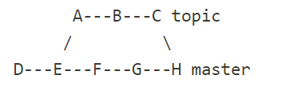
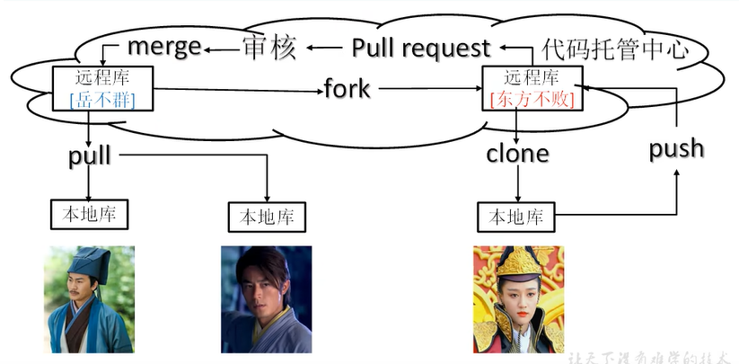

# 1. Git基本使用

## 1.1 常用命令

配置签名(仅仅用于区分操作者)

```
git config --global user.name spiderxi
git config --global user.email anonymous@gmail.com
```

---

初始化本地库(生成.git文件夹)

```
git init
```

查看工作区文件状态

```
git status
```

添加被追踪的文件

```
git add <file>
追踪目录下的全部
git add -a
```

提交到本地仓库

```
git commit -m "<备注>" <-a/文件名>
```

查看提交的日志信息

```
git log
```

移动Head指针(切换版本)

```
git reset [mode] <版本号, 也可以使用git reflog中的简短版本号>
```

## 1.2 分支

分支可以简单理解为副本(底层是指针引用), 分支可以实现多人并行开发

查看当前分支

```
git branch -v
```

从当前分支拉出一个分支

```
git branch <new-branch-name>
```

切换分支

```
git checkout <branch-name>
```

合并其他分支到当前分支上(如果两个分支上的同一个文件同一个位置有不同的修改, 合并会失败, 需要手动解决冲突)

```
git merge <another-branch-name>

git rebase <当前分支 分叉处到HEAD的版本节点链  要变基到的分支>
```

> git merge 和git rebase的区别

**git merge**



**git rebase**(在topic分支下使用 `git rebase master`)


给重要的版本节点打上Tag, 便于查找和使用

```
git tag <标签名>
```

## 1.3 远程协作


团队内协作: 远程库管理员给团队成员权限, 团队成员可以进行push等操作



跨团队协作: 其他团队for项目, 修改完成后发起pull request, 经管理员审核可以合并到项目中

---

查看远程仓库信息

```
git remote -v
```

添加远程仓库

```
git remote add <rep-name> <rep-url>
```

推送分支到远程仓库

```
git push <rep-url/rep-name> <需要推送的分支名>

```

git push到的远程分支可能版本号更高, 这时可以选择:  先pull合并再push

拉去远程仓库到本地仓库

```
git pull <rep-url/rep-name> <远程仓库上需要拉取的分支>   //拉取并合并到当前分支
git fetch   //仅仅拉取, 不做合并

git pull == git fetch + git merge
```

克隆远程仓库到目录

```
git clone <rep-url>
```

## 1.4 gitignore

git add 追踪文件/文件夹时, git会检查项目根目录下的.gitignore文件, 如果要追踪的文件在里面列出了, 就不进行追踪.

已经追踪的文件想要忽略不仅要直接添加到.gitignore, 还需要停止追踪

```
git rm -r --cached <文件>
```

gitignore文件格式

```
target/*      项目根目录/target/下的所有文件
*.iml         iml结尾的所有文件
readme.md     名叫readme.md的文件
```

## 1.5 github踩坑

[git clone太慢的使用gitclone.com](https://gitclone.com/)

---

**可以翻墙上github, 但ping不通github/idea连接不了github**

原因: dns找不到github.com域名对应的ip

`C:\Windows\System32\drivers\etc\hosts`追加github相关域名和ip的映射

github ip===域名

```
#github IP地址
199.232.69.194 github.global.ssl.fastly.net
140.82.113.3 github.com
140.82.112.4 www.github.com
185.199.108.153 assets-cdn.github.com
185.199.109.153 assets-cdn.github.com
185.199.110.153 assets-cdn.github.com
185.199.111.153 assets-cdn.github.com
185.199.108.153 documentcloud.github.com
185.199.109.153 documentcloud.github.com
185.199.110.153 documentcloud.github.com
185.199.111.153 documentcloud.github.com
140.82.114.3 gist.github.com
185.199.108.153 help.github.com
185.199.109.153 help.github.com
185.199.110.153 help.github.com
185.199.111.153 help.github.com
140.82.112.9 nodeload.github.com
199.232.68.133 raw.github.com
140.82.112.18 status.github.com
140.82.113.18 training.github.com
199.232.68.133 raw.githubusercontent.com
199.232.68.133 user-images.githubusercontent.com
199.232.68.133 avatars1.githubusercontent.com
199.232.68.133 avatars2.githubusercontent.com
199.232.68.133 avatars3.githubusercontent.com
199.232.68.133 cloud.githubusercontent.com
140.82.113.6 api.github.com
```

---

**Github身份认证**

个人页 `/settings/developersetting/personnal access token` 中添加token

遇到账号密码验证时将密码填为token即可

## 1.6 搭建代码托管平台

* [gitlab](https://about.gitlab.com/)
* [gogs](https://gogs.io/)

## 1.7 Commit Message规范

```
<type>(<scope>): <subject>
```

Type

```
feat：新功能（feature）。
fix：一次提交直接修复问题
to：多次提交修复问题。最终修复问题提交时使用fix
docs：新增文档（documentation）。
style：格式修改（不影响代码运行的变动）。
refactor：重构（即不是新增功能，也不是修改bug的代码变动）。
perf：优化相关，比如提升性能、体验。
test：增加测试。
revert：回滚到上一个版本。
merge：代码合并。
sync：同步主线或分支的Bug。
```

Scope

```
commit 影响的范围，比如数据层、控制层、视图层 或 *
```

Subject: 详细信息
