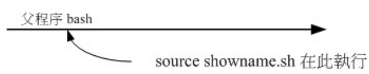
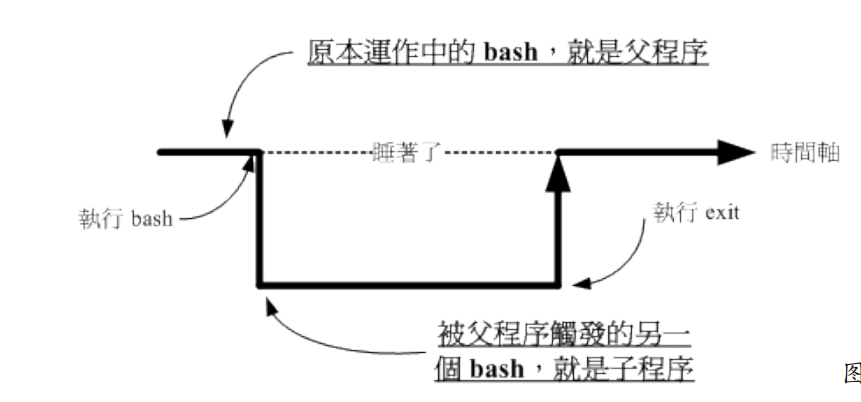
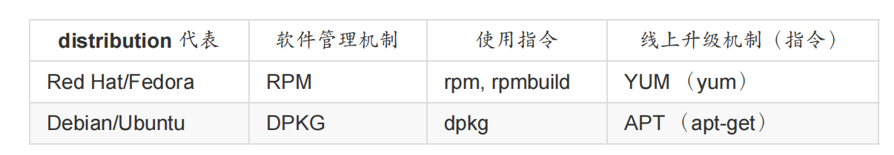

# 0. Linux与硬件

## 0.1 CPU架构

RISC指令集下的CPU架构包括

```
ARM, PowerPC, SPARC
```

CISC指令集下的CPU架构包括

```
x86, x86_64
```

## 0.2 主板和CPU

主板上包含各种硬件设备的插槽, 主板用于连接各个硬件设备(通过总线/), 各个设备的接口符合特定的接口标准

ASUS Asus Z97-AR主板的各个硬件接口标准

```
CPU （Intel LGA 1150 Socket）
内存 （DDR3 3200 support）
显卡接口 （PCIe3.0）
SATA 磁盘插槽 （SATA express）
```

主板上会有南桥芯片用于数据在传输过程的缓冲

```
南桥负责速度慢的设备(鼠标键盘, 外存, 网卡)的缓冲
现代CPU直接与主存/显卡沟通, 不需要外部芯片做缓冲(以前有北桥)
```

CPU频率

```
外频: CPU与其他设备进行数据传输的频率
内频: CPU内部使用的时钟频率, 可能会动态变化以节省电量
```

## 0.3 显卡和GPU

显卡

```
显卡又称为VGA（Video Graphics Array）, 用于要输出存储图像
1024x768分辨率的全彩显示（每个像素占用3Bytes的容量）需要的显卡容量至少为1024*768*3Byte
实际容量还要考虑屏幕刷新率, 屏幕刷新率高的话需要显卡容量更大
```

GPU

```
集成在显卡内部的计算芯片, 用于3d图像的运算, 避免CPU计算繁忙
```

显卡与输出设备的接口标准

```
D-Sub
DVI
HDMI
Display port
```

## 0.4 外存类型和接口

外存分为SSD(固态硬盘)和HDD(机械硬盘)

```
SSD: 相当于大容量flash,容量较小, 速度快, 寿命短
HDD: 内部使用磁盘+磁头, 容量大, 速度慢, 寿命长
```

外存接口标准

```
SATA SATA3速度=600MB/s
SAS SAS3速度=1200MB/s
USB USB3.0速度=500MB/s
PCIe PCIe2.0速度=500MB/s
```

## 0.5 BIOS和CMOS

BIOS

```
存储在主板上EEPROM的一个微型操作系统, 用于开启启动后检查硬件和加载操作系统
```

CMOS

```
主板上存储硬件信息和系统时间等信息的RAM芯片, 使用主板上的纽扣电池供电
纽扣电池没电时会使用出厂信息
```

## 0.6 磁盘分区

MBR分区方式中, 第一个分区包含部分boot loader程序和分区表, 第一个分区的大小是512Byte

# 1. 入门

## 1.1 入门指令

```
# 文件夹
ls -al
cd 
pwd
# 常用工具
date +%H:%M:%S 
cal 2023
bc #计算器
# 用户命令
locale #查看当前编码
man date #用户手册
whatis man
whoami
sync #将cache刷新到外存
shutdown
```

## 1.2 快捷键

```
ctrl+c: 中断程序
ctrl+d: EOF
table table: 补全命令/参数/文件
shift+pageUp: shell翻页
↑/↓: 上一个指令, 下一个指令
```

## 1.3 系统资源信息查看

```
uname -a #查看系统信息
uptime #查看系统启动时间
netstat #查看网络信息
dmesg #查看操作系统核心打印信息
free -h #内存使用信息
```

# 2. 文件管理

## 2.1 文件权限

`ls -al`查看文件详细信息

```
-rwxr-xr-x  1 root root 15960 Apr  4 10:38 a.out*
文件类型+创建者权限+创建者所属群组权限+其他人权限+硬链接数+创建者+创建者群组+大小+最后修改时间+文件名
```

改变文件的权限

```
chgrp users a.out
chown root a.out
chmod a=rwx a.out
```

文件夹的权限

```
r代表这个文件夹可以使用ls查看目录结构
w代表可以往文件夹中添加/删除(不论要删除的文件是否有w权限)文件或目录
x代表可以作为工作目录
```

特殊的权限SUID/SGID

```
拥有该权限的可执行文件在执行期间可以拥有文件拥有者的权限
```

## 2.2 FHS

目录树

```
/bin 一般用户可以使用的可执行文件
/boot 开机会使用的文件
/dev 硬件设备对应的文件
/etc 操作系统配置文件
/lib 静态or共享函数库
/media /mnt 被挂载的设备所在的目录
/tmp 临时文件存放目录
/opt 第三方软件所在目录
/home 普通用户个人目录
/root root用户个人目录
/proc /sys 虚拟目录, 分别存储进程信息和系统信息
/usr unix software resource 所有用户的共享文件夹
/var 软件或系统运行时产生的文件
```

## 2.3 文件和文件夹操作

文件夹管理

```
cd ~
pwd
ls -al
mkdir -p test/inner
rm -r test
```

文件管理

```
cp -r test /tmp/test
mv test /tmp/test
rm -ir test
touch helloworld
ln -s /bin /root/bin
```

查看文件

```
cat /etc/hosts
less /etc/hosts
vim /etc/hosts
head --lines=3 /etc/hosts
tail --lines=3 /etc/hosts
grep pattern test.txt
```

文件默认权限和隐藏权限

```
umask -S
chattr +ai hello
lsattr hello
```

文件的查找

```
type ifconfig
which ifconfig
find /root -name hello
```

## 2.4 磁盘管理

查看个分区情况和挂载点

```
df -h
```

## 2.5 文件压缩

gzip只能对单个文件进行压缩, tar可以将文件夹合并成一个大文件

```
gzip hello
gzip --decompress hello.gz

tar -czf exp.tar.gz exp
tar -xzf exp.tar.gz -C ./
```

# 3. Vim

常用按键

```
i进入插入模式 
esc退出插入模式
:wq写入并退出
/ ?:向上向下查找
2dd: 删除从光标所在行开始的2行
2yy: 复制从光标所在行开始的2行
p: 复制到光标所在的下一行
:set nu 显示行号
:1 返回第一行
0 移动到行首
$ 移动到行尾
```

# 4. Shell

## 4.1 bash

linux默认的shell是bash, 在/etc/passwd文件中可以查看用户登录后使用的shell

bash的优点

```
支持通配符  如ls /usr/Test*
可以使用历史命令  如↑↓
tab自动补全
支持alias别名
```

## 4.2 变量

内置变量

```
PATH=环境变量 
HOME=用户的主目录
?=上一个指令返回值
```

变量的使用/添加/删除

```
echo ${PATH}
PS1="O(∩_∩)O: "
unset NAME
```

自定义变量只能在当前bash中生效, 如果想在子程序中生效可以使用export导出为环境变量

```
export NAME
```

查看变量

```
所有环境变量: env
所有变量: set
```

提示用户输入变量

```
read -p "请输入在30s内你的名字:" -t 30 NAME
```

声明一个整数类型变量

```
declare -i age
age=18+8
echo $age //26, 如果不声明变量为整数类型将会使用默认的字符串类型
```

## 4.4 别名和历史

给命令设置别名

```
alias la="ls -a'
```

查看history和执行上一个命令

```
history
!!
```

## 4.5 配置shell和自定义

bash分为login shell(使用shell时需要输入账号密码登录)和non-login shell, 两种shell的配置方式不同

login shell 配置文件 `~/.bash_profile`

non-login shell配置文件 `~/.bashrc`

通过配置文件可以设置shell的默认环境变量等信息

```bash
else
 PS1="O(∩_∩)O: "
```

每日信息自定义

```
vim /etc/motd

```

登录提示信息自定义

```
vim /etc/issue
vim /etc/issue
```

登录更新提示信息自定义

```
vim /etc/pam.d/login
```

## 4.6 重定向和管道

**将标准输出重定向**到文件或设备 /  将文件或设备作为标准输入

```
ls > test.txt  //覆盖
ls >> test.txt //追加
sort < test.txt //文件或设备作为输入
```

**管道符:** 将一个程序标准输出作为另外一个程序要输入的文件(此时省略文件名参数)

```
ls | grep hello
ls | grep "t[ae]st"
echo "hello" | grep el
echo "hello:name" | cut -d : -f 1    (输出hello)
```

常用于管道符的程序

```
grep(查找符合RE的行)
sort(按行进行排序) 
uniq(去除重复的行)
cut(对每一行按分隔符切割后取出分割后的内容)
```

$() 让指令输出作为**占位符**的内容

```
echo "当前linux内核版本为: $(uname -r)"
```

**特殊的文件:** *-表示标准输入输出 /dev/null表示黑洞文件*

```
echo "shit" > /dev/null

```

## 4.7 指令编程

使用逻辑运算&& ||可以实现程序间的条件执行, 如查看文件是否存在, 如果存在则删除

```
ls ./hello && rm ./hello
```

使用printf可以打印格式化字符串

```
printf "当前内核版本: %s \n" $(uname -r)
```

# 5. Shell脚本

## 5.1 HelloWorld

Hello world脚本示例

```bash
#!/bin/bash
# 第一行表示使用bash执行并使用配置文件.bashrc
# -e可以使用转义字符
echo -e "hello, world \a"
echo $PATH
echo $((5*7) == 35)
# 返回值
exit 0
```

## 5.2 source方式执行

直接执行sh脚本会使用子进程的方式执行, 变量如果不使用export导出不会共享


使用source方式执行相当于将sh脚本代码放到当前bash执行, 变量共享



## 5.3 获取指令参数

$+数字获取指令参数

```bash
echo "你输入的命令是: $0"
echo "你输入的第一个参数是: $1"
echo "你输入的第二个参数是: $2"
echo "你输入的参数个数是: $#"
exit 0
```

## 5.3 if

if []; then elif [] then fi

**[] 和条件之间需要空格**

```bash
read -p "请输入一个字符:" char
if [ "$char" == "y" ] || [ "$char" == "Y" ]; then
        echo "你输入的是Y/y"
elif [ "$char" == "N" ] || [ "$char" == "n" ]; then
        echo "你输入的是N/n"
else
        echo "你输入错误"
fi
```

## 5.4 function

使用function定义一个函数

```bash
function hello(){
        echo "hello $1"
}
if [ 2 -lt 6 ]; then
        hello king
fi
exit 0
```

## 5.5 循环

while循环

```bash
#!/bin/bash
i=1
sum=0
while [ $i -le 100 ]
do
        sum=$((sum+i))
        i=$((i+1))
done
echo "1-100的和是: $sum"
```

for in循环(环境变量IFS作为循环变量之间的分割符, IFS默认值为所有空白字符)

```bash
allUser=$(cut -d ":" -f1 /etc/passwd)
for user in $allUser
do
        echo "username: $user"
done
```

使用seq指令生成序列

```bash
seq 1 100
```

for循环

```bash
maxI=10
for ((i=0;i <= $maxI; i++))
do
        echo "i = $i"
done
```

## 5.6 随机数

使用随机数环境变量RANDOM返回0-2^15-1的值

```bash
maxI=10
for ((i=0;i <= $maxI; i++))
do
        echo "$RANDOM"
done
```

# 6 用户管理

## 6.1 账户和密码

* 账户信息在/etc/passwd中, 密码在/etc/shadow中
* 群组信息在/etc/group中, 密码在/etc/gshasow中

如果忘记root用户的密码, 可以在开机时选择进入单用户模式重置密码

```bash
passwd root
```

## 6.2 账户管理

```bash
useradd spider
useradd -r admin
userdel -r spider
passwd spider
usermod -g users spider
```

切换用户

```
su - spider
```

临时使用root权限执行命令

```
sudo ls

```

/etc/sudoers中设置可以进行sudo的用户和群组

```
%mygroup ALL=(ALL) NOPASSWD: ALL
```

## 6.3 群组管理

```bash
groupadd anoy
groupdel anoy
newgrp anoy
```

# 7. 任务管理

## 7.1 定时任务

at 发布一次性定时任务

```
at 10:30am 04/10/2023
atq
atrm 3
```

cron, 使用cron表达式发布循环定时任务

```
crontab -e
```

## 7.2 前后台进程

父进程会fork一份一模一样的子进程(仅仅pid和ppid不同), 使用exec执行子进程, 此时父进程阻塞



永久执行的进程称为服务(deamon/service)

```
ps -aux #查看所有进程
ps -l #查看不是服务的进程
kill 1086 #根据pid杀死进程
```

在指令后添加&可以让程序在后台执行, 此时可以执行其他任务

```
ls &
```

在前台任务执行时, 可以使用ctrl+z让其阻塞在后台, fg让后台进程返回前台执行, 使用jobs查看前后台进程

```
jobs
kill -9 %1
fg %1
```

## 7.3 进程管理

查看进程信息快照

```
ps aux
```

查看进程实时信息

```
top
```

查看特定进程的实时信息

```
top -p 1
```

查看进程树

```
pstree
```

给进程传递通信信号(signal)

```
kill -l #查看所有可用信号和含义
kill -2 747 #传递2号信号给pid=747
```

## 7.4 服务管理

服务基本管理

```
systemctl status atd
systemctl stop atd
systemctl start atd
systemctl disable atd
systemctl enable atd
systemctl #查看所有服务
```

查看服务对应的网络端口号和协议

```
cat /etc/services
```

新建一个服务

```
1. 在/etc/systemd/system中创建一个.service描述文件
2. systemctl daemon-reload
3. systemctl status 服务名称
```

# 8. 系统管理

## 8.1 日志

日志文件存储在/var/log/中

系统日志服务为 `rsyslog.service` 对应的配置文件为 `/etc/rsyslog.conf`

系统日志分为多个级别

```
DEBUG：调试信息，只用于开发环境，生产环境一般不记录。
INFO：一些需要提示用户或者管理员的信息，比如服务启动、停止等操作。
NOTICE：一般情况下无需特别关注的信息，但是对于某些场景下可能需要分析问题时可以查看这种级别下的日志。
WARNING：警告信息，表示存在潜在的问题或者异常，需要引起注意。
ERROR：错误信息，表示系统出现了故障或者异常，需要及时处理。
CRITICAL：严重错误信息，表示系统发生了无法恢复的错误，需要立刻处理。
ALERT：需要立即采取措施的告警信息，比如磁盘空间不足、网络连接断开等。
EMERGENCY：最高级别的告警信息，表示系统已经无法正常运行，需要紧急处理。
```

## 8.2 系统启动

操作系统启动过程

```
1. BIOS读取CMOS中信息, 进行POST
2. 执行MBR中的boot loader, 转移到boot sector中执行特定kernel的loader
3. 执行systemd程序
```

系统启动可以选择不同启动环境(target)

```
poweroff.target：关机模式，在该模式下系统所有服务都被停止，并关闭电源。
rescue.target：单用户模式，只有 root 用户能够登录系统，主要用于修复系统问题。
multi-user.target：多用户命令行模式，系统在该模式下只运行基本的服务和进程，不包括图形界面。
graphical.target：多用户图形界面模式，除了基本的服务和进程外还会启动图形界面。
reboot.target：重启模式，该模式下系统将重新启动。
```

## 8.3 核心模块

linux kernel提供的功能由多个核心模块共同实现, 在/lib/modules/$(uname -r)/kernel文件夹中可以查看所有核心模块

```
ls /lib/modules/$（uname -r）/kernel
```

每一个module对应一个.ko文件, 是源代码编译后生成的

模块管理

```
lsmod
modinfo
insmod
rmmod
```

## 8.4 软件编译和安装

使用编译器对源代码进行编译, 生成目标文件

```
gcc -c hello.c
```

对目标文件进行链接(相当于源代码层面的复制粘贴)

```
gcc -o myapp hello.o spider.o
```

gcc还有许多参数, 如-L -I 指定标准库和include路径, 使用gcc编译一个大型的软件指令繁多, 可以使用make程序编译, **使用****make进行编译需要Makefile文件**

## 8.5 静态函数库和动态函数库

静态函数库以.o结尾, 编译时需要拼接到最终的程序中

动态函数库以.so结尾, 程序只需要在代码中使用指针的方式调用动态函数库, 动态函数库的存放位置不能变化, 否则指针失效

```
ldd /bin/passwd # 查看程序使用的动态链接库
```

## 8.6 软件管理程序rpm/dpkg

可以使用软件管理程序快速安装/更新编译好的程序



rpm(数据库文件为 `/var/lib/rpm/Packages`)

```
yum install Xxx
yum remove Xxx
yum list installed
```

dpkg(数据库文件为`/etc/apt/sources.list`)

```
apt-get install Xxx
apt-get remove Xxx
apt list installed
```

如果需要配置镜像服务器需要找到yum/apt-get的配置文件进行修改

## 8.7 linux核心的编译和安装

下载需要的程序

```
apt-get install git fakeroot build-essential ncurses-dev xz-utils libssl-dev bc flex libelf-dev bison
```

下载linux源码, 修改源码后进行编译

```
make mrproper #删除.config文件
make clean #删除.o文件
make menuconfig/make oldconfig #生成.config文件, 也可以直接copy当前核心的.config文件
make -j 4 all #编译image&模块
make modules_install
make install
```

设置grub

```
update-initramfs -c -k 新的内核版本号
update-grub
```
